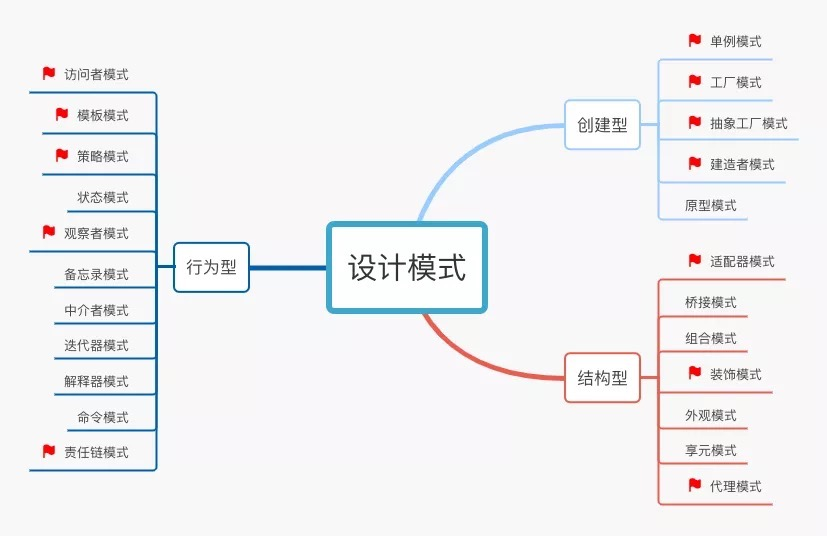

# 学Java有哪些就业方向？
（1）安卓开发
技能要求：
熟悉 Android UI 开发非常熟悉，对 UI 架构有理解，并了解基础的 UI 交互知识;
熟悉 Android 调试工具和方法，可以应付各种 Android 复杂问题;
熟悉 Android Framework 层，有通过 Android 源码阅读定位问题的经验;

（2）Java 后端开发
技能要求：
具备扎实的Java基础，对JVM原理有扎实的理解；对Spring、MyBatis、Dubbo等开源框架熟悉，并能了解它的原理和机制，具有大型分布式系统设计研发经验；
熟悉基于Mysql关系数据库设计和开发、对数据库性能优化有丰富的经验；
熟悉底层中间件、分布式技术（如RPC框架、缓存、消息系统等）；

（3）大数据/数据仓库
技能要求：
熟悉Hadoop/Spark/sqoop/hive/impala/azkaban/kylin等大数据相关组件;
精通sql及性能调优，熟练使用java、python、scala其中一种编程语言;
掌握数据仓库 (DW) / OLAP /商业智能 (BI) /数据统计理论，并灵活的应用，具备大型数据仓库设计经验;

### 1、数据结构和算法
- [ ] 栈与队列：先进先出、后进先出
- [ ] 线性链表
- [ ] 查找：顺序查找、二分查找
- [ ] 排序：交换类、插入类、选择类
- [ ] 树、二叉树、图：深度优先（DFS）、广度优先（BFS）
- [ ] 递归
- [ ] 分治
- [ ] 滑窗
- [ ] 三大牛逼算法：回溯、贪心、动态规划（DP）

> * 路线（并行）
- [ ] leetcode 500+
- [ ] 《漫画算法-小灰的算法之旅》
- [ ] 《剑指 offer》
- [ ] 《labuladong的算法小抄》
- [ ] 《算法导论》
- [ ] 《数据结构与算法之美》
- [ ] 《算法面试通关40讲》

### 2、设计模式
- [ ] 设计模式的六大原则：单一职责、里氏替换、依赖倒置、接口隔离、迪米特法则、开闭原则
- [ ] UML 基础知识
- [ ] 设计模式三大分类：创建型、结构型、行为型
- [ ] 常用设计模式基本原理

 

> * 路线（多选一，或挑精华）
- [ ] [UML](https://www.w3cschool.cn/uml_tutorial/) 入门即可
- [ ] 《Head First 设计模式》
- [ ] 《大话设计模式》
- [ ] 《图解设计模式》
- [ ] 《设计模式-可复用面向对象软件的基础》

### 3、计算机基础

#### 3-1、计算机网络
- [ ] OSI 七层模型、TCP/IP五层模型
- [ ] 常见网络协议：HTTP、TCP/IP、UDP
- [ ] 网络安全：非对称加密、数字签名、数字证书
- [ ] 网络攻击：DDOS、XSS、CSRF 跨域攻击

> * 路线
> * 经典的面试题：说说你从URL输入到最终页面展现的过程。这一题可以覆盖大部分计网的知识点，可以从 DNS 解析到 HTTP、TCP/IP协议、物理层协议，一直到浏览器渲染页面，你技术功底有多深你就可以聊多深。希望大家学完了也能试着回答一下这个问题。
- [ ] 《网络是怎么连接的》
- [ ] 《图解 HTTP》
- [ ] 《TCP/IP详解卷1：协议》：挑重点
- [ ] [The TCP/IP GUIDE](http://www.tcpipguide.com/free/t_TCPSlidingWindowAcknowledgmentSystemForDataTranspo-6.htm)
- [ ] [TCP协议的RFC文档](https://datatracker.ietf.org/doc/rfc1644/)
- [ ] 《Wireshark 网络分析就这么简单》 与 《Wireshark 网络分析的艺术》

#### 3-2、操作系统
- [ ] 进程和线程的区别
- [ ] 进程间的通信方式：共享内存、管道、消息
- [ ] 内存管理、虚拟内存
- [ ] 死锁检测和避免

> * 路线
- [ ] B 站：麻省理工 MIT 6.828（无字幕）：https://www.bilibili.com/video/BV1px411E7ST 
- [ ] 操作系统（哈工大李治军老师）32讲（全）超清：https://www.bilibili.com/video/BV1d4411v7u7
- [ ] 哈工大操作系统：https://www.bilibili.com/video/BV1d4411v7u7?from=search&seid=2361361014547524697
- [ ]《深入理解计算机系统 CSAPP》：圣经
- [ ]《现代操作系统 （第3版）》：难懂的跳过

### 4、java入门
- [ ] 面向过程 VS 面向对象
- [ ] 面向对象基本特征：封装、继承、多态
- [ ] 访问控制符：private、default、protected、public
- [ ] 数据类型：基本类型、引用类型
- [ ] 控制流程：for、while、switch 等
- [ ] 序列化
- [ ] 异常处理（有点难度）
- [ ] 泛型（有点难度）

> * 路线
- [ ] 《Java 核心技术卷I》：桌面应用跳过
- [ ] 《阿里巴巴 Java 开发手册》
- [ ] 《Java 编程思想（Thinking In Java）》：圣经，不用全读，用来查询

### 5、Java 高手进阶
- [ ] Java 集合类源码
- [ ] 线程池
- [ ] Java 代理
- [ ] IO 模型
- [ ] JVM
- [ ] Java 并发编程（JUC）

> * 路线
- [ ] 《Effective Java》：并行
- [ ] 《Java8 实战》
- [ ] 《深入理解 Java 虚拟机 第3版》
- [ ] 《Java 并发编程的艺术》

### 6、基础框架（SSM:Spring+SpringMVC+MyBatis）
- [ ] Spring 全家桶（Spring、Spring MVC、Spring Boot）使用
- [ ] ORM 框架（MyBatis、Hibernate）使用
- [ ] Spring 原理
- [ ] ORM 框架原理

> * 路线
- [ ] 《Spring 基础内幕》
- [ ] 《MyBatis 技术内幕》
- [ ] 使用框架 -> 懂框架 -> 造轮子

### 7、微服务框架
- [ ] Dubbo框架
- [ ] SpringCloud框架
- [ ] 服务注册与发现
- [ ] 分布式服务链路追踪
- [ ] 服务隔离、熔断、降级
- [ ] 服务网关

> * 路线
- [ ] Dubbo官网 http://dubbo.apache.org/ 可以切到中文版
- [ ] SpringCloud 官网 https://spring.io/projects/spring-cloud
- [ ] 《深入理解Apache Dubbo与实战》：配合源码
- [ ] 《Spring Cloud微服务实战》
### 8、常用中间件
- [ ] 缓存：Redis、Memcached（ 推荐 Redis）
- [ ] 消息队列：Kafka、RocketMQ、RabbitMQ、ActiveMQ、ZeroMQ（推荐 Kafka）
- [ ] 数据库中间件：ShardingSpere、Mycat

> * 路线（带着问题、目标）
- [ ] Redis 中文官方网站：http://www.redis.cn/，当做字典学习 redis 常见命令
- [ ] Kafka 官网：http://kafka.apache.org/
- [ ] ShardingSpere 官网：http://shardingsphere.apache.org/index_zh.html
- [ ] Mycat 权威指南在线 PDF 版：http://www.mycat.org.cn/document/mycat-definitive-guide.pdf
- [ ] 《Redis 设计与实现》
- [ ] 《深入理解Kafka：核心设计与实践原理》
- [ ] 《分布式数据库架构及企业实践——基于Mycat中间件》
- [ ] 胡夕：《Kafka核心技术与实战》
- [ ] 蒋德钧：《Redis核心技术与实战》

### 9、数据库
- [ ] 数据库基本理论：范式、索引原理、数据库引擎
- [ ] SQL 基本语法
- [ ] SQL 调优，explain 执行计划
- [ ] 数据库事务（ACID）
- [ ] 数据库锁：乐观锁、悲观锁、表锁、行锁等

> * 路线
- [ ] 《数据库系统概念》
- [ ] 《MySQL必知必会》
- [ ] 《MySQL技术内幕 : InnoDB存储引擎》

### 10、分布式架构
- [ ] 分布式事务：两阶段提交（2PC）、补偿事务（TCC）
- [ ] 分布式锁：基于关系型数据库（MySQL）、基于 Redis、基于Zookeeper
- [ ] 分布式 ID：雪花算法（Snowflake）、美团 Leaf

> * 路线
- [ ] 网络上相关文章总结
### 11、必须掌握的工具软件
- [ ] Java 最聪明的 IDE：IntelliJ IDEA （请放弃使用 Eclipse，我有一堆理由睡服你）
- [ ] 地球上最好用的版本管理工具：Git
- [ ] 经久不衰的依赖管理工具：Maven
- [ ] Docker

### 12、学习资源网站列表汇总
### 13、学习常见问题（FAQ）
> * 学习过程中做好笔记，使用时忘记翻阅笔记回顾
> * 把目录多看一遍，一般而言书的前几章都是介绍型的内容，如果你已经有了基础，可以直接跳到后面原理解析或者实战部分。

