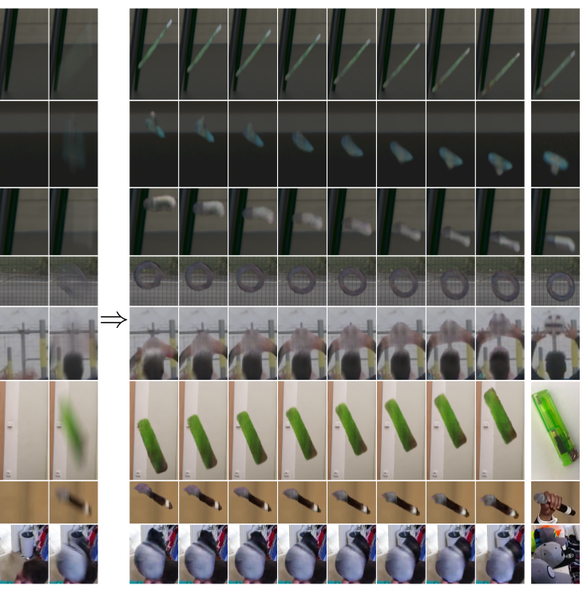

本文继续总结CVPR 2021 底层图像处理相关论文，包含图像/视频去模糊和图像/视频去雾。共计 14 篇。

大家可以在：
https://openaccess.thecvf.com/CVPR2021?day=all
按照题目下载这些论文。

如果想要下载所有CVPR 2021论文，请点击这里：
CVPR 2021 论文开放下载了！

图像去模糊

DeFMO: Deblurring and Shape Recovery of Fast Moving Objects

对图像中快速运动物体导致的去模糊和形状恢复

作者 | Denys Rozumnyi, Martin R. Oswald, Vittorio Ferrari, Jiri Matas, Marc Pollefeys
单位 | 苏黎世联邦理工学院；Microsoft Mixed Reality and AI Zurich Lab；谷歌；捷克理工大学
论文 | https://arxiv.org/abs/2012.00595
代码 | https://github.com/rozumden/DeFMO

Explore Image Deblurring via Encoded Blur Kernel Space

文中提出一种方法来编码任意的 sharp-blur 图像对数据集的模糊核空间，并利用这种编码空间来解决一些特定的任务，如图像去模糊和模糊合成。对于图像去模糊化，已证明所提出方法可以处理未见过的模糊操作。对于模糊合成，该方法可以将模糊从给定的 sharp-blur 图像对数据集中迁移到任何感兴趣的领域，包括面部、灰度和动画图像的领域。

作者 | Phong Tran, Anh Tran, Quynh Phung, Minh Hoai
单位 | VinAI Research；VinUniversity；石溪大学
论文 | https://arxiv.org/abs/2104.00317
代码 | https://github.com/VinAIResearch/blur-kernel-space-exploring

Image

Towards Rolling Shutter Correction and Deblurring in Dynamic Scenes

BS-RSCD，是首个使用分光镜采集系统在真实动态场景中进行联合RSCD（滚动快门校正与去模糊）问题的数据集。提出一个新的神经网络架构，可以同时处理 RS 失真和模糊，使用可变形注意力模块来融合来自 bidirectional warping 和去模糊流的特征。实验结果表明，在 RSC 和 RSCD 任务中，所提出的方法优于最先进的方法。

作者 | Zhihang Zhong, Yinqiang Zheng, Imari Sato
单位 | 东京大学；国立情报学研究所
论文 | https://arxiv.org/abs/2104.01601
代码 | https://github.com/zzh-tech/RSCD

Image

Learning a Non-blind Deblurring Network for Night Blurry Images

文中提出一个非盲去模糊网络（NBDN）来恢复夜间模糊的图像。为了缓和违反模糊模型的像素所带来的副作用，开发一个 confidence estimation unit（置信度估计单元CEU）来估计一个地图，确保这些像素在去卷积步骤中的贡献较小，并通过共轭梯度（CG）方法进行优化。此外，与现有的在其框架中使用手动调整的超参数的方法不同。所提出的 hyper-parameter estimation unit（超参数估计单元HPEU）自适应估计超参数，可以更好地修复图像。实验结果表明，所提出的网络在数量和质量上都比最先进的算法表现得好。

作者 | Liang Chen、Jiawei Zhang、Jinshan Pan、Songnan Lin、Faming Fang、Jimmy S. Ren
单位 | 华东师范大学；商汤；南京理工大学；上海交通大学
论文 | 
https://openaccess.thecvf.com/content/CVPR2021/papers/Chen_Learning_a_Non-Blind_Deblurring_Network_for_Night_Blurry_Images_CVPR_2021_paper.pdf

Image

Test-Time Fast Adaptation for Dynamic Scene Deblurring via Meta-Auxiliary Learning

文中提出一种自监督元辅助学习，通过整合外部和内部学习来提高去模糊的性能。具体来说，建立一个自监督的辅助重建任务，与主要的去模糊任务共享一部分网络。这两个任务是在一个外部数据集上联合训练的。

此外，提出一个元辅助训练方案，以进一步优化作为基础学习者的预训练模型，这适用于测试时的快速适应。在训练过程中，两个任务的性能是耦合的。因此，能够通过辅助任务在测试时利用内部信息来提高去模糊的性能。

跨评估数据集的广泛实验结果证明了所提方法的测试时间适应性的有效性。

作者 | Zhixiang Chi、Yang Wang、Yuanhao Yu、Jin Tang
单位 | 诺亚方舟实验室；曼尼托巴大学
论文 | 
https://openaccess.thecvf.com/content/CVPR2021/papers/Chi_Test-Time_Fast_Adaptation_for_Dynamic_Scene_Deblurring_via_Meta-Auxiliary_Learning_CVPR_2021_paper.pdf

Image

Blind Deblurring for Saturated Images

文中开发一种新的方法来恢复饱和模糊的图像。首先提出一个新的模糊模型，将饱和和不饱和的像素都考虑在内。与以前的方法不同，饱和区域周围的强边缘仍然可以对去模糊过程作出贡献，缓解了现有方法在模糊图像中存在大面积饱和区域时的局限性。然后，基于所提出的模糊模型，开发一个高效的基于MAP 的优化框架。并证明它能很好地收敛，并且比其他方法需要更少的执行时间。

实验结果表明，所提出的方法不需要额外的预处理步骤（即提取光条纹或选择显著边缘），就能在具有挑战性的真实案例中获得高质量的结果。

作者 | Liang Chen、Jiawei Zhang、Songnan Lin、Faming Fang、 Jimmy S. Ren
单位 | 华东师范大学；商汤；上海交通大学
论文 | 
https://openaccess.thecvf.com/content/CVPR2021/papers/Chen_Blind_Deblurring_for_Saturated_Images_CVPR_2021_paper.pdf

Image

Learning Spatially-Variant MAP Models for Non-blind Image Deblurring

文中提出一种在 MAP 框架内联合学习 spatially-variant data 和正则化项的方法，用于非盲图像去模糊。并表明联合学习比单独学习一项更有效，特别是在具有挑战性的情况下，效果更加明显。

作者 | Jiangxin Dong、Stefan Roth、Bernt Schiele
单位 | 萨尔大学；TU Darmstadt & hessian.AI
论文 | 
https://openaccess.thecvf.com/content/CVPR2021/papers/Dong_Learning_Spatially-Variant_MAP_Models_for_Non-Blind_Image_Deblurring_CVPR_2021_paper.pdf

Image

视频去模糊

ARVo: Learning All-Range Volumetric Correspondence for Video Deblurring

通过学习视频中临近帧模糊区域的对应来进行去模糊

作者 | Dongxu Li, Chenchen Xu, Kaihao Zhang, Xin Yu, Yiran Zhong, Wenqi Ren, Hanna Suominen, Hongdong Li
单位 | 澳大利亚国立大学；DATA61-CSIRO；悉尼科技大学；IIE-CAS；图尔库大学
论文 | https://arxiv.org/abs/2103.04260
备注 | CVPR 2021 Poster

Image

Gated Spatio-Temporal Attention-Guided Video Deblurring

文中介绍一个将 factorized spatio-temporal attention 作为一个有效的非局部信息融合工具，用于视频去模糊任务。并表示是首次提出寻找与视频去模糊最相关信息的关键帧的方法。当与所提出的注意力模块结合使用时，它能显著提高修复性能。在几个视频去模糊化的基准上进行了广泛的实验和分析，证明了该架构所达到的最先进的准确性和可解释性。

作者 | Maitreya Suin 、A. N. Rajagopalan
单位 | 印度理工学院
论文 | 
https://openaccess.thecvf.com/content/CVPR2021/papers/Suin_Gated_Spatio-Temporal_Attention-Guided_Video_Deblurring_CVPR_2021_paper.pdf

Image

图像去雾

Ultra-High-Definition Image Dehazing via Multi-Guided Bilateral Learning

文中提出一种通过多引导双边学习的超高清图像去雾化方法。方法的关键是使用深度 CNN 来建立一个仿射双边网格，可以较好保持图像中详细的边缘和纹理。同时，建立多个 guidance matrices，以协助仿射双边网格恢复高质量的特征，为图像去雾提供丰富的颜色和纹理信息。

定量和定性结果表明，所提出的网络在准确性和推理速度（125 fps）方面与最先进的去雾方法相比表现良好，并能在真实世界的 4K 雾霾图像上产生视觉上令人惊喜的结果。

作者 | Zhuoran Zheng、Wenqi Ren、Xiaochun Cao、Xiaobin Hu、Tao Wang、Fenglong Song、Xiuyi Jia
单位 | 南京理工大学；SKLOIS；诺亚方舟实验室
论文 | 
https://openaccess.thecvf.com/content/CVPR2021/papers/Zheng_Ultra-High-Definition_Image_Dehazing_via_Multi-Guided_Bilateral_Learning_CVPR_2021_paper.pdf

Image

Contrastive Learning for Compact Single Image Dehazing

基于对比学习的紧凑图像去雾方法
 
本文提出了一种基于对比学习的新颖对比正则化（CR）技术，以利用模糊图像和清晰图像的信息分别作为负样本和正样本。CR确保在表示空间中将还原后的图像拉到更接近清晰图像，并推到远离朦胧图像的位置。
 
此外，考虑到性能和内存存储之间的权衡，开发了一个基于类自动编码器（AE）框架的紧凑型除雾网络，可分别受益于自适应地保存信息流和扩展接收域以提高网络的转换能力。将具有自动编码器和对比正则化功能的除雾网络称为AECR-Net，在合成和真实数据集上进行的广泛实验表明，AECR-Net超越了最新技术。

作者 | Haiyan Wu, Yanyun Qu, Shaohui Lin, Jian Zhou, Ruizhi Qiao, Zhizhong Zhang, Yuan Xie, Lizhuang Ma
单位 | 华东师范大学；厦门大学；腾讯优图
论文 | https://arxiv.org/abs/2104.09367
代码 | https://github.com/GlassyWu/AECR-Net
简介 | 5

Image

PSD: Principled Synthetic-to-Real Dehazing Guided by Physical Priors

Principled Synthetic-to-real Dehazing（PSD）框架，有效且易于使用。
从一个在合成数据上预训练的骨干网开始，使用未标记的真实雾霾图像，以无监督的方式对网络进行微调。微调过程由一个先验损失“委员会”指导，该“委员会”由几个流行的、有根据的物理先验组成。

广泛的实验表明，PSD 在真实世界的去雾方法中的表现优于最先进的去雾方法。

作者 | Zeyuan Chen、Yangchao Wang、Yang Yang、Dong Liu1
单位 | 中国科学技术大学；电子科技大学
论文 | 
https://openaccess.thecvf.com/content/CVPR2021/papers/Chen_PSD_Principled_Synthetic-to-Real_Dehazing_Guided_by_Physical_Priors_CVPR_2021_paper.pdf
代码 | https://github.com/zychen-ustc/PSD-Principled-Synthetic-to-Real-Dehazing-Guided-by-Physical-Priors
备注 | CVPR 2021 Oral

Image

视频去雾

Learning to Restore Hazy Video: A New Real-World Dataset and A New Method

本次工作中，收集了一个真实世界的视频去雾数据集，其中包含一对真实的有雾和相应的无雾视频。是首个用于监督学习的真实世界视频去雾数据集。并进行了大量的主观和客观的实验，证明了该数据集中收集的有雾场景比合成数据集的场景更真实，为训练和评估真实世界的视频去雾算法提供了宝贵的基准。即所提出的 Confidence Guided and Improved Deformable Network（CG-IDN）用于视频去雾，并在现实世界的视频去雾任务中验证了其有效性。

作者 | Xinyi Zhang、Hang Dong、Jinshan Pan、Chao Zhu、Ying Tai、 Chengjie Wang、Jilin Li、Feiyue Huang、Fei Wang
单位 | 腾讯优图；字节跳动；西安交通大学；南京理工大学
论文 | 
https://openaccess.thecvf.com/content/CVPR2021/papers/Zhang_Learning_To_Restore_Hazy_Video_A_New_Real-World_Dataset_and_CVPR_2021_paper.pdf
简介 | 9
Image

Image Defocus Deblurring

Iterative Filter Adaptive Network for Single Image Defocus Deblurring

文中提出一种新型的基于学习的端到端单幅图像去失焦模糊方法。它配备一个新型的Iterative Filter Adaptive Network（IFAN），专门用于处理空间变化和大的失焦模糊。为了自适应地处理空间变化的模糊，IFAN 预测像素级的去模糊滤波器，这些滤波器被应用于输入图像的失焦特征，以产生去模糊的特征。
为了有效地管理大面积的模糊，IFAN 将去模糊滤波器建模为小尺寸可分离滤波器的堆叠。还提出一个基于失焦差异估计和 reblurring 的训练方案，可以大大提升去模糊的质量。

通过实验证明了所提出方法在真实世界图像上达到了最先进的性能。

作者 | Junyong Lee 、Hyeongseok Son 、Jaesung Rim 、Sunghyun Cho、 Seungyong Lee
单位 | 浦项科技大学
论文 | 
https://openaccess.thecvf.com/content/CVPR2021/papers/Lee_Iterative_Filter_Adaptive_Network_for_Single_Image_Defocus_Deblurring_CVPR_2021_paper.pdf
代码 | https://github.com/codeslake/IFAN

Image
- END -
编辑：CV君
转载请联系本公众号授权
