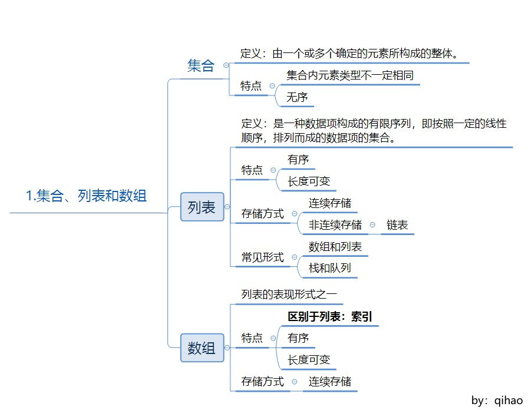
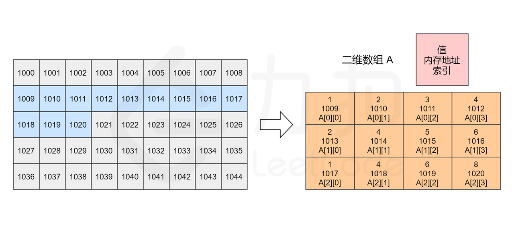

在本 LeetBook 中，我们将介绍 数组 和 字符串。完成后，你将：
> * 理解数组的 基本概念 及其 操作方式；
> * 理解 二维数组 的基本概念，熟悉二维数组的使用；
> * 了解 字符串 的概念以及字符串所具有的不同特性；
> * 理解字符串匹配中的 KMP 算法；
> * 能够运用 双指针 解决实际问题。

# 数组

## 1、集合、列表和数组

集合 -> 列表 -> 数组

### 1-1、集合

定义：

    由一个或多个确定的元素所构成的整体。

特性

    元素类型不一定相同
    元素没有顺序

### 1-2、列表

定义：

    一种数据项构成的有限序列，即按照一定的线性顺序，排列而成的数据项的集合。
    
### 1-3、数组

定义：
    
    数组是列表的实现方式之一
    具有列表的特征，同时也具有自己的一些特征
    不同语言实现有一定差异
    
与列表差异：

    数组有索引，而列表没有
    
特性：

    连续存储

## 2、数组的操作

### 2-1、读取元素

    找到数组索引的内存地址，加上索引的偏移量找到对应的内存地址
    空间连续，时间复杂度为O(1)
    
### 2-2、查找元素

    逐步查找，找到就停止
    时间复杂度为O(N)
    
### 2-3、插入元素

    区分末尾插入和中间插入的区别
    时间复杂度为O(N)
    
### 2-4、删除元素

    区分末尾删除和中间删除的区别
    时间复杂度为O(N)
    

# 二维数组

## 1、二维数组

数据结构：

内存结构：

# 字符串

## 1、字符串简介

## 2、最长公共前缀

    组合、获取，采用记录index的方式

## 3、字符串匹配算法：KMP

    Knuth–Morris–Pratt（KMP）算法是一种改进的字符串匹配算法，它的核心是利用匹配失败后的信息，尽量减少模式串与主串的匹配次数以达到快速匹
    配的目的。它的时间复杂度是 O(m + n)。
    
