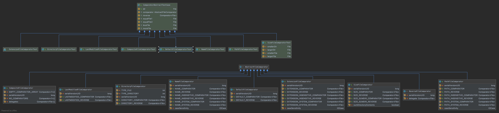

# Comparator

> 实现各种 *java.util.Comparator* 来处理 *java.io.File*

## AbstractFileComparator
> 抽象文件比对器：提供了文件对象 数组/列表 的排序功能
### CompositeFileComparator
> 构造：
>   * 可变数量的比较器 Comparator<File>...
>   * 可迭代的比较器 Iterable<Comparator<File>>  

> 结构：
>   * pre-def-struct 空比较器数组
>   * pre-def-struct 无比较器
>   * 代理数组

> 思想：  
>   * 顺序遍历比较器去比较输入，取第一个比较成功的结果返回

### DefaultFileComparator

### DirectoryFileComparator
### ExtensionFileComparator
### LastModifiedFileComparator
### NameFileComparator
### PathFileComparator
### ReverseFileComparator
### SizeFileComparator
### package
