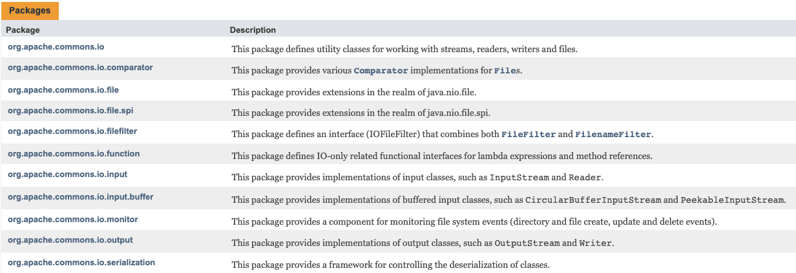

# Apache Commons IO

## 1. 概述
> Apache Commons IO 是一个实用程序库，用于帮助开发 IO 功能。
  
主要包括六个方面：
  
  * io - 该包定义了用于处理流、读取器、写入器和文件的实用程序类。
  * 比较器 - 该包为文件提供了各种比较器实现。
  * file - 这个包提供了 java.nio.file 领域的扩展。
  * filefilter - 这个包定义了一个接口 (IOFileFilter)，它结合了 FileFilter 和 FilenameFilter。
  * function - 该包为 lambda 表达式和方法引用定义了仅 IO 相关的功能接口。
  * input - 这个包提供了输入类的实现，比如 InputStream 和 Reader。
  * input.buffer - 该包提供了缓冲输入类的实现，例如 CircularBufferInputStream 和 PeekableInputStream。
  * monitor - 这个包提供了一个用于监视文件系统事件（目录和文件创建、更新和删除事件）的组件。
  * output - 这个包提供了输出类的实现，比如 OutputStream 和 Writer。
  * 序列化——这个包提供了一个控制类反序列化的框架。
## 2. 用户手册
> Commons-IO 包含实用程序类、endian 类、行迭代器、文件过滤器、文件比较器和流实现。



有关更详细的说明，请查看 [Javadocs](https://commons.apache.org/proper/commons-io/apidocs/).

### 实用类
#### IOUtils
IOUtils 包含处理读取、写入和复制的实用方法。 这些方法适用于 InputStream、OutputStream、Reader 和 Writer。

例如，考虑从 URL 读取字节并打印它们的任务。 这通常会这样做：
```java
 InputStream in = new URL( "https://commons.apache.org" ).openStream();
 try {
   InputStreamReader inR = new InputStreamReader( in );
   BufferedReader buf = new BufferedReader( inR );
   String line;
   while ( ( line = buf.readLine() ) != null ) {
     System.out.println( line );
   }
 } finally {
   in.close();
 }
```
使用 IOUtils 类，可以通过以下方式完成：
```java
 InputStream in = new URL( "https://commons.apache.org" ).openStream();
 try {
   System.out.println( IOUtils.toString( in ) );
 } finally {
   IOUtils.closeQuietly(in);
 }
```
在某些应用领域，这样的IO操作很常见，这个类可以节省大量的时间。 而且您可以依赖经过良好测试的代码。

对于这样的实用程序代码，灵活性和速度是最重要的。 但是，您还应该了解这种方法的局限性。 使用上述技术读取 1GB 文件将导致尝试创建 1GB 字符串对象！

#### FileUtils
FileUtils 类包含用于处理 File 对象的实用方法。这些包括读取、写入、复制和比较文件。

例如，要逐行读取整个文件，您可以使用：

```java
 File file = new File("/commons/io/project.properties");
 list lines = FileUtils.readLines(file, "UTF-8");
```

#### FilenameUtils
FilenameUtils 类包含用于在不使用 File 对象的情况下处理文件名的实用方法。该课程旨在在 Unix 和 Windows 之间保持一致，以帮助这些环境之间的转换（例如从开发转移到生产）。

例如要规范化文件名，删除双点段：

```java
 String filename = "C:/commons/io/../lang/project.xml";
 String normalized = FilenameUtils.normalize(filename);
 // 结果是“C:/commons/lang/project.xml”
```

#### FileSystemUtils
FileSystemUtils 类包含用于处理文件系统以访问 JDK 不支持的功能的实用程序方法。目前，唯一的方法是获取驱动器上的可用空间。请注意，这使用命令行，而不是本机代码。

例如要查找驱动器上的可用空间：

```java
 long freeSpace = FileSystemUtils.freeSpace("C:/");
```

### 字节序类
不同的计算机体系结构采用不同的字节排序约定。在所谓的“小端”架构（例如英特尔）中，低位字节存储在内存中的最低地址，后续字节存储在更高地址。对于“大端”架构（例如摩托罗拉），情况正好相反。

这个相关包中有两个类：

EndianUtils 类包含用于交换 Java 原语和流的字节顺序的静态方法。
SwappedDataInputStream 类是 DataInput 接口的实现。有了这个，人们可以从非本地字节序的文件中读取数据。
有关更多信息，请参阅 [endian](http://www.cs.umass.edu/~verts/cs32/endian.html)

### 行迭代器
org.apache.commons.io.LineIterator 类为处理基于行的文件提供了一种灵活的方式。实例可以直接创建，也可以通过 FileUtils 或 IOUtils 上的工厂方法创建。推荐的使用模式是：

```java
 LineIterator it = FileUtils.lineIterator(file, "UTF-8");
 尝试 {
   而 (it.hasNext()) {
     String line = it.nextLine();
     /// 用线做一些事情
   }
 } 最后 {
   LineIterator.closeQuietly(iterator);
 }
 
```
### 文件过滤器
org.apache.commons.io.filefilter 包定义了一个接口 (IOFileFilter)，它结合了 java.io.FileFilter 和 java.io.FilenameFilter。除此之外，该包还提供了一系列现成的 IOFileFilter 接口实现，包括允许您组合其他此类过滤器的实现。例如，这些过滤器可用于列出文件或在 FileDialog 中。

有关更多详细信息，请参阅 filefilter 包 javadoc。

### 文件比较器
org.apache.commons.io.comparator 包为 java.io.File 提供了许多 java.util.Comparator 实现。例如，这些比较器可用于对文件列表和数组进行排序。

有关更多详细信息，请参阅比较器包 javadoc。

### 流
org.apache.commons.io.input 和 org.apache.commons.io.output 包包含各种有用的流实现。这些包括：

* 空输出流 - 默默地吸收发送给它的所有数据
* Tee 输出流 - 将输出数据发送到两个流而不是一个
* 字节数组输出流 - 这是 JDK 类的更快版本
* 计数流 - 计算传递的字节数
* 代理流 - 委托给代理中的正确方法
* 可锁定写入器 - 使用锁定文件提供写入同步
