# 特征

## 特征
### 多层存储（MULTI-TIER STORAGE）
Apache Ignite® 旨在将内存、磁盘和英特尔傲腾用作活动存储层。内存层允许使用在内存模式下运行的 DRAM 和英特尔® 傲腾™ 来满足数据存储和处理需求。磁盘层是可选的，支持两个选项——您可以将数据保存在外部数据库中或将其保存在 Ignite 本机持久性中。在 AppDirect 模式下运行的 SSD、Flash、HDD 或 Intel Optane 可用作存储设备。

<p align="center">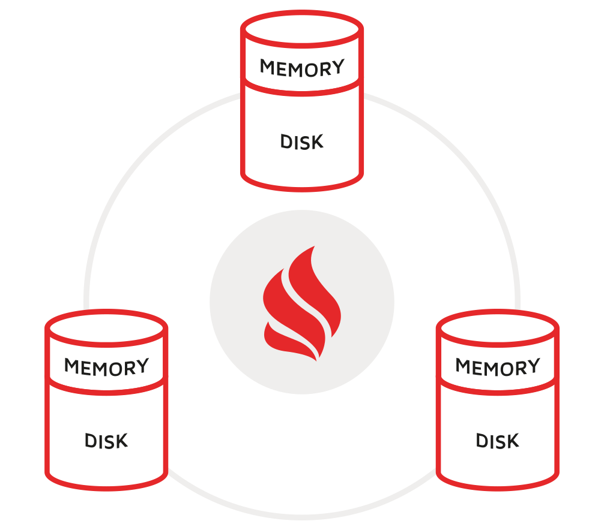</p> 

Ignite 通过分配和管理堆外区域来完全控制其内存层。每个 Ignite 服务器节点在引导期间分配内存区域，将区域拆分为页面，并在这些页面中保留带有索引的数据记录。 Java 堆用于保存临时对象，例如查询结果集、指标样本和应用程序代码生成的对象。所有这些对象最终都会被垃圾回收。

如果您选择本机持久性作为磁盘层，那么大部分处理仍将在缓存数据的内存中进行，但完整副本存储在磁盘上。如果内存中缺少任何记录，Ignite 将从磁盘读取它，允许您保留比内存中缓存更大的数据集。这也消除了重新启动时耗时的内存预热的需要。一旦您的集群在重启后重新连接，Ignite 将提供来自磁盘的大部分数据，在后台预热内存层。

#### 多层存储使用模式
> 模式 | 描述
> --- | ----
> 内存 | 整个数据集仅在内存中可用。 为了避免节点故障，我们建议在集群中至少保留一份数据备份副本。 在内存模式下运行的 DRAM 或 Intel® Optane™ 可用作存储设备。 用例：通用内存缓存、高性能计算、Web 会话缓存、连续数据流的实时处理。
> 内存+外部数据库 | Ignite 作为分布式缓存层部署在现有外部数据库之上。 此模式用于通过与它们交互的 API 加速基于磁盘的数据库和您的服务。 用例：通过直写和后写功能加速服务和 API 到外部数据库。
> 内存缓存 + 本地持久化 | 100% 的数据持久化到磁盘，相同或更少的数据缓存在内存中。 缓存的数据越多，性能越快。 磁盘用作主存储，可以在任何集群故障和重新启动后幸免于难。 重启时不需要内存预热，因为 Ignite 可以从磁盘提供数据。 在 AppDirect 模式下运行的 SSD、闪存、HDD 或英特尔® 傲腾™ 可用作存储设备。用例：Ignite 作为内存数据库或具有主动持久层的数字集成中心。

#### 分区和复制
根据配置，Ignite 可以跨集群分区或复制数据。在复制模式下，每个集群节点都保留数据的完整副本，但复制缓存的大小受节点上可用内存量的限制。在分区模式下，Ignite 将数据均匀地分布在所有集群节点上，允许您存储比一台机器所能容纳的更多的数据。

#### 耐用性和一致性
Ignite 在整个集群中提供以下 ACID 保证：

> * 提交的事务总是在失败后幸存下来。
> * 集群总是可以恢复到最近成功提交的事务。

#### 预写记录和检查点
如果选择 Ignite 本机持久性作为磁盘层，则每次在内存中更新记录时，都会将更改添加到预写日志 (WAL)。 WAL 的目的是以最快的方式将更新传播到磁盘，并提供支持完整集群故障的一致恢复机制。

随着 WAL 的增长，它会定期在主存储中设置检查点。检查点是将脏页从内存层复制到磁盘上的分区文件的过程。脏页是在内存中更新的页面，已附加到 WAL，但尚未写入磁盘上的相应分区文件。

### 本地持久化（NATIVE PERSISTENCE）
尽管 Apache Ignite® 被广泛用作外部数据库之上的缓存层，但它具有本机持久性 - 一个分布式、ACID 和 SQL 兼容的基于磁盘的存储。本机持久性作为磁盘层集成到 Ignite 多层存储中，可以打开该磁盘层，让 Ignite 在磁盘上存储比内存中缓存更多的数据，并支持快速集群重新启动。

<p>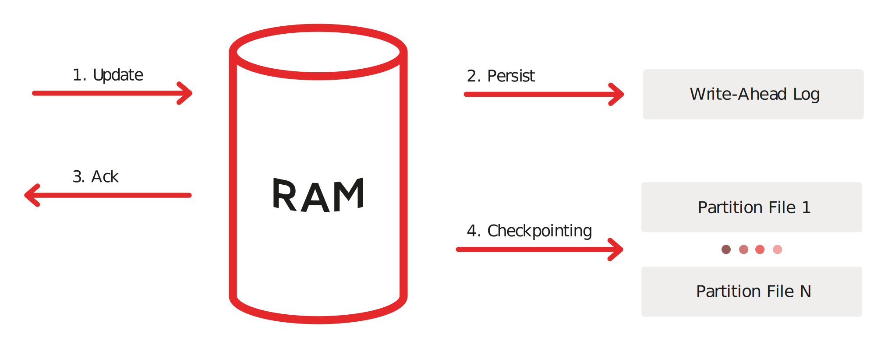</p>

启用本机持久性后，Ignite 将数据的超集存储在磁盘上，并在内存中尽可能多地缓存。例如，如果您的应用程序需要在 Ignite 集群中存储 200 条记录，并且内存容量只允许缓存 150 条记录，那么所有 200 条记录都将存储在磁盘上，其中 150 条将从内存中提供，而其余 50 条则从磁盘提供应用程序请求它们。

#### 点燃持久性 VS。外部数据库
与外部数据库相比，本机持久化具有以下优势：

> * 缓存数据子集的能力 - Ignite 将 100% 的数据存储在磁盘上，并允许您在内存中缓存尽可能多的数据。
> * 从磁盘查询数据的能力 - 如果内存中缺少任何记录，则 Ignite 从磁盘读取它。包括 SQL 在内的所有 API 都支持这一点。
> * 瞬时集群重新启动 - Ignite 在集群启动或重新启动时从磁盘完全运行，无需预加载或预热内存层。

#### 预写记录和检查点
如果选择 Ignite 本机持久性作为磁盘层，则每次在内存中更新记录时，都会将更改添加到预写日志 (WAL)。 WAL 的目的是以最快的方式将更新传播到磁盘，并提供支持完整集群故障的一致恢复机制。随着 WAL 的增长，它会定期在主存储中设置检查点。检查点是将脏页从内存层复制到磁盘上的分区文件的过程。脏页是在内存中更新的页面，已附加到 WAL，但尚未写入磁盘上的相应分区文件。

#### 耐用性
Ignite 本机持久性在整个集群中提供以下 ACID 保证：

> * 提交的事务总是在失败后幸存下来。
> * 集群总是可以恢复到最近成功提交的事务。

### 分布式SQL（DISTRIBUTED SQL）
Apache Ignite® 带有一个符合 ANSI-99 标准、水平可扩展和容错的 SQL 引擎，允许您使用 JDBC、ODBC 驱动程序或适用于 Java、C#、C++ 的本机 SQL API 与常规 SQL 数据库进行交互、Python 和其他编程语言。

<p>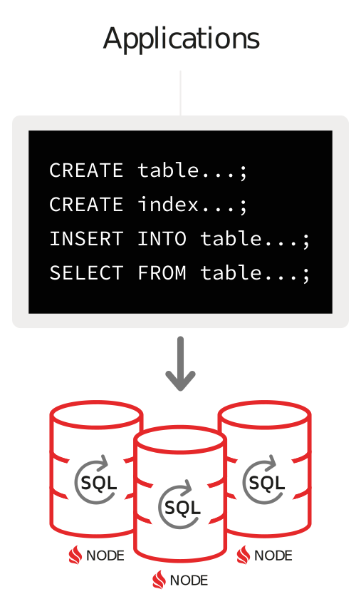</p>

Ignite 支持所有 DML 命令，包括 SELECT、UPDATE、INSERT 和 DELETE 查询以及与分布式系统相关的 DDL 命令的子集。

#### SQL 连接
Ignite 完全支持分布式连接以满足高级查询需求。分布式联接是带有联接子句的 SQL 语句，该联接子句将两个或多个表组合在一起。如果表在分区列（亲缘关系或主键）上联接，则联接称为并置联接。否则，如果表最初未位于同一位置，则 Ignite 以非位于同一位置的方式进行连接。同位连接避免了节点之间的数据混洗并最大限度地减少网络使用，因此比非同位连接执行得快得多。

#### SQL 和内存模式
当所有数据和索引仅位于内存中时，Apache Ignite 可以在纯内存模式下运行。在这种模式下，Ignite SQL 显示出最高的性能，因为所有数据都是从内存中提供的，根本不使用磁盘层。

#### SQL 和本机持久性
在这种模式下，Ignite 将 100% 的数据和索引保留在本机持久化中，同时尽可能多地缓存在内存中。 Ignite SQL 引擎不需要将整个数据集缓存在内存中即可正常运行。如果引擎发现记录没有被缓存，那么它会从磁盘读取记录。您的应用程序只执行 SQL 查询，而 Ignite 会自动从内存和磁盘中获取记录。

在集群重新启动时，Ignite 从磁盘读取数据和索引，消除了内存预热的需要，这显着减少了任何潜在停机时间。

#### SQL 和第 3 方数据库
Ignite 可用作外部数据库（如 RDBMS、NoSQL 或 Hadoop）的缓存层。在这种模式下，Ignite SQL 引擎需要将 SQL 查询所需的所有数据缓存在内存中，因为该引擎目前不支持联合查询。

如果需要在 Ignite 和外部数据库之间进行联合查询，那么您可以考虑将 Ignite 集成到 Spark，其中 DataFrames API 可以连接存储在 Ignite 和其他系统中的数据。

### 分布式Key-Value（DISTRIBUTED KEY-VALUE STORE）
Apache Ignite® 是一种分布式键值存储，可将数据存储在内存和磁盘上。 Ignite 用作分布式分区哈希映射，在这种部署模式下，每个集群节点都拥有整个数据集的一部分。您可以使用键值请求访问集群或利用 Ignite 中独有的 API，其中包括分布式 ACID 事务、SQL、协同定位计算和机器学习。

<p></p>

#### JCACHE 和扩展的键值 API
Ignite 键值 API 符合 JCache (JSR 107) 规范并支持：

> * 基本缓存放置/获取操作
> * ConcurrentMap API
> * EntryProcessor 和 CacheInterceptor API
> * 事件和指标
Ignite 还扩展了 JCache 规范并支持分布式键值 ACID 事务、扫描和连续查询、协同定位计算等等。例如，如果您希望在服务器节点上的记录更新时通知应用程序，则连续查询很有用。 ACID 事务支持使您可以更新存储在不同缓存/表中的一组记录，并具有数据一致性。

#### 近缓存
近缓存是本地客户端缓存，用于存储应用端最常用的数据。此缓存技术仅支持键值 API，并且可以考虑用于需要一致响应时间（以微秒为单位）的应用程序。 Ignite 自动使近缓存失效并更新。每当记录的主要副本在服务器节点上更新时，Ignite 都会将更改传播到存储记录备份副本的所有节点以及将记录副本保存在其附近缓存中的应用程序。

#### 通读和写通/背后
如果 Ignite 被部署为外部数据库之上的键值存储，那么 Ignite 可以为您的应用程序发出的每个键值请求自动写入或隐藏对该外部存储的所有更改。它还包括键值 ACID 事务 - Ignite 在其内存集群和关系数据库中协调和提交事务。

通读功能意味着如果内存中缺少记录，Ignite 可以从外部数据库读取数据。 JCache 和扩展的键值 API 都完全支持此功能。

#### 点燃原生持久性
如果您希望 Ignite 用作将数据缓存在内存中并将其持久化到磁盘而不是外部数据库的键值存储，那么您可以启用 Ignite 原生持久性。本机持久性功能可让您消除耗时的缓存预热步骤以及从外部数据库重新加载数据的阶段。此外，由于本机持久性始终在磁盘上保留数据的完整副本，因此您可以自由地在内存中缓存记录的子集。如果内存中缺少所需的数据记录，则无论您使用何种 API，Ignite 都会自动从磁盘读取它。

### ACID事务（atomicity, consistency, isolation, durability）
Apache Ignite® 可以在高度一致的模式下运行，完全支持分布式 ACID 事务。内存层和磁盘层都满足一致性保证。

<p>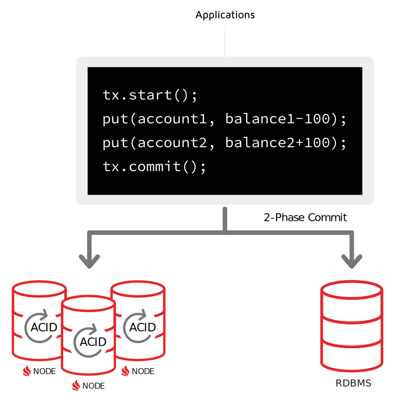</p>

Apache Ignite 中的分布式事务可以跨越多个集群节点、缓存/表和分区。悲观锁定和乐观锁定均可用于应用程序。

#### 两阶段提交协议
在分布式系统中，一个事务通常跨越多个集群节点。这需要事务引擎正确处理可能的分布式故障，以避免集群范围内的数据不一致。在这种情况下确保数据一致性的一种广泛使用的方法是两阶段提交协议 (2PC)。

Ignite 事务引擎实现了 2PC 协议。每当记录在事务中更新时，Ignite 都会将事务状态保存在本地事务映射中，直到提交更改，此时数据将传输到参与的远程节点。只有持有数据主副本或备份副本的节点才参与交易。此外，如果交易被映射到单个节点，那么 Ignite 会通过切换到单阶段提交 (1PC) 协议来优化交易执行。

#### 一致性和点燃持久性
如果使用 Ignite 本机持久性，那么所有更新都会写入预写日志 (WAL)，即使集群或单个节点在事务中间宕机，也能保证数据一致性。 WAL 的目的是以追加模式将更新传播到磁盘，这是将数据持久化到磁盘的最快方式。 WAL 为单个节点或整个集群宕机时的故障场景提供了恢复机制。一个集群总是可以恢复到最近成功提交的事务。

#### 一致性和第三方持久性
在将 Ignite 用作外部数据库（例如 RDBMS）的缓存层的场景中，Ignite 事务既涵盖 Ignite 中的缓存数据，也涵盖支持事务 API 的数据库中持久保存的数据。例如，如果将关系数据库配置为磁盘层，则 Ignite 会在向参与的集群节点发送提交消息之前将事务更改写入数据库。这样，如果事务在数据库级别失败，Ignite 仍然可以将回滚消息发送到集群节点，从而在内存和磁盘层之间保持数据一致。

### 协同处理（CO-LOCATED PROCESSING）
Apache Ignite® 支持用于计算密集型和数据密集型计算以及机器学习算法的协同定位处理技术。此技术通过消除网络延迟的影响来提高性能。

<p>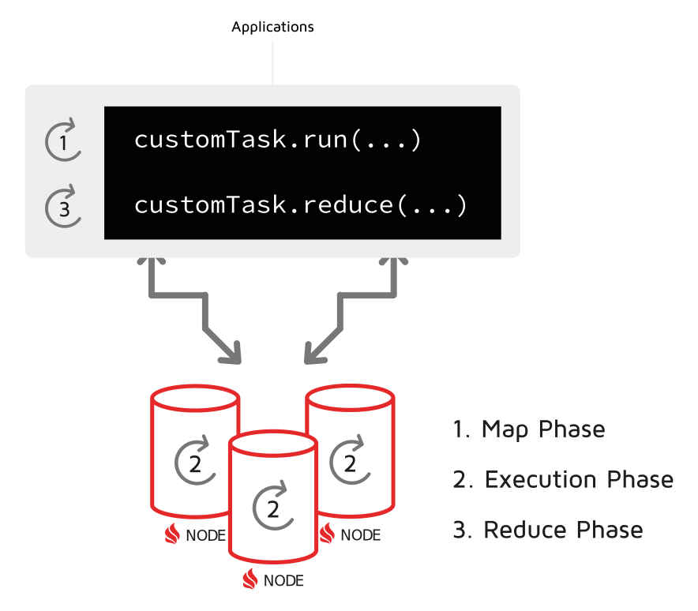</p>

在传统的基于磁盘的系统中，例如关系数据库或 NoSQL 数据库，客户端应用程序通常从服务器获取数据，使用记录进行本地计算，并在业务任务完成后立即丢弃数据。如果大量数据通过网络传输，这种方法不能很好地扩展。

为了克服这个问题，Apache Ignite 支持协同定位处理技术。该技术的主要目的是通过直接在 Ignite 集群节点上运行使用 JOIN 来提高复杂计算或 SQL 的性能。在协同定位处理中，计算是在集群节点的本地数据集上完成的。这避免了记录在网络上的混洗，并消除了网络延迟对应用程序性能的影响。

#### 数据协同定位
在实际中使用co-located处理，首先需要通过将相关记录存储在同一个集群节点上来co-locate数据集。这个过程在 Ignite 中也称为亲和共定位。

例如，让我们引入 Country 和 City 表，并将具有相同 Country 标识符的所有 City 记录并置在单个节点上。为此，您需要将 CountryCode 设置为 City 表中的affinityKey：
```sql
CREATE TABLE Country (
    Code CHAR(3),
    Name CHAR(52),
    Continent CHAR(50),
    Region CHAR(26),
    SurfaceArea DECIMAL(10,2),
    Population INT(11),
    Capital INT(11),
    PRIMARY KEY (Code)
) WITH "template=partitioned, backups=1";

CREATE TABLE City (
    ID INT(11),
    Name CHAR(35),
    CountryCode CHAR(3),
    District CHAR(20),
    Population INT(11),
    PRIMARY KEY (ID, CountryCode)
) WITH "template=partitioned, backups=1, affinityKey=CountryCode";
```

这样，您指示 Ignite 将所有具有相同 CountryCode 的 Cities 存储在单个集群节点上。 一旦数据位于同一位置，Ignite 就可以直接在集群节点上执行计算和数据密集型逻辑以及带有 JOIN 的 SQL，从而最小化甚至消除网络利用率。

#### SQL 和分布式连接
如果针对同一位置的记录执行查询，则 Ignite SQL 引擎的执行速度会快得多。 这对于具有可以跨越许多集群节点的 JOIN 的 SQL 尤其重要。

使用前面带有 Country 和 City 表的示例，让我们连接返回给定国家/地区中人口最多的城市的两个表：
```sql
SELECT country.name, city.name, MAX(city.population) as max_pop
FROM country
JOIN city ON city.countrycode = country.code
WHERE country.code IN ('USA','RUS','CHN')
GROUP BY country.name, city.name
ORDER BY max_pop DESC;
```
此查询仅在存储中国、俄罗斯和美国记录的节点上执行。此外，在 JOIN 期间，记录不会在节点之间打乱，因为具有相同 city.countrycode 的所有城市都存储在单个节点上。

#### 分布式协同计算
Apache Ignite 计算和机器学习 API 允许您并行执行计算和机器学习算法，以实现高性能、低延迟和线性可扩展性。此外，这两个组件最适合协同定位的数据集。

让我们再举一个例子，想象一场冬季风暴即将袭击一个人口稠密的城市。作为一家电信公司，您必须向 2000 万居民发送有关暴风雪的短信。使用客户端-服务器方法，该公司将从数据库中读取所有 2000 万条记录到需要执行某些逻辑并最终向居民发送消息的应用程序。

一种更有效的方法是在存储居民记录的集群节点上运行逻辑并发送文本消息。使用这种技术，您无需通过网络提取 2000 万条记录，而是就地执行逻辑并消除网络对计算性能的影响。

以下是此逻辑的示例：
```java
Ignite ignite = ...

// NewYork ID.
long newYorkId = 2;

// Send the logic to the cluster node that stores NewYork and all its inhabitants.
ignite.compute().affinityRun("City", newYorkId, new IgniteRunnable() {

  @IgniteInstanceResource
  Ignite ignite;

  @Override
  public void run() {
    // Get access to the Person cache.
    IgniteCache<BinaryObject, BinaryObject> people = ignite.cache("Person").withKeepBinary();


    ScanQuery<BinaryObject, BinaryObject> query = new ScanQuery <BinaryObject, BinaryObject>();

    try (QueryCursor<Cache.Entry<BinaryObject, BinaryObject>> cursor = people.query(query)) {
      // Iteration over the local cluster node data using the scan query.
      for (Cache.Entry<BinaryObject, BinaryObject> entry : cursor) {
        BinaryObject personKey = entry.getKey();

        // Pick NewYorkers only.
        if (personKey.<Long>field("CITY_ID") == newYorkId) {
            person = entry.getValue();

            // Send the warning message to the person.
        }
      }
    }
  }
}
```

### 机器学习（MACHINE LEARNING）
Apache Ignite® 机器学习 (ML) 是一组简单、可扩展且高效的工具，可用于构建预测性机器学习模型，而无需进行昂贵的数据传输。将机器和深度学习 (DL) 添加到 Apache Ignite 的基本原理非常简单。今天的数据科学家必须处理阻止 ML 被主流采用的两个主要因素。

<p>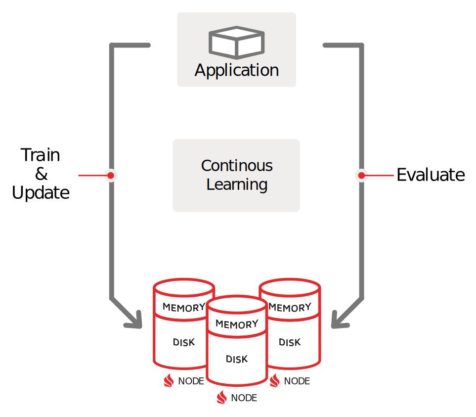</p>

#### 问题 1：持续数据移动 (ETL)
首先，模型在​​不同的系统中进行训练和部署（在训练结束后）。数据科学家必须等待 ETL 或其他一些数据传输过程，才能将数据移动到 Apache Mahout 或 Apache Spark 等系统中以进行培训。然后他们必须等待此过程完成并在生产环境中重新部署模型。整个过程可能需要数小时才能将数 TB 的数据从一个系统移动到另一个系统。此外，训练部分通常发生在旧数据集上。

#### 问题 2：缺乏横向可扩展性
第二个因素与可扩展性有关。 ML 和 DL 算法必须处理不再适合单个服务器单元且不断增长的数据集。这需要数据科学家提出复杂的解决方案或转向分布式计算平台，例如 Apache Spark 和 TensorFlow。然而，这些平台大多只解决了一部分难题，即模型训练，这使得开发人员决定以后如何在生产中部署模型成为一种负担。

#### 零 ETL 和大规模可扩展性
Ignite 机器学习依赖于 Ignite 的多层存储，它为 ML 和 DL 任务带来了巨大的可扩展性，并消除了 ETL 在不同系统之间施加的等待。例如，它允许用户直接在 Ignite 集群中跨内存和磁盘存储的数据上运行 ML/DL 训练和推理。接下来，Ignite 提供了大量 ML 和 DL 算法，这些算法针对 Ignite 的并置分布式处理进行了优化。这些实现在针对海量数据集就地运行或针对传入数据流增量运行时提供内存中速度和无限的水平可扩展性，而无需将数据移动到另一个存储中。通过消除数据移动和冗长的处理等待时间，Ignite 机器学习实现了持续学习，可以根据实时到达的最新数据改进决策。

#### 容错和持续学习
Ignite Machine Learning 可以容忍节点故障。这意味着在学习过程中节点发生故障的情况下，所有的恢复过程对用户都是透明的，学习过程不会被中断，并且你会在类似于所有节点都up和跑步。

### 更多特征

#### 服务网格（service grid）
Apache Ignite® 服务网格允许在集群上部署任意用户定义的服务。 您可以实现和部署任何服务，例如自定义计数器、ID 生成器、分层映射等。

<p>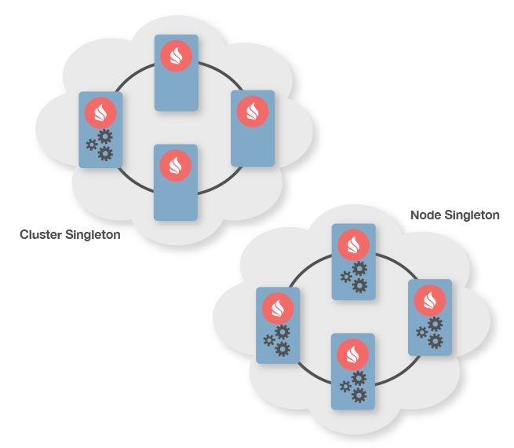</p>

服务网格的主要用例是能够在集群中部署各种类型的*单例服务*。 但是，如果您需要一个服务的多个实例，Ignite 还将确保所有服务实例的正确部署和容错。

##### GitHub 示例：
另请参阅 GitHub 上提供的[服务网格示例](https://github.com/apache/ignite/tree/master/examples/src/main/java/org/apache/ignite/examples/servicegrid)。

##### 代码示例：
> 服务定义
```java
// Simple service implementation.
public class MyIgniteService implements Service {
    // Example of ignite resource injection. All resources are optional.
    // You should inject resources only as needed.
    @IgniteInstanceResource
    private Ignite ignite;
    ...

    @Override public void cancel(ServiceContext ctx) {
        // No-op.
    }

    @Override public void execute(ServiceContext ctx) {
        // Loop until service is cancelled.
        while (!ctx.isCancelled()) {
            // Do something.
            ...
        }
    }
}
```

> 服务部署
```java
Ignite ignite = Ignition.ignite();

IgniteServices svcs = ignite.services();

// Deploy cluster-singleton service.
svcs.deployClusterSingleton("myClusterSingleton", new MyIgniteService());
```
#### 服务网格功能
> 特征 | 描述
> --- | ----
> 用户定义的服务 | 用户可以定义自己的服务，Ignite 将自动在集群上分发这些服务。 例如，您可以创建自己的专用分布式计数器、自定义数据加载服务或任何其他逻辑，并将其部署到集群上。[相关文档](https://ignite.apache.org/docs/latest/services/services)
> 集群单例 | Ignite 允许在任何网格节点上部署任意数量的服务。 但是，最常用的功能是在集群上部署单例服务。 无论拓扑变化和节点崩溃如何，Ignite 都会管理单例合约。[相关文档](https://ignite.apache.org/docs/latest/services/services)
> 容错 | Ignite 始终保证服务持续可用，并根据指定的配置进行部署，而不管任何拓扑更改或节点崩溃。[相关文档](https://ignite.apache.org/docs/latest/services/services)
> 负载均衡 | 在所有情况下，除了单例服务部署之外，Ignite 将自动确保在集群内的每个节点上部署大约相同数量的服务。 每当集群拓扑发生变化时，Ignite 将重新评估服务部署，并可能在另一个节点上重新部署已部署的服务以实现更好的负载平衡。[相关文档](https://ignite.apache.org/docs/latest/services/services)

#### 流式传输
Apache Ignite® 数据加载和流式传输功能允许以可扩展和容错的方式将大量有限且永无止境的数据量摄取到集群中。数据注入 Ignite 的速度非常快，在中等规模的集群上很容易超过每秒数百万个事件。

<p>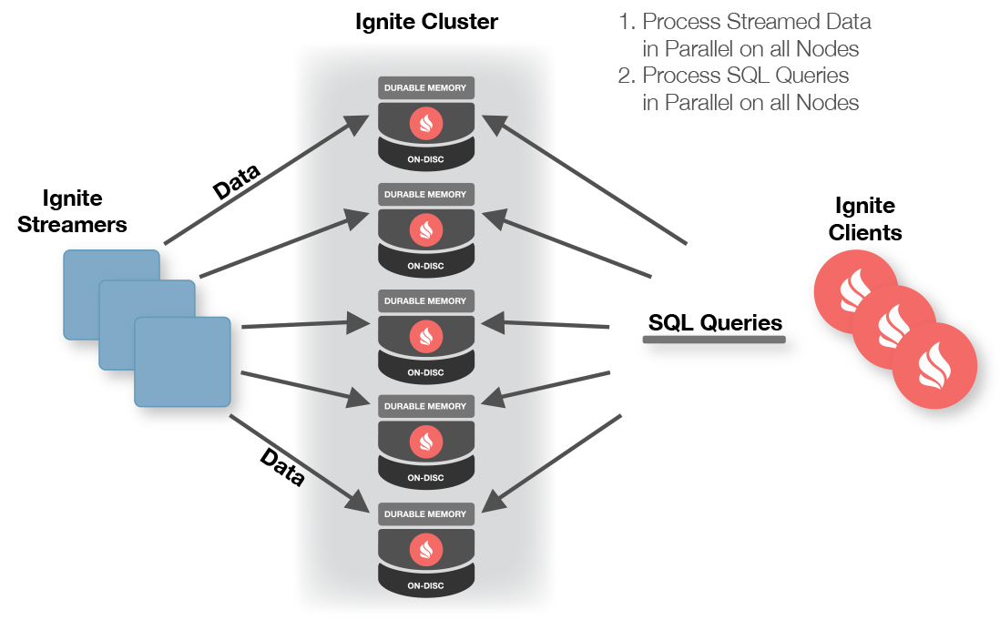</p>

Apache Ignite 与主要的流技术和框架（如 Kafka、Camel、Storm 或 JMS）集成，为基于 Ignite 的架构带来更高级的流功能。

##### 数据加载
Ignite 提供了几种用于初始数据加载的技术。例如，Ignite 流 API 是启用了 Ignite 原生持久性的集群的不错选择，而在 3rd 方存储中持久化数据的集群可以通过 CacheStore API 直接连接到它。

##### IGNITE 流媒体的工作原理：
> * 客户端将数据流注入 Ignite。
> * 数据在 Ignite 数据节点之间自动分区。
> * 跨所有集群节点同时处理数据。
> * 客户端对流数据执行并发 SQL 查询。
> * 客户端订阅数据更改时的连续查询。

##### 代码实例
> 流式数据
```java
// Get the data streamer reference and stream data.
try (IgniteDataStreamer<Integer, String> stmr = ignite.dataStreamer("myStreamCache")) {
    // Stream entries.
    for (int i = 0; i < 100000; i++)
        stmr.addData(i, Integer.toString(i));
}
```

> 转换数据
```java
CacheConfiguration cfg = new CacheConfiguration("wordCountCache");

IgniteCache<Integer, Long> stmCache = ignite.getOrCreateCache(cfg);

try (IgniteDataStreamer<String, Long> stmr = ignite.dataStreamer(stmCache.getName())) {
    // Allow data updates.
    stmr.allowOverwrite(true);

    // Configure data transformation to count instances of the same word.
    stmr.receiver(StreamTransformer.from((e, arg) -> {
    // Get current count.
    Long val = e.getValue();

    // Increment count by 1.
    e.setValue(val == null ? 1L : val + 1);

    return null;
    }));

    // Stream words into the streamer cache.
    for (String word : text)
    stmr.addData(word, 1L);
}
```

##### GitHub 示例：
另请参阅 GitHub 上提供的[连续查询](https://github.com/apache/ignite/blob/master/examples/src/main/java/org/apache/ignite/examples/datagrid/CacheContinuousQueryExample.java)、[字数统计](https://github.com/apache/ignite/tree/master/examples/src/main/java/org/apache/ignite/examples/streaming/wordcount)和[其他流示例](https://github.com/apache/ignite/tree/master/examples/src/main/java/org/apache/ignite/examples/streaming)。

##### 流式特征
> 特征 | 描述
> --- | ----
> Data Streamers | 数据流传输器由 IgniteDataStreamer API 定义，旨在将大量连续数据流注入 Ignite 流缓存中。 数据流传输器以可扩展和容错的方式构建，并为流入 Ignite 的所有数据提供至少一次保证语义。[相关文档](https://ignite.apache.org/docs/latest/data-streaming)
> Data Loading | 数据流传输器可用于将大量数据加载到 Ignite 缓存中。 它们可用于从第 3 方数据库或其他来源加载初始数据。[相关文档](https://ignite.apache.org/docs/latest/data-streaming)
> Collocated Processing | 对于需要执行一些自定义逻辑而不仅仅是添加新数据的情况，您可以利用 StreamReceiver API。流接收器允许您直接在将被缓存的节点上以并置方式对流数据做出反应。 在将数据放入缓存之前，您可以更改数据或向其添加任何自定义预处理逻辑。[相关文档](https://ignite.apache.org/docs/latest/data-streaming)
> Continuous Queries | 当您想要执行查询然后继续收到有关属于查询过滤器的数据更改的通知时，连续查询非常有用。[相关文档](https://ignite.apache.org/docs/latest/key-value-api/continuous-queries)
> JMS Data Streamer | Apache Ignite JMS 1.1 模块提供了一个流送器，用于将 JMS 队列和主题消息消耗到 Apache Ignite 缓存中。[相关文档](https://ignite.apache.org/docs/latest/extensions-and-integrations/streaming/jms-streamer)
> Apache Flume Sink <p></p> | IgniteSink 是一个 Flume 接收器，它从关联的 Flume 通道中提取事件并将它们注入到 Ignite 缓存中。 支持 Flume 1.7.0。[相关文档](https://ignite.apache.org/docs/latest/extensions-and-integrations/streaming/flume-sink)
> MQTT Streamer | Apache Ignite MQTT 模块提供了一个流传输器，用于将 MQTT 主题消息消费到 Apache Ignite 缓存中。[相关文档](https://ignite.apache.org/docs/latest/extensions-and-integrations/streaming/mqtt-streamer)
> Twitter Streamer | Ignite Twitter Streamer 使用来自 Twitter Streaming API 的消息并将它们插入到 Ignite 缓存中。[相关文档](https://ignite.apache.org/docs/latest/extensions-and-integrations/streaming/twitter-streamer)
> Apache Kafka Streamer <p></p> | Apache Ignite Kafka Streamer 模块提供从 Kafka 到 Ignite 缓存的流式传输。 有两种方法可以实现：在您的 Maven 项目中导入 Kafka Streamer 模块并实例化 KafkaStreamer 以进行数据流；使用 Kafka Connect 功能。[相关文档](https://ignite.apache.org/docs/latest/extensions-and-integrations/streaming/kafka-streamer)
> Apache Camel streamer  | Apache Ignite Camel 提供了一个 streamer 来使用来自 Camel 端点的缓存元组，例如 HTTP、TCP、文件、FTP、AMQP、SNMP、数据库等。有关可用组件的更多信息，请参阅 [Camel 组件](https://camel.apache.org/components/latest/)。[相关文档](https://ignite.apache.org/docs/latest/extensions-and-integrations/streaming/camel-streamer)
> Apache Storm Streamer  | Ignite Storm Streamer 使用来自 Apache Storm 消费者端点的消息并将它们馈送到 Ignite 缓存中。[相关文档](https://ignite.apache.org/docs/latest/extensions-and-integrations/streaming/storm-streamer)
> Apache Flink Streamer  | Ignite Flink Streamer 使用来自 Apache Flink 消费者端点的消息并将它们提供给 Ignite 缓存。[相关文档](https://ignite.apache.org/docs/latest/extensions-and-integrations/streaming/flink-streamer)
> Apache RocketMQ Streamer  | Ignite RocketMQ Streamer 使用来自 Apache RocketMQ 消费者端点的消息，并将它们提供给 Ignite 缓存。[相关文档](https://ignite.apache.org/docs/latest/extensions-and-integrations/streaming/rocketmq-streamer)
> ZeroMQ Streamer | Apache Ignite ZeroMQ Streamer 模块提供从 ZeroMQ 到 Ignite 缓存的流。[相关文档](https://ignite.apache.org/docs/latest/extensions-and-integrations/streaming/zeromq-streamer)
> Pub/Sub Streamer | Pub/Sub 模块是一个流连接器，用于将 Pub/Sub 数据注入 Ignite 缓存。

#### 数据结构
Apache Ignite® 允许以分布式方式使用 java.util.concurrent 框架中的大多数数据结构。 例如，您可以使用 java.util.concurrent.BlockingDeque 并在一个节点上向其添加一些内容，然后从另一个节点对其进行轮询。 或者有一个分布式 ID 生成器，它可以保证所有节点上 ID 的唯一性。

##### 支持的数据结构：
> * [Concurrent Map（缓存）](https://ignite.apache.org/use-cases/in-memory-data-grid.html)
> * [Distributed Queues and Sets](https://ignite.apache.org/docs/latest/data-structures/queue-and-set)
> * [AtomicLong](https://ignite.apache.org/docs/latest/data-structures/atomic-types)
> * [AtomicReference](https://ignite.apache.org/docs/latest/data-structures/atomic-types)
> * [AtomicSequence（ID 生成器）](https://ignite.apache.org/docs/latest/data-structures/id-generator)
> * [CountDownLatch](https://ignite.apache.org/docs/latest/data-structures/countdownlatch)

##### 代码示例：
> BlockingQueue
```java
Ignite ignite = Ignition.ignite();

// Non-colocated queue which will be distributed
// across all data nodes.
IgniteQueue<String> queue = ignite.queue("queueName", 20, new CollectionConfiguration());

// Add queue elements.
for (int i = 0; i < 20; i++)
    queue.add("Value " + Integer.toString(i));

// Poll queue elements.
for (int i = 0; i < 20; i++)
    System.out.println("Polled value: " + queue.poll());
```

> Set
```java
Ignite ignite = Ignition.ignite();

// Initialize new set.
IgniteSet<String> set = ignite.set("setName", null);

// Add set elements.
for (int i = 0; i < 10; i++)
    set.add(Integer.toString(i));

// Iterate over set.
for (String item : set)
    System.out.println("Set item: " + item);
```

> AtomicSequence
```java
Ignite ignite = Ignition.ignite();

// Initialize atomic sequence.
IgniteAtomicSequence seq = ignite.atomicSequence("seqName", 0, true);

for (int i = 0; i < 100; i++)
    System.out.println("Next sequence value: " + seq.incrementAndGet());
```

> AtomicLong
```java
Ignite ignite = Ignition.ignite();

// Initialize atomic long.
IgniteAtomicLong atomicLong = ignite.atomicLong("myAtomicLong", 0, true);

for (int i = 0; i < 100; i++)
    System.out.println("Incremented value: " + atomicLong.incrementAndGet());
```

> AtomicReference
```java
Ignite ignite = Ignition.ignite();

String val = "123";

// Initialize distributed atomic reference.
IgniteAtomicReference<String> ref = ignite.atomicReference(refName, val, true);

ref.compareAndSet(val, "456");
```

> CountDownLatch
```java
Ignite ignite = Ignition.ignite();

// Initialize distributed count down latch.
final IgniteCountDownLatch latch = ignite.countDownLatch(latchName, 10, false, true);

IgniteCompute asyncCompute = ignite.compute().withAsync();

// Asynchronously execute closures on the cluster
// which will simply count down the latch on remote nodes.
for (int i = 0; i < 10; i++)
    asyncCompute.run(() -> latch.countDown());

// Wait for all closures to complete.
latch.await();
```

##### GitHub 示例：
另请参阅 GitHub 上提供的[数据结构示例](https://github.com/apache/ignite/tree/master/examples/src/main/java/org/apache/ignite/examples/datastructures)。

##### 数据结构特点
> 特征 | 描述
> --- | ----
> Queue and Set | Ignite 提供了快速分布式阻塞队列和分布式集的实现。[相关文档](https://ignite.apache.org/docs/latest/data-structures/queue-and-set)
> Collocated vs. Non-Collocated | 队列和集合可以并置或非并置模式部署。 在并置模式下，集合的所有元素都将驻留在同一个集群节点上。 这种模式应该用于相对较小的集合。 在非并置模式下，集合的元素将在集群内平均分布，从而允许在内存中保留非常大的集合。[相关文档](https://ignite.apache.org/docs/latest/data-structures/queue-and-set)
> Bounded Queues | 有界队列允许用户拥有预定义最大大小的队列，从而更好地控制整体缓存容量。[相关文档](https://ignite.apache.org/docs/latest/data-structures/queue-and-set)
> Atomic Types | Ignite 支持分布式 AtomicLong 和 AtomicReference。[相关文档](https://ignite.apache.org/docs/latest/data-structures/atomic-types)
> CountDownLatch | Ignite CountDownLatch 允许您同步所有 Ignite 节点上的作业。[相关文档](https://ignite.apache.org/docs/latest/data-structures/countdownlatch)
> Reservation-based ID Generator | ID 生成器是用 AtomicSequence 实现的。 每当您对原子序列执行 incrementAndGet()（或任何其他原子操作）时，数据结构都会预先保留一系列值，这些值保证在该序列实例的整个集群中是唯一的。[相关文档](https://ignite.apache.org/docs/latest/data-structures/id-generator)
> Semaphore | Ignite 的分布式信号量实现和行为类似于 java.util.concurrent.Semaphore。[相关文档](https://ignite.apache.org/docs/latest/data-structures/semaphore)

#### 消息和事件
Apache Ignite® 提供高性能集群范围的消息传递功能，以通过发布-订阅和直接点对点通信模型交换数据。 消息可以以有序或无序的方式交换。 有序消息稍微慢一些，但在使用时，Ignite 保证消息将按照它们发送的相同顺序被接收。

Ignite 分布式事件功能允许应用程序在分布式网格环境中发生各种事件时接收通知。 您可以自动获得在集群内本地或远程节点上发生的任务执行、读取、写入或查询操作的通知。 事件通知也可以组合在一起，分批或按时间间隔发送。

##### 代码示例：
> 有序消息
```java
Ignite ignite = Ignition.ignite();

IgniteMessaging rmtMsg = ignite.message(ignite.cluster().forRemotes());

// Add listener for ordered messages on all remote nodes.
rmtMsg.remoteListen("MyOrderedTopic", (nodeId, msg) -> {
    System.out.println("Received ordered message [msg=" + msg + ", from=" + nodeId + ']');

    return true; // Return true to continue listening.
});

// Send ordered messages to remote nodes.
for (int i = 0; i < 10; i++)
    rmtMsg.sendOrdered("MyOrderedTopic", Integer.toString(i), 0);
```

> 无序消息
```java
Ignite ignite = Ignition.ignite();

IgniteMessaging rmtMsg = ignite.message(ignite.cluster().forRemotes());

// Add listener for unordered messages on all remote nodes.
rmtMsg.remoteListen("MyUnOrderedTopic", (nodeId, msg) -> {
    System.out.println("Received unordered message [msg=" + msg + ", from=" + nodeId + ']');

    return true; // Return true to continue listening.
});

// Send unordered messages to remote nodes.
for (int i = 0; i < 10; i++)
    rmtMsg.send("MyUnOrderedTopic", Integer.toString(i));
```

> 本地事件
```java
Ignite ignite = Ignition.ignite();

// Local listener that listenes to local events.
IgnitePredicate<CacheEvent> locLsnr = evt -> {
    System.out.println("Received local event [evt=" + evt.name() + "]");

    return true; // Continue listening.
};

// Subscribe to specified cache events occuring on local node.
ignite.events().localListen(locLsnr,
    EventType.EVT_CACHE_OBJECT_PUT,
    EventType.EVT_CACHE_OBJECT_REMOVED);

// Get an instance of named cache.
final IgniteCache<Integer, String> cache = ignite.cache("cacheName");

// Generate cache events.
for (int i = 0; i < 20; i++)
    cache.put(i, Integer.toString(i));
```

> 远端事件
```java
Ignite ignite = Ignition.ignite();

// Get an instance of named cache.
final IgniteCache<Integer, String> cache = ignite.jcache("cacheName");

// Sample remote filter which only accepts events for keys
// that are greater than or equal to 10.
IgnitePredicate<CacheEvent> rmtLsnr = evt -> {
    System.out.println("Received remote event [evt=" + evt.<Integer>key() >= 10 + "]");

    return true; // Continue listening.
};

// Subscribe to specified cache events on all nodes that have cache running.
ignite.events(ignite.cluster().forCacheNodes("cacheName")).remoteListen(null, rmtLsnr,
    EventType.EVT_CACHE_OBJECT_PUT,
    EventType.EVT_CACHE_OBJECT_REMOVED);

// Generate cache events.
for (int i = 0; i < 20; i++)
    cache.put(i, Integer.toString(i));
```

##### GitHub 示例：
另请参阅 GitHub 上提供的[消息传递示例](https://github.com/apache/ignite/tree/master/examples/src/main/java/org/apache/ignite/examples/messaging)。

##### 消息和事件功能
> 特征 | 描述
> --- | ----
> 基于主题的消息传递（Topic Based Messaging） | Ignite 分布式消息传递允许所有节点之间基于主题的集群范围内的通信。[相关文档](https://ignite.apache.org/docs/latest/messaging)
> 点对点消息传递（Point-to-Point Messaging） | Ignite 消息可以发送到一组节点或单个节点。[相关文档](https://ignite.apache.org/docs/latest/messaging)
> 有序与无序（Ordered vs. Unordered） | Ignite 支持有序和无序消息。 有序消息稍微慢一些，但在使用时，Ignite 保证消息将按照它们发送的相同顺序被接收。[相关文档](https://ignite.apache.org/docs/latest/messaging)
> 事件通知（Event Notifications） | Ignite 分布式事件功能允许应用程序在集群内发生各种事件时接收通知。[相关文档](https://ignite.apache.org/docs/latest/events/events)
> 本地与远程事件（Local vs. Remote Events） | 应用程序可以获得在集群内本地或远程节点上发生的任务执行、读取、写入或查询操作的通知。[相关文档](https://ignite.apache.org/docs/latest/events/events)
> 自动批次（Automatic Batching） | 事件通知可以组合在一起并分批或按时间间隔发送。[相关文档](https://ignite.apache.org/docs/latest/events/listening-to-events)

## 工具
### 管理和监控
Apache Ignite 以 JMX 和 OpenCensus 格式公开指标，从而可以使用各种工具（包括 Zabbix、Prometheus、Grafana 和 AppDynamics）来监控集群。

此外，*以下是专门为 Ignite 集群的管理和监控开发的工具列表*：

####  VISOR 命令行和控制脚本
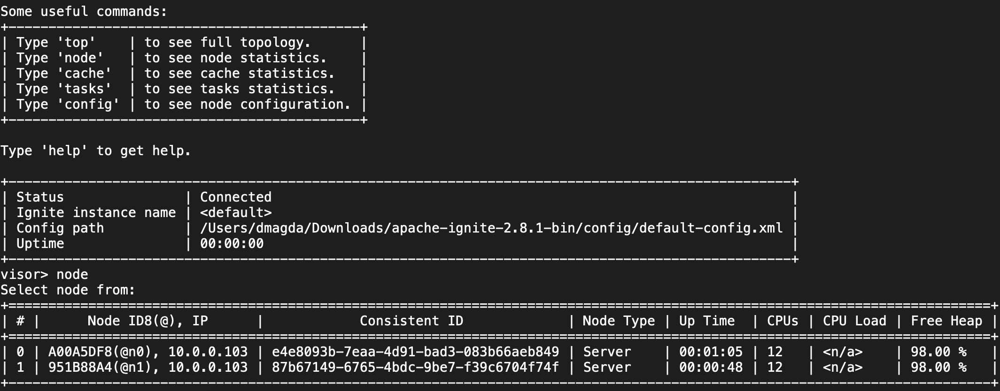
Apache Ignite 正式支持以下命令行工具来管理和监控集群：

> * [Visor 命令行工具](https://ignite.apache.org/docs/latest/tools/visor-cmd) - 提供有关集群节点、缓存和计算任务的基本统计信息。它还允许您通过启动或停止节点来管理集群的大小。
> * [控制脚本](https://ignite.apache.org/docs/latest/tools/control-script) - 一种高级命令行实用程序，可以更改基线拓扑、激活和停用集群、执行数据和索引的一致性检查、检测长时间运行或挂起的事务。
 

####  GRIDGAIN 控制中心
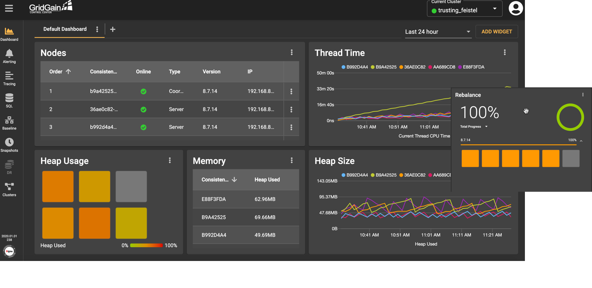
[GridGain Control Center](https://www.gridgain.com/products/control-center) 是 Apache Ignite 的管理和监控工具，支持以下功能：

> * 使用可定制的仪表板监控集群的状态。
> * 定义自定义警报以跟踪 200 多个集群、节点和存储指标并做出反应。
> * 执行和优化 SQL 查询以及监控已经运行的命令。
> * 执行基于 OpenCensus 的根本原因分析，并在 API 调用在整个集群的节点上执行时对其进行可视化调试。
> * 进行完整、增量和连续的集群备份，以便在发生数据丢失或损坏时实现灾难恢复。
 

####  DATADOG INTEGRATION FOR APACHE IGNITE
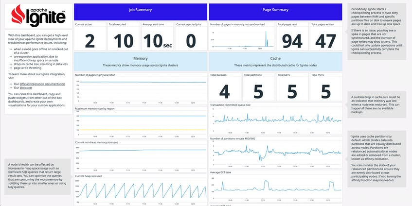

[Datadog](https://www.datadoghq.com/blog/monitor-apache-ignite-with-datadog/) 是一个通用的监控服务，它与 Apache Ignite 本地集成以提供以下功能：

> * 通过开箱即用的仪表板收集和可视化 Ignite 节点的指标。
> * 跟踪集群范围的内存使用情况，包括详细的垃圾收集活动。
> * 使用 Ignite 的内置运行状况检查创建警报以通知您有关“节点脱机”事件的信息。
 

####  Zabbix
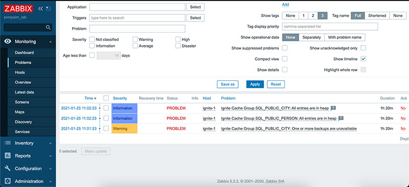

[Zabbix](https://www.zabbix.com/integrations/ignite#tab:official1) 是一种开源监控软件工具，适用于各种 IT 组件，包括网络、服务器、虚拟机和云服务。 Zabbix 提供监控指标，其中包括网络利用率、CPU 负载和磁盘空间消耗。

> * Apache Ignite 计算平台的官方 JMX 模板。该模板基于由 GridGain Systems 的高级工程师和 Apache Ignite Contributor 的 Igor Akkuratov 开发的原始模板。
> * Zabbix 版本：5.4 及更高版本
> * 此模板适用于独立和集群实例。指标由 JMX 收集。所有指标都是可发现的。
