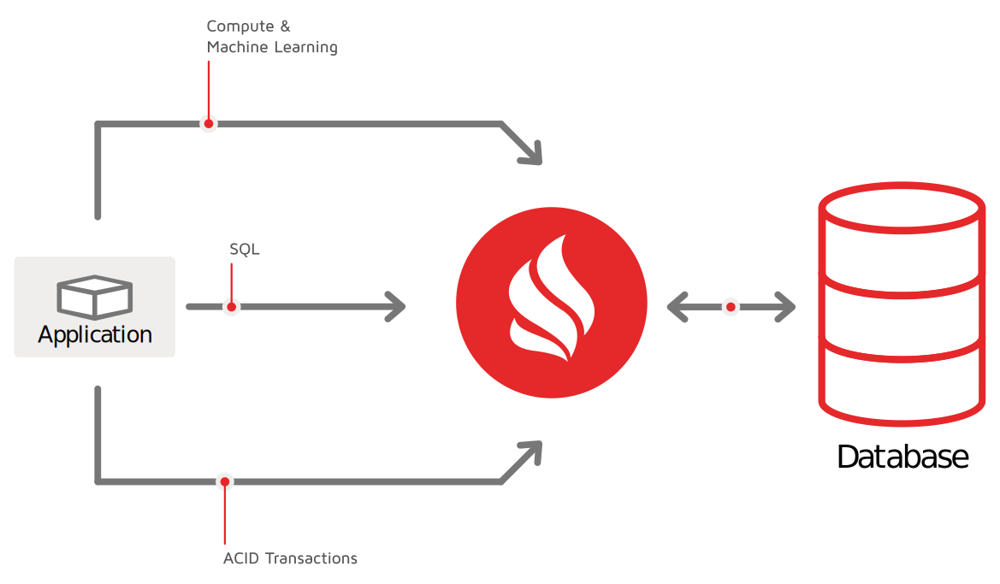
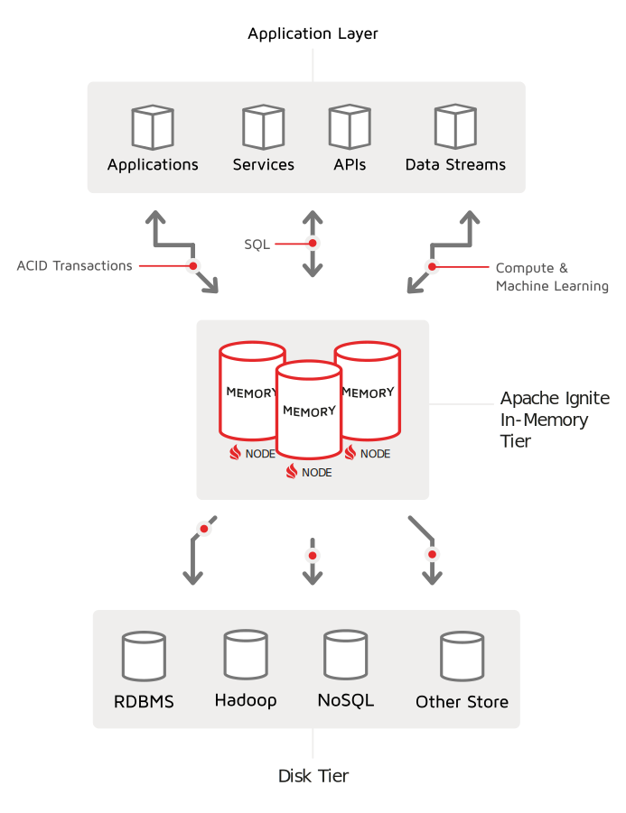
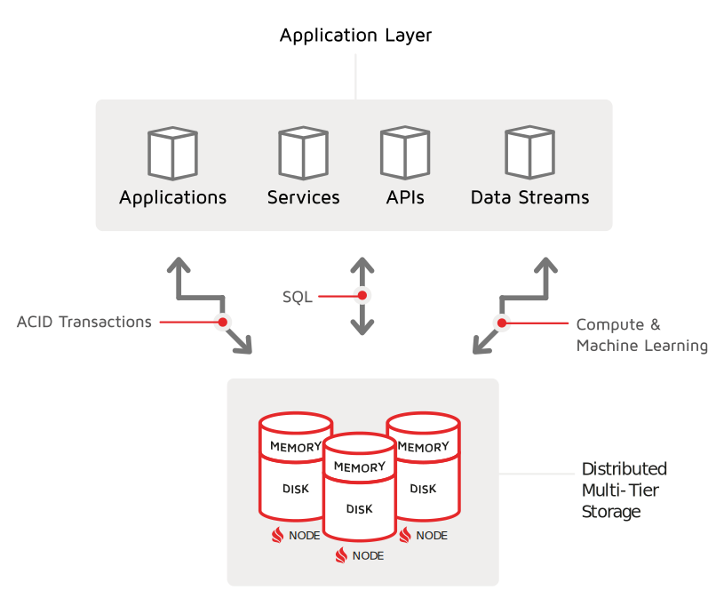
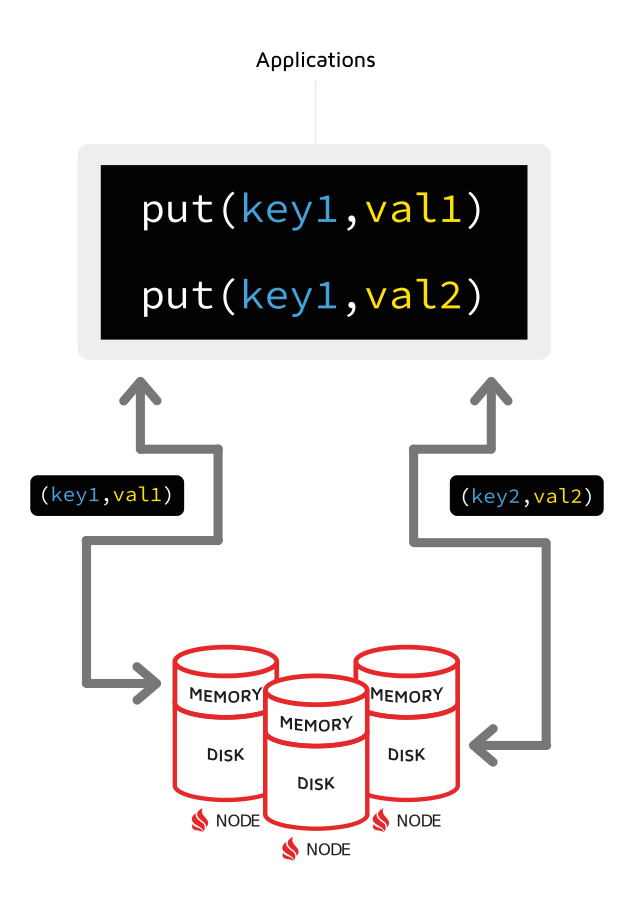
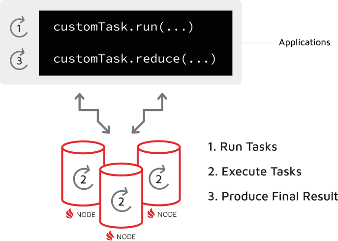
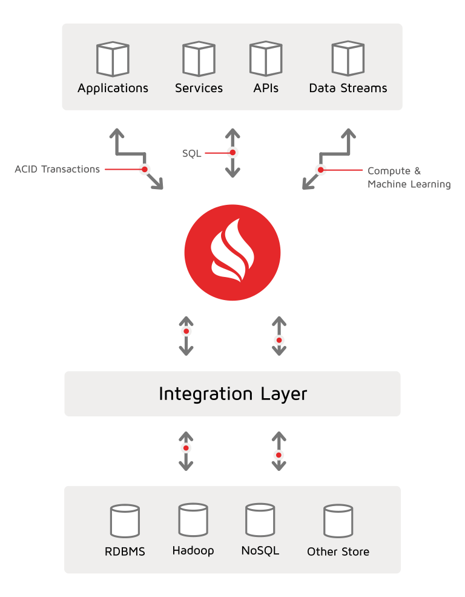
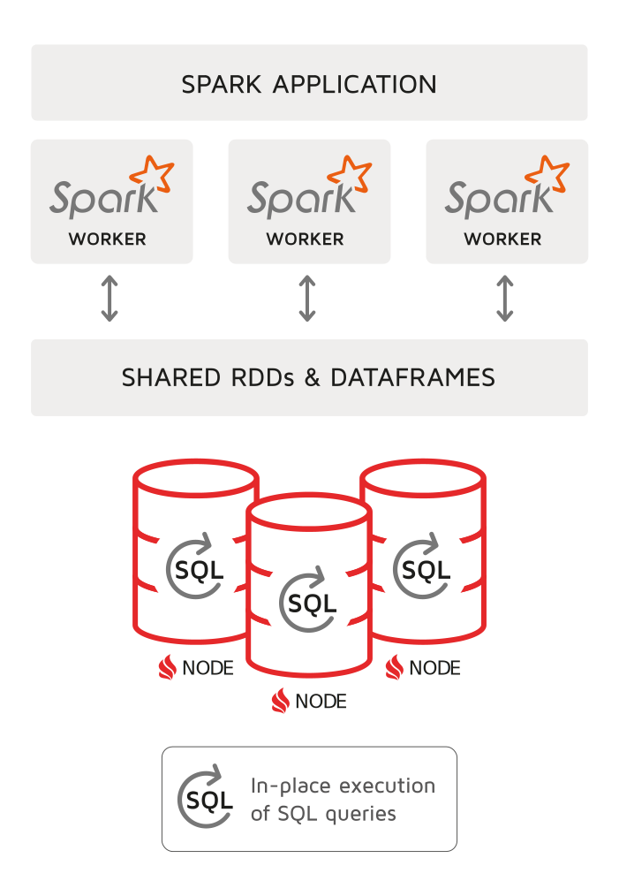
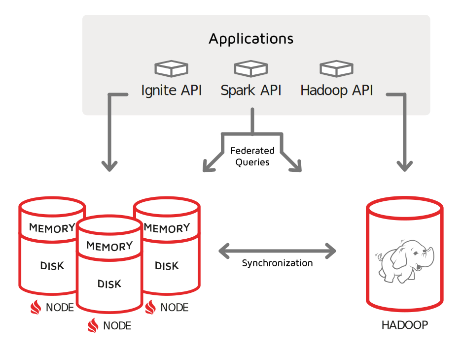

# 使用案例
## 缓存和数据库
### 内存中的缓存
Apache Ignite 可用作分布式内存缓存，您可以使用 SQL 查询并使用 ACID 事务自动更新，您可以在其上执行使用 Java、C# 和 C++ 等语言编写的自定义计算。 Ignite 提供加速应用程序、数据库和微服务所需的所有组件。

使用 Apache Ignite 的内存缓存
Apache Ignite 集群可以跨越多个节点，允许您的应用程序使用分布式环境的所有内存和 CPU 资源。通过使用简单的键值请求，您的应用程序可以在与标准缓存交互时与集群交互。此外，对于更高级的操作，您可以运行连接和分组数据集的分布式 SQL 查询。如果需要强一致性，可以在悲观和乐观两种模式下执行多节点和跨缓存的 ACID 事务。此外，如果应用程序运行计算或数据密集型逻辑，您可以通过运行以现代编程语言编写的协同定位计算来最大程度地减少数据混洗和网络利用率。

作为内存缓存的 Ignite 有两种主要的部署策略 - 缓存边部署和读取/写入缓存。我们将审查这两种策略。

#### 缓存侧部署（CACHE-ASIDE DEPLOYMENT）
使用缓存侧部署策略，缓存与主数据存储分开部署，甚至可能不知道主存储存在。应用程序或更改数据捕获 (CDC) 进程负责两个存储位置之间的数据同步。例如，如果在主数据存储中更新了一条记录，则需要将其新值复制到缓存中。

当缓存数据相对静态（不经常更新）或主存储和缓存之间允许临时数据滞后时，此策略很有效。通常假设更改最终会被完全复制，因此缓存和主存储将变得一致。

当 Apache Ignite 部署在缓存侧配置中时，其本机持久性可用作 Ignite 数据集的磁盘存储。本机持久性允许消除耗时的缓存预热步骤。此外，由于本机持久性在磁盘上维护数据的完整副本，因此您可以在内存中缓存记录的子集。如果内存中缺少所需的数据记录，则 Ignite 会自动从磁盘读取该记录，无论您使用哪种 API——无论是 SQL、键值还是扫描查询。

#### 读取/写入缓存（READ-THROUGH/WRITE-THROUGH CACHING）
读取/写入缓存策略可以归类为内存中、数据网格类型的部署。当 Apache Ignite 作为数据网格部署时，应用层开始将 Ignite 视为主要存储。当应用程序写入和读取数据网格时，Ignite 确保所有底层外部数据库保持更新并与内存中的数据保持一致。

对于需要加速基于磁盘的数据库或跨各种数据源创建共享缓存层的架构，建议使用此策略。 Ignite 与许多开箱即用的数据库集成，并且在直写或后写模式下，可以同步对数据库的所有更改。该策略也适用于 ACID 事务：Ignite 将跨其内存集群以及关系数据库协调和提交事务。

通读能力意味着，如果内存中缺少一条记录，缓存可以从外部数据库读取数据。 Ignite 完全支持键值 API 的此功能。但是，当您使用 Ignite SQL 时，您必须将数据集预加载到内存中——因为 Ignite SQL 只有在数据存储在本机持久性中时才能查询磁盘数据。

### 内存中的数据网格
Apache Ignite 可用作内存数据网格，可加速和扩展现有数据库和数据存储。 网格支持键值和 ANSI SQL API、ACID 事务、协同定位处理和机器学习库。 作为内存数据网格，Ignite 经常用于提高实时应用程序的性能和可扩展性，支持高性能计算，以及缓存分散在数据库中的数据。

#### 什么是数据网格？
内存数据网格是部署在多个数据库之上的高级读取/写入缓存。 网格支持各种 API，例如 SQL、计算和键值。 应用程序对网格进行写入和读取，网格以一致的方式将更改传播到底层数据存储。

借助 Ignite，您的应用程序可以利用多个 API 进行数据处理。 键值和 SQL 查询使您能够请求、加入和分组分布式数据集。 计算和机器学习 API 执行接近数据的逻辑，从而消除了网络上昂贵的数据改组。
#### IGNITE 作为内存数据网格和外部数据库
Ignite 可以作为应用程序和数据库层之间的内存数据网格滑入，从而提高大多数外部数据库和数据存储（例如 RDBMS、NoSQL 和 Hadoop）的性能和可扩展性。 当应用程序将数据写入缓存时，Ignite 将所有数据修改后写入或写入底层外部存储。 Ignite 还执行 ACID 事务（跨集群和数据库协调和提交事务）。

此外，Ignite 可以部署为共享和统一的内存层，用于存储源自脱节数据库的数据集。 您的应用程序可以将来自 Ignite 的所有数据作为单个存储使用，而每当更新内存数据时，Ignite 都会同步原始数据库。

#### IGNITE原生持久存储
Ignite Native Persistence 是一个分布式的 ACID 兼容的、SQL 兼容的磁盘存储，它透明地与 Ignite 内存层集成。 启用 Native Persistence 后，Ignite 将数据和索引都存储在磁盘上，从而消除了耗时的缓存预热步骤。 Native Persistence 在磁盘上保留数据的完整副本，因此您可以自由地在内存中缓存记录的子集。 如果内存中缺少所需的数据记录，Ignite 会自动从磁盘读取记录，而不管 API（无论是 SQL、键值还是扫描查询）。

### 内存中的数据库
Apache Ignite® 是一个分布式内存数据库，可跨内存和磁盘层水平扩展。 Ignite 支持 ACID 事务、ANSI-99 SQL、键值、计算、机器学习和其他数据处理 API。 作为数据库，Ignite 使用内存、磁盘或英特尔® 傲腾™ 作为活动存储层，无需缓存所有数据和内存预热。

#### 多层存储（MULTI-TIER STORAGE）
Apache Ignite 将内存、磁盘和英特尔傲腾用作活动存储层。这种架构将内存计算的优势与磁盘持久性和强一致性结合在一个系统中。

启用本机持久性后，Ignite 允许您控制它应该消耗的内存量。根据可用的内存空间，Ignite 要么将完整数据集缓存在内存中，要么仅保留最常用的数据，并在需要时从磁盘检索丢失的记录。例如，如果有 100 条记录，而您的系统内存只能容纳其中的 20 条，那么所有 100 条记录都将存储在磁盘上，并且只有 20 条记录会缓存在内存中以获得更好的性能。

以下是 Ignite 内存管理架构的主要优势：

> * 多层存储 - Ignite 将磁盘视为活动存储层，允许将数据的子集缓存在内存中，并使用 SQL 和所有其他可用 API 查询内存中和仅磁盘记录。
> * 瞬时集群重新启动 - Ignite 在集群启动或重新启动时从磁盘完全运行，无需预加载或预热内存层。

#### 集群即时重启带来更好的高可用性
Ignite 原生持久化消除了集群重启时耗时的内存预热的麻烦。 启用本机持久性后，Ignite 在磁盘上存储数据的超集，将其视为存储层之一。 因此，一旦集群变为活动状态，Ignite 就会开始从持久层读取数据。 当您开始运行查询时，内存层会在后台使用 Ignite 从磁盘访问的数据进行预热。

#### 通过协同处理避免网络对性能的影响
以磁盘为中心的系统，如 RDBMS 或 NoSQL，在将数据从服务器传输到客户端时，通常使用经典的客户端-服务器方法，在客户端对数据进行处理然后丢弃。 这种方法不能很好地扩展，因为通过网络移动数据是分布式系统中最昂贵的操作。

许多分布式数据库，包括 Apache Ignite，都支持一种称为协同定位处理的更具可扩展性的方法，它通过在集群节点上运行应用程序逻辑来消除或显着减少网络流量。 这种方法执行数据或计算密集型查询，包括具有 JOIN 的分布式 SQL，正是数据所在的位置。

### Key-Value仓储
Apache Ignite® 是一种分布式键值存储，可将数据存储在内存和磁盘上。 Ignite 用作分布式分区哈希映射，在这种部署模式下，每个集群节点都拥有整个数据集的一部分。 您可以使用键值请求访问集群或利用 Ignite 中独有的 API，其中包括分布式 ACID 事务、SQL、协同定位计算和机器学习。

#### JCACHE 和扩展的键值 API
Ignite 键值 API 符合 JCache (JSR 107) 规范并支持：

> * 基本缓存放置/获取操作
> * ConcurrentMap API
> * EntryProcessor 和 CacheInterceptor API
> * 事件和指标

Ignite 还扩展了 JCache 规范并支持分布式键值 ACID 事务、扫描和连续查询、协同定位计算等等。例如，如果您希望在服务器节点上的记录更新时通知应用程序，则连续查询很有用。 ACID 事务支持使您可以更新存储在不同缓存/表中的一组记录，并具有数据一致性。

#### 近缓存
近缓存是本地客户端缓存，用于存储应用端最常用的数据。此缓存技术仅支持键值 API，并且可以考虑用于需要一致响应时间（以微秒为单位）的应用程序。 Ignite 自动使近缓存失效并更新。每当记录的主要副本在服务器节点上更新时，Ignite 都会将更改传播到存储记录备份副本的所有节点以及将记录副本保存在其附近缓存中的应用程序。

#### 通读和写通/背后
如果 Ignite 被部署为外部数据库之上的键值存储，那么 Ignite 可以为您的应用程序发出的每个键值请求自动写入或隐藏对该外部存储的所有更改。它还包括键值 ACID 事务 - Ignite 在其内存集群和关系数据库中协调和提交事务。

通读功能意味着如果内存中缺少记录，Ignite 可以从外部数据库读取数据。 JCache 和扩展的键值 API 都完全支持此功能。

#### Ignite原生持久性
如果您希望 Ignite 用作将数据缓存在内存中并将其持久化到磁盘而不是外部数据库的键值存储，那么您可以启用 Ignite 原生持久性。本机持久性功能可让您消除耗时的缓存预热步骤以及从外部数据库重新加载数据的阶段。此外，由于本机持久性始终在磁盘上保留数据的完整副本，因此您可以自由地在内存中缓存记录的子集。如果内存中缺少所需的数据记录，则无论您使用何种 API，Ignite 都会自动从磁盘读取它。

## 数据和计算中心
### 高性能计算
高性能计算 (HPC) 是高速处理数据和执行复杂计算的能力。 使用 Apache Ignite® 作为高性能计算集群，您可以将一组商用机器或云环境转变为互连 Ignite 节点的分布式超级计算机。 Ignite 通过处理内存中的记录并通过用于数据和计算密集型计算的 API 降低网络利用率来提高速度和规模。 这些 API 实现了 MapReduce 范式，并允许您跨节点集群运行任意任务。

#### 协同处理
Ignite 使用协同定位处理的概念来指导分布式内存环境中的 HPC 工作负载实现。协同处理通过直接在 Ignite 集群节点上运行来提高复杂计算的性能。这些计算仅在节点上可用的本地数据集上进行，从而避免了网络上的数据混洗并导致性能的数量级提高。

为了在实践中利用同位处理，首先需要通过将相关记录存储在同一个集群节点上来对数据进行同位处理。作为相关或共同定位数据的示例，请考虑您的银行账户和发布到其中的交易。一旦您将 accountID 设置为 Transactions 表的关联键，您将指示 Ignite 将您的 accountId 的所有交易存储在将您的帐户记录保存在 Accounts 表中的同一节点上。现在假设支付处理系统发送一个计算任务来验证您帐户的先前交易。由于数据位于同一位置，Ignite 将直接在存储您的帐户记录以及所有已完成交易的节点上执行此任务，并在该机器上本地完成验证，而不是通过网络将所有交易拉回应用程序。这种在数据所在节点上执行任务的方法提供了异常高的性能。当系统需要每秒处理数百万笔交易，验证之前完成的数十亿笔支付时，效果更加显着。

#### 计算 API
Ignite 提供计算 API（也称为计算网格），用于创建和调度任意复杂度的自定义任务。这些 API 实现了 MapReduce 范式，目前可用于 Java、C# 和 C++。

### 数字集成中心
数字集成中心 (DIH) 是一种先进的平台架构，可将多个后端系统和数据库聚合到一个低延迟的共享数据存储中。 Apache Ignite® 充当这样一个存储，它缓存和持久化分散在许多不相交的后端数据库中的数据集，并通过高性能 API 将它们提供给您的应用程序。

应用程序通过 API 服务层访问 Ignite，并通过仅从 Ignite 分布式存储请求数据来体验显着的性能改进。

作为数字集成中心组件，Apache Ignite：

> * 支持大规模和高吞吐量的架构，防止后端系统因过多的工作负载而不堪重负
> * 避免后端数据库和前端 API 服务之间的复杂集成

#### APACHE IGNITE 和后端系统的同步
Ignite 作为高性能数据存储，需要通过流式、基于事件、变更数据捕获 (CDC) 或其他技术与后端数据库同步。

Ignite 提供了 CacheStore 接口，用于在 Ignite 集群和支持关系数据库和一些 NoSQL 存储的外部存储之间进行单向同步。该接口允许 Ignite 自动写入或隐藏对后端系统的所有更改。它还包括事务 - Ignite 在其内存集群和外部事务数据库中协调和提交事务。

对于双向同步，您可以考虑各种流、CDC 和基于事件的技术。例如，Kafka、Spark 和 Debezium 被广泛用于保持 Ignite 与其他数据库的同步。

#### 实时分析
尽管实时分析不是数字集成中心架构的定义特征，但在某些情况下，您最终可以在 Apache Ignite 中整合运营和分析数据孤岛。如果发生这种情况，您可以利用 Ignite SQL、计算和机器学习功能来满足实时分析需求。

## 更快的分析
### apache spark 加速
通过将数据保存在共享的 Apache Ignite® 内存集群中，可以提高 Apache Spark® 应用程序的性能。 Spark 使用 Ignite 作为数据源，类似于它使用 Hadoop 或关系数据库的方式。您可以启动 Ignite 集群，将其设置为 Spark 工作线程的数据源，然后继续使用 Spark RDD 或 DataFrames API。通过直接在 Spark 数据集上运行 Ignite SQL 或计算 API，您可以获得更高的速度。 Ignite 也可以被需要共享数据和状态的 Spark 工作器用作分布式内存层。

出于多种原因，可以实现性能提升。首先，Ignite 旨在跨节点集群将数据集存储在内存中，从而减少通常需要从基于磁盘的系统中提取数据的 Spark 操作的延迟。其次，Ignite 试图通过在 Ignite 节点上就地运行某些 Spark 任务（由 RDD 或 DataFrames API 生成）来最大程度地减少其 store 和 Spark 应用程序之间网络上的数据混洗。这种优化有助于减少网络延迟对 Spark 调用性能的影响。最后，如果直接从 Spark 应用程序调用原生 Ignite API（例如 SQL），则可以进一步降低网络影响。通过这样做，您可以消除 Spark 和 Ignite 之间的数据混洗，只要 Ignite SQL 查询始终在 Ignite 节点上执行，从而向应用层返回小得多的最终结果集。

#### Ignite共享RDDS
Apache Ignite 提供了 Spark RDD 的实现，它允许任何数据和状态在内存中作为 RDD 跨 Spark 作业共享。 Ignite RDD 为存储在不同 Spark 作业、工作者或应用程序的 Ignite 缓存中的数据提供了一个共享的、可变的视图。

Ignite RDD 被实现为分布式 Ignite 表（又名缓存）上的视图。它可以与 Ignite 节点一起部署在 Spark 作业执行过程中、Spark 工作器上或单独的 Ignite 集群中。这意味着根据选择的部署模式，共享状态可能仅在 Spark 应用程序的生命周期内存在（嵌入式模式），也可能超过 Spark 应用程序的存活时间（独立模式）。

#### Ignite数据帧
Apache Spark DataFrame API 引入了模式的概念来描述数据，允许 Spark 管理模式并将数据组织成表格格式。简而言之，DataFrame 是组织成命名列的分布式数据集合。它在概念上等同于关系数据库中的表，并允许 Spark 利用 Catalyst 查询优化器生成比 RDD 更高效的查询执行计划，RDD 是跨集群节点分区的元素集合。

Ignite 支持 DataFrame API，允许 Spark 通过该接口写入和读取 Ignite。此外，Ignite 分析 Spark 的 Catalyst 引擎生成的执行计划，并可以直接在 Ignite 节点上执行部分计划，这将减少数据混洗，从而使您的 SparkSQL 性能更好。

### Apache Hadoop 加速
Apache Ignite® 支持跨 Apache™ Hadoop® 操作和历史数据孤岛的实时分析。 Ignite 内存计算平台提供低延迟和高吞吐量的操作，而 Hadoop 继续用于长时间运行的 OLAP 工作负载。

正如右侧的架构图所示，您可以通过将 Ignite 部署为独立的分布式存储来维护基于低延迟操作或实时报告所需的数据集，从而实现基于 Hadoop 系统的性能加速。

首先，根据数据量和可用内存容量，您可以启用 Ignite 原生持久化，将历史数据集存储在磁盘上，同时为操作记录指定内存空间。您可以继续使用 Hadoop 作为存储较少使用的数据或长时间运行的临时分析查询。

接下来，您的应用程序和服务应该使用 Ignite 本机 API 来处理驻留在内存集群中的数据。 Ignite 为各种数据处理需求提供 SQL、计算（又名 map-reduce）和机器学习 API。

最后，如果应用程序需要跨 Ignite 和 Hadoop 集群运行联合或跨数据库查询，请考虑使用 Apache Spark DataFrames API。 Ignite 与 Spark 集成，后者原生支持 Hive/Hadoop。当 Ignite 和 Hadoop 都不包含整个数据集时，应仅在有限数量的场景中考虑跨数据库查询。

#### 如何在 IGNITE 和 HADOOP 之间拆分数据和操作？
考虑使用这种方法：

> * 将 Apache Ignite 用于需要低延迟响应时间（微秒、毫秒、秒）、高吞吐量操作（每秒数千和数百万次操作）和实时处理的任务。
> * 继续使用 Apache Hadoop 进行高延迟操作（几十秒、几分钟、几小时）和批处理。

#### 入门清单
按照以下步骤在实践中实现所讨论的架构：

> * 在您的系统中下载并安装 Apache Ignite。
> * 选择要针对 Ignite 执行的操作/报告列表。最佳候选者是需要低延迟响应时间、高吞吐量和实时分析的操作。
> * 根据数据量和可用内存空间，考虑使用 Ignite 原生持久化。或者，您可以将 Ignite 用作纯内存缓存或内存数据网格，将更改持久化到 Hadoop 或其他外部数据库。
> * 更新您的应用程序以确保它们使用 Ignite 本机 API 来处理 Ignite 数据并使用 Spark 进行联合查询。
> * 如果您需要在 Ignite 和 Hadoop 集群之间复制更改，请考虑使用现有的更改数据捕获解决方案，例如 Debezium、Kafka、GridGain Data Lake Accelerator、Oracle GoldenGate 或其他。如果您希望 Ignite 直接写入对 Hadoop 的更改，则实现 Ignite 的 CacheStore 接口。

## 产品中的Ignite
### 由Ignite出品

Apache Ignite® 用于解决与速度和规模相关的复杂问题。在这个页面上，社区试图用一些参考数据来积累所有公开披露的 Ignite 生产用例。我们希望共享的架构和实现细节将帮助您构建更强大的 Ignite 解决方案。

如果您有 Apache Ignite 用例要分享，请随时在 Ignite 开发人员列表上与我们联系，我们会将其添加到此页面。

#### IBM
Apache Ignite 用于 IBM Z Mainframes 工作负载加速。

#### 雷费森银行
随着用户过渡到数字渠道，银行系统的负载增加了。例如，自 2020 年初以来，Raiffeisen-Online 对 ABS 子系统的请求数量增加了三分之一。因此，减少负载和系统扩展是不变的和重中之重。

#### Teradata
Apache Ignite 用于处理实时营销活动。

#### 雅虎！日本
这篇博文解释了 Yahoo!日本选择 Apache Ignite 作为其高度可扩展缓存系统的解决方案，该系统每秒可处理数万个请求。 SQL 查询是通过瘦客户端执行的，因为它们不需要标准的拓扑连接，因此更容易通过容器服务处理。在成功进行 POC 后，Ignite 完全满足了他们的要求并迅速投入生产。

#### 美国航空
美国航空公司借助 Apache Ignite 进行 IT 转型。

#### ING银行
ING 使用 Apache Ignite 进行核心银行系统转型。

#### 巴西银行
Banco do Brasil 正在内部开发全渠道 Horus 平台。他们实现了一个基于 Apache Ignite、JBoss Drools 和其他组件的复杂事件处理 (CEP) 生态系统。该团队还构建了事件驱动的微服务和接口应用程序。

#### 24 小时健身
Apache Ignite 作为各种 24 小时健身服务的数字集成中心和数据库。

#### 摩根大通
风险管理对资产管理提出了独特的技术挑战。请求涉及对数百万个数据点进行大量计算，目标响应时间约为 1/3 秒。使用基于 Apache Ignite 的平台解决了这一挑战。

#### 推理.ai
nference.ai 使用 Ignite 进行生物信息学领域的分布式分析。作为一个水平可扩展的框架，Ignite 允许定义不同的统计分析并实时对 TB 的数值数据执行它，而无需移动数据。

#### 天宝
Trimble 使用 Apache Ignite 构建了一个实时地理空间分析平台，以提高施工效率。 Apache Ignite 构成了 TRex 平台的关键基础设施组件。它支持从现场实时摄取数据以及 OLTP 样式分析和针对该数据的查询，例如专题平铺、体积和挖/填计算、空间分析等。

#### 森蒂恩茨
Sentienz 使用 Apache Ignite 通过单个集群物联网平台每秒处理来自 1000 万台设备的超过 100 万个请求。

#### 雅旅
本演讲着眼于 2016 年收购竞争对手酒店住宿供应商 TotalStay Group 后 JacTravel Group 面临的技术挑战。围栏遗留功能并提供增强的搜索功能 - 以 Apache Ignite 的内存数据网格功能为基础。

#### 储蓄银行
使用 Apache Ignite 对 Sberbank 银行服务进行数字化转型。

#### 惠灵顿管理
使用 Apache Ignite 实现投资记录簿 (IBOR)。

#### 电子疗法
Apache Ignite 作为用于药物发现的高性能计算系统。

#### 海皮
Apache Ignite 作为以图形为中心的平台。

#### 趋势矿工
使用 Apache Ignite 计算网格功能实时可视化和分析大量历史数据。

#### 安捷伦科技公司
利用内存中数据网格解决数字渠道的更快上市时间和数据灵活性问题。

#### 胶水
如何使用 Apache Ignite 构建事件驱动、可动态重新配置的微服务平台。

#### FSB技术
使用 Apache Ignite 构建实时体育博彩平台。

#### 荷兰铁路
检测荷兰铁路规划中的潜在危险情况以应对欧洲最繁忙的铁路基础设施之一的挑战 JDriven 使用 Apache Ignite 构建了一个基于空间的架构
