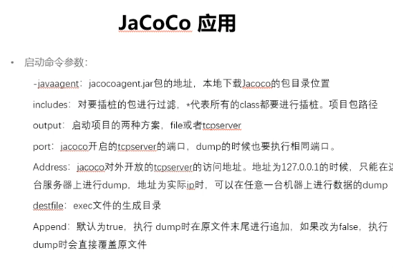

代码覆盖（英语：Code coverage）

是软件测试中的一种度量，描述程序中源代码被测试的比例和程度，所得比例称为代码覆盖率。在做单元测试时，代码覆盖率常常被拿来作为衡量测试好坏的指
标，甚至，用代码覆盖率来考核测试任务完成情况，比如，代码覆盖率必须达到80％或 90％。

代码覆盖率 ＝ 代码的覆盖程度，一种度量方式。

代码的覆盖深度：从覆盖源程序语句的详尽程度分析，逻辑覆盖标准包括以下不同的覆盖标准：

语句覆盖、判定覆盖、条件覆盖、条件判定组合覆盖、多条件覆盖和路径覆盖

语句覆盖：又称行覆盖(LineCoverage)，段覆盖(SegmentCoverage)，基本块覆盖(BasicBlockCoverage)，这是最常用也是最常见的一种覆盖方式，就
是度量被测代码中每个可执行语句是否被执行到了。选择足够多的测试数据，使被测程序中每条语句至少执行一次。语句覆盖是很弱的逻辑覆盖，它只管覆盖代
码中的执行语句，却不考虑各种分支的组合等等。测试效果不明显，很难更多地发现代码中的问题。

判定覆盖：又称分支覆盖(BranchCoverage)，所有边界覆盖(All-EdgesCoverage)，基本路径覆盖(BasicPathCoverage)，判定路径覆盖
(Decision-Decision-Path)。 比语句覆盖稍强的覆盖标准，它度量程序中每一个判定的分支是否都被测试到了。设计足够的测试用例，使得程序中的每个
判定至少都获得一次“真值”或“假值”，或者说使得程序中的每一个取“真”分支和取“假”分支至少经历一次，因此判定覆盖又称为分支覆盖。

条件覆盖：它度量判定中的每个子表达式结果true和false是否被测试到了。在设计程序中，一个判定语句是由多个条件组合而成的复合判定。为了更彻底地
实现逻辑覆盖，可以采用条件覆盖（Condition Coverage）的标准。条件覆盖的含义是：构造一组测试用例，使得每一判定语句中每个逻辑条件的可能值至
少满足一次。条件覆盖与判定覆盖非常容易混淆，条件覆盖不是将判定中的每个条件表达式的结果进行排列组合，而是只要每个条件表达式的结果true和false
测试到了就OK了。因此，我们可以这样推论：完全的条件覆盖并不能保证完全的判定覆盖。

条件判定组合覆盖：多条件覆盖多条件覆盖也称条件组合覆盖，它的含义是：设计足够的测试用例，使得每个判定中条件的各种可能组合都至少出现一次。显然
满足多条件覆盖的测试用例是一定满足判定覆盖、条件覆盖和条件判定组合覆盖的。

路径覆盖：又称断言覆盖(PredicateCoverage)。它度量了是否函数的每一个分支都被执行了。 就是所有可能的分支都执行一遍，有多个分支嵌套时，需要
对多个分支进行排列组合，可想而知，测试路径随着分支的数量指数级别增加。路径覆盖被很多人认为是“最强的覆盖”。

代码覆盖率的意义

分析未覆盖部分的代码，从而反推在前期测试设计是否充分，没有覆盖到的代码是否是测试设计的盲点，为什么没有考虑到？需求/设计不够清晰，测试设计的
理解有误，工程方法应用后的造成的策略性放弃等等，之后进行补充测试用例设计。
检测出程序中的废代码，可以逆向反推在代码设计中思维混乱点，提醒设计/开发人员理清代码逻辑关系，提升代码质量。
代码覆盖率高不能说明代码质量高，但是反过来看，代码覆盖率低，代码质量不会高到哪里去，可以作为测试自我审视的重要工具之一。
最后

覆盖率数据只能代表你测试过哪些代码，不能代表你是否测试好这些代码。不要过于相信覆盖率数据。不要只拿语句覆盖率(行覆盖率)来考核你的测试人员。
测试人员不能盲目追求代码覆盖率，而应该想办法设计更多更好的案例，哪怕多设计出来的案例对覆盖率一点影响也没有。

路径覆盖率 > 判定覆盖 > 语句覆盖

实现：
    1、jenkins+jacoco
        https://sq.sf.163.com/blog/article/200005925597016064

Jacoco
> *  1、官方地址：
> *      https://www.eclemma.org/jacoco/index.html
> *  2、启动配置  
     
