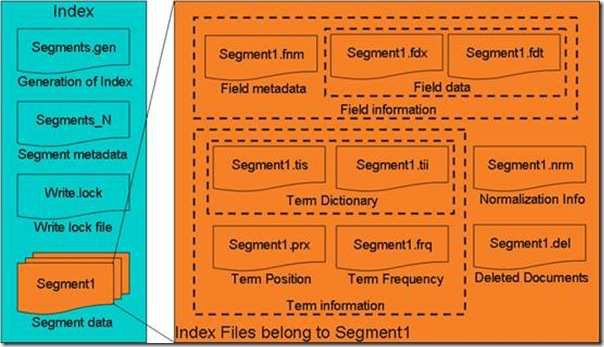

词向量索引文件（tvx） term vector index
词向量文档文件（tvd） term vector document
词向量域文件（tvf）      term vector field    
读取方式：参考70-71页代码
 
词典
term dictionary
Frequencies（.frq)
Positions（.prx)
 
词典信息（tis）term infos file
词典索引（tii） term infos index file
 
词位置信息（prx） the position file
 
标准化因子文件（nrm） normalization factor file
1）对于不同行业的人，不同类型文档的重要性不同
2）不同的域的重要性不同，比如标题和附件
3）绝对次数不合理，文章的长度也是影响因素
 
删除文档文件（del） deleted documents
 
deletesInRAM 和 deletesFlushed 各有什么用处呢？
此版本的 Lucene 对文档的删除是支持多线程的，当用 IndexWriter 删除文档的时候，都是缓存在 deletesInRAM 中的，直到 flush，才将删除的文档写入到索引文件中去，我们知道 flush是需要一段时间的，那么在 flush 的过程中，另一个线程又有文档删除怎么办呢？
一般过程是这个样子的，当 flush 的时候，首先在同步(synchornized)的方法 pushDeletes 中， 将 deletesInRAM 全部加到 deletesFlushed 中，然后将 deletesInRAM 清空，退出同步方法，于是 flush 的线程程就向索引文件写 deletesFlushed 中的删除文档的过程，而与此同时其他线程新删除的文档则添加到新的 deletesInRAM 中去，直到下次 flush 才写入索引文件。
 
缓存管理
为了提高索引的速度，Lucene 对很多的数据进行了缓存，使一起写入磁盘，然而
缓存需要进行管理，何时分配，何时回收，何时写入磁盘都需要考虑。
1.ArrayList<char[]> freeCharBlocks = new ArrayList<char[]>();将用于缓存词(Term)信息
的空闲块
2.ArrayList<byte[]> freeByteBlocks = new ArrayList<byte[]>();将用于缓存文档号(doc id)
及词频(freq)，位置(prox)信息的空闲块。
3.ArrayList<int[]> freeIntBlocks = new ArrayList<int[]>();将存储某词的词频(freq)和位置
(prox)分别在 byteBlocks 中的偏移量
4.boolean bufferIsFull;用来判断缓存是否满了，如果满了，则应该写入磁盘
5.long numBytesAlloc;分配的内存数量
6.long numBytesUsed;使用的内存数量
7long freeTrigger;应该开始回收内存时的内存用量。
8.long freeLevel;回收内存应该回收到的内存用量。
9.long ramBufferSize;用户设定的内存用量。
