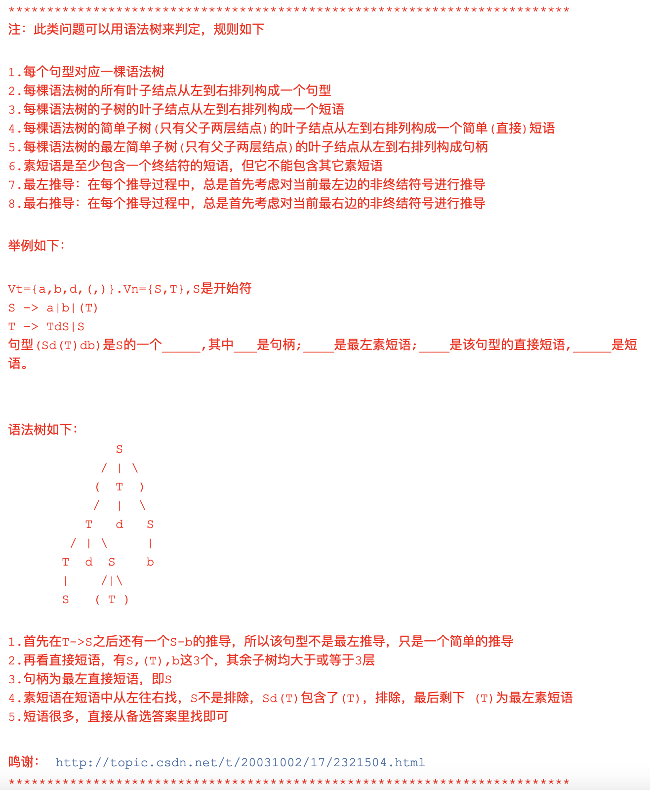
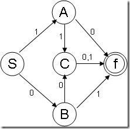

# 编译原理-文法
> * 文法是一个四元组：G = {Vt, Vn, S, P}
>   * Vt：非空有限的符号集合，每个元素为**终结符号**，一般是小写字母
>   * Vn：非空有限的符号集合，每个元素为**非终结符号**，一般是大写字母，是 G 的 开始符号
>   * P：非空有限集合，每个元素为**产生式**
>       * 形式：a -> b，符号 "->" 表示 "定义为"，a、b 属于 (Vt U Vn)*，a 不属于 E
>       * a 称为 产生式 的 左部，b 称为 产生式 的 右部
>       * a -> b，a -> r 可以缩写为 a -> b|r
>   * S：开始符，至少在 某一**产生式**的左部出现一次

    四种文法类型

    0型文法：短语文法
> * 要求：每个产生式 a -> b，满足 a 属于 (Vt U Vn)*，且至少包含一个非终结符，b 属于 (Vt U Vn)*
> * 类比：
>   * 相当于 图灵机
>   * 等价于 递归可枚举

    1型文法：上下文有关文法
> * 要求：0语法基础上，对于每个产生式 a -> b，都有｜b｜>= ｜a｜，这里｜b｜表示 b 的 长度
>   * 特例：a -> E 也满足1型文法
> * 类比：
>   * 对应于 下推自动机

    2型文法：上下文无关文法
> * 要求：1语法基础上，对于每个产生式 a -> b，都有a是非终结符
>   * 例：如 A -> Ba，符合2型文法；如 Ab -> Bab，不符合2型文法，因为a = Ab，Ab 不是 一个 非终结符
> * 类比：
>   * 对应于 线性有界自动机

    3型文法：正规文法
> * 要求：2语法基础上，满足 A -> a|aB（右线性）或 A -> a|Ba（左线性），仅满足一个的情况下才符合
> * 类比：
>   * 对应于 有限状态自动机

    相关定义
- [ ] 当G为 2型 或 3型 文法时，命题 "L(G)是 空集、有限集 或 无限集" 才是可判断的
- [ ] 当G1和G2都是 3型 文法时，命题 "L(G1) = L(G2)" 才是可判断的
- [ ] 最左/右推导：推导的 每一步 都对 最左/右的非终结符 使用推导公式
- [ ] 若S可以推出mAn，则A可以推出a，则称 a 是 非终结符号A的、句型mAn 的短语。若存在 A -> a，则为直接短语
- [ ] 一个句型 的 最左直接短语 称为 该句型的 句柄
- [ ] 素短语 是 一个短语，它 至少 包含 一个 终结符，并 除 自身外 不包含 其他的 素短语

    语法树

 

# DFA: Deterministic Finite State 确定的有穷自动机

[知乎 DFA&NFA](https://zhuanlan.zhihu.com/p/30009083)

    注：只要是有限状态自动机 -> 必符合3型文法｜可用正则表达式
    
    一个确定的有限状态自动机：五元组：M=（∑，Q，q0，F，δ）

    DFA：Deterministic Finite State 确定的有穷自动机

其中：
> * Q：有限状态合集
> * ∑：字母集，每个元素为 一个 输入符号
> * q0 ∈ Q，初始状态
> * F ∈ Q，终结状态集合
> * δ 是一个 从 Qx∑ (Q与∑的笛卡尔积) 到 Q 的 单值映射：
>   * δ(q, a)= q* （q, q* ∈ Q, a ∈ ∑）：当状态为q，输入符号a时，自动机 将 转换 到下一个状态 q*，q* 称为 q 的一个 后继
>   * Q = {q1,q2,...,qn}, ∑ = (a1,a2,...,an)，则 (δ(qi,aj))nxm 是一个 n行m列 矩阵，称为DFA的 状态转换矩阵，称为转换表

    状态转换图

    
    DFA M=({S,A,B,C,f},{1,0},S,{f},δ)
    其中：δ(S,0)=B, δ(S,1)=A, δ(A,0)=f, δ(A,1)=C, δ(B,0)=C, δ(B,1)=f, δ(C,0)=f
    
    其中圈表示状态结点，双圈表示终结状态结点，而边表示状态的转换，代表映射。边上的符号表示此转换需要输入的符号，代表映射的输入。
    对于∑上的任何字符串w∈∑*，若存在一条从初始结点到终态结点的路径，在这条路径上的所有边的符号连接称的符号串恰好是w，则w被DFA所识别(或接受、读出)。
    
    DFA所能识别的符号串的全体记为L(M)，称为DFA所识别的语言。

# NFA: Non-Deterministic Finite State Automata

    之前介绍的是确定的有限自动机，即一个状态对于待定的输入字符有一个确定的后继状态。而当一个状态对于特定的输入字符有一个以上的后继状态时，我们称该
    有限自动机为非确定有限自动机(记做NFA)，其形式定义也是M=(∑,Q,q,F,δ)，且前面的字符定义均和DFA相同，但是δ：Q×∑对应所有Q的任意子集。

    在NFA中能够识别的路径与DFA中定义也相同。
    
    对任何一个NFA，都存在一个DFA*使L(M*)=L(M)，这时我们称M*与M等价。构造与M等价的M*的基本方法是让M*的状态对应于M的状态集合。即如果
    δ(q,a)={q1,q2,...,qn}，则把{q1,q2,...,qn}看作M*的一个状态，即M*中的状态集合Q*的一个元素。

# 正表达式的转换
## 1、正则 -> NFA（Thompson构造法）
