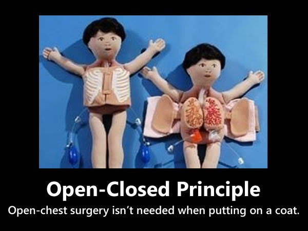
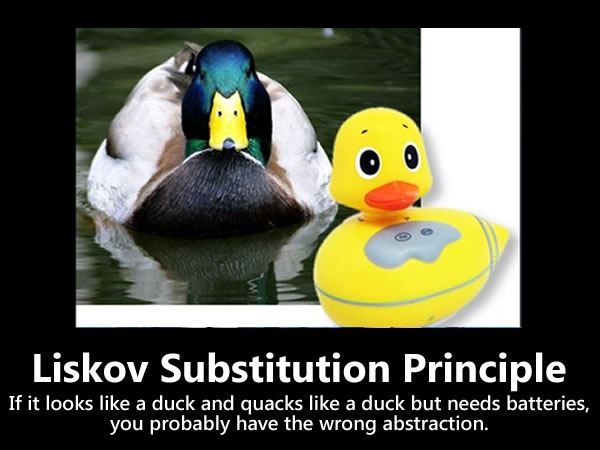
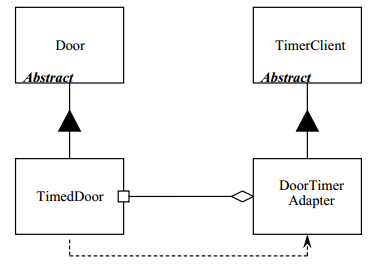
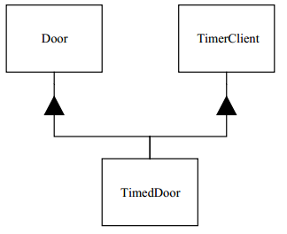
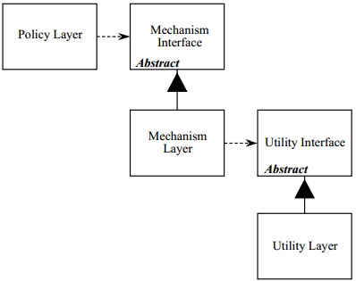

# 面向对象设计的原则
> 简称    |   中文名 |   英文全程
> ---   |   ----------  |   -------------------------------
> SRP   |   单一职责原则  |   Single Responsibility Principle
> OCP	|   开放封闭原则  |   Open Closed Principle
> LSP	|   里氏替换原则  |   Liskov Substitution Principle
> ISP   |   接口隔离原则  |   Interface Segregation Principle
> DIP   |   依赖倒置原则  |   Dependency Inversion Principle
> LKP   |   最少知识原则  |   Least Knowledge Principle

> "Bad Design" 的定义
> 
> 你可能曾经提出过一个让你倍感自豪的软件设计，然后让你的一个同事来做 Design Review？你能感觉到你同事脸上隐含的抱怨与嘲弄，他会冷笑的问道："为什么你要这么设计？" 反正这事儿在我身上肯定是发生过，并且我也看到在我身边的很多工程师身上也发生过。确切的说，那些持不同想法的同事是没有采用与你相同的评判标准来断定 "Bad Design"。我见过最常使用的标准是 "TNNTWI-WHDI" ，也就是 "That's not the way I would have done it（要是我就不会这么干）" 标准。
> 
> 但有一些标准是所有工程师都会赞同的。如果软件在满足客户需求的情况下，其呈现出了下述中的一个或多个特点，则就可称其为 "Bad Design"：
> 
>   * 难以修改，因为每次修改都影响系统中的多个部分。（僵化性Rigidity）
>   * 当修改时，难以预期系统中哪些地方会被影响。（脆弱性Fragility）
>   * 难以在其他应用中重用，因为它不能从当前系统中解耦。（复用性差Immobility）
>
> 此外，还有一些较难断定的 "Bad Design"，比如：灵活性（Flexible）、鲁棒性（Robust）、可重用性（Reusable）等方面。我们可以仅使用上面明确的三点作为判定一个设计的好与坏的标准。
> 
> "Bad Design" 的根源
> 
> 那到底是什么让设计变得僵化、脆弱和难以复用呢？答案是模块间的相互依赖。
> 
> 如果一个设计不能很容易被修改，则设计就是僵化的。这种僵化性体现在，如果对相互依赖严重的软件做一处改动，将会导致所有依赖的模块发生级联式的修改。当设计师或代码维护者无法预期这种级联式的修改所产生的影响时，那么这种蔓延的结果也就无法估计了。这导致软件变更的代价无法被准确的预测。而管理人员在面对这种无法预测的情况时，通常是不会对变更进行授权，然后僵化的设计也就得到了官方的保护。
> 
> 脆弱性是指一处变更将破坏程序中多个位置的功能。而通常新产生的问题所涉及的模块与该变更所涉及的模块在概念上并没有直接的关联关系。这种脆弱性极大地削弱了设计与维护团队对软件的信任度。同时软件使用者和管理人员都不能预测产品的质量，因为对应用程序某一部分简单的修改导致了其他多个位置的错误，而且看起来还是完全无关的位置。而解决这些问题将可能导致更多的问题，使得维护过程陷进了 "狗咬尾巴" 的怪圈。
> 
> 如果设计中实现需求的部分对一些与该需求无关的部分产生了很强的依赖，则该设计陷入了死板区域。设计师可能会被要求去调查是否能够将该设计应用到不同的应用程序，要能够预知该设计在新的应用中是否可以完好的工作。然而，如果设计的模块间是高度依赖的，而从一个功能模块中隔离另一个功能模块的工作量足以吓到设计师时，设计师就会放弃这种重用，因为隔离重用的代价已经高于重新设计的代价。

https://www.cnblogs.com/gaochundong/p/single_responsibility_principle.html

## 单一职责原则
定义
> 一个类应该有且只有一个变化的原因。
>
> There should never be more than one reason for a class to change.
 

职责（Responsibility）到底是什么？

> 在单一职责原则（SRP：Single Responsibility Principle）的概念中，我们将职责（Responsibility）定义为 "一个变化的原因（a reason for change）"。如果你能想出多于一种动机来更改一个类，则这个类就包含多于一个职责。

## 开发封闭原则
定义
> "软件实体（类、模块、函数等）应对扩展开放，但对修改封闭。"。
>  
> Software entities (classes, modules, functions, etc.) should be open for extension, but closed for modification.
 

两个重要的特性
> * 它们 "面向扩展开放（Open For Extension）"。
> 
>   * 也就是说模块的行为是能够被扩展的。当应用程序的需求变化时，我们可以使模块表现出全新的或与以往不同的行为，以满足新的需求。
> 
> * 它们 "面向修改封闭（Closed For Modification）"。
> 
>   * 模块的源代码是不能被侵犯的，任何人都不允许修改已有源代码。

看起来冲突？
> 看起来上述两个特性是互相冲突的，因为通常扩展模块行为的常规方式就是修改该模块。一个不能被修改的模块通常被认为其拥有着固定的行为。那么如何使这两个相反的特性共存呢？

抽象是关键。
> Abstraction is the Key.

策略性的闭合（Strategic Closure）
> 程序是不可能 100% 完全封闭的, 程序设计师必须甄别其设计对哪些变化封闭

使用抽象来获取显示地闭合
> 对行为进行某种程度的抽象

使用 "数据驱动（Data Driven）" 的方法来达成闭合
> 使用表驱动达到某种行为的闭合

进一步的扩展闭合
> 用抽象类来实现某种行为

## 里氏替换原则

引入
> * 是什么设计规则在保证对继承的使用呢？
> * 优秀的继承层级设计都有哪些特征呢？
> * 是什么在诱使我们构建了不符合开放封闭原则的层级结构呢？

定义
> 使用基类对象指针或引用的函数必须能够在不了解衍生类的条件下使用衍生类的对象。
>
> Functions that use pointers or references to base classes must be able to use objects of derived classes without knowing it.

Barbara Liskov 在 1988 年提出了这一原则：
> What is wanted here is something like the following substitution property: If for each object o1 of type S there is an object o2 of type T such that for all programs P defined in terms of T, the behavior of P is unchanged when o1 is substituted for o2 then S is a subtype of T.

一个自洽的模型不一定对它的所有用户都保持一致！
> 自洽性即逻辑自洽性和概念、观点等的前后一贯性。首先是指建构一个科学理论的若干个基本假设之间，基本假设和由这些基本假设逻辑地导出的一系列结论之间，各个结论之间必须是相容的，不相互矛盾的。逻辑自洽性也要求构建理论过程中的所有逻辑推理和数学演算正确无误。逻辑自洽性是一个理论能够成立的必备条件。

必须从该设计的使用者的合理假设的角度来分析
> * 软件设计真正关注的就是行为
> * 所有的衍生类必须符合使用者所期待的基类的行为

契约式设计（Design by Contract）
> Bertrand Meyer 在 1988 年阐述了 LSP 原则与契约式设计之间的关系。使用契约式设计，类中的方法需要声明前置条件和后置条件。前置条件为真，则方法才能被执行。而在方法调用完成之前，方法本身将确保后置条件也成立。

为衍生类设置前置条件和后置条件的规则是，Meyer 描述的是：

> …when redefining a routine [in a derivative], you may only replace its precondition by a weaker one, and its postcondition by a stronger one.
>
> 换句话说，当通过基类接口使用对象时，客户类仅知道基类的前置条件和后置条件。因此，衍生类对象不能期待客户类服从强于基类中的前置条件。也就是说，它们必须接受任何基类可以接受的条件。而且，衍生类必须符合基类中所定义的后置条件。也就是说，它们的行为和输出不能违背任何已经与基类建立的限制。基类的客户类绝不能对衍生类的输出产生任何疑惑。

里氏替换原则（Liskov Substitution Principle）则是实现 OCP 原则的重要方式

## 接口分离原则
定义
> Clients should not be forced to depend upon interfaces that they do not use.
> 
> 接口分离原则描述为 "客户类不应被强迫依赖那些它们不需要的接口"。

通过委托进行分离（Separation through Delegation）
> 让对象的客户类不通过对象的接口来访问，而是通过委托（delegation）或者基类对象来访问。

通过多继承进行分离（Separation through Multiple Inheritance）
> 

## 依赖倒置原则

定义
> A. High level modules should not depend upon low level modules. Both should depend upon abstractions.
> 
> B. Abstractions should not depend upon details. Details should depend upon abstraction.
> 
> A. 高层模块不应该依赖于低层模块，二者都应该依赖于抽象。
> 
> B. 抽象不应该依赖于具体实现细节，而具体实现细节应该依赖于抽象。

为什么说倒置
> 对于更加传统的软件开发方法，例如结构化的分析与设计（Structured Analysis and Design），更趋向于创建高层模块依赖于低层模块的软件结构，进而使得抽象依赖了具体实现细节。而且实际上这些方法最主要的目标就是通过定义子程序的层级关系来描述高层模块式如何调用低层模块的。图 1 中的示例正好描述了这样的一个层级结构。因此，一个设计良好的面向对象程序的依赖结构是 “inverted” 倒置了相对于传统过程化方法的依赖结构

分层（Layering）
> 依据 Grady Booch 的定义：
> 
> All well-structured object-oriented architectures have clearly-defined layers, with each layer providing some coherent set of services though a well-defined and controlled interface.
>
> 所有结构良好的面向对象架构都有着清晰明确的层级定义，每一层都通过一个定义良好和可控的接口来提供一组内聚的服务集合。

样例
> 高层类 "Policy" 使用了低层类 "Mechanism"，"Mechanism" 使用了更细粒度的 "Utility" 类。这看起来像是很合适，但其实隐藏了一个问题，就是对于 Policy Layer 的更改将对一路下降至 Utility Layer。这称为依赖是传递的（Dependency is transitive）。Policy Layer 依赖一些依赖于 Utility Layer 的模块，然后 Policy Layer 传递性的依赖了 Utility Layer。这显示是非常不幸的。

## 最少知识原则
定义

> 最少知识原则（Least Knowledge Principle），或者称迪米特法则（Law of Demeter），是一种面向对象程序设计的指导原则，它描述了一种保持代码松耦合的策略。其可简单的归纳为：
> 
> Each unit should have only limited knowledge about other units: only units "closely" related to the current unit.
> 
> 每个单元对其他单元只拥有有限的知识，只了解与当前单元紧密联系的单元；
> 
> 再简洁些：
> 
> Each unit should only talk to its friends; don't talk to strangers.
> 
> 每个单元只能和它的 "朋友" 交谈，不能和 "陌生人" 交谈；
> 
> 更简洁些：
> 
> Only talk to your immediate friends.
> 
> 只和自己直接的 "朋友" 交谈。
> 
> 应用到面向对象的程序设计中时，可描述为 "类应该与其协作类进行交互但无需了解它们的内部结构"。
> 
> A class should interact directly with its collaborators and be shielded from understanding their internal structure.
> 
> 迪米特法则（Law of Demeter）由 Northeastern University 的 Ian Holland 在 1987 年提出，"Law of Demeter" 名称是来自当时正在进行的一项研究 "The Demeter Project"。
> 
> Demeter = Greek Goddess of Agriculture; grow software in small steps.
> 
> 在 2004 年，Karl Lieberherr 在其论文 "Controlling the Complexity of Software Designs" 中将 LoD 的定义由 "Only talk to your friends" 改进为：
> 
> Only talk to your friends who share your concerns.
> 
> 改进后的原则称为 LoDC（Law of Demeter for Concerns），它为软件设计带来了两个主要的益处：
> 
> It leads to better information hiding.
> 
> It leads to less information overload.
> 
> 即，更好的信息隐藏和更少的信息重载。LoDC 原则在面向方面的软件开发（AOSD：Aspect-Oriented Software Development）中有着良好的应用。

应用最少知识原则优点和缺点
> 优点：遵守 Law of Demeter 将降低模块间的耦合，提升了软件的可维护性和可重用性。
> 
> 缺点：应用 Law of Demeter 可能会导致不得不在类中设计出很多用于中转的包装方法（Wrapper Method），这会提升类设计的复杂度。
