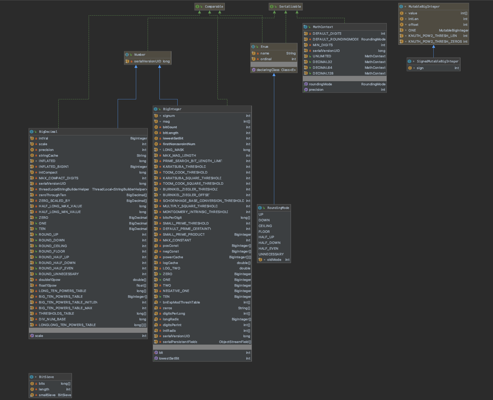

# Core Java Math
    数学功能包括浮点库（java.lang.Math 和 java.lang.StrictMath）和任意精度数学（java.math 包）。

## API规范
### *浮点库*
> * java.lang.Math
> * java.lang.StrictMath
### *任意精度数学*
> * java.math 包
### 增强功能
> * 对 java.math 的增强

## 详细
### 1-1-1、java.lang.Math
     extends Object

> * Math 类包含执行基本数值运算的方法，例如基本指数、对数、平方根和三角函数。
> * 与 StrictMath 类的一些数值方法不同，Math 类的等效函数的所有实现都没有定义为返回逐位相同的结果。这种放松允许在不需要严格再现性的情况
>下实现更好的实现。
> * 默认情况下，许多 Math 方法只是简单地调用 StrictMath 中的等效方法来实现它们。鼓励代码生成器使用特定于平台的本机库或微处理器指令
>（如果可用）来提供更高性能的数学方法实现。这种更高性能的实现仍然必须符合 Math 的规范。
> * 实现规范的质量涉及两个属性，返回结果的**准确性**和方法的**单调性**。浮点数学方法的精度是根据 ulps 来衡量的，单位在最后。对于给定的浮
>点格式，特定实数值的 ulp 是包含该数值的两个浮点值之间的距离。当从整体上而不是在特定参数上讨论方法的准确性时，引用的 ulps 数量是针对任何
>参数的最坏情况错误。如果一个方法的错误总是小于 0.5 ulps，则该方法总是返回最接近精确结果的浮点数；这种方法是正确四舍五入的。正确舍入的方
>法通常是浮点近似的最佳方法；但是，要正确舍入许多浮点方法是不切实际的。相反，对于 Math 类，某些方法允许 1 或 2 ulps 的更大误差范围。非正
>式地，在 1 ulp 误差范围内，当精确结果是可表示的数字时，精确结果应作为计算结果返回；否则，可能会返回包含确切结果的两个浮点值中的任何一个。
>对于幅度很大的精确结果，括号的端点之一可能是无限的。除了单个参数的准确性之外，在不同参数的方法之间保持适当的关系也很重要。因此，大多数误差
>大于 0.5 ulp 的方法都要求是半单调的：每当数学函数不减时，浮点近似也是如此，同样，每当数学函数不增时，浮点数也是-点近似。并非所有具有
> 1 ulp 精度的近似值都会自动满足单调性要求。
> * 该平台使用带有 int 和 long 原始类型的有符号二进制补码整数算法。开发人员应该选择原始类型以确保算术运算始终产生正确的结果，这在某些情况
>下意味着运算不会溢出计算值的范围。最佳实践是选择原始类型和算法以避免溢出。在大小为 int 或 long 且需要检测溢出错误的情况下，方法 addExact
>、subtractExact、multiplyExact 和 toIntExact 在结果溢出时抛出 ArithmeticException。对于其他算术运算，例如除法、绝对值、递增、递减
>和否定溢出仅发生在特定的最小值或最大值时，应根据最小值或最大值进行检查。 

    域：
> 修饰符和类型 | 类 | 描述
> ---------- | ------- | ---------
> static double | E | 比任何其他值都更接近 e（自然对数的底）的双精度值。
> static double | PI | 比任何其他值都更接近圆周率的双精度值，圆周长与其直径的比率。

    方法：
    1.调用StrictMath:
        sin、cos、tan、asin、acos、atan、exp、log、log10、sqrt、cbrt、IEEEremainder、ceil、floor、rint、atan2、pow、sinh、cosh
        、tanh、hypot、expm1、log1p
    2、其余方法：
        在使用时添加相应的内容即可

### 1-1-2、java.lang.StrictMath
     extends Object

> * StrictMath 类包含用于执行基本数值运算的方法，例如基本指数、对数、平方根和三角函数。
> * 为了帮助确保 Java 程序的可移植性，此包中某些数字函数的定义要求它们产生与某些已发布算法相同的结果。这些算法可从著名的网络库 netlib 作
>为“自由分发数学库”包 fdlibm 获得。这些算法是用 C 编程语言编写的，然后可以理解为按照 Java 浮点运算规则执行所有浮点运算。  
> * Java 数学库是针对 fdlibm 5.3 版定义的。如果 fdlibm 为函数（例如 acos）提供多个定义，请使用“IEEE 754 核心函数”版本（驻留在名称以
>字母 e 开头的文件中）。需要 fdlibm 语义的方法是 sin、cos、tan、asin、acos、atan、exp、log、log10、cbrt、atan2、pow、sinh、cosh、
>tanh、hypot、expm1 和 log1p。
> * 该平台使用带有 int 和 long 原始类型的有符号二进制补码整数算法。开发人员应该选择原始类型以确保算术运算始终产生正确的结果，这在某些情况
>下意味着运算不会溢出计算值的范围。最佳实践是选择原始类型和算法以避免溢出。在大小为 int 或 long 且需要检测溢出错误的情况下，方法 addExact
>、subtractExact、multiplyExact 和 toIntExact 在结果溢出时抛出 ArithmeticException。对于其他算术运算，例如除法、绝对值、递增、递减
>和否定溢出仅发生在特定的最小值或最大值时，应根据最小值或最大值进行检查。

    域：
> 修饰符和类型 | 类 | 描述
> ---------- | ------- | ---------
> static double | E | 比任何其他值都更接近 e（自然对数的底）的双精度值。
> static double | PI | 比任何其他值都更接近圆周率的双精度值，圆周长与其直径的比率。
### 1-2-1、java.math
    提供用于执行任意精度整数算术 (BigInteger) 和任意精度十进制算术 (BigDecimal) 的类。

#### 1-2-1-1、BigDecimal
    implements Comparable<BigInteger>
    
    不可变的、任意精度的有符号十进制数。 BigDecimal 由一个任意精度的整数非标度值和一个 32 位整数标度组成。如果为零或正数，则刻度是小数点
    右侧的位数。如果为负，则数字的未缩放值乘以 10 的缩放负数的幂。因此，由 BigDecimal 表示的数字的值是 (unscaledValue × 10-scale)。
    BigDecimal 类提供算术、缩放操作、舍入、比较、散列和格式转换的操作。 toString() 方法提供了 BigDecimal 的规范表示。
    
    BigDecimal 类使用户可以完全控制舍入行为。如果没有指定舍入方式且无法表示准确结果，则抛出异常；否则，可以通过向操作提供适当的 MathContext 
    对象，以选定的精度和舍入模式执行计算。在任何一种情况下，都提供了八种舍入模式来控制舍入。使用此类中的整数字段（例如 ROUND_HALF_UP）来
    表示舍入模式在很大程度上已过时；应该使用 RoundingMode 枚举的枚举值（例如 RoundingMode.HALF_UP）。
    
    当 MathContext 对象的精度设置为 0（例如 MathContext.UNLIMITED）时，算术运算是精确的，不采用 MathContext 对象的算术方法也是如此。
     （这是 5 之前版本中唯一支持的行为。）作为计算精确结果的必然结果，精度设置为 0 的 MathContext 对象的舍入模式设置未使用，因此无关紧要
     。在除法的情况下，精确的商可以有无限长的十进制展开；例如，1 除以 3。如果商具有非终止的十进制扩展并且指定运算返回精确结果，则抛出
     ArithmeticException。否则，将返回除法的确切结果，就像其他操作一样。
    
    当精度设置不为 0 时，BigDecimal 算术规则与 ANSI X3.274-1996 和 ANSI X3.274-1996/AM 1-2000（第 7.4 节）中定义的所选算术运算模
    式广泛兼容。与那些标准不同，BigDecimal 包括许多舍入模式，这些模式在 BigDecimal 5 之前的版本中是强制性的。这些 ANSI 标准与
    BigDecimal 规范之间的任何冲突都将得到解决，以支持 BigDecimal。
    
    由于相同的数值可以有不同的表示（具有不同的比例），因此算术和舍入规则必须指定数值结果和结果表示中使用的比例。
    
    通常，舍入模式和精度设置决定了当确切结果的位数（在除法的情况下可能是无限多）多于返回的位数时，运算如何返回具有有限位数的结果。首先，要
    返回的总位数由 MathContext 的精度设置指定；这决定了结果的精度。数字计数从精确结果的最左边的非零数字开始。舍入模式确定任何丢弃的尾随
    数字如何影响返回的结果。
    
    对于所有算术运算符 ，执行运算就像首先计算精确的中间结果，然后使用选定的舍入模式舍入到精度设置指定的位数（如有必要）。如果未返回精确结果
    ，则丢弃精确结果的某些数字位置。当舍入增加返回结果的幅度时，有可能通过传播到前导“9”数字的进位来创建新的数字位置。例如，将值 999.9 舍
    入为三位数四舍五入在数字上等于一千，表示为 100×101。在这种情况下，新的“1”是返回结果的前导数字位置。
    
    除了逻辑上的精确结果外，每个算术运算都有一个表示结果的首选比例。下表列出了每个操作的首选规模。
    
> 操作 | 首选结果量表
> ---- | ----------
> Add | max(addend.scale(), augend.scale())
> Subtract |	max(minuend.scale(), subtrahend.scale())
> Multiply |	multiplier.scale() + multiplicand.scale()
> Divide |	dividend.scale() - divisor.scale()

    这些尺度是返回精确算术结果的方法所使用的尺度；除了精确的除法可能必须使用更大的比例，因为精确的结果可能有更多的数字。例如，1/32 是 0.03125。
    在四舍五入之前，逻辑精确中间结果的比例是该操作的首选比例。如果精确的数值结果不能用精度数字表示，则舍入选择要返回的数字集，结果的小数位数从中间结果的小数位数减少到可以表示实际返回的精度数的最小小数位数。如果精确结果最多可以用精度数字表示，则返回与首选比例最接近的比例的结果表示。特别是，可以通过去除尾随零和减小比例以少于精度的数字来表示可精确表示的商。例如，使用地板四舍五入模式四舍五入到三位数，
    19/100 = 0.19 // 整数=19，比例=2
    但
    21/110 = 0.190 // 整数=190，比例=3
    请注意，对于加、减和乘，比例的减少将等于被丢弃的确切结果的数字位置数。如果舍入导致进位传播以创建新的高位数字位置，则与没有创建新数字位置时相比，结果的额外数字将被丢弃。
    
    其他方法的舍入语义可能略有不同。例如，使用指定算法的 pow 方法的结果有时可能与舍入后的数学结果相差一个以上的单位，即一个 ulp。
    
    提供了两种类型的操作来操纵 BigDecimal 的比例：缩放/舍入操作和小数点运动操作。缩放/舍入操作（setScale 和 round）返回一个 BigDecimal，其值大约（或完全）等于操作数的值，但其比例或精度是指定值；也就是说，它们增加或减少存储数字的精度，而对其值的影响最小。小数点运动操作（movePointLeft 和 movePointRight）返回一个 BigDecimal，它是通过将小数点在指定方向上移动指定距离而从操作数创建的。
    
    为了简洁和清晰起见，在 BigDecimal 方法的整个描述中使用了伪代码。伪代码表达式 (i + j) 是“一个 BigDecimal，其值是 i 添加到 BigDecimal j 的 BigDecimal 的值”的简写。伪代码表达式 (i == j) 是“当且仅当 BigDecimal i 表示与 BigDecimal j 相同的值时才为真”的简写。其他伪代码表达式的解释类似。方括号用于表示定义 BigDecimal 值的特定 BigInteger 和比例对；例如 [19, 2] 是 BigDecimal，数值上等于 0.19，尺度为 2。
    
    注意：如果 BigDecimal 对象用作 SortedMap 中的键或 SortedSet 中的元素，则应小心，因为 BigDecimal 的自然顺序与 equals 不一致。有关更多信息，请参阅 Comparable、SortedMap 或 SortedSet。
    
    当为任何输入参数传递空对象引用时，此类的所有方法和构造函数都会抛出 NullPointerException。
#### 1-2-1-2、BigInteger
    implements Comparable<BigInteger>
    
    不可变的任意精度整数。所有操作的行为都好像 BigIntegers 是用二进制补码表示法表示的（就像 Java 的原始整数类型）。 BigInteger 提供了
    所有 Java 原始整数运算符的类似物，以及来自 java.lang.Math 的所有相关方法。此外，BigInteger 提供用于模算术、GCD 计算、素数测试、素
    数生成、位操作和一些其他杂项操作的操作。
    算术运算的语义完全模仿 Java 语言规范中定义的 Java 整数算术运算符的语义。例如，除以零会引发 ArithmeticException，而将负数除以正数会
    产生负（或零）余数。规范中关于溢出的所有细节都被忽略了，因为 BigInteger 被制作得尽可能大以容纳操作的结果。
    
    移位操作的语义扩展了 Java 的移位运算符的语义，以允许负移位距离。具有负移位距离的右移位导致左移位，反之亦然。无符号右移运算符 (>>>) 被
    省略，因为此操作与此类提供的“无限字长”抽象相结合毫无意义。
    
    按位逻辑运算的语义完全模仿 Java 的按位整数运算符的语义。二元运算符（和、或、异或）在执行运算之前隐式地对两个操作数中较短的一个进行符号
    扩展。
    
    比较操作执行有符号整数比较，类似于 Java 的关系和相等运算符执行的那些比较。
    
    提供模块化算术运算来计算余数、执行幂运算和计算乘法逆。这些方法总是返回一个非负结果，介于 0 和 (modulus - 1) 之间，包括 0 和 (modulus - 1)。
    
    位操作对其操作数的二进制补码表示的单个位进行操作。如有必要，对操作数进行符号扩展，使其包含指定位。任何一位操作都不能产生一个与正在操作
    的 BigInteger 具有不同符号的 BigInteger，因为它们只影响一位，并且此类提供的“无限字长”抽象确保有无限多个“虚拟”符号位”在每个 
    BigInteger 之前。
    
    为简洁起见，在 BigInteger 方法的整个描述中使用了伪代码。伪代码表达式 (i + j) 是“一个 BigInteger，其值是 BigInteger i 加上 
    BigInteger j 的值”的简写。伪代码表达式 (i == j) 是“当且仅当 BigInteger i 表示与 BigInteger j 相同的值时才为真”的简写。其他伪代
    码表达式的解释类似。
    
    当为任何输入参数传递空对象引用时，此类中的所有方法和构造函数都会抛出 NullPointerException。 BigInteger 必须支持
     -2Integer.MAX_VALUE（不包括）到 +2Integer.MAX_VALUE（不包括）范围内的值，并且可以支持该范围之外的值。可能的质数范围是有限的，可
     能小于 BigInteger 完全支持的正范围。范围必须至少为 1 到 2^500000000。
#### 1-2-1-3、BitSieve
    用于查找素数候选的简单位筛。 允许设置和清除存储阵列中的位。 假设筛子的大小是恒定的以减少开销。 新 bitSieve 的所有位都为零，并通过设置
    它们从中删除位。 为了减少存储空间和提高效率，筛子中不表示偶数（筛子中的每一位代表一个奇数）。 位的索引与其代表的数字之间的关系由
    N = offset + (2*index + 1) 给出； 其中 N 是筛网中一位表示的整数，offset 是指示筛网开始位置的偶数整数偏移量，index 是筛网数组中一
    位的索引。
    
    域：
> 修饰符和类型 | 类 | 描述
> ---------- | ------- | ---------
> private long[] | bits | 将位存储在此 bitSieve 中。
> private int | length | 长度是这个筛子包含多少位。
> private static BitSieve | smallSieve | 一个小筛子，用于在搜索筛子中过滤掉多个小素数。

##### unitIndex(int bitIndex) int
##### bit(int bitIndex) long
##### get(int bitIndex) boolean
##### set(int bitIndex) void
##### sieveSearch(int limit, int start) int
    此方法返回搜索数组中出现在开始时或之后的第一个清除位的索引。 它不会搜索超过指定的限制。 如果没有这样的清除位，则返回 -1。
##### sieveSingle(int limit, int start, int step) void
    从筛子中筛出一组倍数。 从指定的开始索引开始删除指定步骤的倍数，直到指定的限制。
##### retrieve(BigInteger initValue, int certainty, Random random)
    在筛子中测试可能的素数并返回成功的候选者。
#### 1-2-1-4、MathContext
    implements Serializable
    
    封装了上下文设置的不可变对象，这些设置描述了数字运算符的某些规则，例如由 BigDecimal 类实现的那些规则。
    与碱基无关的设置是：
    
        1.精度：用于操作的位数； 结果四舍五入到这个精度
        2.roundingMode：一个 RoundingMode 对象，它指定用于舍入的算法。

    域：
> 修饰符和类型 | 类 | 描述
> ---------- | ------- | ---------
> static MathContext | DECIMAL128 | 一个 MathContext 对象，其精度设置与 IEEE 754R Decimal128 格式、34 位数字和 HALF_EVEN（IEEE 754R 默认值）的舍入模式相匹配。
> static MathContext | DECIMAL32 | 一个 MathContext 对象，其精度设置与 IEEE 754R Decimal32 格式、7 位数字和 HALF_EVEN（IEEE 754R 默认值）的舍入模式相匹配。
> static MathContext | DECIMAL64 | 一个 MathContext 对象，其精度设置与 IEEE 754R Decimal64 格式、16 位数字和 HALF_EVEN（IEEE 754R 默认值）的舍入模式相匹配。
> private static int | DEFAULT_DIGITS |
> private static RoundingMode | DEFAULT_ROUNDINGMODE |
> private static int | MIN_DIGITS |
> (package private) int | precision | 用于操作的位数。
> (package private) RoundingMode | roundingMode | 用于操作的舍入算法。
> private static long | serialVersionUID |
> static MathContext | UNLIMITED | 一个 MathContext 对象，其设置具有无限精度算术所需的值。
    
#### 1-2-1-5、MutableBigInteger
    用于表示多精度整数的类，它通过允许数字仅占用数组的一部分来有效利用分配的空间，从而不必经常重新分配数组。 当执行具有多次迭代的操作时，用
    于保存数字的数组仅在必要时增加，并且不必与它表示的数字大小相同。 可变数字允许对同一数字进行计算，而不必像 BigIntegers 那样为计算的每
    一步都创建一个新数字。
