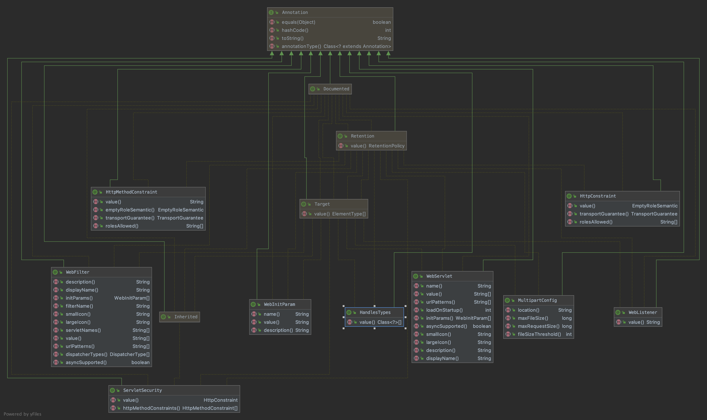

# 1、javax.servlet
## 1-1、overall
> 包 | 描述
> --- | ---
> [javax.servlet](#1-2-1javaxservlet) | javax.servlet 包包含许多类和接口，它们描述和定义了 servlet 类与由符合标准的 servlet 容器为此类类的实例提供的运行时环境之间的契约。
> [javax.servlet.annotation](#1-2-2javaxservletannotation) | javax.servlet.annotation 包包含许多注释，允许用户使用注释来声明 servlet、过滤器、侦听器并为声明的组件指定元数据。
> [javax.servlet.descriptor](#1-2-3javaxservletdescriptor) | 提供对从 web.xml 和 web-fragment.xml 描述符聚合的 Web 应用程序配置信息的编程访问。
> [javax.servlet.http](#1-2-4javaxservlethttp) | javax.servlet.http 包包含许多类和接口，它们描述和定义在 HTTP 协议下运行的 servlet 类与由符合标准的 servlet 容器为此类类的实例提供的运行时环境之间的契约。
## 1-2、javax.servlet
### 1-2-1、javax.servlet
    javax.servlet 包包含许多类和接口，它们描述和定义了 servlet 类与由符合标准的 servlet 容器为此类类的实例提供的运行时环境之间的契约。


> basic components
#### 1-2-1-1、Servlet
    定义所有 servlet 必须实现的方法。
    servlet 是在 Web 服务器中运行的小型 Java 程序。 Servlet 接收并响应来自 Web 客户端的请求，通常是通过 HTTP（超文本传输​​协议）。
    
    要实现此接口，您可以编写扩展 javax.servlet.GenericServlet 的通用 servlet 或扩展 javax.servlet.http.HttpServlet 的 HTTP servlet。
    
    该接口定义了初始化 servlet、服务请求和从服务器中删除 servlet 的方法。这些被称为生命周期方法，按以下顺序调用：
    
        1.servlet 被构造，然后用 init 方法初始化。
        2.处理从客户端到服务方法的任何调用。
        3.servlet 停止服务，然后使用 destroy 方法销毁，然后垃圾收集并完成。
        
    除了生命周期方法之外，该接口还提供了 getServletConfig 方法，servlet 可以使用它来获取任何启动信息，以及 getServletInfo 方法，它
    允许 servlet 返回关于它自己的基本信息，例如作者、版本和版权。
##### init(ServletConfig config) void
    由 servlet 容器调用以向 servlet 指示该 servlet 正在投入使用。
    servlet 容器在实例化 servlet 后只调用一次 init 方法。 在 servlet 可以接收任何请求之前，init 方法必须成功完成。
    
    如果 init 方法，servlet 容器无法将 servlet 置于服务中
    
        1.抛出一个 ServletException
        2.在 Web 服务器定义的时间段内不返回
> * 参数：
>   * config - 一个 ServletConfig 对象，包含 servlet 的配置和初始化参数
> * 抛出：
>   * ServletException - 如果发生了干扰 servlet 正常操作的异常
> * 也可以看看：
>   * UnavailableException, getServletConfig()
##### getServletConfig() ServletConfig
    返回一个 ServletConfig 对象，其中包含此 servlet 的初始化和启动参数。 返回的 ServletConfig 对象是传递给 init 方法的对象。
    此接口的实现负责存储 ServletConfig 对象，以便此方法可以返回它。 实现这个接口的 GenericServlet 类已经做到了这一点。
    
> * 返回：
>   * 初始化此 servlet 的 ServletConfig 对象
> * 也可以看看：
>   * 初始化（javax.servlet.ServletConfig）
##### service​(ServletRequest req, ServletResponse res) void
    由 servlet 容器调用以允许 servlet 响应请求。
    只有在 servlet 的 init() 方法成功完成后才会调用此方法。
    
    对于抛出或发送错误的 servlet，应始终设置响应的状态代码。
    
    Servlet 通常在可以同时处理多个请求的多线程 servlet 容器中运行。 开发人员必须注意同步对任何共享资源（例如文件、网络连接以及 servlet 
    的类和实例变量）的访问。 有关 Java 多线程编程的更多信息，请参阅多线程编程的 Java 教程。
    
> * 参数：
>   * req - 包含客户端请求的 ServletRequest 对象
>   * res - 包含 servlet 响应的 ServletResponse 对象
> * 抛出：
>   * ServletException - 如果发生干扰 servlet 正常操作的异常
>   * java.io.IOException - 如果发生输入或输出异常
##### getServletInfo() String
    返回有关 servlet 的信息，例如作者、版本和版权。
    此方法返回的字符串应该是纯文本，而不是任何类型的标记（例如 HTML、XML 等）。
    
> * 返回：
>   * 包含 servlet 信息的 String
##### destroy() void
    由 servlet 容器调用以向 servlet 指示 servlet 正在停止服务。 只有在 servlet 的服务方法中的所有线程都退出或超时时间过后，才会调用此
    方法。 servlet 容器调用此方法后，将不会在此 servlet 上再次调用服务方法。
    此方法使 servlet 有机会清理任何被占用的资源（例如，内存、文件句柄、线程），并确保任何持久状态与 servlet 在内存中的当前状态同步。
#### 1-2-1-2、ServletConfig
    servlet 容器用于在初始化期间将信息传递给 servlet 的 servlet 配置对象。
    
##### getInitParameter​(String name) String
    获取具有给定名称的初始化参数的值。
> * 参数：
>   * name - 要获取其值的初始化参数的名称
> * 返回：
>   * 一个包含初始化参数值的字符串，如果初始化参数不存在，则为 null
##### getInitParameterNames() Enumeration<String>
    以字符串对象的枚举形式返回 servlet 初始化参数的名称，如果 servlet 没有初始化参数，则返回空枚举。
> * 返回：
>   * 包含 servlet 初始化参数名称的 String 对象枚举
##### getServletContext() ServletContext
    返回对调用方正在其中执行的 ServletContext 的引用。
> * 返回：
>   * 一个 ServletContext 对象，由调用者用来与其 servlet 容器交互
> * 也可以看看：
>   * ServletContext
##### getServletName() String
    返回此 servlet 实例的名称。 该名称可以通过服务器管理提供，在 Web 应用程序部署描述符中分配，或者对于未注册（因此未命名）的 servlet 
    实例，它将是 servlet 的类名。
> * 返回：
>   * servlet 实例的名称

#### 1-2-1-3、Filter
    过滤器是一个对象，它对资源（servlet 或静态内容）的请求或来自资源的响应或两者执行过滤任务。
    
    过滤器在 doFilter 方法中执行过滤。 每个过滤器都可以访问一个 FilterConfig 对象，它可以从中获取它的初始化参数，以及一个对 
    ServletContext 的引用，它可以使用它来加载过滤任务所需的资源。
    
    过滤器在 Web 应用程序的部署描述符中配置。
    
    已为此设计确定的示例有：
    
        1.身份验证过滤器
        2.记录和审计过滤器
        3.图像转换过滤器
        4.数据压缩过滤器
        5.加密过滤器
        6.标记过滤器
        7.触发资源访问事件的过滤器
        8.XSL/T 过滤器
        9.Mime 型链式过滤器
        
    自从：
    小服务程序 2.3
##### init​(FilterConfig filterConfig) void
    由 Web 容器调用以向过滤器指示它正在投入使用。
    
    servlet 容器在实例化过滤器后只调用一次 init 方法。 在要求过滤器执行任何过滤工作之前，init 方法必须成功完成。
    
    如果 init 方法要么
    
        1.抛出一个 ServletException
        2.在 Web 容器定义的时间段内不返回

> * 参数：
>   * filterConfig - 一个 FilterConfig 对象，包含过滤器的配置和初始化参数
> * 抛出：
>   * ServletException - 如果发生了干扰过滤器正常操作的异常
##### doFilter(ServletRequest request, ServletResponse response, FilterChain chain) void
    由于客户端对链尾资源的请求，每次请求/响应对通过链时，容器都会调用 Filter 的 doFilter 方法。传入此方法的 FilterChain 允许 Filter 将请求和响应传递给链中的下一个实体。
    此方法的典型实现将遵循以下模式：
    
        1.检查请求
        2.可选择使用自定义实现包装请求对象以过滤内容或标题以进行输入过滤
        3.可选择使用自定义实现包装响应对象以过滤内容或标题以进行输出过滤
        4.  要么:使用 FilterChain 对象（chain.doFilter()）调用链中的下一个实体，
            或者:不将请求/响应对传递给过滤器链中的下一个实体以阻止请求处理
        5.调用过滤器链中的下一个实体后，直接在响应上设置标头。
> * 参数：
>   * request - ServletRequest 对象包含客户端的请求
>   * response - ServletResponse 对象包含过滤器的响应
>   * chain - 用于调用下一个过滤器或资源的 FilterChain
> * 抛出：
>   * java.io.IOException - 如果在处理过程中发生了与 I/O 相关的错误
>   * ServletException - 如果发生干扰过滤器正常操作的异常
> * 也可以看看：
>   * UnavailableException
##### destroy() void
    由 Web 容器调用以向过滤器指示它正在停止服务。
    
    仅当过滤器的 doFilter 方法中的所有线程都退出或超时时间过后，才会调用此方法。 Web 容器调用此方法后，将不会在此过滤器实例上再次调用 
    doFilter 方法。
    
    此方法使过滤器有机会清理任何被占用的资源（例如，内存、文件句柄、线程）并确保任何持久状态与过滤器在内存中的当前状态同步。
    
#### 1-2-1-4、FilterConfig
    servlet 容器用于在初始化期间将信息传递给过滤器的过滤器配置对象。
    
##### getFilterName() String
    返回部署描述符中定义的此过滤器的过滤器名称。
> * 返回：
>   * 此过滤器的过滤器名称
##### getServletContext() ServletContext
    返回对调用方正在其中执行的 ServletContext 的引用。
> * 返回：
>   * 一个 ServletContext 对象，由调用者用来与其 servlet 容器交互
> * 也可以看看：
>   * ServletContext
##### getInitParameter(String name) String
    返回一个包含命名初始化参数值的字符串，如果初始化参数不存在，则返回 null。
> * 参数：
>   * name - 指定初始化参数名称的字符串
> * 返回：
>   * 一个包含初始化参数值的字符串，如果初始化参数不存在，则为 null
##### getInitParameterNames() Enumeration<String> 
    以字符串对象的枚举形式返回过滤器初始化参数的名称，如果过滤器没有初始化参数，则返回空枚举。
> * 返回：
>   * 包含过滤器初始化参数名称的 String 对象枚举
#### 1-2-1-5、ServletRequest
    定义一个对象以向 servlet 提供客户端请求信息。 servlet 容器创建一个 ServletRequest 对象并将其作为参数传递给 servlet 的服务方法。
    ServletRequest 对象提供的数据包括参数名称和值、属性和输入流。 扩展 ServletRequest 的接口可以提供额外的特定于协议的数据（例如，HTTP 
    数据由 HttpServletRequest 提供。
##### getAttribute(String name) Object
    将命名属性的值作为对象返回，如果不存在给定名称的属性，则返回 null。
    可以通过两种方式设置属性。 servlet 容器可以设置属性以使有关请求的自定义信息可用。 例如，对于使用 HTTPS 发出的请求，属性 
    javax.servlet.request.X509Certificate 可用于检索有关客户端证书的信息。 也可以使用 
    setAttribute(java.lang.String, java.lang.Object) 以编程方式设置属性。 这允许在 RequestDispatcher 调用之前将信息嵌入到请求中。
    
    属性名称应遵循与包名称相同的约定。 本规范保留与 java.*、javax.* 和 sun.* 匹配的名称。
    
> * 参数：
>   * name - 指定属性名称的字符串
> * 返回：
>   * 一个包含属性值的对象，如果属性不存在，则为 null
##### getAttributeNames() Enumeration<String>
    返回一个包含可用于此请求的属性名称的枚举。 如果请求没有可用的属性，则此方法返回一个空的 Enumeration。
> * 返回：
>   * 包含请求属性名称的字符串枚举
##### getCharacterEncoding() String
    返回此请求正文中使用的字符编码的名称。 如果未指定请求编码字符编码，则此方法返回 null。 参考以下用于指定请求字符编码的方法，按优先级降
    序排列：每个请求、每个 Web 应用程序（使用 ServletContext.setRequestCharacterEncoding(java.lang.String)、部署描述符）和每个容
    器（针对所有部署的 Web 应用程序） 在该容器中，使用供应商特定的配置）。
> * 返回：
>   * 包含字符编码名称的字符串，如果请求未指定字符编码，则为 null
##### setCharacterEncoding​(java.lang.String env) void
    覆盖此请求正文中使用的字符编码的名称。 必须在使用 getReader() 读取请求参数或读取输入之前调用此方法。 否则，它没有任何作用。
> * 参数：
>   * env - 包含字符编码名称的字符串。
> * 抛出：
>   * java.io.UnsupportedEncodingException - 如果此 ServletRequest 仍处于可以设置字符编码的状态，但指定的编码无效
##### getContentLength() int
    返回请求正文的长度（以字节为单位）并由输入流提供，如果长度未知 ir 大于 Integer.MAX_VALUE，则返回 -1。 对于 HTTP servlet，与 CGI 
    变量 CONTENT_LENGTH 的值相同。
> * 返回：
>   * 包含请求正文长度的整数，如果长度未知或大于 Integer.MAX_VALUE，则为 -1。
##### getContentLengthLong() long
    返回请求正文的长度（以字节为单位）并由输入流提供，如果长度未知，则返回 -1。 对于 HTTP servlet，与 CGI 变量 CONTENT_LENGTH 的值相同。
> * 返回：
>   * 包含请求正文长度的 long 或 -1L 如果长度未知
> * 自从：
>   * 小服务程序 3.1
##### getContentType() String
    返回请求正文的 MIME 类型，如果类型未知，则返回 null。 对于 HTTP servlet，与 CGI 变量 CONTENT_TYPE 的值相同。
> * 返回：
>   * 包含请求的 MIME 类型名称的字符串，如果类型未知，则为 null
##### getInputStream() ServletInputStream
    使用 ServletInputStream 以二进制数据形式检索请求正文。 可以调用此方法或 getReader() 来读取正文，而不是同时调用两者。
> * 返回：
>   * 包含请求正文的 ServletInputStream 对象
> * 抛出：
>   * java.lang.IllegalStateException - 如果已经为此请求调用了 getReader() 方法
>   * java.io.IOException - 如果发生输入或输出异常
##### getParameter​(String name) String
    以字符串形式返回请求参数的值，如果该参数不存在，则返回 null。 请求参数是与请求一起发送的额外信息。 对于 HTTP servlet，参数包含在查询
    字符串或发布的表单数据中。
    只有在确定参数只有一个值时才应使用此方法。 如果参数可能有多个值，请使用 getParameterValues(java.lang.String)。
    
    如果将此方法与多值参数一起使用，则返回的值等于 getParameterValues 返回的数组中的第一个值。
    
    如果参数数据在请求正文中发送，例如发生在 HTTP POST 请求中，则直接通过 getInputStream() 或 getReader() 读取正文可能会干扰此方法的执行。
    
> * 参数：
>   * name - 指定参数名称的字符串
> * 返回：
>   * 表示参数单个值的字符串
> * 也可以看看：
>   * getParameterValues(java.lang.String)
##### getParameterNames() Enumeration<String>
    返回包含此请求中包含的参数名称的 String 对象的枚举。 如果请求没有参数，则该方法返回一个空的 Enumeration。
> * 返回：
>   * String 对象的枚举，每个 String 包含一个请求参数的名称； 如果请求没有参数，则为空枚举
##### getParameterValues​(String name) String[]
    返回包含给定请求参数具有的所有值的 String 对象数组，如果该参数不存在，则返回 null。
    如果参数只有一个值，则数组的长度为 1。
    
> * 参数：
>   * name - 包含请求其值的参数名称的字符串
> * 返回：
>   * 包含参数值的 String 对象数组
> * 也可以看看：
>   * 获取参数（java.lang.String）
##### getParameterMap() Map<java.lang.String,​java.lang.String[]>
    返回此请求参数的 java.util.Map。
    请求参数是与请求一起发送的额外信息。 对于 HTTP servlet，参数包含在查询字符串或发布的表单数据中。
    
> * 返回：
>   * 一个不可变的 java.util.Map 包含参数名称作为键和参数值作为映射值。 参数映射中的键是字符串类型。 参数映射中的值是字符串数组类型。
##### getProtocol() String
    以 protocol/majorVersion.minorVersion 的形式返回请求使用的协议的名称和版本，例如 HTTP/1.1。 对于 HTTP servlet，返回的值与 CGI 变量 SERVER_PROTOCOL 的值相同。
> * 返回：
>   * 包含协议名称和版本号的字符串
##### getScheme() String
    返回用于发出此请求的方案的名称，例如 http、https 或 ftp。 如 RFC 1738 中所述，不同的方案具有不同的 URL 构造规则。
> * 返回：
>   * 包含用于发出此请求的方案名称的字符串
##### getServerName() String
    返回请求发送到的服务器的主机名。 它是 Host 标头值中“:”之前部分的值（如果有），或者是解析的服务器名称，或者是服务器 IP 地址。
> * 返回：
>   * 一个包含服务器名称的字符串
##### getServerPort() int
    返回请求发送到的端口号。 它是 Host 标头值中“:”之后的部分的值（如果有），或者是接受客户端连接的服务器端口。
> * 返回：
>   * 指定端口号的整数
##### getReader() BufferedReader
    使用 BufferedReader 将请求正文作为字符数据检索。 阅读器根据正文使用的字符编码来翻译字符数据。 可以调用此方法或 getInputStream() 
    来读取正文，而不是同时调用两者。
> * 返回：
>   * 包含请求正文的 BufferedReader
> * 抛出：
>   * java.io.UnsupportedEncodingException - 如果不支持使用的字符集编码并且无法解码文本
>   * java.lang.IllegalStateException - 如果在此请求上调用了 getInputStream() 方法
>   * java.io.IOException - 如果发生输入或输出异常
> * 也可以看看：
>   * getInputStream()
##### getRemoteAddr() String
    返回发送请求的客户端或最后一个代理的 Internet 协议 (IP) 地址。 对于 HTTP servlet，与 CGI 变量 REMOTE_ADDR 的值相同。
> * 返回：
>   * 包含发送请求的客户端 IP 地址的字符串
##### getRemoteHost() String
    返回发送请求的客户端或最后一个代理的完全限定名称。 如果引擎无法或选择不解析主机名（以提高性能），则此方法返回 IP 地址的点分字符串形式。 对于 HTTP servlet，与 CGI 变量 REMOTE_HOST 的值相同。
> * 返回：
>   * 包含客户端完全限定名称的字符串
##### setAttribute​(java.lang.String name, java.lang.Object o) void
    在此请求中存储一个属性。 在请求之间重置属性。 此方法最常与 RequestDispatcher 结合使用。
    属性名称应遵循与包名称相同的约定。 以 java.*、javax.* 和 com.sun.* 开头的名称保留供 Sun Microsystems 使用。
    如果传入的对象为null，效果与调用removeAttribute(java.lang.String)相同。
    警告当请求从驻留在不同 Web 应用程序中的 servlet 分派时，RequestDispatcher 可能无法在调用方 servlet 中正确检索到此方法设置的对象。
    
> * 参数：
>   * name - 指定属性名称的字符串
>   * o - 要存储的对象
##### removeAttribute(String name) oid
    从此请求中删除一个属性。 通常不需要此方法，因为只要处理请求，属性就会持续存在。
    属性名称应遵循与包名称相同的约定。 以 java.*、javax.* 和 com.sun.* 开头的名称保留供 Sun Microsystems 使用。
    
> * 参数：
>   * name - 一个字符串，指定要删除的属性的名称
##### getLocale() Locale
    根据 Accept-Language 标头，返回客户端将接受内容的首选 Locale。 如果客户端请求未提供 Accept-Language 标头，则此方法返回服务器的默
    认语言环境。
> * 返回：
>   * 客户端的首选语言环境
##### getLocales() Enumeration<Locale>
    返回 Locale 对象的枚举，以从首选语言环境开始的降序表示，基于 Accept-Language 标头的客户端可接受的语言环境。 如果客户端请求不提供 
    Accept-Language 标头，则此方法返回一个包含一个区域设置的枚举，即服务器的默认区域设置。
> * 返回：
>   * 客户端首选 Locale 对象的枚举
##### isSecure() boolean
    返回一个布尔值，指示此请求是否是使用安全通道（例如 HTTPS）发出的。
> * 返回：
>   * 指示请求是否是使用安全通道发出的布尔值
##### getRequestDispatcher​(java.lang.String path) RequestDispatcher
    返回一个 RequestDispatcher 对象，该对象充当位于给定路径的资源的包装器。 RequestDispatcher 对象可用于将请求转发到资源或将资源包含
    在响应中。资源可以是动态的或静态的。
    指定的路径名​​可能是相对的，但它不能扩展到当前 servlet 上下文之外。如果路径以“/”开头，则将其解释为相对于当前上下文根。如果 servlet 容
    器无法返回 RequestDispatcher，则此方法返回 null。
    
    该方法与 ServletContext.getRequestDispatcher(java.lang.String) 的区别在于，该方法可以采用相对路径。
    
> * 参数：
>   * path - 一个字符串，指定资源的路径名。如果是相对的，则它必须相对于当前的 servlet。
> * 返回：
>   * 一个 RequestDispatcher 对象，它充当指定路径上资源的包装器，如果 servlet 容器无法返回 RequestDispatcher，则为 null
> * 也可以看看：
>   * RequestDispatcher, ServletContext.getRequestDispatcher(java.lang.String)
##### getRealPath​(java.lang.String path) String
> * 已弃用。
>   * 从 Java Servlet API 的 2.1 版开始，请改用 ServletContext.getRealPath(java.lang.String)。
> * 参数：
>   * path - 要为其返回真实路径的路径。
> * 返回：
>   * 真实路径，如果无法执行转换，则为 null。
##### getRemotePort() int
    返回发送请求的客户端或最后一个代理的 Internet 协议 (IP) 源端口。
> * 返回：
>   * 指定端口号的整数
> * 自从：
>   * 小服务程序 2.4
##### getLocalName() String
    返回接收请求的 Internet 协议 (IP) 接口的主机名。
> * 返回：
>   * 一个字符串，其中包含接收请求的 IP 的主机名。
> * 自从：
>   * 小服务程序 2.4
##### getLocalAddr() String
    返回接收请求的接口的 Internet 协议 (IP) 地址。
> * 返回：
>   * 包含接收请求的 IP 地址的字符串。
> * 自从：
>   * 小服务程序 2.4
##### getLocalPort() int
    返回接收请求的接口的 Internet 协议 (IP) 端口号。
> * 返回：
>   * 指定端口号的整数
> * 自从：
>   * 小服务程序 2.4
##### getServletContext()
    获取上次将此 ServletRequest 分派到的 servlet 上下文。
> * 返回：
>   * 此 ServletRequest 最后分派到的 servlet 上下文
> * 自从：
>   * 小服务程序 3.0
##### startAsync() AsyncContext
    将此请求置于异步模式，并使用原始（未包装的）ServletRequest 和 ServletResponse 对象初始化其 AsyncContext。
    调用此方法将导致关联响应的提交延迟，直到在返回的 AsyncContext 上调用 AsyncContext.complete() 或异步操作已超时。
    
    在返回的 AsyncContext 上调用 AsyncContext.hasOriginalRequestAndResponse() 将返回 true。在将此请求置于异步模式后在出站方向上
    调用的任何过滤器都可以将此用作指示它们在入站调用期间添加的任何请求和/或响应包装器不需要在异步操作的持续时间内停留，因此它们的任何相关资
    源都可能被释放。
    
    在调用每个 AsyncListener 的 onStartAsync 方法后，此方法会清除已向 AsyncContext 注册的 AsyncListener 实例（如果有）列表，这些实
    例由上一次调用 startAsync 方法返回。
    
    此方法或其重载变体的后续调用将返回相同的 AsyncContext 实例，并根据需要重新初始化。
    
> * 返回：
>   * （重新）初始化的 AsyncContext
> * 抛出：
>   * java.lang.IllegalStateException - 如果此请求在不支持异步操作的过滤器或 servlet 的范围内（即 isAsyncSupported() 返回 false）
>，或者如果在没有任何异步调度的情况下再次调用此方法（由一个的 AsyncContext.dispatch() 方法），在任何此类调度的范围之外调用，或者在同一
>个调度的范围内再次调用，或者如果响应已经关闭
> * 自从：
>   * 小服务程序 3.0
> * 也可以看看：
>   * AsyncContext.dispatch()
##### startAsync​(ServletRequest servletRequest, ServletResponse servletResponse) AsyncContext
    将此请求置于异步模式，并使用给定的请求和响应对象初始化其 AsyncContext。
    ServletRequest 和 ServletResponse 参数必须是相同的实例，或者包装它们的 ServletRequestWrapper 和 ServletResponseWrapper 的实例，分别传递给 Servlet 的服务方法或过滤器的 doFilter 方法，在其范围内调用此方法。
    
    调用此方法将导致关联响应的提交延迟，直到在返回的 AsyncContext 上调用 AsyncContext.complete() 或异步操作已超时。
    
    对返回的 AsyncContext 调用 AsyncContext.hasOriginalRequestAndResponse() 将返回 false，除非传入的 ServletRequest 和 ServletResponse 参数是原始参数或不携带任何应用程序提供的包装器。将此请求置于异步模式后在出站方向上调用的任何过滤器都可以将此用作指示，它们在入站调用期间添加的某些请求和/或响应包装器可能需要在异步持续时间内保持原位操作，其相关资源可能不会被释放。仅当用于初始化 AsyncContext 并将通过调用 AsyncContext.getRequest() 返回的给定 servletRequest 不包含说 ServletRequestWrapper。这同样适用于 ServletResponseWrapper 实例。
    
    在调用每个 AsyncListener 的 onStartAsync 方法后，此方法会清除已向 AsyncContext 注册的 AsyncListener 实例（如果有）列表，这些实例由上一次调用 startAsync 方法返回。
    
    此方法或其零参数变体的后续调用将返回相同的 AsyncContext 实例，并根据需要重新初始化。如果对此方法的调用之后是对其零参数变体的调用，则指定的（并且可能被包装的）请求和响应对象将保持锁定在返回的 AsyncContext 中。
    
> * 参数：
>   * servletRequest - 用于初始化 AsyncContext 的 ServletRequest
>   * servletResponse - 用于初始化 AsyncContext 的 ServletResponse
> * 返回：
>   * （重新）初始化的 AsyncContext
> * 抛出：
>   * java.lang.IllegalStateException - 如果此请求在不支持异步操作的过滤器或 servlet 的范围内（即 isAsyncSupported() 返回 false），或者如果在没有任何异步调度的情况下再次调用此方法（由一个的 AsyncContext.dispatch() 方法），在任何此类调度的范围之外调用，或者在同一个调度的范围内再次调用，或者如果响应已经关闭
> * 自从：
>   * 小服务程序 3.0
##### isAsyncStarted() boolean
    检查此请求是否已进入异步模式。
    ServletRequest 通过调用 startAsync() 或 startAsync(ServletRequest,ServletResponse) 进入异步模式。
    
    如果此请求被置于异步模式，但此后已使用 AsyncContext.dispatch() 方法之一调度或通过调用 AsyncContext.complete() 从异步模式释放，
    则此方法返回 false。
    
> * 返回：
>   * 如果此请求已进入异步模式，则为 true，否则为 false
> * 自从：
>   * 小服务程序 3.0
##### isAsyncSupported() boolean
    检查此请求是否支持异步操作。
    如果此请求处于过滤器或 servlet 的范围内，而该过滤器或 servlet 尚未在部署描述符中进行注释或标记为能够支持异步处理，则对此请求禁用异步
    操作。
    
> * 返回：
>   * 如果此请求支持异步操作，则为 true，否则为 false
> * 自从：
>   * 小服务程序 3.0
##### getAsyncContext() AsyncContext
    获取由最近对此请求调用 startAsync() 或 startAsync(ServletRequest,ServletResponse) 创建或重新初始化的 AsyncContext 。
> * 返回：
>   * 由最近对此请求的 startAsync() 或 startAsync(ServletRequest,ServletResponse) 调用创建或重新初始化的 AsyncContext
> * 抛出：
>   * java.lang.IllegalStateException - 如果这个请求没有被置于异步模式，即如果 startAsync() 和 startAsync(ServletRequest,ServletResponse) 都没有被调用
> * 自从：
>   * 小服务程序 3.0
##### getDispatcherType() DispatcherType
    获取此请求的调度程序类型。
    容器使用请求的调度器类型来选择需要应用于请求的过滤器：仅应用具有匹配调度器类型和 url 模式的过滤器。
    
    允许已为多种调度程序类型配置的过滤器查询其调度程序类型的请求，允许过滤器根据其调度程序类型以不同方式处理请求。
    
    请求的初始调度程序类型定义为 DispatcherType.REQUEST。通过 RequestDispatcher.forward(ServletRequest, ServletResponse) 或 
    RequestDispatcher.include(ServletRequest, ServletResponse) 分派的请求的分派器类型分别给出为 DispatcherType.FORWARD 或 
    DispatcherType.INCLUDE，而异步请求的分派器类型通过以下之一分派AsyncContext.dispatch() 方法作为 DispatcherType.ASYNC 给出。
    最后，由容器的错误处理机制分派到错误页面的请求的分派器类型被指定为 DispatcherType.ERROR。
    
> * 返回：
>   * 此请求的调度程序类型
> * 自从：
>   * 小服务程序 3.0
> * 也可以看看：
>   * 调度员类型

#### 1-2-1-6、ServletResponse
    定义一个对象以帮助 servlet 向客户端发送响应。 servlet 容器创建一个 ServletResponse 对象并将其作为参数传递给 servlet 的服务方法。
    要在 MIME 正文响应中发送二进制数据，请使用 getOutputStream() 返回的 ServletOutputStream。要发送字符数据，请使用 getWriter() 
    返回的 PrintWriter 对象。例如，要混合二进制和文本数据，以创建多部分响应，请使用 ServletOutputStream 并手动管理字符部分。
    
    MIME 正文响应的字符集可以使用以下任何一种技术明确指定：每个请求、每个 Web 应用程序（使用 ServletContext.setRequestCharacterEncoding(java.lang.String)、
    部署描述符）和每个容器（对于所有 Web 应用程序）部署在该容器中，使用供应商特定的配置）。如果采用了多种上述技术，则优先级是列出的顺序。
    对于每个请求，可以使用 setCharacterEncoding(java.lang.String) 和 setContentType(java.lang.String) 方法显式指定响应的字符集，
    或使用 setLocale(java.util.Locale) 方法隐式指定。显式规范优先于隐式规范。如果未明确指定字符集，则将使用 ISO-8859-1。必须在 
    getWriter 和提交要使用的字符编码的响应之前调用 setCharacterEncoding、setContentType 或 setLocale 方法。
    
    有关 MIME 的更多信息，请参阅 Internet RFC，例如 RFC 2045。 SMTP 和 HTTP 等协议定义了 MIME 的配置文件，这些标准仍在不断发展。
    
    也可以看看：
    Servlet 输出流
##### getCharacterEncoding() String
    返回用于此响应中发送的正文的字符编码（MIME 字符集）的名称。参考以下用于指定响应字符编码的方法，按优先级降序排列：每个请求、每个 Web 
    应用程序（使用 ServletContext.setResponseCharacterEncoding(java.lang.String)、部署描述符）和每个容器（针对所有部署的 Web 应
    用程序）在该容器中，使用供应商特定的配置）。返回这些产生结果的方法中的第一个。每个请求，响应的字符集可以使用 
    setCharacterEncoding(java.lang.String) 和 setContentType(java.lang.String) 方法显式指定，或使用 setLocale(java.util.Locale) 
    方法隐式指定。显式规范优先于隐式规范。在调用 getWriter 或提交响应之后对这些方法的调用对字符编码没有影响。如果未指定字符编码，则返回 
    ISO-8859-1。
    有关字符编码和 MIME 的更多信息，请参阅 RFC 2047 (http://www.ietf.org/rfc/rfc2047.txt)。
    
> * 返回：
>   * 指定字符编码名称的字符串，例如 UTF-8
##### getContentType() String
    返回用于此响应中发送的 MIME 正文的内容类型。 在提交响应之前，必须使用 setContentType(java.lang.String) 指定正确的内容类型。 如果
    未指定内容类型，则此方法返回 null。 如果已指定内容类型，并且已按照 getCharacterEncoding() 或 getWriter() 中所述显式或隐式指定字
    符编码，则返回的字符串中将包含 charset 参数。 如果未指定字符编码，则省略 charset 参数。
> * 返回：
>   * 指定内容类型的字符串，例如 text/html； 字符集=UTF-8，或为空
> * 自从：
>   * 小服务程序 2.4
##### getOutputStream() ServletOutputStream
    返回一个适合在响应中写入二进制数据的 ServletOutputStream。 servlet 容器不对二进制数据进行编码。
    在 ServletOutputStream 上调用 flush() 提交响应。 可以调用此方法或 getWriter() 来写入主体，但不能同时调用两者，除非调用了 reset()。
    
> * 返回：
>   * 用于写入二进制数据的 ServletOutputStream
> * 抛出：
>   * java.lang.IllegalStateException - 如果在此响应上调用了 getWriter 方法
>   * java.io.IOException - 如果发生输入或输出异常
> * 也可以看看：
>   * getWriter(), reset()
##### getWriter() PrintWriter
    返回一个可以向客户端发送字符文本的 PrintWriter 对象。 PrintWriter 使用 getCharacterEncoding() 返回的字符编码。 如果未按照 
    getCharacterEncoding 中的描述指定响应的字符编码（即，该方法仅返回默认值 ISO-8859-1），则 getWriter 将其更新为 ISO-8859-1。
    在 PrintWriter 上调用 flush() 提交响应。
    
    可以调用此方法或 getOutputStream() 来写入主体，但不能同时调用两者，除非调用了 reset()。
    
> * 返回：
>   * 一个可以将字符数据返回给客户端的 PrintWriter 对象
> * 抛出：
>   * java.io.UnsupportedEncodingException - 如果无法使用 getCharacterEncoding 返回的字符编码
>   * java.lang.IllegalStateException - 如果已经为此响应对象调用了 getOutputStream 方法
>   * java.io.IOException - 如果发生输入或输出异常
> * 也可以看看：
>   * getOutputStream()、setCharacterEncoding(java.lang.String)、reset()
##### setCharacterEncoding(String charset) void
    将发送到客户端的响应的字符编码（MIME 字符集）设置为 UTF-8。如果响应字符编码已由 
    ServletContext.setResponseCharacterEncoding(java.lang.String)、部署描述符或使用 setContentType() 或 setLocale() 方法设
    置，则此方法中设置的值将覆盖任何这些值。用text/html的String调用setContentType(java.lang.String)，用UTF-8的String调用这个方法，
    等价于用text/html的String调用setContentType；字符集=UTF-8。
    可以重复调用此方法来更改字符编码。如果在调用 getWriter 或提交响应之后调用此方法，则此方法无效。
    
    如果协议提供了这样做的方法，容器必须将用于 servlet 响应的编写器的字符编码传达给客户端。在 HTTP 的情况下，字符编码作为文本媒体类型的 
    Content-Type 标头的一部分进行通信。请注意，如果 servlet 未指定内容类型，则字符编码无法通过 HTTP 标头进行通信；但是，它仍然用于对通
    过 servlet 响应的编写器编写的文本进行编码。
    
> * 参数：
>   * charset - 仅指定由 IANA 字符集 (http://www.iana.org/assignments/character-sets) 定义的字符集的字符串
> * 自从：
>   * 小服务程序 2.4
> * 也可以看看：
>   * setContentType(java.lang.String), setLocale(java.util.Locale)
##### setContentLength(int len) void
    设置响应中内容主体的长度 在 HTTP servlet 中，此方法设置 HTTP Content-Length 标头。
> * 参数：
>   * len - 一个整数，指定返回给客户端的内容的长度； 设置 Content-Length 标头
##### setContentLengthLong(long len) void
    设置响应中内容主体的长度 在 HTTP servlet 中，此方法设置 HTTP Content-Length 标头。
> * 参数：
>   * len - 指定返回给客户端的内容长度的 long； 设置 Content-Length 标头
> * 自从：
>   * 小服务程序 3.1
##### setContentType(String type) void
    如果响应尚未提交，则设置发送到客户端的响应的内容类型。给定的内容类型可以包括字符编码规范，例如 text/html;charset=UTF-8。如果在调用 
    getWriter 之前调用此方法，则响应的字符编码仅从给定的内容类型设置。
    可能会重复调用此方法以更改内容类型和字符编码。如果在响应提交后调用此方法，则此方法无效。如果在调用 getWriter 之后或在提交响应之后调用
    它，它不会设置响应的字符编码。
    
    如果协议提供了这样做的方法，容器必须将用于 servlet 响应的编写器的内容类型和字符编码传达给客户端。在 HTTP 的情况下，使用 Content-Type 标头。
    
> * 参数：
>   * type - 指定内容 MIME 类型的字符串
> * 也可以看看：
>   * setLocale(java.util.Locale), setCharacterEncoding(java.lang.String), getOutputStream(), getWriter()
##### setBufferSize(int size) void
    设置响应正文的首选缓冲区大小。 servlet 容器将使用至少与请求大小一样大的缓冲区。 使用的实际缓冲区大小可以使用 getBufferSize 找到。
    更大的缓冲区允许在实际发送任何内容之前写入更多内容，从而为 servlet 提供更多时间来设置适当的状态代码和标题。 较小的缓冲区减少了服务器
    内存负载并允许客户端更快地开始接收数据。
    
    必须在写入任何响应正文内容之前调用此方法； 如果已写入内容或已提交响应对象，则此方法将引发 IllegalStateException。
    
> * 参数：
>   * size - 首选缓冲区大小
> * 抛出：
>   * java.lang.IllegalStateException - 如果在写入内容后调用此方法
> * 也可以看看：
>   * getBufferSize()、flushBuffer()、isCommitted()、reset()
##### getBufferSize() int
    返回用于响应的实际缓冲区大小。 如果未使用缓冲，则此方法返回 0。
> * 返回：
>   * 实际使用的缓冲区大小
> * 也可以看看：
>   * setBufferSize(int)、flushBuffer()、isCommitted()、reset()
##### flushBuffer() void
    强制将缓冲区中的任何内容写入客户端。 调用此方法会自动提交响应，这意味着将写入状态代码和标头。
> * 抛出：
>   * java.io.IOException - 如果无法完成刷新缓冲区的操作。
> * 也可以看看：
>   * setBufferSize(int), getBufferSize(), isCommitted(), reset()
##### resetBuffer() void
    清除响应中底层缓冲区的内容，而不清除标头或状态代码。 如果响应已提交，则此方法将引发 IllegalStateException。
> * 自从：
>   * 小服务程序 2.3
> * 也可以看看：
>   * setBufferSize(int), getBufferSize(), isCommitted(), reset()
##### isCommitted() void
    返回一个布尔值，指示响应是否已提交。 提交的响应已经写入了其状态代码和标头。
> * 返回：
>   * 指示响应是否已提交的布尔值
> * 也可以看看：
>   * setBufferSize(int)、getBufferSize()、flushBuffer()、reset()
##### reset() void
    清除缓冲区中存在的任何数据以及状态代码、标题。 调用 getWriter() 或 getOutputStream() 的状态也被清除。 例如，调用 getWriter()、
    reset() 和 getOutputStream() 是合法的。 如果在此方法之前调用了 getWriter() 或 getOutputStream()，则相应返回的 Writer 或 
    OutputStream 将失效，并且使用失效对象的行为未定义。 如果响应已提交，则此方法将引发 IllegalStateException。
> * 抛出：
>   * java.lang.IllegalStateException - 如果响应已经提交
> * 也可以看看：
>   * setBufferSize(int)、getBufferSize()、flushBuffer()、isCommitted()
##### setLocale(Locale loc) void
    如果响应尚未提交，则设置响应的区域设置。它还为区域设置适当地设置响应的字符编码，如果尚未使用 setContentType(java.lang.String) 或 
    setCharacterEncoding(java.lang.String) 显式设置字符编码，则尚未调用 getWriter，并且尚未提交响应。如果部署描述符包含 
    locale-encoding-mapping-list 元素，并且该元素为给定的语言环境提供映射，则使用该映射。否则，从语言环境到字符编码的映射取决于容器。
    可以重复调用此方法以更改区域设置和字符编码。如果在响应提交后调用该方法，则该方法无效。如果在使用字符集规范调用 
    setContentType(java.lang.String) 之后、在调用 setCharacterEncoding(java.lang.String) 之后、在调用 getWriter 之后或之后调
    用它，它不会设置响应的字符编码已作出回应。
    
    如果协议提供了这样做的方法，容器必须将用于 servlet 响应的编写器的语言环境和字符编码传达给客户端。在 HTTP 的情况下，区域设置通过 
    Content-Language 标头进行通信，字符编码作为文本媒体类型的 Content-Type 标头的一部分。请注意，如果 servlet 未指定内容类型，则字符
    编码无法通过 HTTP 标头进行通信；但是，它仍然用于对通过 servlet 响应的编写器编写的文本进行编码。
    
> * 参数：
>   * loc - 响应的语言环境
> * 也可以看看：
>   * getLocale(), setContentType(java.lang.String), setCharacterEncoding(java.lang.String)
##### getLocale() Locale
    使用 setLocale(java.util.Locale) 方法返回为此响应指定的语言环境。 响应提交后对 setLocale 的调用无效。 如果未指定语言环境，则返回
    容器的默认语言环境。
> * 返回：
>   * 此响应的区域设置。

#### 1-2-1-7、ServletContext
    定义一组 servlet 用于与其 servlet 容器通信的方法，例如，获取文件的 MIME 类型、分派请求或写入日志文件。
    每个 Java 虚拟机的每个“Web 应用程序”有一个上下文。 （“Web 应用程序”是 servlet 和内容的集合，它们安装在服务器 URL 命名空间的特定子
    集下，例如 /catalog，并且可能通过 .war 文件安装。）
    
    对于在其部署描述符中标记为“分布式”的 Web 应用程序，每个虚拟机将有一个上下文实例。 在这种情况下，上下文不能用作共享全局信息的位置（因为
    信息不会是真正的全局信息）。 改用数据库等外部资源。
    
    ServletContext 对象包含在 ServletConfig 对象中，Web 服务器在 servlet 初始化时提供该 servlet。
    
    也可以看看：
    Servlet.getServletConfig(), ServletConfig.getServletContext()
    
    域：
> 修饰符和类型 | 类 | 描述
> ---------- | ------- | ----
> String | ORDERED_LIBS | ServletContext 属性的名称，其值（类型 java.util.List<java.lang.String>）包含 WEB-INF/lib 中 JAR 文件的名称列表，按其 Web 片段名称排序（如果 < 没有使用任何 <others/> 的绝对排序>，如果没有指定绝对或相对排序，则为 null
> String | TEMPDIR | ServletContext 属性的名称，该属性存储 servlet 容器为 ServletContext 提供的私有临时目录（类型为 java.io.File）

##### getContextPath() String
    返回 Web 应用程序的上下文路径。
    上下文路径是用于选择请求上下文的请求 URI 部分。上下文路径始终在请求 URI 中排在第一位。如果此上下文是以 Web 服务器 URL 名称空间为根
    的“根”上下文，则此路径将为空字符串。否则，如果上下文不是以服务器名称空间的根为根，则路径以 / 字符开头但不以 / 字符结尾。
    
    一个 servlet 容器可能通过多个上下文路径匹配一个上下文。在这种情况下， HttpServletRequest.getContextPath() 将返回请求使用的实际
    上下文路径，它可能与此方法返回的路径不同。此方法返回的上下文路径应被视为应用程序的主要或首选上下文路径。
    
> * 返回：
>   * Web 应用程序的上下文路径，或“”表示根上下文
> * 自从：
>   * 小服务程序 2.5
> * 也可以看看：
>   * HttpServletRequest.getContextPath()
##### getContext(String uriPath) ServletContext
    返回对应于服务器上指定 URL 的 ServletContext 对象。
    此方法允许 servlet 访问服务器各个部分的上下文，并根据需要从上下文中获取 RequestDispatcher 对象。 给定的路径必须以 / 开头，相对于
    服务器的文档根进行解释，并与托管在此容器上的其他 Web 应用程序的上下文根进行匹配。
    
    在具有安全意识的环境中，servlet 容器可能会为给定的 URL 返回 null。
    
> * 参数：
>   * uripath - 一个字符串，指定容器中另一个 Web 应用程序的上下文路径。
> * 返回：
>   * 对应于命名 URL 的 ServletContext 对象，如果不存在或容器希望限制此访问，则为 null。
> * 也可以看看：
>   * 请求调度器
##### getMajorVersion() int
    返回此 servlet 容器支持的 Servlet API 的主要版本。 所有符合 4.0 版的实现都必须让这个方法返回整数 4。
> * 返回：
>   * 4
##### getMinorVersion() int
    返回此 servlet 容器支持的 Servlet API 的次要版本。 所有符合 4.0 版的实现都必须让这个方法返回整数 0。
> * 返回：
>   * 0
##### getEffectiveMajorVersion() int
    获取此 ServletContext 表示的应用程序所基于的 Servlet 规范的主要版本。
    返回的值可能与 getMajorVersion() 不同，后者返回 Servlet 容器支持的 Servlet 规范的主要版本。
    
> * 返回：
>   * 此 ServletContext 表示的应用程序所基于的 Servlet 规范的主要版本
> * 抛出：
>   * java.lang.UnsupportedOperationException - 如果此 ServletContext 传递给 ServletContextListener 的 
>ServletContextListener.contextInitialized(javax.servlet.ServletContextEvent) 方法，该方法既未在 web.xml 或 web-fragment.xml 
>中声明，也未使用 WebListener 注释
> * 自从：
>   * 小服务程序 3.0
##### getEffectiveMinorVersion() int
    获取此 ServletContext 表示的应用程序所基于的 Servlet 规范的次要版本。
    返回的值可能与 getMinorVersion() 不同，后者返回 Servlet 容器支持的 Servlet 规范的次要版本。
    
> * 返回：
>   * 此 ServletContext 表示的应用程序所基于的 Servlet 规范的次要版本
> * 抛出：
>   * java.lang.UnsupportedOperationException - 如果此 ServletContext 传递给 ServletContextListener 的 
>ServletContextListener.contextInitialized(javax.servlet.ServletContextEvent) 方法，该方法既未在 web.xml 或 web-fragment.xml 
>中声明，也未使用 WebListener 注释
> * 自从：
>   * 小服务程序 3.0
##### getMimeType(String file) String
    返回指定文件的 MIME 类型，如果 MIME 类型未知，则返回 null。 MIME 类型由 servlet 容器的配置确定，并且可以在 Web 应用程序部署描述符
    中指定。 常见的 MIME 类型包括 text/html 和 image/gif。

> * 参数：
>   * file - 指定文件名的字符串
> * 返回：
>   * 指定文件 MIME 类型的字符串
##### getResourcePaths​(java.lang.String path) Set<String>
    返回 Web 应用程序中最长子路径与提供的路径参数匹配的所有资源路径的类似目录的列表。
    指示子目录路径的路径以 / 结尾。
    
    返回的路径都是相对于 web 应用程序的根目录，或者相对于 web 应用程序的 /WEB-INF/lib 目录中 JAR 文件的 /META-INF/resources 目录，
    并且有一个前导 /。
    
    返回的集合不受 ServletContext 对象的支持，因此返回的集合中的更改不会反映在 ServletContext 对象中，反之亦然。
    
    例如，对于包含以下内容的 Web 应用程序：
    
    
       /welcome.html
       /catalog/index.html
       /catalog/products.html
       /catalog/offers/books.html
       /catalog/offers/music.html
       /customer/login.jsp
       /WEB-INF/web.xml
       /WEB-INF/classes/com.acme.OrderServlet.class
       /WEB-INF/lib/catalog.jar!/META-INF/resources/catalog/moreOffers/books.html
     
    getResourcePaths("/") 将返回 {"/welcome.html"、"/catalog/"、"/customer/"、"/WEB-INF/"}，而 getResourcePaths("/catalog/") 
    将返回 {" /catalog/index.html"、"/catalog/products.html"、"/catalog/offers/"、"/catalog/moreOffers/"}。
> * 参数：
>   * path - 用于匹配资源的部分路径，必须以 / 开头
> * 返回：
>   * 包含目录列表的 Set，如果 Web 应用程序中没有以提供的路径开头的资源，则为 null。
> * 自从：
>   * 小服务程序 2.3
##### getResource​(java.lang.String path) java.net.URL
    返回映射到给定路径的资源的 URL。
    路径必须以 / 开头，并被解释为相对于当前上下文根，或相对于 Web 应用程序的 /WEB-INF/lib 目录中 JAR 文件的 /META-INF/resources 目
    录。此方法将首先在 Web 应用程序的文档根目录中搜索所请求的资源，然后再搜索 /WEB-INF/lib 中的任何 JAR 文件。搜索 /WEB-INF/lib 中的 
    JAR 文件的顺序未定义。
    
    此方法允许 servlet 容器将资源提供给来自任何来源的 servlet。资源可以位于本地或远程文件系统、数据库或 .war 文件中。
    
    servlet 容器必须实现访问资源所需的 URL 处理程序和 URLConnection 对象。
    
    如果没有资源映射到路径名，则此方法返回 null。
    
    某些容器可能允许使用 URL 类的方法写入此方法返回的 URL。
    
    资源内容是直接返回的，所以请注意，请求一个.jsp 页面会返回JSP 源代码。改用 RequestDispatcher 来包含执行结果。
    
    此方法与 java.lang.Class.getResource 具有不同的用途，后者根据类加载器查找资源。此方法不使用类加载器。
    
> * 参数：
>   * path - 指定资源路径的字符串
> * 返回：
>   * 位于指定路径的资源，如果该路径没有资源，则为 null
> * 抛出：
>   * java.net.MalformedURLException - 如果路径名没有以正确的形式给出
##### getResourceAsStream(String path) InputStream
    将位于命名路径的资源作为 InputStream 对象返回。
    InputStream 中的数据可以是任何类型或长度。 必须根据 getResource 中给出的规则指定路径。 如果指定路径不存在资源，则此方法返回 null。
    
    使用此方法时，通过 getResource 方法可用的元信息（例如内容长度和内容类型）将丢失。
    
    servlet 容器必须实现访问资源所需的 URL 处理程序和 URLConnection 对象。
    
    此方法与 java.lang.Class.getResourceAsStream 不同，后者使用类加载器。 此方法允许 servlet 容器从任何位置为 servlet 提供资源，
    而无需使用类加载器。
    
> * 参数：
>   * path - 指定资源路径的字符串
> * 返回：
>   * 返回给 servlet 的 InputStream，如果指定路径不存在资源，则返回 null
##### getRequestDispatcher​(java.lang.String path) RequestDispatcher
    返回一个 RequestDispatcher 对象，该对象充当位于给定路径的资源的包装器。 RequestDispatcher 对象可用于将请求转发到资源或将资源包含
    在响应中。 资源可以是动态的或静态的。
    路径名必须以 / 开头，并被解释为相对于当前上下文根。 使用 getContext 为外部上下文中的资源获取 RequestDispatcher。
    
    如果 ServletContext 无法返回 RequestDispatcher，则此方法返回 null。
    
> * 参数：
>   * path - 一个字符串，指定资源的路径名
> * 返回：
>   * 一个 RequestDispatcher 对象，它充当指定路径上资源的包装器，如果 ServletContext 无法返回 RequestDispatcher，则为 null
> * 也可以看看：
>   * RequestDispatcher, getContext(java.lang.String)
##### getNamedDispatcher​(java.lang.String name) RequestDispatcher
    返回一个 RequestDispatcher 对象，该对象充当命名 servlet 的包装器。
    Servlet（以及 JSP 页面）可以通过服务器管理或通过 Web 应用程序部署描述符来命名。 servlet 实例可以使用 
    ServletConfig.getServletName() 确定其名称。
    
    如果 ServletContext 由于任何原因无法返回 RequestDispatcher，则此方法返回 null。
    
> * 参数：
>   * name - 一个字符串，指定要包装的 servlet 的名称
> * 返回：
>   * 一个 RequestDispatcher 对象，它充当命名 servlet 的包装器，如果 ServletContext 不能返回 RequestDispatcher，则为 null
> * 也可以看看：
>   * RequestDispatcher, getContext(java.lang.String), ServletConfig.getServletName()
##### log​(java.lang.String msg) void
    将指定的消息写入 servlet 日志文件，通常是事件日志。 servlet 日志文件的名称和类型特定于 servlet 容器。
> * 参数：
>   * msg - 一个字符串，指定要写入日志文件的消息
#####  log​(java.lang.String message, java.lang.Throwable throwable) void
    将给定的 Throwable 异常的解释性消息和堆栈跟踪写入 servlet 日志文件。 servlet 日志文件的名称和类型特定于 servlet 容器，通常是事件
    日志。
> * 参数：
>   * message - 描述错误或异常的字符串
>   * throwable - Throwable 错误或异常
##### getRealPath​(java.lang.String path) String
    获取与给定虚拟路径对应的真实路径。
    例如，如果 path 等于 /index.html，则此方法将返回服务器文件系统上的绝对文件路径，请求格式为 http://<host>:<port>/<contextPath>/index。 
    html 将被映射，其中 <contextPath> 对应于这个 ServletContext 的上下文路径。
    
    返回的真实路径将采用适合运行 servlet 容器的计算机和操作系统的形式，包括正确的路径分隔符。
    
    应用程序的 /WEB-INF/lib 目录中捆绑的 JAR 文件的 /META-INF/resources 目录中的资源只有在容器已将它们从包含的 JAR 文件中解压时才必
    须考虑，在这种情况下，解压位置的路径必须被退回。
    
    如果 servlet 容器无法将给定的虚拟路径转换为真实路径，则此方法返回 null。
    
> * 参数：
>   * path - 要转换为真实路径的虚拟路径
> * 返回：
>   * 真实路径，如果无法执行翻译，则为 null
##### getServletInfo() String
    返回运行 servlet 的 servlet 容器的名称和版本。
    返回字符串的形式是服务器名/版本号。 例如，JavaServer Web Development Kit 可能会返回字符串 JavaServer Web Dev Kit/1.0。
    
    servlet 容器可能会在括号中的主字符串之后返回其他可选信息，例如 JavaServer Web Dev Kit/1.0 (JDK 1.1.6; Windows NT 4.0 x86)。
    
> * 返回：
>   * 至少包含 servlet 容器名称和版本号的 String
##### getInitParameter​(java.lang.String name) String
    返回一个包含命名上下文范围初始化参数值的字符串，如果该参数不存在，则返回 null。
    这种方法可以使可用的配置信息对整个 Web 应用程序有用。 例如，它可以提供网站管理员的电子邮件地址或保存关键数据的系统名称。
    
> * 参数：
>   * name - 包含请求其值的参数名称的字符串
> * 返回：
>   * 包含上下文初始化参数值的字符串，如果上下文初始化参数不存在，则为 null。
> * 抛出：
>   * java.lang.NullPointerException - 如果参数名称为 null
> * 也可以看看：
>   * ServletConfig.getInitParameter(java.lang.String)
##### getInitParameterNames() Enumeration<String>
    以字符串对象的枚举形式返回上下文初始化参数的名称，如果上下文没有初始化参数，则返回空枚举。
> * 返回：
>   * 包含上下文初始化参数名称的 String 对象枚举
> * 也可以看看：
>   * ServletConfig.getInitParameter(java.lang.String)
##### setInitParameter​(java.lang.String name, java.lang.String value) boolean
    使用此 ServletContext 上的给定名称和值设置上下文初始化参数。
> * 参数：
>   * name - 要设置的上下文初始化参数的名称
>   * value - 要设置的上下文初始化参数的值
> * 返回：
>   * 如果在此 ServletContext 上成功设置了具有给定名称和值的上下文初始化参数，则为 true，如果未设置，则为 false，因为此 ServletContext 
>已包含具有匹配名称的上下文初始化参数
> * 抛出：
>   * java.lang.IllegalStateException - 如果这个 ServletContext 已经被初始化
>   * java.lang.NullPointerException - 如果 name 参数为 null
>   * java.lang.UnsupportedOperationException - 如果此 ServletContext 传递给 ServletContextListener 的 
>ServletContextListener.contextInitialized(javax.servlet.ServletContextEvent) 方法，该方法既未在 web.xml 或 web-fragment.xml 
>中声明，也未使用 WebListener 注释
> * 自从：
>   * 小服务程序 3.0
##### getAttribute​(java.lang.String name) Object
    返回具有给定名称的 servlet 容器属性，如果没有该名称的属性，则返回 null。
    属性允许 servlet 容器向 servlet 提供此接口尚未提供的附加信息。 有关其属性的信息，请参阅您的服务器文档。 可以使用 getAttributeNames 
    检索支持的属性列表。
    
    该属性作为 java.lang.Object 或某个子类返回。
    
    属性名称应遵循与包名称相同的约定。 Java Servlet API 规范保留与 java.*、javax.* 和 sun.* 匹配的名称。
    
> * 参数：
>   * name - 指定属性名称的字符串
> * 返回：
>   * 一个包含属性值的对象，如果不存在与给定名称匹配的属性，则为 null。
> * 抛出：
>   * java.lang.NullPointerException - 如果参数名称为 null
> * 也可以看看：
>   * getAttributeNames()
##### getAttributeNames() Enumeration<String>
    返回包含此 ServletContext 中可用的属性名称的枚举。
    使用带有属性名称的 getAttribute(java.lang.String) 方法来获取属性的值。
    
> * 返回：
>   * 属性名称枚举
> * 也可以看看：
>   * getAttribute(java.lang.String)
##### setAttribute(String name, Object object)
    将对象绑定到此 ServletContext 中的给定属性名称。 如果指定的名称已用于属性，则此方法将使用新属性的新属性替换该属性。
    如果在 ServletContext 上配置了侦听器，则容器会相应地通知它们。
    
    如果传入空值，效果与调用removeAttribute()相同。
    
    属性名称应遵循与包名称相同的约定。 Java Servlet API 规范保留与 java.*、javax.* 和 sun.* 匹配的名称。
    
> * 参数：
>   * name - 指定属性名称的字符串
>   * object - 表示要绑定的属性的 Object
> * 抛出：
>   * java.lang.NullPointerException - 如果 name 参数为 null
##### removeAttribute(String name) void
    从此 ServletContext 中删除具有给定名称的属性。 删除后，后续调用 getAttribute(java.lang.String) 以检索属性值将返回 null。
    如果在 ServletContext 上配置了侦听器，则容器会相应地通知它们。
    
> * 参数：
>   * name - 一个字符串，指定要删除的属性的名称
##### getServletContextName() String
    返回与此 ServletContext 对应的此 Web 应用程序的名称，该名称由 display-name 元素在此 Web 应用程序的部署描述符中指定。
> * 返回：
>   * Web 应用程序的名称，如果未在部署描述符中声明名称，则为 null。
> * 自从：
>   * 小服务程序 2.3
##### addServlet(String servletName, String className) ServletRegistration.Dynamic
    将具有给定名称和类名的 servlet 添加到此 servlet 上下文。
    可以通过返回的 ServletRegistration 对象进一步配置注册的 servlet。
    
    将使用与此 ServletContext 表示的应用程序关联的类加载器加载指定的 className。
    
    如果此 ServletContext 已经包含具有给定 servletName 的 servlet 的初步 ServletRegistration，它将完成（通过将给定的 className 
    分配给它）并返回。
    
    此方法使用 ServletSecurity、MultipartConfig、javax.annotation.security.RunAs 和 javax.annotation.security.DeclareRoles 
    注释的给定 className 内省类。此外，如果具有给定 className 的类表示托管 Bean，则此方法支持资源注入。有关托管 Bean 和资源注入的其他
    详细信息，请参阅 Java EE 平台和 JSR 299 规范。
    
> * 参数：
>   * servletName - servlet 的名称
>   * className - servlet 的完全限定类名
> * 返回：
>   * 一个 ServletRegistration 对象，可用于进一步配置已注册的 servlet，如果此 ServletContext 已包含具有给定 servletName 的 
>servlet 的完整 ServletRegistration，则为 null
> * 抛出：
>   * java.lang.IllegalStateException - 如果这个 ServletContext 已经被初始化
>   * java.lang.IllegalArgumentException - 如果 servletName 为 null 或空字符串
>   * java.lang.UnsupportedOperationException - 如果此 ServletContext 传递给 ServletContextListener 的 
>ServletContextListener.contextInitialized(javax.servlet.ServletContextEvent) 方法，该方法既未在 web.xml 或 web-fragment.xml 
>中声明，也未使用 WebListener 注释
> * 自从：
>   * 小服务程序 3.0
##### addServlet(String servletName, Servlet servlet) ServletRegistration.Dynamic
    在给定的 servletName 下使用此 ServletContext 注册给定的 servlet 实例。
    可以通过返回的 ServletRegistration 对象进一步配置注册的 servlet。
    
    如果此 ServletContext 已经包含具有给定 servletName 的 servlet 的初步 ServletRegistration，它将完成（通过将给定 servlet 实例
    的类名分配给它）并返回。
    
> * 参数：
>   * servletName - servlet 的名称
>   * servlet - 要注册的 servlet 实例
> * 返回：
>   * 可用于进一步配置给定 servlet 的 ServletRegistration 对象，如果此 ServletContext 已包含具有给定 servletName 的 servlet 的
>完整 ServletRegistration，或者相同的 servlet 实例已在同一容器中的此或另一个 ServletContext 中注册，则为 null
> * 抛出：
>   * java.lang.IllegalStateException - 如果这个 ServletContext 已经被初始化
>   * java.lang.UnsupportedOperationException - 如果此 ServletContext 传递给 ServletContextListener 的 
>ServletContextListener.contextInitialized(javax.servlet.ServletContextEvent) 方法，该方法既未在 web.xml 或 
>web-fragment.xml 中声明，也未使用 WebListener 注释
>   * java.lang.IllegalArgumentException - 如果给定的 servlet 实例实现 SingleThreadModel，或者 servletName 为 null 或空字符串
> * 自从：
>   * 小服务程序 3.0
##### addServlet(String servletName, Class<? extends Servlet> servletClass) ServletRegistration.Dynamic
    将具有给定名称和类类型的 servlet 添加到此 servlet 上下文。
    可以通过返回的 ServletRegistration 对象进一步配置注册的 servlet。
    
    如果此 ServletContext 已经包含具有给定 servletName 的 servlet 的初步 ServletRegistration，它将完成（通过将给定 servletClass 
    的名称分配给它）并返回。
    
    此方法为 ServletSecurity、MultipartConfig、javax.annotation.security.RunAs 和 javax.annotation.security.DeclareRoles 
    注释检查给定的 servletClass。此外，如果给定的 servletClass 表示托管 Bean，则此方法支持资源注入。有关托管 Bean 和资源注入的其他详
    细信息，请参阅 Java EE 平台和 JSR 299 规范。
    
> * 参数：
>   * servletName - servlet 的名称
>   * servletClass - 将从中实例化 servlet 的类对象
> * 返回：
>   * 一个 ServletRegistration 对象，可用于进一步配置已注册的 servlet，如果此 ServletContext 已包含给定 servletName 的完整 
>ServletRegistration，则为 null
> * 抛出：
>   * java.lang.IllegalStateException - 如果这个 ServletContext 已经被初始化
>   * java.lang.IllegalArgumentException - 如果 servletName 为 null 或空字符串
>   * java.lang.UnsupportedOperationException - 如果此 ServletContext 传递给 ServletContextListener 的 
>ServletContextListener.contextInitialized(javax.servlet.ServletContextEvent) 方法，该方法既未在 web.xml 或 
>web-fragment.xml 中声明，也未使用 WebListener 注释
> * 自从：
>   * 小服务程序 3.0
##### addJspFile(String servletName, String jspFile) ServletRegistration.Dynamic
    将具有给定 jsp 文件的 servlet 添加到此 servlet 上下文。
    可以通过返回的 ServletRegistration 对象进一步配置注册的 servlet。
    
    如果此 ServletContext 已经包含具有给定 servletName 的 servlet 的初步 ServletRegistration，它将完成（通过将给定的 jspFile 分
    配给它）并返回。
    
> * 参数：
>   * servletName - servlet 的名称
>   * jspFile - 以“/”开头的 Web 应用程序中 JSP 文件的完整路径。
> * 返回：
>   * 一个 ServletRegistration 对象，可用于进一步配置已注册的 servlet，如果此 ServletContext 已包含具有给定 servletName 的 
>servlet 的完整 ServletRegistration，则为 null
> * 抛出：
>   * java.lang.IllegalStateException - 如果这个 ServletContext 已经被初始化
>   * java.lang.IllegalArgumentException - 如果 servletName 为 null 或空字符串
>   * java.lang.UnsupportedOperationException - 如果此 ServletContext 传递给 ServletContextListener 的 
>ServletContextListener.contextInitialized(javax.servlet.ServletContextEvent) 方法，该方法既未在 web.xml 或 
>web-fragment.xml 中声明，也未使用 WebListener 注释
> * 自从：
>   * 小服务程序 4.0
##### createServlet(Class<T> clazz) <T extends Servlet> T
    实例化给定的 Servlet 类。
    返回的 Servlet 实例可以在通过调用 addServlet(String,Servlet) 注册到此 ServletContext 之前进一步自定义。
    
    给定的 Servlet 类必须定义一个零参数构造函数，用于实例化它。
    
    此方法内省以下注释的给定 clazz：ServletSecurity、MultipartConfig、javax.annotation.security.RunAs 和 
    javax.annotation.security.DeclareRoles。此外，如果给定的 clazz 表示托管 Bean，则此方法支持资源注入。有关托管 Bean 和资源注入的
    其他详细信息，请参阅 Java EE 平台和 JSR 299 规范。
    
> * 类型参数：
>   * T - 要创建的 Servlet 的类
> * 参数：
>   * clazz - 要实例化的 Servlet 类
> * 返回：
>   * 新的 Servlet 实例
> * 抛出：
>   * ServletException - 如果给定的 clazz 无法实例化
>   * java.lang.UnsupportedOperationException - 如果此 ServletContext 传递给 ServletContextListener 的 
>ServletContextListener.contextInitialized(javax.servlet.ServletContextEvent) 方法，该方法既未在 web.xml 或 
>web-fragment.xml 中声明，也未使用 WebListener 注释
> * 自从：
>   * 小服务程序 3.0
##### getServletRegistration(String servletName) ServletRegistration
    获取与具有给定 servletName 的 servlet 对应的 ServletRegistration。
> * 参数：
>   * servletName - servlet 的名称
> * 返回：
>   * 具有给定 servletName 的 servlet 的（完整的或初步的）ServletRegistration，如果该名称下不存在 ServletRegistration，则为 null
> * 抛出：
>   * java.lang.UnsupportedOperationException - 如果此 ServletContext 传递给 ServletContextListener 的 
>ServletContextListener.contextInitialized(javax.servlet.ServletContextEvent) 方法，该方法既未在 web.xml 或 
>web-fragment.xml 中声明，也未使用 WebListener 注释
> * 自从：
>   * 小服务程序 3.0
##### getServletRegistrations() Map<String, ? extends ServletRegistration>
    获取对应于使用此 ServletContext 注册的所有 servlet 的 ServletRegistration 对象（以 servlet 名称为键）的（可能为空）映射。
    返回的 Map 包括对应于所有声明和注释的 servlet 的 ServletRegistration 对象，以及对应于通过 addServlet 和 addJspFile 方法之一添
    加的所有 servlet 的 ServletRegistration 对象。
    
    如果允许，对返回的 Map 的任何更改都不得影响此 ServletContext。
    
> * 返回：
>   * 对应于当前使用此 ServletContext 注册的所有 servlet 的（完整的和初步的）ServletRegistration 对象的映射
> * 抛出：
>   * java.lang.UnsupportedOperationException - 如果此 ServletContext 传递给 ServletContextListener 的 
>ServletContextListener.contextInitialized(javax.servlet.ServletContextEvent) 方法，该方法既未在 web.xml 或 
>web-fragment.xml 中声明，也未使用 WebListener 注释
> * 自从：
>   * 小服务程序 3.0
##### addFilter(String filterName, String className) FilterRegistration.Dynamic
    将具有给定名称和类名的过滤器添加到此 servlet 上下文。
    可以通过返回的 FilterRegistration 对象进一步配置注册的过滤器。
    
    将使用与此 ServletContext 表示的应用程序关联的类加载器加载指定的 className。
    
    如果此 ServletContext 已经包含具有给定 filterName 的过滤器的初步 FilterRegistration，它将完成（通过将给定的 className 分配给
    它）并返回。
    
    如果具有给定 className 的类表示托管 Bean，则此方法支持资源注入。有关托管 Bean 和资源注入的其他详细信息，请参阅 Java EE 平台和 
    JSR 299 规范。
    
> * 参数：
>   * filterName - 过滤器的名称
>   * className - 过滤器的完全限定类名
> * 返回：
>   * 一个 FilterRegistration 对象，可用于进一步配置已注册的过滤器，如果此 ServletContext 已包含具有给定 filterName 的过滤器的完整 
>FilterRegistration，则为 null
> * 抛出：
>   * java.lang.IllegalStateException - 如果这个 ServletContext 已经被初始化
>   * java.lang.IllegalArgumentException - 如果 filterName 为 null 或空字符串
>   * java.lang.UnsupportedOperationException - 如果此 ServletContext 传递给 ServletContextListener 的 
>ServletContextListener.contextInitialized(javax.servlet.ServletContextEvent) 方法，该方法既未在 web.xml 或 
>web-fragment.xml 中声明，也未使用 WebListener 注释
> * 自从：
>   * 小服务程序 3.0
##### addFilter(String filterName, Filter className) FilterRegistration.Dynamic
    在给定的过滤器名称下使用此 ServletContext 注册给定的过滤器实例。
    可以通过返回的 FilterRegistration 对象进一步配置注册的过滤器。
    
    如果此 ServletContext 已经包含具有给定 filterName 的过滤器的初步 FilterRegistration，它将完成（通过将给定过滤器实例的类名分配给
    它）并返回。
    
> * 参数：
>   * filterName - 过滤器的名称
>   * filter - 要注册的过滤器实例
> * 返回：
>   * 一个 FilterRegistration 对象，可用于进一步配置给定的过滤器，如果此 ServletContext 已包含具有给定 filterName 的过滤器的完整 
>FilterRegistration 或者如果相同的过滤器实例已在同一容器中的此或另一个 ServletContext 中注册，则为 null
> * 抛出：
>   * java.lang.IllegalStateException - 如果这个 ServletContext 已经被初始化
>   * java.lang.IllegalArgumentException - 如果 filterName 为 null 或空字符串
>   * java.lang.UnsupportedOperationException - 如果此 ServletContext 传递给 ServletContextListener 的 
>ServletContextListener.contextInitialized(javax.servlet.ServletContextEvent) 方法，该方法既未在 web.xml 或 
>web-fragment.xml 中声明，也未使用 WebListener 注释
> * 自从：
>   * 小服务程序 3.0
##### addFilter(String filterName, Class<? extends Filter> filterClass) FilterRegistration.Dynamic
    将具有给定名称和类类型的过滤器添加到此 servlet 上下文。
    可以通过返回的 FilterRegistration 对象进一步配置注册的过滤器。
    
    如果此 ServletContext 已经包含具有给定 filterName 的过滤器的初步 FilterRegistration，它将完成（通过将给定 filterClass 的名称
    分配给它）并返回。
    
    如果给定的 filterClass 表示托管 Bean，则此方法支持资源注入。有关托管 Bean 和资源注入的其他详细信息，请参阅 Java EE 平台和 
    JSR 299 规范。
    
> * 参数：
>   * filterName - 过滤器的名称
>   * filterClass - 将从中实例化过滤器的类对象
> * 返回：
>   * 一个 FilterRegistration 对象，可用于进一步配置已注册的过滤器，如果此 ServletContext 已包含具有给定 filterName 的过滤器的完整 
>FilterRegistration，则为 null
> * 抛出：
>   * java.lang.IllegalStateException - 如果这个 ServletContext 已经被初始化
>   * java.lang.IllegalArgumentException - 如果 filterName 为 null 或空字符串
>   * java.lang.UnsupportedOperationException - 如果此 ServletContext 传递给 ServletContextListener 的 
>ServletContextListener.contextInitialized(javax.servlet.ServletContextEvent) 方法，该方法既未在 web.xml 或 
>web-fragment.xml 中声明，也未使用 WebListener 注释
> * 自从：
>   * 小服务程序 3.0
##### createFilter(Class<T> clazz) <T extends Filter> T
    实例化给定的 Filter 类。
    返回的 Filter 实例可以在通过调用 addFilter(String,Filter) 注册到此 ServletContext 之前进一步自定义。
    
    给定的 Filter 类必须定义一个零参数构造函数，用于实例化它。
    
    如果给定的 clazz 表示托管 Bean，则此方法支持资源注入。 有关托管 Bean 和资源注入的其他详细信息，请参阅 Java EE 平台和 JSR 299 规范。
    
> * 类型参数：
>   * T - 要创建的过滤器的类
> * 参数：
>   * clazz - 要实例化的过滤器类
> * 返回：
>   * 新的过滤器实例
> * 抛出：
>   * ServletException - 如果给定的 clazz 无法实例化
>   * java.lang.UnsupportedOperationException - 如果此 ServletContext 传递给 ServletContextListener 的 
>ServletContextListener.contextInitialized(javax.servlet.ServletContextEvent) 方法，该方法既未在 web.xml 或 
>web-fragment.xml 中声明，也未使用 WebListener 注释
> * 自从：
>   * 小服务程序 3.0
##### getFilterRegistration(String filterName) FilterRegistration
    获取与具有给定 filterName 的过滤器对应的 FilterRegistration。
> * 参数：
>   * filterName - 过滤器的名称
> * 返回：
>   * 具有给定过滤器名称的过滤器的（完整的或初步的）过滤器注册，如果该名称下不存在过滤器注册，则为 null
> * 抛出：
>   * java.lang.UnsupportedOperationException - 如果此 ServletContext 传递给 ServletContextListener 的 
>ServletContextListener.contextInitialized(javax.servlet.ServletContextEvent) 方法，该方法既未在 web.xml 或 
>web-fragment.xml 中声明，也未使用 WebListener 注释
> * 自从：
>   * 小服务程序 3.0
##### getFilterRegistrations() Map<String,​? extends FilterRegistration>
    获取与使用此 ServletContext 注册的所有过滤器相对应的 FilterRegistration 对象（以过滤器名称为键）的（可能为空）映射。
    返回的 Map 包括与所有声明和带注释的过滤器对应的 FilterRegistration 对象，以及与通过 addFilter 方法之一添加的所有过滤器对应的 
    FilterRegistration 对象。
    
    对返回的 Map 的任何更改都不得影响此 ServletContext。
    
> * 返回：
>   * 对应于当前使用此 ServletContext 注册的所有过滤器的（完整的和初步的）FilterRegistration 对象的映射
> * 抛出：
>   * java.lang.UnsupportedOperationException - 如果此 ServletContext 传递给 ServletContextListener 的 
>ServletContextListener.contextInitialized(javax.servlet.ServletContextEvent) 方法，该方法既未在 web.xml 或 
>web-fragment.xml 中声明，也未使用 WebListener 注释
> * 自从：
>   * 小服务程序 3.0
##### getSessionCookieConfig() SessionCookieConfig
    获取 SessionCookieConfig 对象，通过该对象可以配置代表此 ServletContext 创建的会话跟踪 cookie 的各种属性。
    重复调用此方法将返回相同的 SessionCookieConfig 实例。
    
> * 返回：
>   * SessionCookieConfig 对象，通过它可以配置代表此 ServletContext 创建的会话跟踪 cookie 的各种属性
> * 抛出：
>   * java.lang.UnsupportedOperationException - 如果此 ServletContext 传递给 ServletContextListener 的 
>ServletContextListener.contextInitialized(javax.servlet.ServletContextEvent) 方法，该方法既未在 web.xml 或 
>web-fragment.xml 中声明，也未使用 WebListener 注释
> * 自从：
>   * 小服务程序 3.0
##### setSessionTrackingModes(Set<SessionTrackingMode> sessionTrackingModes) void
    设置将对此 ServletContext 生效的会话跟踪模式。
    给定的 sessionTrackingModes 替换了先前在此 ServletContext 上调用此方法设置的任何会话跟踪模式。
    
> * 参数：
>   * sessionTrackingModes - 对这个 ServletContext 生效的一组会话跟踪模式
> * 抛出：
>   * java.lang.IllegalStateException - 如果这个 ServletContext 已经被初始化
>   * java.lang.UnsupportedOperationException - 如果此 ServletContext 传递给 ServletContextListener 的 
>ServletContextListener.contextInitialized(javax.servlet.ServletContextEvent) 方法，该方法既未在 web.xml 或 
>web-fragment.xml 中声明，也未使用 WebListener 注释
>   * java.lang.IllegalArgumentException - 如果 sessionTrackingModes 指定了 SessionTrackingMode.SSL 与 
>SessionTrackingMode.SSL 以外的会话跟踪模式的组合，或者 sessionTrackingModes 指定了 servlet 容器不支持的会话跟踪模式
> * 自从：
>   * 小服务程序 3.0
##### getDefaultSessionTrackingModes() Set<SessionTrackingMode>
    获取此 ServletContext 默认支持的会话跟踪模式。
    返回的集合不受 ServletContext 对象的支持，因此返回的集合中的更改不会反映在 ServletContext 对象中，反之亦然。
    
> * 返回：
>   * 此 ServletContext 默认支持的一组会话跟踪模式
> * 抛出：
>   * java.lang.UnsupportedOperationException - 如果此 ServletContext 传递给 ServletContextListener 的 
>ServletContextListener.contextInitialized(javax.servlet.ServletContextEvent) 方法，该方法既未在 web.xml 或 
>web-fragment.xml 中声明，也未使用 WebListener 注释
> * 自从：
>   * 小服务程序 3.0
##### getEffectiveSessionTrackingModes() Set<SessionTrackingMode>
    获取对此 ServletContext 有效的会话跟踪模式。
    有效的会话跟踪模式是提供给 setSessionTrackingModes 的那些模式。
    
    返回的集合不受 ServletContext 对象的支持，因此返回的集合中的更改不会反映在 ServletContext 对象中，反之亦然。
    
> * 返回：
>   * 对此 ServletContext 有效的会话跟踪模式集
> * 抛出：
>   * java.lang.UnsupportedOperationException - 如果此 ServletContext 传递给 ServletContextListener 的 
>ServletContextListener.contextInitialized(javax.servlet.ServletContextEvent) 方法，该方法既未在 web.xml 或 
>web-fragment.xml 中声明，也未使用 WebListener 注释
> * 自从：
>   * 小服务程序 3.0
##### addListener(String className) void
    将具有给定类名的侦听器添加到此 ServletContext。
    具有给定名称的类将使用与此 ServletContext 表示的应用程序关联的类加载器加载，并且必须实现以下一个或多个接口：
    
        * ServletContextAttributeListener
        * ServletRequestListener
        * ServletRequestAttributeListener
        * HttpSessionAttributeListener
        * HttpSessionIdListener
        * HttpSessionListener
        
    如果将此 ServletContext 传递给 ServletContainerInitializer.onStartup(java.util.Set<java.lang.Class<?>>, 
    javax.servlet.ServletContext)，那么除了接口之外，具有给定名称的类还可以实现 ServletContextListener以上所列。
    
    作为此方法调用的一部分，容器必须加载具有指定类名的类，以确保它实现所需的接口之一。
    
    如果具有给定名称的类实现了调用顺序与声明顺序相对应的侦听器接口（即，如果它实现了 ServletRequestListener、ServletContextListener 
    或 HttpSessionListener），则新的侦听器将添加到侦听器的有序列表的末尾那个界面。
    
    如果具有给定 className 的类表示托管 Bean，则此方法支持资源注入。有关托管 Bean 和资源注入的其他详细信息，请参阅 Java EE 平台和 
    JSR 299 规范。
    
> * 参数：
>   * className - 侦听器的完全限定类名
> * 抛出：
>   * java.lang.IllegalArgumentException - 如果具有给定名称的类没有实现上述任何接口，或者它实现了 ServletContextListener 并且这
>个 ServletContext 没有传递给 ServletContainerInitializer.onStartup(java.util.Set<java.lang.Class< ?>>, 
>javax.servlet.ServletContext)
>   * java.lang.IllegalStateException - 如果这个 ServletContext 已经被初始化
>   * java.lang.UnsupportedOperationException - 如果此 ServletContext 传递给 ServletContextListener 的 
>ServletContextListener.contextInitialized(javax.servlet.ServletContextEvent) 方法，该方法既未在 web.xml 或 
>web-fragment.xml 中声明，也未使用 WebListener 注释
> * 自从：
>   * 小服务程序 3.0
##### <T extends java.util.EventListener> addListener​(T t) void
    将给定的侦听器添加到此 ServletContext。
    给定的侦听器必须是以下一个或多个接口的实例：
    
        * ServletContextAttributeListener
        * ServletRequestListener
        * ServletRequestAttributeListener
        * HttpSessionAttributeListener
        * HttpSessionIdListener
        * HttpSessionListener
        
    如果这个 ServletContext 被传递给 ServletContainerInitializer.onStartup(java.util.Set<java.lang.Class<?>>, 
    javax.servlet.ServletContext)，那么给定的监听器也可能是 ServletContextListener 的一个实例，除了接口以上所列。
    
    如果给定的侦听器是一个侦听器接口的实例，其调用顺序与声明顺序相对应（即，如果它是 ServletRequestListener、ServletContextListener 
    或 HttpSessionListener 的实例），则该侦听器将被添加到该接口的侦听器。
    
> * 类型参数：
>   * T - 要添加的 EventListener 的类
> * 参数：
>   * t - 要添加的侦听器
> * 抛出：
>   * java.lang.IllegalArgumentException - 如果给定的侦听器不是上述任何接口的实例，或者它是 ServletContextListener 的实例并且此 ServletContext 未传递给 ServletContainerInitializer.onStartup(java.util.Set<java.lang.类<?>>, javax.servlet.ServletContext)
>    * java.lang.IllegalStateException - 如果这个 ServletContext 已经被初始化
>   * java.lang.UnsupportedOperationException - 如果此 ServletContext 传递给 ServletContextListener 的 ServletContextListener.contextInitialized(javax.servlet.ServletContextEvent) 方法，该方法既未在 web.xml 或 web-fragment.xml 中声明，也未使用 WebListener 注释
> * 自从：
>   * 小服务程序 3.0
##### addListener​(java.lang.Class<? extends java.util.EventListener> listenerClass) void
    将给定类类型的侦听器添加到此 ServletContext。
    给定的 listenerClass 必须实现以下一个或多个接口：
    
        * ServletContextAttributeListener
        * ServletRequestListener
        * ServletRequestAttributeListener
        * HttpSessionAttributeListener
        * HttpSessionIdListener
        * HttpSessionListener
        
    如果将此 ServletContext 传递给 ServletContainerInitializer.onStartup(java.util.Set<java.lang.Class<?>>, 
    javax.servlet.ServletContext)，那么除了上面列出的接口之外，给定的 listenerClass 还可以实现 ServletContextListener。
    
    如果给定的 listenerClass 实现了一个侦听器接口，其调用顺序对应于声明顺序（即，如果它实现了 ServletRequestListener、
    ServletContextListener 或 HttpSessionListener），则新的侦听器将添加到该接口的有序侦听器列表的末尾。
    
    如果给定的 listenerClass 表示托管 Bean，则此方法支持资源注入。有关托管 Bean 和资源注入的其他详细信息，请参阅 Java EE 平台和 
    JSR 299 规范。
    
> * 参数：
>   * listenerClass - 要实例化的侦听器类
> * 抛出：
>   * java.lang.IllegalArgumentException - 如果给定的 listenerClass 没有实现上述任何接口，或者它实现了 ServletContextListener 
>并且这个 ServletContext 没有传递给 ServletContainerInitializer.onStartup(java.util.Set<java.lang.Class<?>> , 
>javax.servlet.ServletContext)
>   * java.lang.IllegalStateException - 如果这个 ServletContext 已经被初始化
>   * java.lang.UnsupportedOperationException - 如果此 ServletContext 传递给 ServletContextListener 的 
>ServletContextListener.contextInitialized(javax.servlet.ServletContextEvent) 方法，该方法既未在 web.xml 或 
>web-fragment.xml 中声明，也未使用 WebListener 注释
> * 自从：
>   * 小服务程序 3.0
##### createListener​(java.lang.Class<T> clazz) <T extends java.util.EventListener> T
    实例化给定的 EventListener 类。
    指定的 EventListener 类必须至少实现 ServletContextListener、ServletContextAttributeListener、ServletRequestListener、
    ServletRequestAttributeListener、HttpSessionAttributeListener、HttpSessionIdListener 或 HttpSessionListener 接口之一。
    
    返回的 EventListener 实例可以在通过调用 addListener(EventListener) 注册到此 ServletContext 之前进一步自定义。
    
    给定的 EventListener 类必须定义一个零参数构造函数，用于实例化它。
    
    如果给定的 clazz 表示托管 Bean，则此方法支持资源注入。有关托管 Bean 和资源注入的其他详细信息，请参阅 Java EE 平台和 JSR 299 规范。
    
> * 类型参数：
>   * T - 要创建的 EventListener 的类
> * 参数：
>   * clazz - 要实例化的 EventListener 类
> * 返回：
>   * 新的 EventListener 实例
> * 抛出：
>   * ServletException - 如果给定的 clazz 无法实例化
>   * java.lang.UnsupportedOperationException - 如果此 ServletContext 传递给 ServletContextListener 的 
>ServletContextListener.contextInitialized(javax.servlet.ServletContextEvent) 方法，该方法既未在 web.xml 或 
>web-fragment.xml 中声明，也未使用 WebListener 注释
>   * java.lang.IllegalArgumentException - 如果指定的 EventListener 类没有实现任何 ServletContextListener、
>ServletContextAttributeListener、ServletRequestListener、ServletRequestAttributeListener、HttpSessionAttributeListener、
>HttpSessionIdListener 或 HttpSessionListener 接口。
> * 自从：
>   * 小服务程序 3.0
##### getJspConfigDescriptor() JspConfigDescriptor
    获取从该 ServletContext 表示的 Web 应用程序的 web.xml 和 web-fragment.xml 描述符文件聚合的 <jsp-config> 相关配置。
> * 返回：
>   * 从该 ServletContext 所代表的 Web 应用程序的 web.xml 和 web-fragment.xml 描述符文件聚合的 <jsp-config> 相关配置，如果不存在
>此类配置，则为 null
> * 抛出：
>   * java.lang.UnsupportedOperationException - 如果此 ServletContext 传递给 ServletContextListener 的 
>ServletContextListener.contextInitialized(javax.servlet.ServletContextEvent) 方法，该方法既未在 web.xml 或 
>web-fragment.xml 中声明，也未使用 WebListener 注释
> * 自从：
>   * 小服务程序 3.0
> * 也可以看看：
>   * Jsp配置描述符
##### getClassLoader() ClassLoader
    获取由此 ServletContext 表示的 Web 应用程序的类加载器。
    如果安全管理器存在，并且调用者的类加载器与所请求的类加载器不同，或者不是所请求类加载器的祖先，则使用 
    RuntimePermission("getClassLoader") 权限调用安全管理器的 checkPermission 方法，以检查是否访问了请求的类加载器 应该授予类加载器。
    
> * 返回：
>   * 此 ServletContext 表示的 Web 应用程序的类加载器
> * 抛出：
>   * java.lang.UnsupportedOperationException - 如果此 ServletContext 传递给 ServletContextListener 的 
>ServletContextListener.contextInitialized(javax.servlet.ServletContextEvent) 方法，该方法既未在 web.xml 或 
>web-fragment.xml 中声明，也未使用 WebListener 注释
>   * java.lang.SecurityException - 如果安全管理器拒绝访问请求的类加载器
> * 自从：
>   * 小服务程序 3.0
##### declareRoles​(java.lang.String... roleNames) void
    声明使用 isUserInRole 测试的角色名称。
    由于在 ServletRegistration 接口的 setServletSecurity 或 setRunAsRole 方法中使用而隐式声明的角色不需要声明。
    
> * 参数：
>   * roleNames - 被声明的角色名称
> * 抛出：
>   * java.lang.UnsupportedOperationException - 如果此 ServletContext 传递给 ServletContextListener 的 
>ServletContextListener.contextInitialized(javax.servlet.ServletContextEvent) 方法，该方法既未在 web.xml 或 
>web-fragment.xml 中声明，也未使用 WebListener 注释
>   * java.lang.IllegalArgumentException - 如果任何参数 roleNames 为 null 或空字符串
>   * java.lang.IllegalStateException - 如果 ServletContext 已经初始化
> * 自从：
>   * 小服务程序 3.0
##### getVirtualServerName() String
    返回部署 ServletContext 的逻辑主机的配置名称。 Servlet 容器可能支持多个逻辑主机。 对于部署在逻辑主机上的所有 servlet 上下文，此方
    法必须返回相同的名称，并且此方法返回的名称必须不同，每个逻辑主机都稳定，并且适合用于将服务器配置信息与逻辑主机相关联。 不期望或不要求
    返回值等于逻辑主机的网络地址或主机名。
> * 返回：
>   * 一个字符串，其中包含部署 servlet 上下文的逻辑主机的配置名称。
> * 抛出：
>   * java.lang.UnsupportedOperationException - 如果此 ServletContext 传递给 ServletContextListener 的 
>ServletContextListener.contextInitialized(javax.servlet.ServletContextEvent) 方法，该方法既未在 web.xml 或 
>web-fragment.xml 中声明，也未使用 WebListener 注释
> * 自从：
>   * 小服务程序 3.1
##### getSessionTimeout() int
    获取此 ServletContext 默认支持的会话超时（以分钟为单位）。
> * 返回：
>   * 此 ServletContext 默认支持的会话超时（分钟）
> * 抛出：
>   * java.lang.UnsupportedOperationException - 如果此 ServletContext 传递给 ServletContextListener 的 
>ServletContextListener.contextInitialized(javax.servlet.ServletContextEvent) 方法，该方法既未在 web.xml 或 
>web-fragment.xml 中声明，也未使用 WebListener 注释
> * 自从：
>   * 小服务程序 4.0
##### setSessionTimeout(int sessionTimeout) void
##### getRequestCharacterEncoding() String
    获取此 ServletContext 默认支持的请求字符编码。 如果在部署描述符或容器特定配置（对于容器中的所有 Web 应用程序）中未指定请求编码字符
    编码，则此方法返回 null。
> * 返回：
>   * 此 ServletContext 默认支持的请求字符编码
> * 抛出：
>   * java.lang.UnsupportedOperationException - 如果此 ServletContext 传递给 ServletContextListener 的 
>ServletContextListener.contextInitialized(javax.servlet.ServletContextEvent) 方法，该方法既未在 web.xml 或 
>web-fragment.xml 中声明，也未使用 WebListener 注释
> * 自从：
>   * 小服务程序 4.0
##### setRequestCharacterEncoding(String encoding) void
##### getResponseCharacterEncoding(String encoding) String
    获取此 ServletContext 默认支持的响应字符编码。 如果在部署描述符或容器特定配置（对于容器中的所有 Web 应用程序）中未指定响应编码字符
    编码，则此方法返回 null。
> * 返回：
>   * 此 ServletContext 默认支持的请求字符编码
> * 抛出：
>   * java.lang.UnsupportedOperationException - 如果此 ServletContext 传递给 ServletContextListener 的 
>ServletContextListener.contextInitialized(javax.servlet.ServletContextEvent) 方法，该方法既未在 web.xml 或 
>web-fragment.xml 中声明，也未使用 WebListener 注释
> * 自从：
>   * 小服务程序 4.0
##### setResponseCharacterEncoding(String encoding) void
#### 1-2-1-8、AsyncContext
    表示在 ServletRequest 上启动的异步操作的执行上下文的类。
    AsyncContext 是通过调用 ServletRequest.startAsync() 或 ServletRequest.startAsync(ServletRequest, ServletResponse) 来创
    建和初始化的。 重复调用这些方法将返回相同的 AsyncContext 实例，并根据需要重新初始化。
    
    如果异步操作超时，容器必须运行以下步骤：
    
        1.在它们的 onTimeout 方法中调用所有注册到异步操作的 ServletRequest 的 AsyncListener 实例。
        2.如果没有任何侦听器调用 complete() 或任何 dispatch() 方法，则使用等于 HttpServletResponse.SC_INTERNAL_SERVER_ERROR 的
        状态代码执行错误调度。
        3.如果没有找到匹配的错误页面，或者错误页面没有调用 complete() 或任何 dispatch() 方法，则调用 complete()。
        
    自从：
    小服务程序 3.0
    
    域：
> 修饰符和类型 | 类 | 描述
> ---------- | ------- | ----
> 静态 java.lang.String | ASYNC_CONTEXT_PATH | 请求属性的名称，在该属性下原始上下文路径可用于 dispatch(String) 或 dispatch(ServletContext,String) 的目标
> 静态 java.lang.String | ASYNC_MAPPING | 请求属性的名称，在该属性下原始 HttpServletMapping 可用于 dispatch(String) 或 dispatch(ServletContext,String) 的目标
> 静态 java.lang.String | ASYNC_PATH_INFO | 请求属性的名称，在该属性下原始路径信息可用于 dispatch(String) 或 dispatch(ServletContext,String) 的目标
> 静态 java.lang.String | ASYNC_QUERY_STRING | 请求属性的名称，在该属性下原始查询字符串可用于 dispatch(String) 或 dispatch(ServletContext,String) 的目标
> 静态 java.lang.String | ASYNC_REQUEST_URI | 请求属性的名称，在该属性下原始请求 URI 可用于 dispatch(String) 或 dispatch(ServletContext,String) 的目标
> 静态 java.lang.String | ASYNC_SERVLET_PATH | 请求属性的名称，在该属性下原始 servlet 路径可用于 dispatch(String) 或 dispatch(ServletContext,String) 的目标

##### getRequest() ServletRequest
    通过调用 ServletRequest.startAsync() 或 ServletRequest.startAsync(ServletRequest, ServletResponse) 获取用于初始化此 
    AsyncContext 的请求。
> * 返回：
>   * 用于初始化此 AsyncContext 的请求
> * 抛出：
>   * java.lang.IllegalStateException - 如果在异步循环中调用了 complete() 或任何 dispatch() 方法
##### getResponse() ServletResponse
    通过调用 ServletRequest.startAsync() 或 ServletRequest.startAsync(ServletRequest, ServletResponse) 获取用于初始化此 
    AsyncContext 的响应。
> * 返回：
>   * 用于初始化此 AsyncContext 的响应
> * 抛出：
>   * java.lang.IllegalStateException - 如果在异步循环中调用了 complete() 或任何 dispatch() 方法
##### hasOriginalRequestAndResponse() boolean
    检查此 AsyncContext 是否已使用原始或应用程序包装的请求和响应对象初始化。
    在将请求置于异步模式之后，在出站方向上调用的过滤器可以使用此信息来确定是否需要在异步操作的持续时间内保留它们在入站调用期间添加的任何请
    求和/或响应包装器 ，或可能被释放。
    
> * 返回：
>   * 如果此 AsyncContext 是通过调用 ServletRequest.startAsync() 使用原始请求和响应对象初始化的，或者如果它是通过调用 
>ServletRequest.startAsync(ServletRequest, ServletResponse) 初始化的，并且 ServletRequest 和 ServletResponse 参数均不携带任
>何应用程序提供的包装器，则为 true ; 否则为假
##### dispatch() void
    将此 AsyncContext 的请求和响应对象分派给 servlet 容器。
    如果异步循环是从 ServletRequest.startAsync(ServletRequest, ServletResponse) 开始的，并且传递的请求是 HttpServletRequest 
    的一个实例，那么 dispatch 是到 HttpServletRequest.getRequestURI() 返回的 URI。否则，将分派到容器上次分派请求时的 URI。
    
    以下序列说明了这将如何工作：
    
```java
 // REQUEST dispatch to /url/A
 AsyncContext ac = request.startAsync();
 ...
 ac.dispatch(); // ASYNC dispatch to /url/A
 
 // REQUEST to /url/A
 // FORWARD dispatch to /url/B
 request.getRequestDispatcher("/url/B").forward(request,response);
 // Start async operation from within the target of the FORWARD
 // dispatch
 ac = request.startAsync();
 ...
 ac.dispatch(); // ASYNC dispatch to /url/A
 
 // REQUEST to /url/A
 // FORWARD dispatch to /url/B
 request.getRequestDispatcher("/url/B").forward(request,response);
 // Start async operation from within the target of the FORWARD
 // dispatch
 ac = request.startAsync(request,response);
 ...
 ac.dispatch(); // ASYNC dispatch to /url/B
```
     
    此方法在将请求和响应对象传递给容器管理的线程后立即返回，将在该线程上执行分派操作。如果在调用 startAsync 的容器发起的调度返回容器之前
    调用此方法，则调度操作将延迟到容器发起的调度返回到容器之后。
    
    请求的调度程序类型设置为 DispatcherType.ASYNC。与前向调度不同，响应缓冲区和头不会被重置，即使响应已经提交，调度也是合法的。
    
    对请求和响应的控制委托给调度目标，当调度目标完成执行时，响应将关闭，除非调用 ServletRequest.startAsync() 或 
    ServletRequest.startAsync(ServletRequest, ServletResponse)。
    
    该方法执行过程中可能发生的任何错误或异常都必须由容器捕获并处理，如下所示：
    
        1.在其 onError 方法中调用所有注册到为其创建此 AsyncContext 的 ServletRequest 的 AsyncListener 实例，并通过 
        AsyncEvent.getThrowable() 使捕获的 Throwable 可用。
        2.如果没有侦听器调用 complete() 或任何 dispatch() 方法，则执行状态代码等于 HttpServletResponse.SC_INTERNAL_SERVER_ERROR 
        的错误调度，并使上述 Throwable 可用作 RequestDispatcher.ERROR_EXCEPTION 请求属性的值。
        3.如果没有找到匹配的错误页面，或者错误页面没有调用 complete() 或任何 dispatch() 方法，则调用 complete()。
    
    每个异步周期最多可以有一个异步调度操作，它通过调用 ServletRequest.startAsync() 方法之一启动。任何在同一异步周期内执行附加异步调度
    操作的尝试都将导致 IllegalStateException。如果随后在分派的请求上调用 startAsync，则可以调用任何 dispatch 或 complete() 方法。
    
> * 抛出：
>   * java.lang.IllegalStateException - 如果调用了调度方法之一并且在结果调度期间没有调用 startAsync 方法，或者如果调用了 complete()
> * 也可以看看：
>   * ServletRequest.getDispatcherType()
##### dispatch​(java.lang.String path) void
    将此 AsyncContext 的请求和响应对象分派到给定路径。
    path 参数的解释方式与 ServletRequest.getRequestDispatcher(String) 中的解释方式相同，在初始化此 AsyncContext 的 
    ServletContext 范围内。
    
    请求的所有路径相关的查询方法都必须反映调度目标，而原始请求URI、上下文路径、路径信息、servlet路径和查询字符串可以从要求。即使在重复调度
    的情况下，这些属性也将始终反映原始路径元素。
    
    每个异步周期最多可以有一个异步调度操作，它通过调用 ServletRequest.startAsync() 方法之一启动。任何在同一异步周期内执行附加异步调度
    操作的尝试都将导致 IllegalStateException。如果随后在分派的请求上调用 startAsync，则可以调用任何 dispatch 或 complete() 方法。
    
    有关其他详细信息，包括错误处理，请参阅 dispatch()。
    
> * 参数：
>   * path - 调度目标的路径，范围限定为初始化此 AsyncContext 的 ServletContext
> * 抛出：
>   * java.lang.IllegalStateException - 如果调用了调度方法之一并且在结果调度期间没有调用 startAsync 方法，或者如果调用了 complete()
> * 也可以看看：
>   * ServletRequest.getDispatcherType()
##### dispatch(ServletContext context, String path) void
    将此 AsyncContext 的请求和响应对象分派到范围为给定上下文的给定路径。
    路径参数的解释方式与 ServletRequest.getRequestDispatcher(String) 中的解释方式相同，不同之处在于它的范围限定为给定的上下文。
    
    请求的所有路径相关的查询方法都必须反映调度目标，而原始请求URI、上下文路径、路径信息、servlet路径和查询字符串可以从要求。即使在重复调
    度的情况下，这些属性也将始终反映原始路径元素。
    
    每个异步周期最多可以有一个异步调度操作，它通过调用 ServletRequest.startAsync() 方法之一启动。任何在同一异步周期内执行附加异步调度
    操作的尝试都将导致 IllegalStateException。如果随后在分派的请求上调用 startAsync，则可以调用任何 dispatch 或 complete() 方法。
    
    有关其他详细信息，包括错误处理，请参阅 dispatch()。
    
> * 参数：
>   * context - 调度目标的 ServletContext
>   * path - 调度目标的路径，范围为给定的 ServletContext
> * 抛出：
>   * java.lang.IllegalStateException - 如果调用了调度方法之一并且在结果调度期间没有调用 startAsync 方法，或者如果调用了 complete()
> * 也可以看看：
>   * ServletRequest.getDispatcherType()
##### complete() void
    完成在用于初始化此 AsyncContext 的请求上启动的异步操作，关闭用于初始化此 AsyncContext 的响应。
    任何注册到为其创建此 AsyncContext 的 ServletRequest 的 AsyncListener 类型的侦听器都将在其 onComplete 方法中调用。
    
    在调用 ServletRequest.startAsync() 或 ServletRequest.startAsync(ServletRequest, ServletResponse) 之后以及调用此类的其中
    一个调度方法之前，任何时候调用此方法都是合法的。 如果在调用 startAsync 的容器发起的分派返回容器之前调用此方法，则该调用将不会生效（并
    且任何 AsyncListener.onComplete(AsyncEvent) 的调用都将被延迟），直到容器发起的分派完成 返回容器。
##### start(Runnable run) void
    使容器分派一个线程（可能来自托管线程池）来运行指定的 Runnable。 容器可以将适当的上下文信息传播到 Runnable。
> * 参数：
>   * run - 异步处理程序
##### addListener(AsyncListener listener) void
    使用通过调用 ServletRequest.startAsync() 方法之一启动的最新异步周期注册给定的 AsyncListener。
    当异步循环成功完成、超时、导致错误或通过 ServletRequest.startAsync() 方法之一启动新的异步循环时，给定的 AsyncListener 将接收 
    AsyncEvent。
    
    AsyncListener 实例将按照添加的顺序收到通知。
    
    如果调用 ServletRequest.startAsync(ServletRequest, ServletResponse) 或 ServletRequest.startAsync()，则在通知 
    AsyncListener 时，可以从 AsyncEvent 获得完全相同的请求和响应对象。
    
> * 参数：
>   * listener - 要注册的 AsyncListener
> * 抛出：
>   * java.lang.IllegalStateException - 如果在容器启动的分派之后调用此方法，在此期间调用 ServletRequest.startAsync() 方法之一，
>已返回到容器
##### addListener(AsyncListener listener, ServletRequest servletRequest, ServletResponse servletResponse) void
    使用通过调用 ServletRequest.startAsync() 方法之一启动的最新异步周期注册给定的 AsyncListener。
    当异步循环成功完成、超时、导致错误或通过 ServletRequest.startAsync() 方法之一启动新的异步循环时，给定的 AsyncListener 将接收 
    AsyncEvent。
    
    AsyncListener 实例将按照添加的顺序收到通知。
    
    给定的 ServletRequest 和 ServletResponse 对象将分别通过传递给它的 AsyncEvent 的 getSuppliedRequest 和 getSuppliedResponse 
    方法提供给给定的 AsyncListener。在传递 AsyncEvent 时，不应分别读取或写入这些对象，因为自注册给定的 AsyncListener 以来可能发生了
    额外的包装，但可用于释放与它们关联的任何资源。
    
> * 参数：
>   * listener - 要注册的 AsyncListener
>   * servletRequest - 将包含在 AsyncEvent 中的 ServletRequest
>   * servletResponse - 将包含在 AsyncEvent 中的 ServletResponse
> * 抛出：
>   * java.lang.IllegalStateException - 如果在容器启动的分派之后调用此方法，在此期间调用 ServletRequest.startAsync() 方法之一，
>已返回到容器
##### createListener​(java.lang.Class<T> clazz) <T extends AsyncListener> T
    实例化给定的 AsyncListener 类。
    返回的 AsyncListener 实例可以在通过调用 addListener 方法之一注册到此 AsyncContext 之前进一步自定义。
    
    给定的 AsyncListener 类必须定义一个零参数构造函数，用于实例化它。
    
    如果给定的 clazz 表示托管 Bean，则此方法支持资源注入。 有关托管 Bean 和资源注入的其他详细信息，请参阅 Java EE 平台和 JSR 299 规范。
    
    此方法支持适用于 AsyncListener 的任何注释。
    
> * 类型参数：
>   * T - 要实例化的对象的类
> * 参数：
>   * clazz - 要实例化的 AsyncListener 类
> * 返回：
>   * 新的 AsyncListener 实例
> * 抛出：
>   * ServletException - 如果给定的 clazz 无法实例化
##### setTimeout(long timeout) void
    设置此 AsyncContext 的超时（以毫秒为单位）。
    一旦调用 ServletRequest.startAsync() 方法之一的容器启动的分派返回到容器，超时将应用于此 AsyncContext。
    
    如果 complete() 方法和任何调度方法都没有被调用，则超时将到期。 零或更小的超时值表示没有超时。
    
    如果未调用 setTimeout(long)，则将应用容器的默认超时（可通过调用 getTimeout() 获得）。
    
    默认值为 30000 毫秒。
    
> * 参数：
>   * timeout - 以毫秒为单位的超时时间
> * 抛出：
>   * java.lang.IllegalStateException - 如果在容器启动的分派之后调用此方法，在此期间调用 ServletRequest.startAsync() 方法之一，
>已返回到容器
##### getTimeout() long
    获取此 AsyncContext 的超时（以毫秒为单位）。
    此方法返回容器的异步操作默认超时值，或传递给最近调用 setTimeout(long) 的超时值。
    
    零或更小的超时值表示没有超时。
    
> * 返回：
>   * 以毫秒为单位的超时

#### 1-2-1-9、RequestDispatcher
    定义一个对象，该对象接收来自客户端的请求并将它们发送到服务器上的任何资源（例如 servlet、HTML 文件或 JSP 文件）。 servlet 容器创建 
    RequestDispatcher 对象，该对象用作位于特定路径或由特定名称指定的服务器资源的包装器。
    此接口旨在包装 servlet，但 servlet 容器可以创建 RequestDispatcher 对象来包装任何类型的资源。
    
    域：
> 修饰符和类型 | 类 | 描述
> ---------- | ------- | ----
> 静态 java.lang.String | ERROR_EXCEPTION | 在错误分派期间传播异常对象的请求属性的名称
> 静态 java.lang.String | ERROR_EXCEPTION_TYPE | 在错误分派期间传播异常对象类型的请求属性的名称
> 静态 java.lang.String | ERROR_MESSAGE | 在错误分派期间传播异常消息的请求属性的名称
> 静态 java.lang.String | ERROR_REQUEST_URI | 请求属性的名称，其处理导致错误的请求 URI 在错误分派期间在该属性下传播
> 静态 java.lang.String | ERROR_SERVLET_NAME | 在错误分派期间传播发生错误的 servlet 的名称的请求属性的名称
> 静态 java.lang.String | ERROR_STATUS_CODE | 在错误调度期间传播响应状态的请求属性的名称
> 静态 java.lang.String | FORWARD_CONTEXT_PATH | 请求属性的名称，在该属性下原始上下文路径可用于转发的目标
> 静态 java.lang.String | FORWARD_MAPPING | 请求属性的名称，在该属性下原始 HttpServletMapping 可用于转发的目标
> 静态 java.lang.String | FORWARD_PATH_INFO | 原始路径信息可用于转发目标的请求属性的名称
> 静态 java.lang.String | FORWARD_QUERY_STRING | 请求属性的名称，在该属性下原始查询字符串可用于转发的目标
> 静态 java.lang.String | FORWARD_REQUEST_URI | 请求属性的名称，在该属性下原始请求 URI 可用于转发的目标
> 静态 java.lang.String | FORWARD_SERVLET_PATH | 请求属性的名称，在该属性下原始 servlet 路径可用于转发的目标
> 静态 java.lang.String | INCLUDE_CONTEXT_PATH | 请求属性的名称，包含的目标的上下文路径存储在该属性下
> 静态 java.lang.String | INCLUDE_MAPPING | 请求属性的名称，包含的目标的 HttpServletMapping 存储在该属性下
> 静态 java.lang.String | INCLUDE_PATH_INFO | 请求属性的名称，包含目标的路径信息存储在该属性下
> 静态 java.lang.String | INCLUDE_QUERY_STRING | 请求属性的名称，包含目标的查询字符串存储在该属性下
> 静态 java.lang.String | INCLUDE_REQUEST_URI | 请求属性的名称，包含目标的请求 URI 存储在该属性下
> 静态 java.lang.String | INCLUDE_SERVLET_PATH | 请求属性的名称，包含目标的 servlet 路径存储在该属性下

##### forward(ServletRequest request, ServletResponse response) void
    将来自 servlet 的请求转发到服务器上的另一个资源（servlet、JSP 文件或 HTML 文件）。此方法允许一个 servlet 对请求进行初步处理，并允
    许另一个资源生成响应。
    对于通过 getRequestDispatcher() 获取的 RequestDispatcher， ServletRequest 对象的路径元素和参数已调整以匹配目标资源的路径。
    
    forward 应该在响应提交给客户端之前调用（在响应正文输出被刷新之前）。如果已提交响应，则此方法将引发 IllegalStateException。响应缓
    冲区中未提交的输出在转发之前自动清除。
    
    请求和响应参数必须是与传递给调用 servlet 的服务方法相同的对象，或者是包装它们的 ServletRequestWrapper 或 ServletResponseWrapper 
    类的子类。
    
    此方法将给定请求的调度程序类型设置为 DispatcherType.FORWARD。
    
> * 参数：
>   * request - 表示客户端对 servlet 发出的请求的 ServletRequest 对象
>   * response - 一个 ServletResponse 对象，表示 servlet 返回给客户端的响应
> * 抛出：
>   * ServletException - 如果目标资源抛出这个异常
>   * java.io.IOException - 如果目标资源抛出这个异常
>   * java.lang.IllegalStateException - 如果响应已经提交
> * 也可以看看：
>   * ServletRequest.getDispatcherType()
##### include(ServletRequest request, ServletResponse response) void
    在响应中包含资源（servlet、JSP 页面、HTML 文件）的内容。本质上，此方法启用了程序化的服务器端包含。
    ServletResponse 对象的路径元素和参数与调用者的路径元素和参数保持不变。包含的 servlet 不能更改响应状态代码或设置标头；任何进行更改的
    尝试都将被忽略。
    
    请求和响应参数必须是与传递给调用 servlet 的服务方法相同的对象，或者是包装它们的 ServletRequestWrapper 或 ServletResponseWrapper 
    类的子类。
    
    此方法将给定请求的调度程序类型设置为 DispatcherType.INCLUDE。
    
> * 参数：
>   * request - 包含客户端请求的 ServletRequest 对象
>   * response - 一个包含 servlet 响应的 ServletResponse 对象
> * 抛出：
>   * ServletException - 如果包含的资源抛出此异常
>   * java.io.IOException - 如果包含的资源抛出此异常
> * 也可以看看：
>   * ServletRequest.getDispatcherType()

#### 1-2-1-10、HttpConstraintElement
    HttpConstraint 注释值的 Java 类表示。
    
    域：
> 修饰符和类型 | 类 | 描述
> ---------- | ------- | ----
> private ServletSecurity.EmptyRoleSemantic |	emptyRoleSemantic	  |
> private java.lang.String[] |	rolesAllowed	  |
> private ServletSecurity.TransportGuarantee |	transportGuarantee |

    构造器：
##### HttpConstraintElement()
    构造默认的 HTTP 约束元素
##### HttpConstraintElement​(ServletSecurity.EmptyRoleSemantic semantic)
    建立EmptyRoleSemantic.DENY的便捷构造函数
> * 参数：
>   * 语义 - 应该是 EmptyRoleSemantic.DENY
##### HttpConstraintElement​(ServletSecurity.TransportGuarantee guarantee, String... roleNames)
    建立非空 getRolesAllowed 和/或 TransportGuarantee.CONFIDENTIAL 的构造函数。
> * 参数：
>   * guarantee - TransportGuarantee.NONE 或 TransportGuarantee.CONFIDENTIAL
>   * roleNames - 允许访问的角色的名称
##### HttpConstraintElement​(ServletSecurity.EmptyRoleSemantic semantic, ServletSecurity.TransportGuarantee guarantee, String... roleNames)
    建立所有 getEmptyRoleSemantic、getRolesAllowed 和 getTransportGuarantee 的构造函数。
> * 参数：
>   * semantic - EmptyRoleSemantic.DENY 或 EmptyRoleSemantic.PERMIT
>   * guarantee - TransportGuarantee.NONE 或 TransportGuarantee.CONFIDENTIAL
>   * roleNames - 允许访问的角色的名称，如果语义为 EmptyRoleSemantic.DENY 则缺失

    方法：
##### getEmptyRoleSemantic() ServletSecurity.EmptyRoleSemantic
    获取默认授权语义。
    当 getRolesAllowed 返回非空数组时，此值无关紧要，当为 getRolesAllowed 指定非空数组时，不应指定此值。
    
> * 返回：
> * 当 getRolesAllowed 返回空（即零长度）数组时要应用的 ServletSecurity.EmptyRoleSemantic
##### getTransportGuarantee() ServletSecurity.TransportGuarantee
    获取传输连接必须满足的数据保护要求（即，是否需要 SSL/TLS）。
> * 返回：
>   * 指示必须由连接提供的数据保护的 ServletSecurity.TransportGuarantee
##### getRolesAllowed() String[]
    获取授权角色的名称。
    getRolesAllowed 中出现的重复角色名称无关紧要，可能会被丢弃。 字符串“*”作为角色名称没有特殊意义（它应该出现在 getRolesAllowed 中）。
    
> * 返回：
> * 一个（可能是空的）角色名称数组。 当数组为空时，其含义取决于 getEmptyRoleSemantic() 的值。 如果它的值为 DENY，并且 
>getRolesAllowed 返回一个空数组，则访问将被拒绝，而与身份验证状态和身份无关。 相反，如果其值为 PERMIT，则表示允许访问与身份验证状态和身
>份无关。 当数组包含一个或多个角色的名称时，它表示访问取决于至少一个命名角色的成员资格（独立于 getEmptyRoleSemantic() 的值）。
##### copyStrings(String[] strings) String[]

#### 1-2-1-11、Registration
    可以进一步配置 Servlet 或过滤器的接口。
    将 getClassName() 方法返回 null 的 Registration 对象视为初步对象。 实现类是容器实现特定的 Servlet 和过滤器可以分别在没有任何 
    servlet-class 或 filter-class 元素的情况下进行声明，并将表示为初步注册对象。 必须通过调用 ServletContext 上的 addServlet 或 
    addFilter 方法之一，并分别传入 Servlet 或 Filter 名称（通过 getName() 获得）以及支持的 Servlet 或 Filter 实现类名称、Class 
    对象或实例来完成初步注册 . 在大多数情况下，初步注册将由适当的、容器提供的 ServletContainerInitializer 完成。
    
    自从：
    小服务程序 3.0
    
    嵌套接口：
##### Dynamic
    extends Registration

    可以进一步配置 Servlet 或过滤器分别通过 addServlet 或 addFilter 方法之一在 ServletContext 上注册的接口。

###### setAsyncSupported​(boolean isAsyncSupported) void
    配置此动态注册所代表的 Servlet 或过滤器是否支持异步操作。
    默认情况下，servlet 和过滤器不支持异步操作。
    
    对此方法的调用会覆盖任何先前的设置。
    
> * 参数：
>   * isAsyncSupported - 如果此动态注册表示的 Servlet 或过滤器支持异步操作，则为 true，否则为 false
> * 抛出：
>   * java.lang.IllegalStateException - 如果从中获取此动态注册的 ServletContext 已经初始化

##### getName() String
    获取由此注册表示的 Servlet 或过滤器的名称。
> * 返回：
>   * 此注册表示的 Servlet 或过滤器的名称
##### getClassName() String
    获取由此注册表示的 Servlet 或过滤器的完全限定类名。
> * 返回：
>   * 此注册表示的 Servlet 或过滤器的完全限定类名，如果此注册是初步的，则为 null
##### setInitParameter​(java.lang.String name, java.lang.String value) boolean
    在由此注册表示的 Servlet 或过滤器上使用给定的名称和值设置初始化参数。
> * 参数：
>   * name - 初始化参数名称
>   * value - 初始化参数值
> * 返回：
>   * 如果更新成功，则为 true，即此注册所代表的 Servlet 或过滤器不存在具有给定名称的初始化参数，否则为 false
> * 抛出：
>   * java.lang.IllegalStateException - 如果获取此注册的 ServletContext 已经初始化
>   * java.lang.IllegalArgumentException - 如果给定的名称或值为 null
##### getInitParameter(String name) String
    获取具有给定名称的初始化参数的值，该值将用于初始化由此注册对象表示的 Servlet 或过滤器。
> * 参数：
>   * name - 请求其值的初始化参数的名称
> * 返回：
>   * 具有给定名称的初始化参数的值，如果不存在具有给定名称的初始化参数，则为 null
##### setInitParameters(Map<String, String> initParameters) Set<String>
    在由此注册表示的 Servlet 或过滤器上设置给定的初始化参数。
    给定的初始化参数映射是按值处理的，即对于映射中包含的每个初始化参数，此方法调用 setInitParameter(String,String)。如果该方法将为给定
    映射中的任何初始化参数返回 false，则不会执行更新，并且将返回 false。同样，如果映射包含具有空名称或值的初始化参数，则不会执行更新，并
    且会抛出 IllegalArgumentException。
    
    返回的集合不受 Registration 对象的支持，因此返回集合中的更改不会反映在 Registration 对象中，反之亦然。
    
> * 参数：
>   * initParameters - 初始化参数
> * 返回：
>   * 冲突的初始化参数名称集（可能为空）
> * 抛出：
>   * java.lang.IllegalStateException - 如果获取此注册的 ServletContext 已经初始化
>   * java.lang.IllegalArgumentException - 如果给定的映射包含具有空名称或值的初始化参数
##### getInitParameters() Map<String, String>
    获取一个不可变的（可能是空的）映射，其中包含当前可用的初始化参数，这些参数将用于初始化由此注册对象表示的 Servlet 或过滤器。
> * 返回：
>   * 包含当前可用初始化参数的映射，这些参数将用于初始化由此注册对象表示的 Servlet 或过滤器

#### 1-2-1-12、FilterRegistration
    extends Registration

    可以进一步配置过滤器的接口。

    嵌套接口：
##### Dynamic
    可以进一步配置通过 ServletContext 上的 addFilter 方法之一注册的过滤器的接口。
    
    方法：
##### addMappingForServletNames​(EnumSet<DispatcherType> dispatcherTypes, boolean isMatchAfter, String... servletNames) void
    使用给定的 servlet 名称和调度程序类型为由此 FilterRegistration 表示的过滤器添加过滤器映射。
    过滤器映射按添加顺序匹配。
    
    根据 isMatchAfter 参数的值，将在从中获得此 FilterRegistration 的 ServletContext 的任何声明的过滤器映射之后或之前考虑给定的过滤
    器映射。
    
    如果多次调用此方法，则每次连续调用都会增加前者的效果。
    
> * 参数：
>   * dispatcherTypes - 过滤器映射的调度器类型，如果要使用默认的 DispatcherType.REQUEST，则为 null
>   * isMatchAfter - 如果给定的过滤器映射应该在任何声明的过滤器映射之后匹配，则为 true，如果它应该在获得此 FilterRegistration 的 ServletContext 的任何已声明的过滤器映射之前匹配，则为 false
>   * servletNames - 过滤器映射的 servlet 名称
> * 抛出：
>   * java.lang.IllegalArgumentException - 如果 servletNames 为 null 或为空
>   * java.lang.IllegalStateException - 如果从中获取此 FilterRegistration 的 ServletContext 已经初始化

##### getServletNameMappings() Collections<String>
    获取由此 FilterRegistration 表示的 Filter 的当前可用 servlet 名称映射。
    如果允许，对返回的集合的任何更改都不得影响此 FilterRegistration。
    
> * 返回：
>   * 此 FilterRegistration 表示的 Filter 的当前可用 servlet 名称映射的（可能为空）集合
##### addMappingForUrlPatterns​(EnumSet<DispatcherType> dispatcherTypes, boolean isMatchAfter, String... urlPatterns) void
    为由此 FilterRegistration 表示的过滤器添加具有给定 url 模式和调度程序类型的过滤器映射。
    过滤器映射按添加顺序匹配。
    
    根据 isMatchAfter 参数的值，将在从中获得此 FilterRegistration 的 ServletContext 的任何声明的过滤器映射之后或之前考虑给定的过滤
    器映射。
    
    如果多次调用此方法，则每次连续调用都会增加前者的效果。
    
> * 参数：
>   * dispatcherTypes - 过滤器映射的调度器类型，如果要使用默认的 DispatcherType.REQUEST，则为 null
>   * isMatchAfter - 如果给定的过滤器映射应该在任何声明的过滤器映射之后匹配，则为 true，如果它应该在获得此 FilterRegistration 的 
>ServletContext 的任何已声明的过滤器映射之前匹配，则为 false
>   * urlPatterns - 过滤器映射的 url 模式
> * 抛出：
>   * java.lang.IllegalArgumentException - 如果 urlPatterns 为 null 或为空
>   * java.lang.IllegalStateException - 如果从中获取此 FilterRegistration 的 ServletContext 已经初始化
##### getUrlPatternMappings() Collections<String>
    获取由此 FilterRegistration 表示的 Filter 当前可用的 URL 模式映射。
    如果允许，对返回的集合的任何更改都不得影响此 FilterRegistration。
    
> * 返回：
>   * 此 FilterRegistration 表示的过滤器的当前可用 URL 模式映射的（可能为空）集合
#### 1-2-1-13、ServletRegistration
    extends Registration
    
    可以进一步配置 Servlet 的接口。

    嵌套接口：
##### Dynamic
    可以进一步配置通过 ServletContext 上的 addServlet 方法之一注册 Servlet 的接口。
    
    方法：
##### addMapping​(String... urlPatterns) Set<String>
    为由此 ServletRegistration 表示的 Servlet 添加具有给定 URL 模式的 servlet 映射。
    如果任何指定的 URL 模式已经映射到不同的 Servlet，则不会执行更新。
    
    如果多次调用此方法，则每次连续调用都会增加前者的效果。
    
    返回的集合不受 ServletRegistration 对象的支持，因此返回的集合中的更改不会反映在 ServletRegistration 对象中，反之亦然。
    
> * 参数：
>   * urlPatterns - servlet 映射的 URL 模式
> * 返回：
>   * （可能是空的）一组已经映射到不同 Servlet 的 URL 模式
> * 抛出：
>   * java.lang.IllegalArgumentException - 如果 urlPatterns 为 null 或为空
>   * java.lang.IllegalStateException - 如果从中获取 ServletRegistration 的 ServletContext 已经初始化
##### getMappings() Collection<String>
    获取由此 ServletRegistration 表示的 Servlet 的当前可用映射。
    如果允许，对返回的 Collection 的任何更改都不得影响此 ServletRegistration。
    
> * 返回：
>   * 此 ServletRegistration 表示的 Servlet 当前可用映射的（可能为空）集合
##### getRunAsRole() String
    获取由此 ServletRegistration 表示的 Servlet 的 runAs 角色的名称。
> * 返回：
>   * runAs 角色的名称，如果 Servlet 配置为作为其调用者运行，则为 null

#### 1-2-1-14、SessionCookieConfig
    可用于配置用于会话跟踪目的的 cookie 的各种属性的类。
    此类的实例通过调用 ServletContext.getSessionCookieConfig() 获得。
    
    自从：
    小服务程序 3.0
    
    方法：
> 修饰符和类型 | 方法 | 描述
> ---------- | ------- | ----
> java.lang.String |  getComment() | 获取将分配给代表由从中获取此 SessionCookieConfig 的 ServletContext 表示的应用程序创建的任何会话跟踪 cookie 的注释。
> java.lang.String |  getDomain() | 获取将分配给代表应用程序创建的任何会话跟踪 cookie 的域名，该应用程序由从中获取此 SessionCookieConfig 的 ServletContext 表示。
> int |  getMaxAge() | 获取代表由从中获取此 SessionCookieConfig 的 ServletContext 表示的应用程序创建的会话跟踪 cookie 的生命周期（以秒为单位）。
> java.lang.String |  getName() | 获取将分配给代表由从中获取此 SessionCookieConfig 的 ServletContext 表示的应用程序创建的任何会话跟踪 cookie 的名称。
> java.lang.String |  getPath() | 获取将分配给代表由从中获取此 SessionCookieConfig 的 ServletContext 表示的应用程序创建的任何会话跟踪 cookie 的路径。
> boolean |  isHttpOnly() | 检查代表从中获取此 SessionCookieConfig 的 ServletContext 表示的应用程序创建的会话跟踪 cookie 是否将标记为 HttpOnly。
> boolean |  isSecure() | 检查代表从中获取此 SessionCookieConfig 的 ServletContext 表示的应用程序创建的会话跟踪 cookie 是否将被标记为安全，即使发起相应会话的请求使用纯 HTTP 而不是 HTTPS。
> void | setComment (java.lang.String comment) | 设置将分配给代表应用程序创建的任何会话跟踪 cookie 的注释，该应用程序由从中获取此 SessionCookieConfig 的 ServletContext 表示。
> void | setDomain (java.lang.String domain) | 设置将分配给代表应用程序创建的任何会话跟踪 cookie 的域名，该应用程序由从中获取此 SessionCookieConfig 的 ServletContext 表示。
> void | setHttpOnly (boolean httpOnly) | 标记或取消标记代表由 ServletContext 表示的应用程序创建的会话跟踪 cookie，从中获取此 SessionCookieConfig 为 HttpOnly。
> void | setMaxAge (int maxAge) | 为代表应用程序创建的会话跟踪 cookie 设置生命周期（以秒为单位），该应用程序由从中获取此 SessionCookieConfig 的 ServletContext 表示。
> void | setName (java.lang.String name) | 设置将分配给代表应用程序创建的任何会话跟踪 cookie 的名称，该应用程序由从中获取此 SessionCookieConfig 的 ServletContext 表示。
> void | setPath（java.lang.String 路径） | 设置将分配给代表应用程序创建的任何会话跟踪 cookie 的路径，该应用程序由从中获取此 SessionCookieConfig 的 ServletContext 表示。
> void | setSecure （布尔安全） | 标记或取消标记代表应用程序创建的会话跟踪 cookie，该应用程序由从中获取此 SessionCookieConfig 的 ServletContext 表示为安全的。
#### 1-2-1-15、SingleThreadModel(Deprecated)
    确保 servlet 一次只处理一个请求。 这个接口没有方法。
    如果 servlet 实现了此接口，则可以保证在 servlet 的服务方法中不会有两个线程同时执行。 servlet 容器可以通过同步访问 servlet 的单个
    实例，或者通过维护一个 servlet 实例池并将每个新请求分派到一个空闲的 servlet 来实现这一保证。
    
    请注意，SingleThreadModel 并不能解决所有线程安全问题。 例如，会话属性和静态变量仍然可以被多个线程上的多个请求同时访问，即使使用 
    SingleThreadModel servlet。 建议开发人员采用其他方式来解决这些问题，而不是实现此接口，例如避免使用实例变量或同步访问这些资源的代码
    块。 此接口在 Servlet API 版本 2.4 中已弃用。
#### 1-2-1-16、FilterChain
    FilterChain 是一个由 servlet 容器提供给开发人员的对象，它提供了一个对资源的过滤请求的调用链的视图。 过滤器使用 FilterChain 调用链
    中的下一个过滤器，或者如果调用过滤器是链中的最后一个过滤器，则调用链末尾的资源。
    
##### doFilter(ServletRequest request, ServletResponse response) void
    导致调用链中的下一个过滤器，或者如果调用过滤器是链中的最后一个过滤器，则导致调用链末尾的资源。
> * 参数：
>   * request - 沿着链传递的请求。
>   * response - 沿着链传递的响应。
> * 抛出：
>   * java.io.IOException - 如果在处理过程中发生了与 I/O 相关的错误
>   * ServletException - 如果发生了干扰 filterChain 正常操作的异常
#### 1-2-1-17、ServletContainerInitializer
    允许库/运行时被通知 Web 应用程序的启动阶段并执行任何必需的 servlet、过滤器和侦听器的编程注册以响应它的接口。
    此接口的实现可以使用 HandlesTypes 进行注释，以便接收（在它们的 onStartup(java.util.Set<java.lang.Class<?>>, 
    javax.servlet.ServletContext) 方法中）实现的应用程序类集、扩展或已使用注解指定的类类型进行注解。
    
    如果此接口的实现不使用 HandlesTypes 注解，或者没有任何应用程序类与注解指定的类匹配，则容器必须向 
    onStartup(java.util.Set<java.lang.Class< ?>>, javax.servlet.ServletContext)。
    
    在检查应用程序的类以查看它们是否与 ServletContainerInitializer 的 HandlesTypes 注释指定的任何条件匹配时，如果缺少任何应用程序的
    可选 JAR 文件，容器可能会遇到类加载问题。因为容器无法决定这些类型的类加载失败是否会阻止应用程序正常工作，所以它必须忽略它们，同时提供
    一个配置选项来记录它们。
    
    此接口的实现必须由位于 META-INF/services 目录内的 JAR 文件资源声明，并以此接口的完全限定类名命名，并将使用运行时的服务提供者查找机
    制或容器特定机制发现在语义上等同于它。在任一情况下，必须忽略从绝对排序中排除的 Web 片段 JAR 文件中的 ServletContainerInitializer 
    服务，并且发现这些服务的顺序必须遵循应用程序的类加载委托模型。
    
    自从：
    小服务程序 3.0
    也可以看看：
    HandlesTypes
##### onStartup​(java.util.Set<java.lang.Class<?>> c, ServletContext ctx)
    通知此 ServletContainerInitializer 由给定的 ServletContext 表示的应用程序的启动。
    如果此 ServletContainerInitializer 捆绑在应用程序的 WEB-INF/lib 目录内的 JAR 文件中，则在捆绑应用程序启动期间，其 onStartup 
    方法将只调用一次。 如果此 ServletContainerInitializer 捆绑在任何 WEB-INF/lib 目录之外的 JAR 文件中，但仍可如上所述发现，则每次
    启动应用程序时都会调用其 onStartup 方法。
    
> * 参数：
>   * c - 扩展、实现或已使用 HandlesTypes 批注指定的类类型进行批注的应用程序类集，如果没有匹配项，则为 null，或者此 
>ServletContainerInitializer 尚未使用 HandlesTypes 进行批注
>   * ctx - 正在启动的 Web 应用程序的 ServletContext，在其中找到了包含在 c 中的类
> * 抛出：
>   * ServletException - 如果发生错误


> implementations
#### 1-2-1-18、GenericServlet
    extends java.lang.Object
    implements Servlet, ServletConfig, java.io.Serializable
    
    定义一个通用的、与协议无关的 servlet。 要编写在 Web 上使用的 HTTP servlet，请改为扩展 HttpServlet。
    GenericServlet 实现了 Servlet 和 ServletConfig 接口。 GenericServlet 可以由 servlet 直接扩展，尽管扩展特定于协议的子类（如 
    HttpServlet）更为常见。
    
    GenericServlet 使编写 servlet 更容易。 它提供了生命周期方法 init 和 destroy 以及 ServletConfig 接口中方法的简单版本。 
    GenericServlet 还实现了在 ServletContext 接口中声明的 log 方法。
    
    要编写通用 servlet，您只需覆盖抽象服务方法。

    域：
> 修饰符和类型 | 类 | 描述
> ---------- | ------- | ----
> private ServletConfig |	config	  |
> private static java.lang.String |	LSTRING_FILE	  |
> private static java.util.ResourceBundle |	lStrings	  |

    构造器：
##### GenericServlet()
    什么也没做。 所有 servlet 初始化都由 init 方法之一完成。

    方法：
##### destroy() void
    由 servlet 容器调用以向 servlet 指示 servlet 正在停止服务。 参见 Servlet.destroy()。
> * 指定者：
>   * 在接口 Servlet 中销毁
##### getInitParameter​(java.lang.String name) String
    返回一个包含命名初始化参数值的字符串，如果该参数不存在，则返回 null。 请参阅 ServletConfig.getInitParameter(java.lang.String)。
    提供此方法是为了方便。 它从 servlet 的 ServletConfig 对象中获取命名参数的值。
    
> * 指定者：
>   * 接口 ServletConfig 中的 getInitParameter
> * 参数：
>   * name - 指定初始化参数名称的字符串
> * 返回：
>   * String 一个包含初始化参数值的字符串
##### getInitParameter​Names() Enumeration<String>
    以字符串对象的枚举形式返回 servlet 初始化参数的名称，如果 servlet 没有初始化参数，则返回空枚举。 请参阅 
    ServletConfig.getInitParameterNames()。
    提供此方法是为了方便。 它从 servlet 的 ServletConfig 对象中获取参数名称。
    
> * 指定者：
>   * 接口 ServletConfig 中的 getInitParameterNames
> * 返回：
>   * Enumeration 包含 servlet 初始化参数名称的 String 对象的枚举
##### getServletConfig() ServletConfig
    返回此 servlet 的 ServletConfig 对象。
> * 指定者：
>   * 接口 Servlet 中的 getServletConfig
> * 返回：
>   * ServletConfig 初始化这个 servlet 的 ServletConfig 对象
> * 也可以看看：
>   * Servlet.init(javax.servlet.ServletConfig)

##### getServletContext() ServletContext
    返回对运行此 servlet 的 ServletContext 的引用。 请参阅 ServletConfig.getServletContext()。
    提供此方法是为了方便。 它从 servlet 的 ServletConfig 对象获取上下文。
    
> * 指定者：
>   * 接口 ServletConfig 中的 getServletContext
> * 返回：
>   * ServletContext 通过init方法传递给这个servlet的ServletContext对象
> * 也可以看看：
>   * 服务端上下文
##### getServletInfo() String
    返回有关 servlet 的信息，例如作者、版本和版权。 默认情况下，此方法返回一个空字符串。 覆盖此方法以使其返回有意义的值。 请参阅 
    Servlet.getServletInfo()。
    
> * 指定者：
>   * 接口 Servlet 中的 getServletInfo
> * 返回：
>   * 关于此 servlet 的字符串信息，默认为空字符串
##### init(ServletConfig config) void
    由 servlet 容器调用以向 servlet 指示该 servlet 正在投入使用。 请参阅 Servlet.init(javax.servlet.ServletConfig)。
    此实现存储它从 servlet 容器接收到的 ServletConfig 对象以供以后使用。 当覆盖这种形式的方法时，调用 super.init(config)。
    
> * 指定者：
>   * 接口 Servlet 中的 init
> * 参数：
>   * config - 包含此 servlet 的配置信息的 ServletConfig 对象
> * 抛出：
>   * ServletException - 如果发生中断 servlet 正常操作的异常
> * 也可以看看：
>   * 不可用异常
##### init() void
    一种可以被覆盖的便捷方法，因此无需调用 super.init(config)。
    而不是覆盖 init(ServletConfig)，只需覆盖这个方法，它就会被 GenericServlet.init(ServletConfig config) 调用。 仍然可以通过 
    getServletConfig() 检索 ServletConfig 对象。
    
> * 抛出：
>   * ServletException - 如果发生中断 servlet 正常操作的异常
##### log(String msg) void
    将指定的消息写入 servlet 日志文件，以 servlet 的名称作为前缀。 请参阅 ServletContext.log(String)。
> * 参数：
>   * msg - 一个字符串，指定要写入日志文件的消息
##### log(String message, Throwable t) void
    将给定的 Throwable 异常的解释性消息和堆栈跟踪写入 servlet 日志文件，以 servlet 的名称作为前缀。 请参阅 
    ServletContext.log(String, Throwable)。
> * 参数：
>   * message - 描述错误或异常的字符串
>   * t - java.lang.Throwable 错误或异常
##### service​(ServletRequest req, ServletResponse res) void
    由 servlet 容器调用以允许 servlet 响应请求。 参见 Servlet.service(javax.servlet.ServletRequest, 
    javax.servlet.ServletResponse)。
    此方法被声明为抽象方法，因此子类（例如 HttpServlet）必须覆盖它。
    
> * 指定者：
>   * 接口 Servlet 中的服务
> * 参数：
>   * req - 包含客户端请求的 ServletRequest 对象
>   * res - 将包含 servlet 响应的 ServletResponse 对象
> * 抛出：
>   * ServletException - 如果发生干扰 servlet 正常操作的异常发生
>   * java.io.IOException - 如果发生输入或输出异常
##### getServletName() String
    返回此 servlet 实例的名称。 请参见 ServletConfig.getServletName()。
> * 指定者：
>   * 接口 ServletConfig 中的 getServletName
> * 返回：
>   * 此 servlet 实例的名称

#### 1-2-1-19、GenericFilter
    extends java.lang.Object
    implements Filter, FilterConfig, java.io.Serializable

    定义一个通用的、独立于协议的过滤器。 要编写用于 Web 的 HTTP 过滤器，请改为扩展 HttpFilter。
    
    GenericFilter 实现了 Filter 和 FilterConfig 接口。 GenericFilter 可以由过滤器直接扩展，尽管扩展特定于协议的子类（例如 
    HttpFilter）更为常见。
    
    GenericFilter 使编写过滤器更容易。 它提供了生命周期方法 init 和 destroy 以及 FilterConfig 接口中方法的简单版本。
    
    要编写通用过滤器，您只需要覆盖抽象的 doFilter 方法。
    
    域：
> 修饰符和类型 | 类 | 描述
> ---------- | ------- | ----
> private FilterConfig |	config	  |
> private static java.lang.String |	LSTRING_FILE	  |
> private static java.util.ResourceBundle |	lStrings	  |

    方法：
> 修饰符和类型 | 方法 | 描述
> ---------- | ------- | ----
> FilterConfig | getFilterConfig() | 返回此 servlet 的 ServletConfig 对象。
> java.lang.String | getFilterName() | 返回此过滤器实例的名称。
> java.lang.String | getInitParameter (java.lang.String name) | 返回一个包含命名初始化参数值的字符串，如果该参数不存在，则返回 null。
> java.util.Enumeration<java.lang.String> | getInitParameterNames() | 以字符串对象的枚举形式返回过滤器初始化参数的名称，如果过滤器没有初始化参数，则返回空枚举。
> ServletContext | getServletContext() | 返回对运行此过滤器的 ServletContext 的引用。
> void | init() | 一种可以被覆盖的便捷方法，因此无需调用 super.init(config)。
> void | init(FilterConfig config)  | 由 servlet 容器调用以向过滤器指示它正在投入服务。

#### 1-2-1-20、ServletRequestWrapper
    implements ServletRequest

    提供 ServletRequest 接口的便捷实现，希望将请求调整为 Servlet 的开发人员可以将其子类化。 这个类实现了 Wrapper 或 Decorator 模式。 
    方法默认调用包装的请求对象。
    
    域：
> 修饰符和类型 | 类 | 描述
> ---------- | ------- | ----
> private ServletRequest | request | 

    方法：
> 修饰符和类型 | 方法 | 描述
> ---------- | ------- | ----
> AsyncContext | getAsyncContext() | 获取由最近对包装的请求调用 startAsync() 或 startAsync(ServletRequest,ServletResponse) 创建或重新初始化的 AsyncContext。
> java.lang.Object | getAttribute（java.lang.String 名称） | 此方法的默认行为是对包装的请求对象调用 getAttribute(String name)。
> java.util.Enumeration<java.lang.String> | getAttributeNames() | 此方法的默认行为是在包装的请求对象上返回 getAttributeNames()。
> java.lang.String | getCharacterEncoding() | 此方法的默认行为是在包装的请求对象上返回 getCharacterEncoding()。
> int | getContentLength() | 此方法的默认行为是在包装的请求对象上返回 getContentLength()。
> long | getContentLengthLong() | 此方法的默认行为是在包装的请求对象上返回 getContentLengthLong()。
> java.lang.String | getContentType() | 此方法的默认行为是在包装的请求对象上返回 getContentType()。
> DispatcherType | getDispatcherType() | 获取包装请求的调度程序类型。
> ServletInputStream | getInputStream() | 此方法的默认行为是在包装的请求对象上返回 getInputStream()。
> java.lang.String | getLocalAddr() | 此方法的默认行为是在包装的请求对象上返回 getLocalAddr()。
> java.util.Locale | getLocale() | 此方法的默认行为是在包装的请求对象上返回 getLocale()。
> java.util.Enumeration<java.util.Locale> | getLocales() | 此方法的默认行为是在包装的请求对象上返回 getLocales()。
> java.lang.String | getLocalName() | 此方法的默认行为是在包装的请求对象上返回 getLocalName()。
> int | getLocalPort() | 此方法的默认行为是在包装的请求对象上返回 getLocalPort()。
> java.lang.String | getParameter (java.lang.String name) | 此方法的默认行为是在包装的请求对象上返回 getParameter(String name)。
> java.util.Map<java.lang.String, java.lang.String[]> | getParameterMap() | 此方法的默认行为是在包装的请求对象上返回 getParameterMap()。
> java.util.Enumeration<java.lang.String> | getParameterNames() | 此方法的默认行为是在包装的请求对象上返回 getParameterNames()。
> java.lang.String[] | getParameterValues (java.lang.String name) | 此方法的默认行为是在包装的请求对象上返回 getParameterValues(String name)。
> java.lang.String | getProtocol() | 此方法的默认行为是在包装的请求对象上返回 getProtocol()。
> java.io.BufferedReader | getReader() | 此方法的默认行为是在包装的请求对象上返回 getReader()。
> java.lang.String | getRealPath（java.lang.String 路径） | 已弃用。从 Java Servlet API 的 2.1 版开始，请改用 ServletContext.getRealPath(java.lang.String)
> java.lang.String | getRemoteAddr() | 此方法的默认行为是在包装的请求对象上返回 getRemoteAddr()。
> java.lang.String | getRemoteHost() | 此方法的默认行为是在包装的请求对象上返回 getRemoteHost()。
> int | getRemotePort() | 此方法的默认行为是在包装的请求对象上返回 getRemotePort()。
> ServletRequest | getRequest() | 返回包装好的请求对象。
> RequestDispatcher | getRequestDispatcher（java.lang.String path） | 此方法的默认行为是在包装的请求对象上返回 getRequestDispatcher(String path)。
> java.lang.String | getScheme() | 此方法的默认行为是在包装的请求对象上返回 getScheme()。
> java.lang.String | getServerName() | 此方法的默认行为是在包装的请求对象上返回 getServerName()。
> int | getServerPort() | 此方法的默认行为是在包装的请求对象上返回 getServerPort()。
> ServletContext | getServletContext() | 获取上次将包装的 servlet 请求分派到的 servlet 上下文。
> boolean | isAsyncStarted() | 检查包装的请求是否已进入异步模式。
> boolean | isAsyncSupported() | 检查包装的请求是否支持异步操作。
> boolean | isSecure() | 此方法的默认行为是在包装的请求对象上返回 isSecure()。
> boolean | isWrapperFor(java.lang.Class<?>wrappedType) | 检查（递归）此 ServletRequestWrapper 是否包装给定类类型的 ServletRequest。
> boolean | isWrapperFor(ServletRequest 包裹) | 检查（递归）此 ServletRequestWrapper 是否包装给定的 ServletRequest 实例。
> void | removeAttribute (java.lang.String name) | 此方法的默认行为是对包装的请求对象调用 removeAttribute(String name)。
> void | setAttribute (java.lang.String name, java.lang.Object o) | 此方法的默认行为是在包装的请求对象上返回 setAttribute(String name, Object o)。
> void | setCharacterEncoding(java.lang.String enc) | 此方法的默认行为是在包装的请求对象上设置字符编码。
> void | setRequest（ServletRequest 请求） | 设置被包装的请求对象。
> AsyncContext | startAsync() | 此方法的默认行为是在包装的请求对象上调用 ServletRequest.startAsync()。
> AsyncContext | startAsync (ServletRequest servletRequest, ServletResponse servletResponse) | 此方法的默认行为是在包装的请求对象上调用 ServletRequest.startAsync(ServletRequest, ServletResponse)。
#### 1-2-1-21、ServletResponseWrapper
    implements ServletResponse
    
    提供 ServletResponse 接口的便捷实现，希望调整来自 Servlet 的响应的开发人员可以将其子类化。 这个类实现了 Wrapper 或 Decorator 模
    式。 方法默认调用包装的响应对象。

    域：
> 修饰符和类型 | 类 | 描述
> ---------- | ------- | ----
> private ServletResponse | response | 
#### 1-2-1-22、HttpMethodConstraintElement
    extends HttpConstraintElement

    HttpMethod 约束注释值的 Java 类表示。

    域：
> 修饰符和类型 | 类 | 描述
> ---------- | ------- | ----
> private String | methodName | 


#### 1-2-1-23、ServletSecurityElement
    extends HttpConstraintElement

    ServletSecurity 注释值的 Java 类表示。
    
    域：
> 修饰符和类型 | 类 | 描述
> ---------- | ------- | ----
> private java.util.Collection<HttpMethodConstraintElement> |	methodConstraints	 | 
> private java.util.Collection<java.lang.String> |	methodNames |

##### checkMethodNames(Collection<HttpMethodConstraintElement> methodConstraints) Collection<String>
    检查 methodConstraints 中的重复方法名称。
> * 参数：
>   * 方法约束 -
> * 抛出：
>   * java.lang.IllegalArgumentException - 如果检测到重复的方法名称

#### 1-2-1-24、ServletRequestListener
    extends java.util.EventListener
    
    用于接收有关进入和离开 Web 应用程序范围的请求的通知事件的接口。
    ServletRequest 被定义为在即将进入 Web 应用程序的第一个 servlet 或过滤器时进入 Web 应用程序的范围，并在退出链中的最后一个 servlet 
    或第一个过滤器时超出范围。
    
    为了接收这些通知事件，实现类必须在 Web 应用程序的部署描述符中声明，使用 WebListener 进行注释，或者通过 ServletContext 上定义的 
    addListener 方法之一进行注册。
    
    该接口的实现在它们的 requestInitialized(javax.servlet.ServletRequestEvent) 方法中按照它们被声明的顺序被调用，在它们的 
    requestDestroyed(javax.servlet.ServletRequestEvent) 方法中以相反的顺序被调用。
##### requestDestroyed​(ServletRequestEvent sre) void
    接收 ServletRequest 即将超出 Web 应用程序范围的通知。
> * 参数：
>   * sre - 包含 ServletRequest 的 ServletRequestEvent 和代表 Web 应用程序的 ServletContext
##### requestInitialized​(ServletRequestEvent sre) void
    接收 ServletRequest 即将进入 Web 应用程序范围的通知。
> * 参数：
>   * sre - 包含 ServletRequest 的 ServletRequestEvent 和代表 Web 应用程序的 ServletContext
#### 1-2-1-25、ServletRequestAttributeListener
    extends java.util.EventListener

    用于接收有关 ServletRequest 属性更改的通知事件的接口。
    当请求在 Web 应用程序的范围内时，将生成通知。 ServletRequest 被定义为在即将进入 Web 应用程序的第一个 servlet 或过滤器时进入 Web 
    应用程序的范围，并在退出链中的最后一个 servlet 或第一个过滤器时超出范围。
    
    为了接收这些通知事件，实现类必须在 Web 应用程序的部署描述符中声明，使用 WebListener 进行注释，或者通过 ServletContext 上定义的 
    addListener 方法之一进行注册。
    
    调用此接口的实现的顺序未指定。
    
    自从：
    小服务程序 2.4

##### attributeAdded​(ServletRequestAttributeEvent srae) void
    接收属性已添加到 ServletRequest 的通知。
> * 参数：
>   * srae - ServletRequestAttributeEvent 包含 ServletRequest 以及添加的属性的名称和值
##### attributeRemoved​(ServletRequestAttributeEvent srae) void
    接收已从 ServletRequest 中删除属性的通知。
> * 参数：
>   * srae - ServletRequestAttributeEvent 包含 ServletRequest 以及被删除的属性的名称和值
##### attributeReplaced​(ServletRequestAttributeEvent srae) void
    接收 ServletRequest 上的属性已被替换的通知。
> * 参数：
>   * srae - ServletRequestAttributeEvent 包含 ServletRequest 以及被替换的属性的名称和（旧）值
#### 1-2-1-26、ReadListener
    extends java.util.EventListener

    此类表示一种回调机制，该机制将在 HTTP 请求数据变得可供读取时通知实现而不会阻塞。
##### onDataAvailable() void
    当 ReadListener 的实例注册到 ServletInputStream 时，容器将在第一次可以读取数据时调用此方法。 随后，当且仅当 
    ServletInputStream.isReady() 方法已被调用并返回 false 值且数据随后可供读取时，容器才会调用此方法。
> * 抛出：
>   * java.io.IOException - 如果在处理过程中发生了与 I/O 相关的错误
##### OnAllDataRead() void
    在读取当前请求的所有数据时调用。
> * 抛出：
>   * java.io.IOException - 如果在处理过程中发生了与 I/O 相关的错误
##### onError(Throwable t) void
    在处理请求时发生错误时调用。
> * 参数：
>   * t - 指示读取操作失败原因的 throwable
#### 1-2-1-27、WriteListener
    extends java.util.EventListener
    
    回调通知机制，向开发人员发出信号，可以在不阻塞的情况下编写内容。
    
##### onWritePossible() void
    当 WriteListener 的实例注册到 ServletOutputStream 时，容器将在第一次可以写入数据时调用此方法。 随后，当且仅当 
    ServletOutputStream.isReady() 方法已被调用并返回 false 值且写入操作随后成为可能时，容器才会调用此方法。
> * 抛出：
>   * java.io.IOException - 如果在处理过程中发生了与 I/O 相关的错误
##### onError(Throwable t) void
    在使用非阻塞 API 写入数据时发生错误时调用。
> * 参数：
>   * t - 指示写入操作失败原因的 throwable
#### 1-2-1-28、AsyncListener
    extends java.util.EventListener
    
    在已添加侦听器的 ServletRequest 上启动的异步操作已完成、超时或导致错误时，将收到通知的侦听器。
    
##### onComplete(AsyncEvent event) void
    通知此 AsyncListener 异步操作已完成。
    已经完成的异步操作对应的AsyncContext可以通过对给定事件调用getAsyncContext来获取。
    
    此外，如果此 AsyncListener 已通过调用 AsyncContext.addListener(AsyncListener, ServletRequest, ServletResponse) 注册，则
    可以通过在给定事件上分别调用 getSuppliedRequest 和 getSuppliedResponse 来检索提供的 ServletRequest 和 ServletResponse 对象。
    
> * 参数：
>   * event - 指示异步操作已完成的 AsyncEvent
> * 抛出：
>   * java.io.IOException - 如果在给定 AsyncEvent 的处理过程中发生了与 I/O 相关的错误
##### onTimeout(AsyncEvent event) void
    通知此 AsyncListener 异步操作已超时。
    超时的异步操作对应的AsyncContext可以通过对给定事件调用getAsyncContext来获取。
    
    此外，如果此 AsyncListener 已通过调用 AsyncContext.addListener(AsyncListener, ServletRequest, ServletResponse) 注册，则
    可以通过在给定事件上分别调用 getSuppliedRequest 和 getSuppliedResponse 来检索提供的 ServletRequest 和 ServletResponse 对象。
    
> * 参数：
>   * event - 指示异步操作已超时的 AsyncEvent
> * 抛出：
>   * java.io.IOException - 如果在给定 AsyncEvent 的处理过程中发生了与 I/O 相关的错误
##### onError(AsyncEvent event) void
    通知此 AsyncListener 异步操作已失败。
    超时的异步操作对应的AsyncContext可以通过对给定事件调用getAsyncContext来获取。
    
    此外，如果此 AsyncListener 已通过调用 AsyncContext.addListener(AsyncListener, ServletRequest, ServletResponse) 注册，则
    可以通过在给定事件上分别调用 getSuppliedRequest 和 getSuppliedResponse 来检索提供的 ServletRequest 和 ServletResponse 对象。
    
> * 参数：
>   * event - 指示异步操作已失败的 AsyncEvent
> * 抛出：
>   * java.io.IOException - 如果在给定 AsyncEvent 的处理过程中发生了与 I/O 相关的错误
##### onStartAsync(AsyncEvent event) void
    通过调用 ServletRequest.startAsync() 方法之一通知此 AsyncListener 正在启动新的异步循环。
    正在重新初始化的异步操作对应的 AsyncContext 可以通过对给定事件调用 getAsyncContext 来获取。
    
    此外，如果此 AsyncListener 已通过调用 AsyncContext.addListener(AsyncListener, ServletRequest, ServletResponse) 注册，则
    可以通过在给定事件上分别调用 getSuppliedRequest 和 getSuppliedResponse 来检索提供的 ServletRequest 和 ServletResponse 对象。
    
    此 AsyncListener 不会接收任何与新异步周期相关的事件，除非它向作为给定 AsyncEvent 一部分交付的 AsyncContext 注册自己（通过调用 
    AsyncContext.addListener(javax.servlet.AsyncListener)）。
    
> * 参数：
>   * event - 指示正在启动新的异步循环的 AsyncEvent
> * 抛出：
>   * java.io.IOException - 如果在给定 AsyncEvent 的处理过程中发生了与 I/O 相关的错误
#### 1-2-1-29、ServletContextAttributeListener
    extends java.util.EventListener

    用于接收有关 ServletContext 属性更改的通知事件的接口。
    为了接收这些通知事件，实现类必须在 Web 应用程序的部署描述符中声明，使用 WebListener 进行注释，或者通过 ServletContext 上定义的 
    addListener 方法之一进行注册。
    
    调用此接口的实现的顺序未指定。
    
    自从：
    小服务程序 2.3
    也可以看看：
    ServletContextAttributeEvent
##### attributeAdded(ServletContextAttributeEvent event) void
    接收属性已添加到 ServletContext 的通知。
> * 参数：
>   * event - ServletContextAttributeEvent 包含添加了属性的 ServletContext 以及属性名称和值
##### attributeRemoved(ServletContextAttributeEvent event) void
    接收属性已从 ServletContext 中删除的通知。
> * 参数：
>   * event - ServletContextAttributeEvent 包含从中删除属性的 ServletContext 以及属性名称和值
##### attributeReplaced(ServletContextAttributeEvent event) void

#### 1-2-1-30、ServletContextListener
    extends java.util.EventListener
    用于接收有关 ServletContext 生命周期更改的通知事件的接口。
    为了接收这些通知事件，实现类必须在 Web 应用程序的部署描述符中声明，使用 WebListener 进行注释，或者通过 ServletContext 上定义的 
    addListener 方法之一进行注册。
    
    该接口的实现在它们的 contextInitialized(javax.servlet.ServletContextEvent) 方法中按照它们被声明的顺序被调用，在它们的 
    contextDestroyed(javax.servlet.ServletContextEvent) 方法中以相反的顺序被调用。
    
    自从：
    小服务程序 2.3
    也可以看看：
    ServletContextEvent
##### contextInitialized​(ServletContextEvent sce) void
    接收 Web 应用程序初始化过程正在启动的通知。
    在初始化 Web 应用程序中的任何过滤器或 servlet 之前，所有 ServletContextListener 都会收到上下文初始化通知。
    
> * 参数：
>   * sce - 包含正在初始化的 ServletContext 的 ServletContextEvent
##### contextDestroyed(ServletContextEvent sce) void
    接收 ServletContext 即将关闭的通知。
    在通知任何 ServletContextListener 上下文销毁之前，所有 servlet 和过滤器都将被销毁。
    
> * 参数：
>   * sce - 包含正在被销毁的 ServletContext 的 ServletContextEvent
    
> tools
#### 1-2-1-31、ServletRequestEvent
    extends java.util.EventObject
    
    此类事件指示 ServletRequest 的生命周期事件。 事件的来源是这个 Web 应用程序的 ServletContext。
    
    域：
> 修饰符和类型 | 类 | 描述
> ---------- | ------- | ----
> private ServletRequest |	request	  |
> private static long |	serialVersionUID	  |

    构造器：
##### ServletRequestEvent​(ServletContext sc, ServletRequest request)
    为给定的 ServletContext 和 ServletRequest 构造一个 ServletRequestEvent。
> * 参数：
>   * sc - Web 应用程序的 ServletContext。
>   * request - 发送事件的 ServletRequest。

    方法：
##### getServletContext() ServletContext
##### getServletRequest() ServletRequest
#### 1-2-1-32、ServletContextEvent
    extends java.util.EventObject
    
    这是用于通知有关 Web 应用程序的 servlet 上下文更改的事件类。
    
    域：
> 修饰符和类型 | 类 | 描述
> ---------- | ------- | ----
> private static long | serialVersionUID |

    构造器:
##### ServletContextEvent​(ServletContext source)
    从给定的上下文构造一个 ServletContextEvent。
> * 参数：
>   * source - - 发送事件的 ServletContext。

    方法：
##### getServletContext() ServletContext

#### 1-2-1-33、ServletRequestAttributeEvent
    extends ServletRequestEvent
    
    这是用于通知应用程序中 servlet 请求的属性更改的事件类。

    域：
> 修饰符和类型 | 类 | 描述
> ---------- | ------- | ----
> private java.lang.String |	name	  |
> private static long |	serialVersionUID	  |
> private java.lang.Object |	value	  |
    构造器：
##### ServletRequestAttributeEvent​(ServletContext sc, ServletRequest request, String name, Object value)
    构造一个 ServletRequestAttributeEvent，给出这个 Web 应用程序的 servlet 上下文、属性正在改变的 ServletRequest 以及属性的名称和值。
> * 参数：
>   * sc - 发送事件的 ServletContext。
>   * request - 发送事件的 ServletRequest。
>   * name - 请求属性的名称。
>   * value - 请求属性的值。
##### getName() String
    返回在 ServletRequest 上更改的属性的名称。
> * 返回：
>   * 更改的请求属性的名称
##### getValue() Object
    返回已添加、删除或替换的属性的值。 如果添加了该属性，则这是该属性的值。 如果该属性已被移除，则这是已移除属性的值。 如果属性被替换，则
    这是属性的旧值。
> * 返回：
>   * 更改的请求属性的值
#### 1-2-1-34、ServletContextAttributeEvent
    extends ServletRequestEvent
    
    用于通知 Web 应用程序的 ServletContext 属性更改的事件类。
    
    域：
> 修饰符和类型 | 类 | 描述
> ---------- | ------- | ----
> private java.lang.String |	name	  |
> private static long |	serialVersionUID	  |
> private java.lang.Object |	value	  |
    构造器：
##### ServletContextAttributeEvent​(ServletContext source, String name, Object value)
    构造一个 ServletRequestAttributeEvent，给出这个 Web 应用程序的 servlet 上下文以及属性的名称和值。
> * 参数：
>   * source - 发送事件的 ServletContext。
>   * name - 请求属性的名称。
>   * value - 请求属性的值。
##### getName() String
    返回在 ServletRequest 上更改的属性的名称。
> * 返回：
>   * 更改的请求属性的名称
##### getValue() Object
    返回已添加、删除或替换的属性的值。 如果添加了该属性，则这是该属性的值。 如果该属性已被移除，则这是已移除属性的值。 如果属性被替换，则
    这是属性的旧值。
> * 返回：
>   * 更改的请求属性的值
#### 1-2-1-35、AsyncEvent
    当对 ServletRequest 发起的异步操作（通过调用 ServletRequest.startAsync() 或 ServletRequest.startAsync(ServletRequest, 
    ServletResponse)）完成、超时或产生错误时触发的事件。
    
    域：
> 修饰符和类型 | 类 | 描述
> ---------- | ------- | ----
> private AsyncContext |	context	 |
> private ServletRequest |	request	 |
> private ServletResponse |	response	| 
> private java.lang.Throwable |	throwable	|
##### getAsyncContext() AsyncContext
##### getSuppliedRequest() ServletRequest
    从此 AsyncEvent 获取 ServletRequest。
    如果使用 AsyncContext.addListener(AsyncListener, ServletRequest, ServletResponse) 添加此 AsyncEvent 正在传递到的 
    AsyncListener，则返回的 ServletRequest 将与提供给上述方法的相同。 如果 AsyncListener 是通过 
    AsyncContext.addListener(AsyncListener) 添加的，则此方法必须返回 null。
    
> * 返回：
>   * 用于初始化此 AsyncEvent 的 ServletRequest，如果此 AsyncEvent 是在没有任何 ServletRequest 的情况下初始化的，则为 null
##### getSuppliedResponse() ServletResponse
    从此 AsyncEvent 获取 ServletResponse。
    如果使用 AsyncContext.addListener(AsyncListener, ServletRequest, ServletResponse) 添加此 AsyncEvent 正在传递到的 
    AsyncListener，则返回的 ServletResponse 将与提供给上述方法的相同。 如果 AsyncListener 是通过 
    AsyncContext.addListener(AsyncListener) 添加的，则此方法必须返回 null。
    
> * 返回：
>   * 用于初始化此 AsyncEvent 的 ServletResponse，如果此 AsyncEvent 是在没有任何 ServletResponse 的情况下初始化的，则为 null
##### getThrowable() Throwable


#### 1-2-1-36、SessionTrackingMode
    extends java.lang.Enum<SessionTrackingMode>

    枚举会话跟踪模式。
    
    常量：
> * COOKIE
> * SSL
> * URL

#### 1-2-1-37、DispatcherType
    extends java.lang.Enum<DispatcherType>

    过滤器调度程序类型的枚举。
    
    常量：
> * ASYNC
> * ERROR
> * FORWARD
> * INCLUDE
> * REQUEST
#### 1-2-1-38、ServletOutputStream
    extends java.io.OutputStream

    提供用于向客户端发送二进制数据的输出流。 通常通过 ServletResponse.getOutputStream() 方法检索 ServletOutputStream 对象。
    这是 servlet 容器实现的抽象类。 此类的子类必须实现 java.io.OutputStream.write(int) 方法。
    
    域：
> 修饰符和类型 | 类 | 描述
> ---------- | ------- | ----
> private static java.lang.String |	LSTRING_FILE	  |
> private static java.util.ResourceBundle |	lStrings	  |
#### 1-2-1-39、ServletInputStream
    extends java.io.InputStream

    提供用于从客户端请求读取二进制数据的输入流，包括一次读取一行数据的高效 readLine 方法。 对于某些协议，例如 HTTP POST 和 PUT，可以使
    用 ServletInputStream 对象来读取从客户端发送的数据。
    ServletInputStream 对象通常通过 ServletRequest.getInputStream() 方法检索。
    
    这是一个 servlet 容器实现的抽象类。 此类的子类必须实现 java.io.InputStream.read() 方法。
#### 1-2-1-40、MultipartConfigElement
    MultipartConfig 注释值的 Java 类表示。

    域：
> 修饰符和类型 | 类 | 描述
> ---------- | ------- | ----
> private int |	fileSizeThreshold	  |
> private java.lang.String |	location	  |
> private long |	maxFileSize	  |
> private long |	maxRequestSize	  |

    构造器：
##### MultipartConfigElement(String location)
    构造一个实例，除位置外的所有实例都具有默认值。
> * 参数：
>   * location - 如果值为 null，则默认为 ""。
##### MultipartConfigElement(String location,long maxFileSize,long maxRequestSize,int fileSizeThreshold)
    构造一个具有指定所有值的实例。
> * 参数：
>   * location - 将存储文件的目录位置
>   * maxFileSize - 上传文件允许的最大大小
>   * maxRequestSize - 多部分/表单数据请求允许的最大大小
>   * fileSizeThreshold - 文件将被写入磁盘的大小阈值
##### MultipartConfigElement(MultipartConfig annotation) 
    从 MultipartConfig 注释值构造一个实例。
> * 参数：
>   * annotation - 注释值


> exception
#### 1-2-1-41、ServletException
#### 1-2-1-42、UnavailableException
    extends ServletException

    定义 servlet 或过滤器抛出的异常，以指示它永久或暂时不可用。
    当 servlet 或过滤器永久不可用时，它就会出现问题，并且在采取某些操作之前它无法处理请求。例如，servlet 可能配置不正确，或者过滤器的状
    态可能已损坏。该组件应记录错误和所需的纠正措施。
    
    如果 servlet 或过滤器由于某些系统范围的问题而暂时无法处理请求，则它暂时不可用。例如，可能无法访问第三层服务器，或者可能没有足够的内存
    或磁盘存储来处理请求。系统管理员可能需要采取纠正措施。
    
    Servlet 容器可以以相同的方式安全地处理两种类型的不可用异常。然而，有效地处理临时不可用使得 servlet 容器更加健壮。具体来说，servlet 
    容器可能会在异常建议的一段时间内阻止对 servlet 或过滤器的请求，而不是拒绝它们，直到 servlet 容器重新启动。

### 1-2-2、javax.servlet.annotation
    javax.servlet.annotation 包包含许多注释，允许用户使用注释来声明 servlet、过滤器、侦听器并为声明的组件指定元数据。
    


> Enum
#### 1-2-2-1、ServletSecurity.EmptyRoleSemantic
    extends java.lang.Enum<ServletSecurity.EmptyRoleSemantic>
    
    定义要应用于空的 rolesAllowed 数组的访问语义。
    
    枚举：
> * DENY
> * PERMIT

#### 1-2-2-2、ServletSecurity.TransportGuarantee
    extends java.lang.Enum<ServletSecurity.TransportGuarantee>

    定义传输必须满足的数据保护要求

    枚举：
> * CONFIDENTIAL
> * NONE

> Annotation
#### 1-2-2-3、HandlesTypes
    该注解用于声明 ServletContainerInitializer 可以处理的类类型。
    
    元素：
##### value Class<?>[]
    ServletContainerInitializer 表示感兴趣的类。
    如果 ServletContainerInitializer 的实现指定了此注解，则 Servlet 容器必须将扩展、实现或已使用此注解列出的类类型进行注解的应用程序
    类集传递给 ServletContainerInitializer.onStartup(java.util.Set<java. lang.Class<?>>, javax.servlet.ServletContext) 
    ServletContainerInitializer 方法（如果没有找到匹配的类，则必须传递 null）
    
> * 返回：
>   * ServletContainerInitializer 表示感兴趣的类

#### 1-2-2-4、HttpConstraint
    此注释在 ServletSecurity 注释中用于表示要应用于所有 HTTP 协议方法的安全约束，在这些方法中，相应的 HttpMethodConstraint 元素不会
    出现在 ServletSecurity 注释中。
    对于返回所有默认值的@HttpConstraint 与返回所有默认值以外的至少一个 HttpMethodConstraint 的特殊情况，@HttpConstraint 表示没有
    安全约束应用于任何 HTTP 协议方法 否则将适用安全约束。 这个例外是为了确保@HttpConstraint 的这种潜在的非特定用途不会产生约束，这些约
    束将显式建立对此类方法的不受保护的访问； 考虑到它们不会被约束所覆盖。
    
    自从：
    小服务程序 3.0
    
    元素：
##### value ServletSecurity.EmptyRoleSemantic
    默认授权语义。 当rolesAllowed 返回非空数组时，此值无关紧要，并且在为rolesAllowed 指定非空数组时不应指定此值。
> * 返回：
>   * 当rolesAllowed 返回空（即零长度）数组时要应用的ServletSecurity.EmptyRoleSemantic。
> * 默认：
>   * 允许
##### transportGuarantee ServletSecurity.TransportGuarantee
    请求到达的连接必须满足的数据保护要求（即，是否需要 SSL/TLS）。
> * 返回：
>   * ServletSecurity.TransportGuarantee 指示必须由连接提供的数据保护。
> * 默认：
>   * 没有任何
##### rolesAllowed String[]
    授权角色的名称。 出现在rolesAllowed 中的重复角色名称无关紧要，可能会在注释的运行时处理期间被丢弃。 字符串“*”作为角色名称没有特殊意义
    （它应该出现在rolesAllowed 中）。
> * 返回：
>   * 零个或多个角色名称的数组。 当数组包含零个元素时，其含义取决于 value 方法返回的 EmptyRoleSemantic。 如果 value 返回 DENY，并且 
>rolesAllowed 返回零长度数组，则访问将被拒绝，而与身份验证状态和身份无关。 相反，如果 value 返回 PERMIT，则表示允许访问与身份验证状态和
>身份无关。 当数组包含一个或多个角色的名称时，它表示访问取决于至少一个命名角色的成员资格（独立于 value 方法返回的 EmptyRoleSemantic）。
> * 默认：
>   * {}
#### 1-2-2-5、HttpMethodConstraint
    此注释在 ServletSecurity 注释中用于表示对特定 HTTP 协议消息的安全约束。
    
    元素：
##### value String
    Http协议方法名
> * 返回：
>   * HTTP 协议方法的名称。 value 不能为 null 或空字符串，并且必须是 RFC 2616 定义的合法 HTTP 方法名称。
##### emptyRoleSemantic ServletSecurity.EmptyRoleSemantic
    默认授权语义。 当rolesAllowed 返回非空数组时，此值无关紧要，并且在为rolesAllowed 指定非空数组时不应指定此值。
> * 返回：
>   * 当rolesAllowed 返回空（即零长度）数组时要应用的ServletSecurity.EmptyRoleSemantic。
> * 默认：
>   * 允许
##### transportGuarantee ServletSecurity.TransportGuarantee
    请求到达的连接必须满足的数据保护要求（即，是否需要 SSL/TLS）。
> * 返回：
>   * ServletSecurity.TransportGuarantee 指示必须由连接提供的数据保护。
> * 默认：
>   * 没有任何
##### rolesAllowed String[]
    授权角色的名称。 出现在rolesAllowed 中的重复角色名称无关紧要，可能会在注释的运行时处理期间被丢弃。 字符串“*”作为角色名称没有特殊意义
    （它应该出现在rolesAllowed 中）。
> * 返回：
>   * 零个或多个角色名称的数组。 当数组包含零个元素时，其含义取决于emptyRoleSemantic 返回的值。 如果emptyRoleSemantic 返回DENY，而
>rolesAllowed 返回零长度数组，则访问将被拒绝，而与身份验证状态和身份无关。 相反，如果 emptyRoleSemantic 返回 PERMIT，则表示允许访问与
>身份验证状态和身份无关。 当数组包含一个或多个角色的名称时，它表示访问取决于至少一个命名角色的成员资格（独立于 emptyRoleSemantic 返回的值）。
> * 默认：
>   * {}
#### 1-2-2-6、MultipartConfig
    可以在 Servlet 类上指定的注释，指示 Servlet 的实例期望符合 multipart/form-data MIME 类型的请求。
    使用 MultipartConfig 注释的 Servlet 可以通过调用 getPart 或 getParts 来检索给定 multipart/form-data 请求的 Part 组件。
    
    元素：
> 修饰符和类型 | 元素 | 描述
> ---------- | ------- | ----
> int |	fileSizeThreshold	| The size threshold after which the file will be written to disk
> java.lang.String |	location	| The directory location where files will be stored
> long |	maxFileSize	| The maximum size allowed for uploaded files.
> long |	maxRequestSize	| The maximum size allowed for multipart/form-data requests
#### 1-2-2-7、ServletSecurity
    此注释用于 Servlet 实现类，以指定 Servlet 容器对 HTTP 协议消息强制执行的安全约束。 Servlet 容器将对映射到映射到注释类的 servlet 
    的 url-patterns 强制执行这些约束。
    
    嵌套类：
##### EmptyRoleSemantic
##### TransportGuarantee

    元素：
##### value HttpConstraint
    获取 HttpConstraint，它定义了要应用于所有 HTTP 方法的保护，这些 HTTP 方法未在 httpMethodConstraints 返回的数组中表示。
> * 返回：
>   * 一个 HttpConstraint 对象。
> * 默认：
>   * @javax.servlet.annotation.HttpConstraint
##### httpMethodConstraints HttpMethodConstraint[]
    获取 HTTP 方法特定的约束。 每个 HttpMethodConstraint 命名一个 HTTP 协议方法并定义要对其应用的保护。
> * 返回：
>   * 一组 HttpMethodConstraint 元素，每个元素定义要应用于一个 HTTP 协议方法的保护。 对于任何 HTTP 方法名称，返回的数组中最多必须有
>一个对应的元素。 如果返回的数组长度为零，则表示没有定义 HTTP 方法特定的约束。
> * 默认：
>   * {}
#### 1-2-2-8、WebFilter
    用于声明 servlet 过滤器的注释。
    此注释在部署时由容器处理，并将相应的过滤器应用于指定的 URL 模式、servlet 和调度程序类型。
    
    自从：
    小服务程序 3.0
    也可以看看：
    筛选
    
    元素：
> 修饰符和类型 | 元素 | 描述
> ---------- | ------- | ----
> boolean	asyncSupported	| Declares whether the filter supports asynchronous operation mode.
> java.lang.String	description	| The description of the filter
> DispatcherType[]	dispatcherTypes	| The dispatcher types to which the filter applies
> java.lang.String	displayName	| The display name of the filter
> java.lang.String	filterName	| The name of the filter
> WebInitParam[]	initParams	| The init parameters of the filter
> java.lang.String	largeIcon	| The large-icon of the filter
> java.lang.String[]	servletNames	| The names of the servlets to which the filter applies.
> java.lang.String	smallIcon	| The small-icon of the filter
> java.lang.String[]	urlPatterns	| The URL patterns to which the filter applies
> java.lang.String[]	value	| The URL patterns to which the filter applies The default value is an empty array.
#### 1-2-2-9、WebInitParam
    此注释用于 Servlet 或过滤器实现类以指定初始化参数。
    
    元素：
> 修饰符和类型 | 元素 | 描述
> ---------- | ------- | ----
> java.lang.String |	name	| Name of the initialization parameter
> java.lang.String |	value	| Value of the initialization parameter
> java.lang.String |	description	| Description of the initialization parameter
#### 1-2-2-10、WebListener
    该注解用于声明一个 WebListener。 任何用 WebListener 注释的类都必须实现 ServletContextListener、
    ServletContextAttributeListener、ServletRequestListener、ServletRequestAttributeListener、HttpSessionListener 或 
    HttpSessionAttributeListener 或 HttpSessionIdListener 接口中的一个或多个。
    
    元素：
> 修饰符和类型 | 元素 | 描述
> ---------- | ------- | ----
> java.lang.String |	description	| Description of the listener
#### 1-2-2-11、WebServlet
    用于声明 servlet 的注解。
    该注解在部署时由容器处理，相应的 servlet 在指定的 URL 模式下可用。
    
    自从：
    小服务程序 3.0
    也可以看看：
    小服务程序
    
    元素：
> 修饰符和类型 | 元素 | 描述
> ---------- | ------- | ----
> boolean |	asyncSupported	| Declares whether the servlet supports asynchronous operation mode.
> java.lang.String |	description	| The description of the servlet
> java.lang.String |	displayName	| The display name of the servlet
> WebInitParam[] |	initParams	| The init parameters of the servlet
> java.lang.String |	largeIcon	| The large-icon of the servlet
> int |	loadOnStartup	| The load-on-startup order of the servlet
> java.lang.String |	name	| The name of the servlet
> java.lang.String |	smallIcon	| The small-icon of the servlet
> java.lang.String[] |	urlPatterns	| The URL patterns of the servlet
> java.lang.String[] |	value	| The URL patterns of the servlet
### 1-2-3、javax.servlet.descriptor
    提供对从 web.xml 和 web-fragment.xml 描述符聚合的 Web 应用程序配置信息的编程访问。
    
#### 1-2-3-1、JspConfigDescriptor
    此接口提供对 Web 应用程序的 <jsp-config> 相关配置的访问。
    该配置从 Web 应用程序的 web.xml 和 web-fragment.xml 描述符文件聚合而来。
    
    自从：
    小服务程序 3.0
    
##### getTaglibs() Collection<TaglibDescriptor>
    获取由此 JspConfigDescriptor 表示的 <jsp-config> 元素的 <taglib> 子元素。
    对返回的集合的任何更改不得影响此 JspConfigDescriptor。
    
> * 返回：
>   * 此 JspConfigDescriptor 表示的 <jsp-config> 元素的 <taglib> 子元素的（可能为空）集合
##### getJspPropertyGroups() Collection<JspPropertyGroupDescriptor>
    获取此 JspConfigDescriptor 表示的 <jsp-config> 元素的 <jsp-property-group> 子元素。
    对返回的集合的任何更改不得影响此 JspConfigDescriptor。
    
> * 返回：
>   * 此 JspConfigDescriptor 表示的 <jsp-config> 元素的 <jsp-property-group> 子元素的（可能为空）集合
#### 1-2-3-2、JspPropertyGroupDescriptor
    此接口提供对 Web 应用程序的 <jsp-property-group> 相关配置的访问。
    该配置从 Web 应用程序的 web.xml 和 web-fragment.xml 描述符文件聚合而来。
    
    方法：
> 修饰符和类型 | 方法 | 描述
> ---------- | ------- | ----
> java.lang.String getBuffer() | 获取缓冲区配置的值，该值指定映射到此 JspPropertyGroupDescriptor 表示的 JSP 属性组的任何 JSP 页面的响应缓冲区的默认大小。
> java.lang.String getDefaultContentType() | 获取 default-content-type 配置的值，该值指定映射到此 JspPropertyGroupDescriptor 表示的 JSP 属性组的任何 JSP 页面的默认响应内容类型。
> java.lang.String getDeferredSyntaxAllowedAsLiteral() | 获取 deferred-syntax-allowed-as-literal 配置的值，该配置指定通常为表达式语言 (EL) 表达式保留的字符序列“#{”如果显示为字符串是否会导致翻译错误映射到此 JspPropertyGroupDescriptor 表示的 JSP 属性组的任何 JSP 页面中的字面量。
> java.lang.String getElIgnored() | 获取 el-ignored 配置的值，该值指定是否对映射到此 JspPropertyGroupDescriptor 表示的 JSP 属性组的任何 JSP 页面启用表达式语言 (EL) 评估。
> java.lang.String getErrorOnUndeclaredNamespace() | 获取 error-on-undeclared-namespace 配置的值，该值指定如果在映射到由此 JspPropertyGroupDescriptor 表示的 JSP 属性组的任何 JSP 页面中使用带有未声明的命名空间的标记时，是否在转换时引发错误。
> java.util.Collection<java.lang.String> getIncludeCodas() | 获取由此 JspPropertyGroupDescriptor 表示的 JSP 属性组的包含结尾配置。
> java.util.Collection<java.lang.String> getIncludePreludes() | 获取由此 JspPropertyGroupDescriptor 表示的 JSP 属性组的包含前奏配置。
> java.lang.String getIsXml() | 获取 is-xml 配置的值，该值指定映射到此 JspPropertyGroupDescriptor 表示的 JSP 属性组的任何 JSP 页面是否将被视为 JSP 文档（XML 语法）。
> java.lang.String getPageEncoding() | 获取页面编码配置的值，该值指定映射到此 JspPropertyGroupDescriptor 表示的 JSP 属性组的任何 JSP 页面的默认页面编码。
> java.lang.String getScriptingInvalid() | 获取脚本无效配置的值，该值指定是否为映射到此 JspPropertyGroupDescriptor 表示的 JSP 属性组的任何 JSP 页面启用脚本。
> java.lang.String getTrimDirectiveWhitespaces() | 获取trim-directive-whitespaces 配置的值，该值指定是否必须从映射到此JspPropertyGroupDescriptor 表示的JSP 属性组的任何JSP 页面的响应输出中删除仅包含空格的模板文本。
> java.util.Collection<java.lang.String> getUrlPatterns() | 获取由此 JspPropertyGroupDescriptor 表示的 JSP 属性组的 URL 模式。
#### 1-2-3-3、TaglibDescriptor
    此接口提供对 Web 应用程序的 <taglib> 相关配置的访问。
    该配置从 Web 应用程序的 web.xml 和 web-fragment.xml 描述符文件聚合而来。
    
    自从：
    小服务程序 3.0
    
    方法：
> 修饰符和类型 | 方法 | 描述
> ---------- | ------- | ----
> java.lang.String |  getTaglibLocation() | 获取由此 TaglibDescriptor 表示的标记库的位置。
> java.lang.String |  getTaglibURI() | 获取由此 TaglibDescriptor 表示的标记库的唯一标识符。
### 1-2-4、javax.servlet.http
    javax.servlet.http 包包含许多类和接口，它们描述和定义在 HTTP 协议下运行的 servlet 类与由符合标准的 servlet 容器为此类类的实例提
    供的运行时环境之间的契约。


> AutoCloseable Flushable
#### 1-2-4-1、WebConnection
#### 1-2-4-2、ServletOutputStream
#### 1-2-4-3、NoBodyOutputStream

> core
#### 1-2-4-4、HttpServlet
#### 1-2-4-5、Cookie
#### 1-2-4-6、HttpSessionEvent
#### 1-2-4-7、HttpSessionBindingEvent
#### 1-2-4-8、HttpFilter
#### 1-2-4-9、HttpSession
#### 1-2-4-10、HttpSessionActivationListener
#### 1-2-4-11、HttpSessionAttributeListener
#### 1-2-4-12、HttpSessionListener
#### 1-2-4-13、HttpSessionBindingListener
#### 1-2-4-14、HttpSessionIdListener

> other
#### 1-2-4-15、MappingMatch
#### 1-2-4-16、Part
#### 1-2-4-17、PushBuilder

