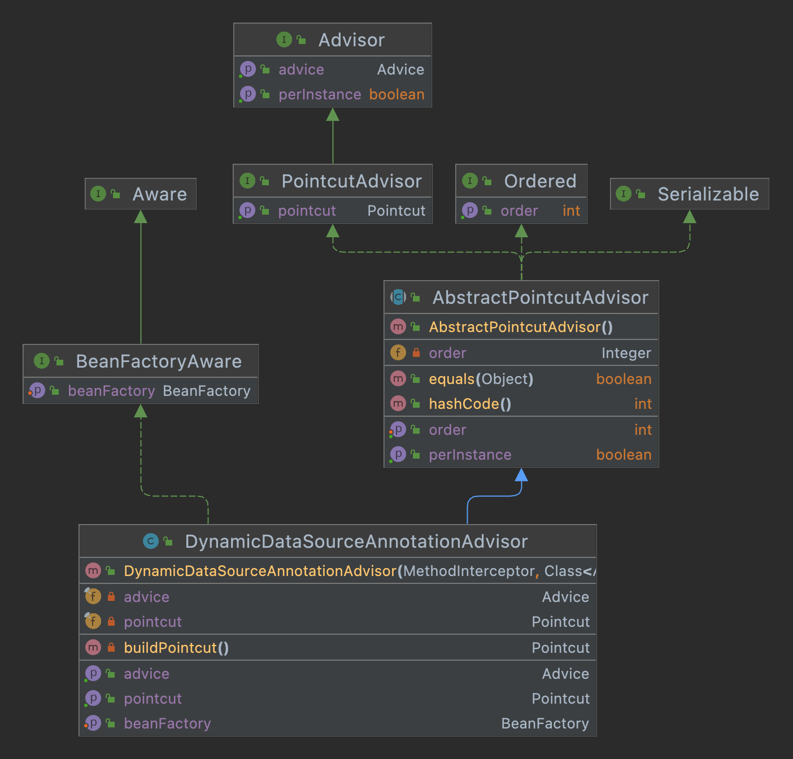
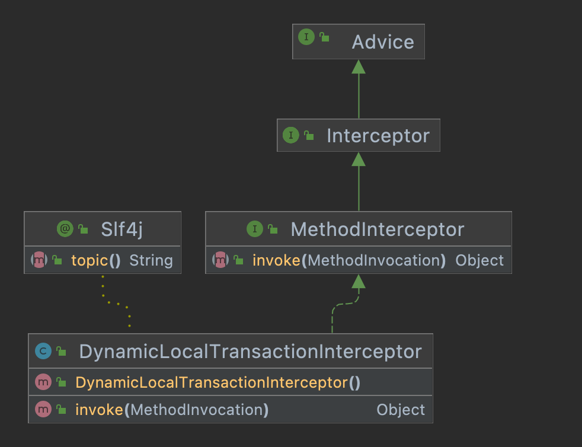
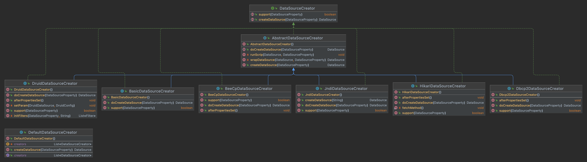
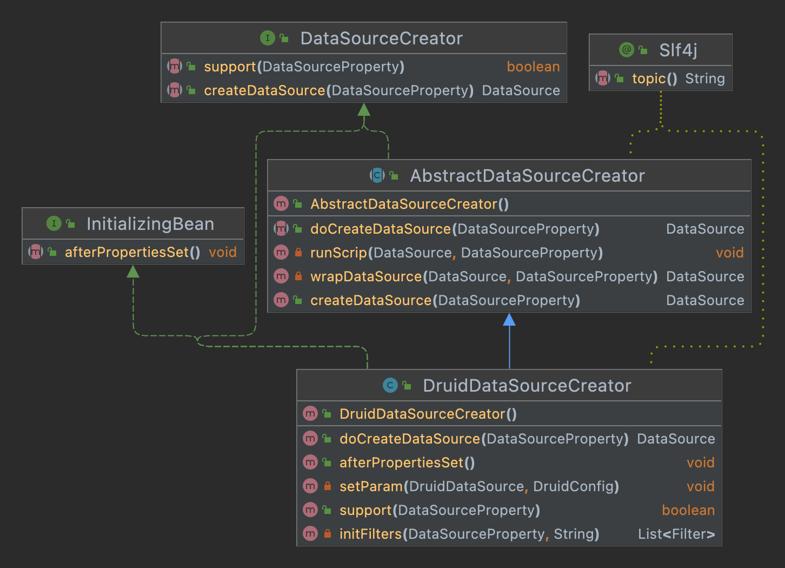
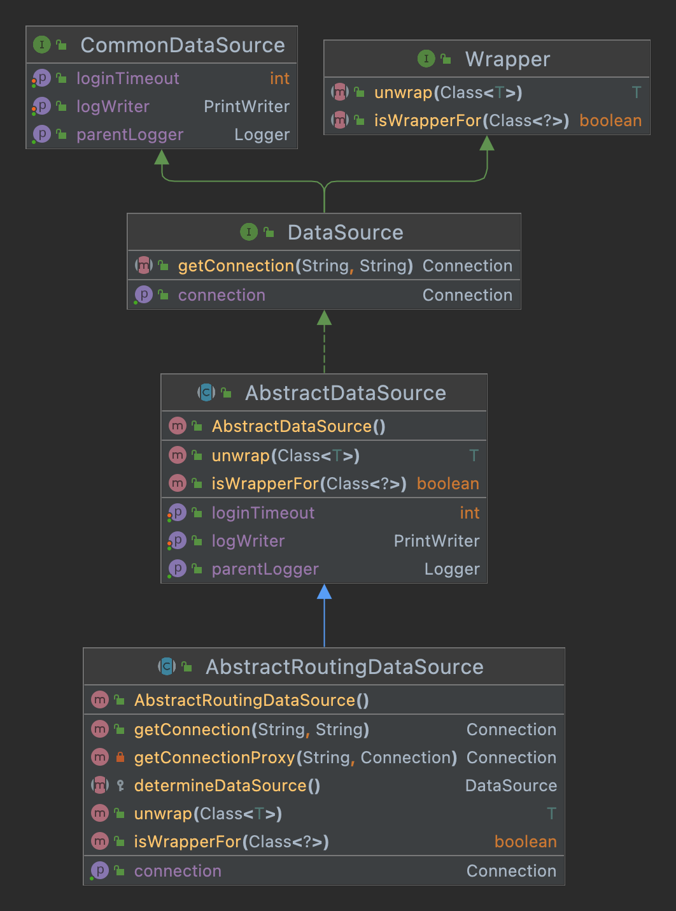
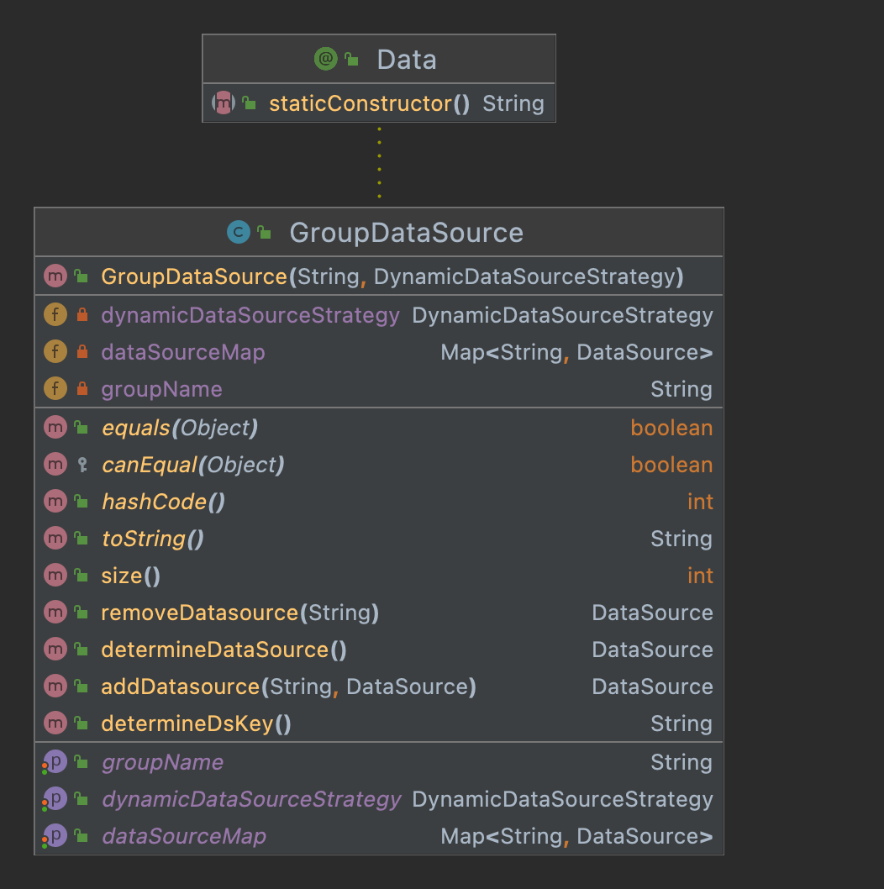
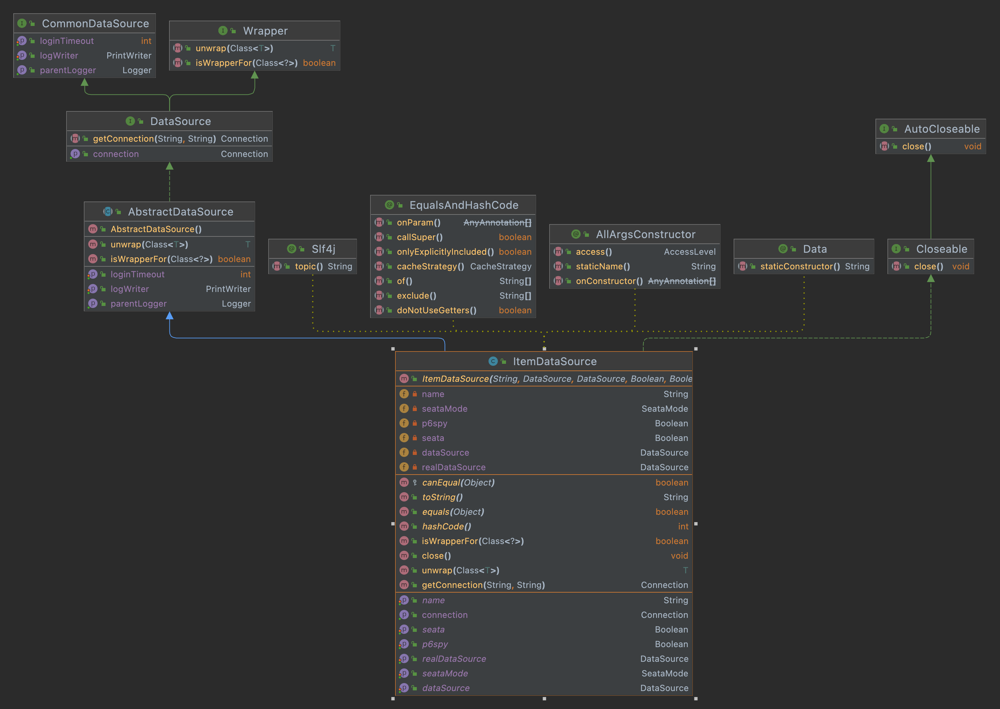

# annotation
    DS
        数据源
    DSTransactional
        支持事务
    Master
        主数据源
    Slave
        从数据源
# aop

    实现BeanFactoryAware
    继承AbstractPointcutAdvisor
        DynamicDataSourceAnnotationAdvisor
            org.aopalliance.aop
                Advice
            org.springframework.aop
                Pointcut: ComposablePointcut
                    org.springframework.aop.support.annotation
                        AnnotationMatchingPointcut
                            功能: 匹配注解的切点
                    AnnotationMethodPoint(自定义,适配低于5.0的spring)
                        功能: 判断某个类的某个方法是否有指定的注解
                        AnnotationMethodMatcher(自定义)
                            功能: 
                                org.springframework.core.annotation
                                    AnnotatedElementUtils.hasAnnotation(method,annotation): 判断方法是否有注解
                                java.lang.reflect
                                    Proxy.isProxyClass(class): 代理的类一定没有注解
                                org.springframework.aop.support.AopUtils
                                    getMostSpecificMethod(method, targetClass): 找到
                                        给定一个可能来自接口的方法，以及当前 AOP 调用中使用的目标类，如果有，则找到对应的目标方法。 
                                        例如。 方法可能是 IFoo.bar()，目标类可能是 DefaultFoo。 在这种情况下，方法可能是 DefaultFoo.bar()。 这使得可以找到该方法的属性。
                                        如果我们正在处理带有泛型参数的方法，请找到原始方法。
                                        如果是代理类，可以找到原始的方法
            java.lang.annotation
                Annotation

    实现MethodInterceptor(相同结构)
        DynamicDataSourceAnnotationInterceptor
            注解拦截器
        DynamicDatasourceNamedInterceptor
            命名拦截器
        DynamicLocalTransactionInterceptor
            本地事务拦截器

# creator
    whole

    
    creator

    DataSourceCreator
    AbstractDataSourceCreator
    BasicDataSourceCreator

    BeeCpDataSourceCreator
    Dbcp2DataSourceCreator
    DruidDataSourceCreator
    HikariDataSourceCreator
    JndiDataSourceCreator

    DefaultDataSourceCreator
# ds

    AbstractRoutingDataSource

    GroupDataSource

    ItemDataSource
# enums
    SeataMode
        XA
        AT
# event
    DataSourceInitEvent
    EncDataSourceInitEvent
# exception
    CannotFindDataSourceException
    ErrorCreateDataSourceException
# plugin
    MasterSlaveAutoRoutingPlugin
# processor
    DsHeaderProcessor
    DsProcessor
    DsSessionProcessor
    DsSpelExpressionProcessor
# provider
    AbstractDataSourceProvider
    AbstractJdbcDataSourceProvider
    DynamicDataSourceProvider
    YmlDynamicDataSourceProvider
# autoconfigure
## beecp
    BeeCpConfig
## dbcp2
    Dbcp2Config
## druid
    DruidConfig
    DruidConsts
    DruidDynamicDataSourceConfiguration
    DruidLogConfigUtil
    DruidStatConfigUtil
    DruidWallConfigUtil
## hikari
    HikariCpConfig
##
    DatasourceInitProperties
        动态数据源初始化脚本配置：建表、数据、
    DataSourceProperty
        数据库连接参数、seata、p6spy、数据库配置(4个)、动态数据源初始化脚本配置
    DynamicDatasourceAopProperties
        多数据源aop相关配置：默认ds注解、排序、是否只对public
    DynamicDataSourceAutoConfiguration
        
    DynamicDataSourceCreatorAutoConfiguration
    DynamicDataSourceProperties
    DynamicDataSourcePropertiesCustomizer
# strategy
    DynamicDataSourceStrategy
    LoadBalanceDynamicDataSourceStrategy
    RandomDynamicDataSourceStrategy
# support
    DataSourceClassResolver
    DdConstants
    ScriptRunner
# toolkit
    Base64
    ConfigMergeCreator
    CryptoUtils
    DsConfigUtil
    DynamicDataSourceContextHolder
# tx
    ConnectionFactory
    ConnectionProxy
    LocalTxUtil
    TransactionContext

#
    DynamicRoutingDataSource
