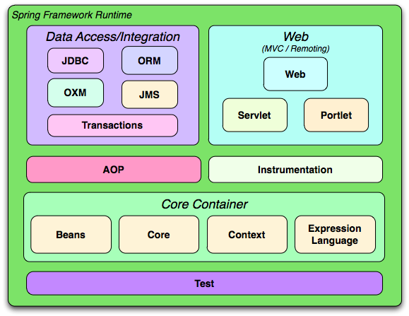
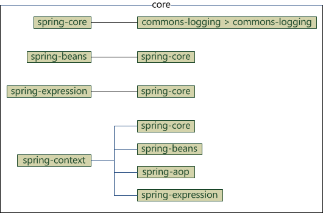

# 1、Spring 概述
## 概述
Spring 是最受欢迎的**企业级 Java 应用程序开发框架**，数以百万的来自世界各地的开发人员使用 Spring 框架来创建性能好、易于测试、可重用的代码。

Spring 框架是一个开源的 Java 平台，它最初是由 **Rod Johnson** 编写的，并且于 2003 年 6 月首次在 Apache 2.0 许可下发布。

Spring 是**轻量级**的框架，其基础版本只有 2 MB 左右的大小。

Spring 框架的核心特性是可以**用于开发任何 Java 应用程序**，但是在 Java EE 平台上构建 web 应用程序是需要扩展的。 Spring 框架的目标是**使 J2EE 开发变得更容易使用**，通过启用基于 POJO 编程模型来促进良好的编程实践。

## 三层架构
> * A 表现层   web层    MVC是表现层的一个设计模型 
> * B 业务层  service层
> * C 持久层  dao层  Spring JDBC

## 优良特性
> * 非侵入式：基于Spring开发的应用中的对象可以不依赖于Spring的API
> * 控制反转：IOC——Inversion of Control，指的是将对象的创建权交给 Spring 去创建。使用 Spring 之前，对象的创建都是由我们自己在代码中new创建。而使用 Spring 之后。对象的创建都是给了 Spring 框架。
> * 依赖注入：DI——Dependency Injection，是指依赖的对象不需要手动调用 setXX 方法去设置，而是通过配置赋值。
> * 面向切面编程：Aspect Oriented Programming——AOP
> * 容器：Spring 是一个容器，因为它包含并且管理应用对象的生命周期
> * 组件化：Spring 实现了使用简单的组件配置组合成一个复杂的应用。在 Spring 中可以使用XML和Java注解组合这些对象。
> * 一站式：在 IOC 和 AOP 的基础上可以整合各种企业应用的开源框架和优秀的第三方类库（实际上 Spring 自身也提供了表现层的 SpringMVC 和持久层的 Spring JDBC）

## 使用Spring框架的好处
> * 支持企业级应用开发：Spring 可以使开发人员使用 POJOs 开发企业级的应用程序。只使用 POJOs 的好处是你**不需要一个 EJB 容器产品**，比如一个应用程序服务器，但是你**可以选择使用一个健壮的 servlet 容器**，比如 Tomcat 或者一些商业产品。
> * 单元有组织的：Spring **在一个单元模式中是有组织的**。即使包和类的数量非常大，你只要担心你需要的，而其它的就可以忽略了。
> * 复用现有技术：Spring 不会让你白费力气做重复工作，它真正的**利用了一些现有的技术**，像 ORM 框架、日志框架、JEE、Quartz 和 JDK 计时器，其他视图技术。
> * 便于测试：测试一个用 Spring 编写的应用程序很容易，因为环境相关的代码被移动到这个框架中。此外，通过使用 JavaBean-style POJOs，它在使用依赖注入注入测试数据时变得更容易。
> * 良好的WEB框架：Spring 的 web 框架是一个设计良好的 web MVC 框架，它为比如 Structs 或者其他工程上的或者不怎么受欢迎的 web 框架提供了一个很好的供替代的选择。MVC 模式导致应用程序的不同方面(输入逻辑，业务逻辑和UI逻辑)分离，同时提供这些元素之间的松散耦合。模型(Model)封装了应用程序数据，通常它们将由 POJO 类组成。视图(View)负责渲染模型数据，一般来说它生成客户端浏览器可以解释 HTML 输出。控制器(Controller)负责处理用户请求并构建适当的模型，并将其传递给视图进行渲染。
> * 复杂框架的封装：Spring 对 JavaEE 开发中非常难用的一些 API（JDBC、JavaMail、远程调用等），都提供了封装，使这些API应用难度大大降低。
> * 轻量级的 IOC 容器：轻量级的 IOC 容器往往是轻量级的，例如，特别是当与 EJB 容器相比的时候。这有利于在内存和 CPU 资源有限的计算机上开发和部署应用程序。
> * 事务管理：Spring 提供了一致的事务管理接口，可向下扩展到（使用一个单一的数据库，例如）本地事务并扩展到全局事务（例如，使用 JTA）。

## 依赖注入（DI）
Spring 最认同的技术是控制反转的**依赖注入（DI）**模式。控制反转（IoC）是一个通用的概念，它可以用许多不同的方式去表达，依赖注入仅仅是控制反转的一个具体的例子。

当编写一个复杂的 Java 应用程序时，应用程序类应该尽可能的独立于其他的 Java 类来增加这些类**可重用可能性**，当进行单元测试时，可以使它们独立于其他类进行测试。依赖注入（或者有时被称为配线）有助于将这些类粘合在一起，并且在同一时间让它们保持独立。

到底什么是依赖注入？让我们将这两个词分开来看一看。这里将依赖关系部分转化为两个类之间的关联。例如，类 A 依赖于类 B。现在，让我们看一看第二部分，注入。所有这一切都意味着类 B 将通过 IoC 被注入到类 A 中。

依赖注入可以以向构造函数传递参数的方式发生，或者通过使用 setter 方法 post-construction。由于依赖注入是 Spring 框架的核心部分，所以我将在一个单独的章节中利用很好的例子去解释这一概念。

## 面向切面的程序设计（AOP）：
Spring 框架的一个关键组件是**面向切面的程序设计（AOP）框架**。一个程序中跨越多个点的功能被称为横切关注点，这些横切关注点在概念上独立于应用程序的业务逻辑。有各种各样常见的很好的关于方面的例子，比如日志记录、声明性事务、安全性，和缓存等等。

在 OOP 中模块化的关键单元是类，而在 AOP 中模块化的关键单元是方面。AOP 帮助你将横切关注点从它们所影响的对象中分离出来，然而依赖注入帮助你将你的应用程序对象从彼此中分离出来。

Spring 框架的 AOP 模块提供了面向方面的程序设计实现，可以定义诸如方法拦截器和切入点等，从而**使实现功能的代码彻底的解耦**出来。使用源码级的元数据，可以用类似于 .Net 属性的方式合并行为信息到代码中。我将在一个独立的章节中讨论更多关于 Spring AOP 的概念。
# 2、Spring 体系结构
Spring 有可能成为所有企业应用程序的一站式服务点，然而，Spring 是模块化的，允许你挑选和选择适用于你的模块，不必要把剩余部分也引入。下面的部分对在 Spring 框架中所有可用的模块给出了详细的介绍。

Spring 框架提供约 20 个模块，可以根据应用程序的要求来使用。

## 核心容器
核心容器由 spring-core，spring-beans，spring-context，spring-context-support和spring-expression（SpEL，Spring 表达式语言，Spring Expression Language）等模块组成，它们的细节如下：

> * spring-core 模块提供了框架的基本组成部分，包括 IoC 和依赖注入功能。

> * spring-beans 模块提供 BeanFactory，工厂模式的微妙实现，它移除了编码式单例的需要，并且可以把配置和依赖从实际编码逻辑中解耦。

> * context 模块建立在由 core和 beans 模块的基础上建立起来的，它以一种类似于 JNDI 注册的方式访问对象。Context 模块继承自 Bean 模块，
并且添加了国际化（比如，使用资源束）、事件传播、资源加载和透明地创建上下文（比如，通过 Servelet 容器）等功能。Context 模块也支持 Java EE 
的功能，比如 EJB、JMX 和远程调用等。ApplicationContext 接口是 Context 模块的焦点。spring-context-support 提供了对第三方集成到
 Spring 上下文的支持，比如缓存（EhCache, Guava, JCache）、邮件（JavaMail）、调度（CommonJ, Quartz）、模板引擎（FreeMarker,
 JasperReports, Velocity）等。

> * spring-expression 模块提供了强大的表达式语言，用于在运行时查询和操作对象图。它是 JSP2.1 规范中定义的统一表达式语言的扩展，支持 set
和 get 属性值、属性赋值、方法调用、访问数组集合及索引的内容、逻辑算术运算、命名变量、通过名字从 Spring IoC 容器检索对象，还支持列表的投
影、选择以及聚合等。

它们完整的依赖关系如下图所示：

## 数据访问/集成
数据访问/集成层包括 JDBC，ORM，OXM，JMS 和事务处理模块，它们的细节如下：

**（注：JDBC=Java Data Base Connectivity，ORM=Object Relational Mapping，OXM=Object XML Mapping，JMS=Java Message Service）**

> * JDBC 模块提供了 JDBC 抽象层，它消除了冗长的 JDBC 编码和对数据库供应商特定错误代码的解析。

> * ORM 模块提供了对流行的对象关系映射 API 的集成，包括 JPA、JDO 和 Hibernate 等。通过此模块可以让这些 ORM 框架和 spring的其它功能整合，比如前面提及的事务管理。

> * OXM 模块提供了对 OXM 实现的支持，比如 JAXB、Castor、XML Beans、JiBX、XStream 等。

> * JMS 模块包含生产（produce）和消费（consume）消息的功能。从 Spring 4.1 开始，集成了 spring-messaging 模块。

> * 事务模块为实现特殊接口类及所有的 POJO 支持编程式和声明式事务管理。（注：编程式事务需要自己写 beginTransaction()、commit()、rollback() 等事务管理方法，声明式事务是通过注解或配置由 spring 自动处理，编程式事务粒度更细）

## Web
Web 层由 Web，Web-MVC，Web-Socket 和 Web-Portlet 组成，它们的细节如下：

> * Web 模块提供面向 web 的基本功能和面向 web 的应用上下文，比如多部分（multipart）文件上传功能、使用 Servlet 监听器初始化 IoC 容器等。它还包括 HTTP 客户端以及 Spring 远程调用中与 web 相关的部分。

> * Web-MVC 模块为 web 应用提供了模型视图控制（MVC）和 REST Web服务的实现。Spring 的 MVC 框架可以使领域模型代码和 web 表单完全地分离，且可以与 Spring 框架的其它所有功能进行集成。

> * Web-Socket 模块为 WebSocket-based 提供了支持，而且在 web 应用程序中提供了客户端和服务器端之间通信的两种方式。

> * Web-Portlet 模块提供了用于 Portlet 环境的 MVC 实现，并反映了 spring-webmvc 模块的功能。

# 3、Spring 环境配置

# 4、Spring Hello World 实例
# 5、Spring IoC容器
# 6、Spring 依赖注入
# 7、Spring Beans 自动装配
# 8、Spring 基于注解的配置
# 9、Spring 框架的AOP
# 10、Spring JDBC框架
# 11、Spring 事务管理
# 12、Spring Web MVC 框架
