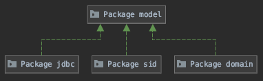
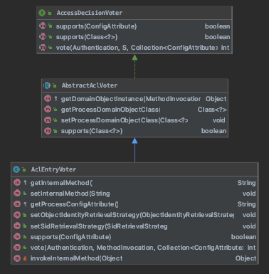
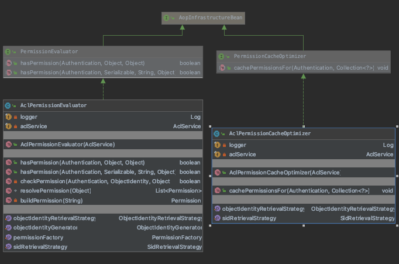
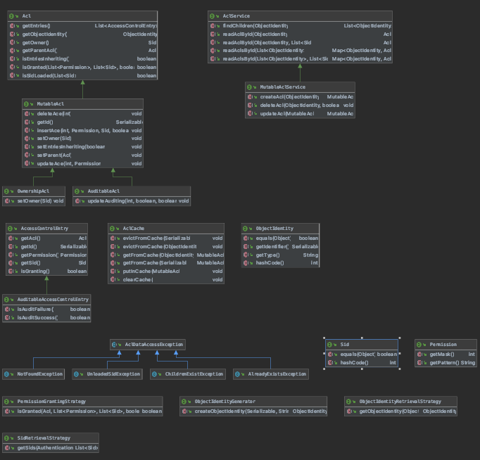

# 1、acl
访问控制列表 (ACL) 是附加到对象的权限列表。 ACL 指定哪些身份被授予对给定对象的哪些操作。

Spring Security 访问控制列表是一个支持域对象安全的 Spring 组件。 简而言之，Spring ACL 有助于在单个域对象上定义特定用户/角色的权限 - 
而不是全面，在典型的每个操作级别。

例如，具有 Admin 角色的用户可以查看 (READ) 和编辑 (WRITE) 中央通知箱上的所有消息，但普通用户只能看到消息，与消息相关，不能编辑。 同时，
其他具有编辑器角色的用户可以查看和编辑某些特定消息。

因此，不同的用户/角色对每个特定对象具有不同的权限。 在这种情况下，Spring ACL 能够完成任务。 我们将在本文中探讨如何使用 Spring ACL 设置
基本权限检查。

## 1-1、模块关系

> * base
> * after invocation
> * domain
> * jdbc
> * model

> 包 | 描述
> --- | ---
> acls	| Spring Security ACL 包，它为域对象实现基于实例的安全性。
> acls.afterinvocation	| 用于集合和数组过滤的调用后提供程序。
> acls.domain | 访问控制列表 (ACL) 接口的基本实现。
> acls.jdbc | 基于JDBC的ACL信息持久化
> acls.model | 用于管理域对象实例的访问控制列表 (ACL) 的接口和共享类。

## 1-2、基础部分
Spring Security ACL 包，它为域对象实现基于实例的安全性。

### 1-2-1、AclsEntryVoter

AccessDecisionVoter -> AbstractAclVoter -> AclEntryVoter

给定作为方法参数传递的域对象实例，确保主体具有由 AclService 指示的适当权限。

AclService 用于检索与当前身份验证对象的域对象实例关联的访问控制列表 (ACL) 权限。

如果任何 ConfigAttribute.getAttribute() 与 processConfigAttribute 匹配，则投票者将投票。然后提供程序将定位
 AbstractAclVoter.processDomainObjectClass 类型的第一个方法参数。假设方法参数为非空，提供者将在 AclManager 中查找 ACL，并在向该方
法提供 requirePermission 数组时确保主体为 Acl.isGranted(List, List, boolean)。

如果方法参数为空，则投票者将放弃投票。如果找不到方法参数，将抛出 AuthorizationServiceException。

实际上，用户通常会设置多个 AclEntryVoters。每个都有不同的 processDomainObjectClass、processConfigAttribute 和 requirePermission 
组合。例如，一个小型应用程序可能会使用以下 AclEntryVoter 实例：

> * 进程域对象类BankAccount，配置属性VOTE_ACL_BANK_ACCOUNT_READ，需要权限BasePermission.READ
> * 进程域对象类BankAccount，配置属性VOTE_ACL_BANK_ACCOUNT_WRITE，需要权限列表BasePermission.WRITE和BasePermission.CREATE
（允许主体拥有这两个权限之一）
> * 流程域对象类Customer，配置属性VOTE_ACL_CUSTOMER_READ，需要权限BasePermission.READ
> * 流程域对象类Customer，配置属性VOTE_ACL_CUSTOMER_WRITE，需要权限列表BasePermission.WRITE和BasePermission.CREATE

或者，如果 BankAccount 和 Customer 都有共同的父级，您可以为 AbstractAclVoter.processDomainObjectClass 使用通用超类或接口。

如果主体没有足够的权限，投票者将投票拒绝访问。

所有比较和前缀都**区分大小写**。

#### 1、getInternalMethod

可选地指定将用于获取包含的域对象的域对象的方法。 包含的域对象将用于 ACL 评估。 如果域对象包含 ACL 评估应该针对的父域对象，而不是子域对象
（可能正在创建，因此还没有任何 ACL 权限），这将很有用

#### 2、vote
指示是否授予访问权限。

决定必须是肯定 (ACCESS_GRANTED)、否定 (ACCESS_DENIED) 或 AccessDecisionVoter 可以弃权 (ACCESS_ABSTAIN) 投票。在任何情况下，实现
类都不应返回任何其他值。如果需要对结果进行加权，则应改为在自定义 AccessDecisionManager 中处理。

除非由于传递的方法调用或配置属性参数，AccessDecisionVoter 专门用于对访问控制决策进行投票，否则它必须返回 ACCESS_ABSTAIN。这可以防止协
调 AccessDecisionManager 计算那些对访问控制决策没有合法利益的 AccessDecisionVoter 的选票。

虽然安全对象（例如 MethodInvocation）作为参数传递以最大限度地提高访问控制决策的灵活性，但实现类不应修改它或导致所表示的调用发生（例如，
通过调用 MethodInvocation.proceed()） .

### 1-2-2、AclPermissionCacheOptimizer && AclPermissionEvaluator

> * AclPermissionCacheOptimizer: 批量加载对象集合的 ACL 以允许优化过滤。
> * AclPermissionEvaluator: 

## 1-3、模型（model）
用于管理域对象实例的访问控制列表 (ACL) 的接口和共享类。

### 1-3-1、Acl
表示域对象的访问控制列表 (ACL)。

Acl 表示给定域对象的所有 ACL 条目。 为了避免需要对域对象本身的引用，该接口通过 ObjectIdentity 接口处理域对象和 ACL 对象标识之间的间接
关系。

实现类可以选择返回代表某些或所有 Sid 实例的权限信息的实例。 因此，一个实例可能不一定包含给定域对象的所有 Sid。

#### getEntries() List<AccessControlEntry>
> * 返回由当前 Acl 表示的所有条目。 不会返回与 Acl 父项关联的条目。
> * 此方法通常用于管理目的。
> * 条目在数组中出现的顺序对于 MutableAcl 接口中声明的方法很重要。 此外，一些实现可以使用排序作为高级权限检查的一部分。
> * 不要使用此方法做出授权决定。 而是使用 isGranted(List, List, boolean)。
> * 即使 Acl 仅代表 Sid 的一个子集，此方法也必须正确运行。 如果仅表示 Sid 的一个子集，则调用方负责正确处理结果。
#### getObjectIdentity() ObjectIdentity
> * 获取此 Acl 为其提供条目的域对象。 一旦创建了 Acl，这是不可变的。
> * 返回值不为空
#### getOwner() Sid
> * 确定 Acl 的所有者。 所有权的含义因实现而异，并且未指定。
#### getParentAcl() Acl
> * 出于 ACL 继承的目的，域对象可能有一个父对象。 如果存在父级，则可以通过此方法访问其 ACL。 反过来，可以访问父母的父母（祖父母）等等。
> * 此方法仅表示父 Acl 和此 Acl 之间存在导航层次结构。 要进行实际继承，isEntriesInheriting() 也必须为真。
> * 即使 Acl 仅代表 Sid 的一个子集，此方法也必须正确运行。 **如果仅表示 Sid 的一个子集，则调用方负责正确处理结果。**
#### isEntriesInheriting() boolean
> * 指示来自 getParentAcl() 的 ACL 条目是否应向下流入当前 Acl。
> * Acl 和父 Acl 之间的链接本身不足以导致 ACL 条目向下继承。 这是因为域对象可能希望具有完全独立的条目，但为了导航目的而保持与父级的链接。
因此，该方法表示导航关系是否也扩展到条目的实际继承。
#### isGranted(List<Permission> permission, List<Sid> sids, boolean administrativeMode) boolean
> * 这是实际的授权逻辑方法，必须在需要 ACL 授权决策时使用。
> * 显示了一组 Sid，代表当前主体的安全标识。此外，还提供了一组权限，这些权限将设置一个或多个位，以指示肯定授权决定所需的权限。之所以出现数
组，是因为在数组中持有任何权限就足以进行肯定授权。
> * 用于做出授权决定的实际方法由实现决定，并且未由该接口指定。例如，一个实现可以按照 ACL 条目的存储顺序搜索当前的 ACL。如果发现单个条目具
有与传递的权限中显示的相同的活动位，则该条目的授予或拒绝状态可以确定授权决定。如果是拒绝状态，则拒绝决定仅在数组中传递的所有其他权限也未成功
搜索时才相关。如果没有找到与当前 ACL 中的位匹配的条目，假设 isEntriesInheriting() 为真，则可以将授权决定传递给父 ACL。如果没有匹配的条
目，实现可以抛出一个异常，或者做出一个预定义的授权决定。
> * 即使 Acl 仅表示 Sid 的一个子集，此方法也必须正确运行，尽管如果调用该方法请求对从未在此 Acl 中加载的 Sid 进行授权决策，则允许实现抛出
签名定义的异常之一。

参数：
> * 权限 - 所需的一个或多个权限（至少需要一个条目）
> * sids - 主体持有的安全身份（至少需要一个条目）
> * 管理模式 - 如果为 true 表示查询是出于管理目的，并且不应该进行日志记录或审计（如果由实现支持）

返回：
> * 如果授权被授予，则为真

抛出：
> * NotFoundException - 如果实现无法做出权威授权决定，则必须抛出，通常是因为没有此特定权限和/或 SID 的 ACL 信息
> * UnloadedSidException - 如果 Acl 没有作为参数传递的一个或多个 Sid 的详细信息，则抛出
#### isSidLoaded(List<Sid> sids) boolean
> * 出于效率原因，可能会加载 Acl 并且不包含系统中每个 Sid 的条目。 如果一个 Acl 已经被加载并且不代表每个 Sid，那么 Acl 的所有方法只能在
它实际代表的 Sid 实例的有限范围内使用。
> * 如果正在做出只读授权决定，则仅为特定 Sid 加载 Acl 是正常的。 但是，如果需要用户界面报告或修改 Acl，则应加载所有 Sid 的 Acl。 此方法
表示是否已加载指定的 Sid。

参数：
> sids - 调用者有兴趣了解此 Sid 是否支持的一个或多个安全身份

返回：
> 如果每个传递的 Sid 都由此 Acl 实例表示，则为 true
### 1-3-2、AclService
提供 Acl 实例的检索。

#### findChildren(ObjectIdentity parentIdentity) List<ObjectIndentity>
> 定位使用指定父项的所有对象标识。 这对于管理工具很有用。

参数：
> parentIdentity - 定位孩子的

返回：
> 孩子（如果没有找到，则为空）
#### readAclById(ObjectIdentity object) Acl
> * 与 readAclsById(List) 相同，只是它只返回一个 Acl。
> * 不应调用此方法，因为它没有利用底层实现的潜在能力来根据 Sid 参数过滤 Acl 条目。

参数：
> 对象 - 定位一个 Acl

返回：
> 请求的 ObjectIdentity 的 Acl（从不为空）

抛出：
> NotFoundException - 如果未找到请求的 ObjectIdentity 的 Acl
#### readAclById(ObjectIdentity object, List<Sid> sids) Acl
> 与 readAclsById(List, List) 相同，但它只返回一个 Acl。

参数：
> * 对象 - 定位一个 Acl
> * sids - 需要 Acl 信息的安全身份（可能为空以表示所有条目）

返回：
> 请求的 ObjectIdentity 的 Acl（从不为空）

抛出：
> NotFoundException - 如果未找到请求的 ObjectIdentity 的 Acl
#### readAclsById(List<ObjectIdentity> objects) Map<ObjectIdentity, Acl>
> * 获取所有适用于传递的 Objects 的 ACL。
> * 返回的映射以传递的对象为键，值为 Acl 实例。 任何未知对象都没有映射键。

参数：
> objects - 要为其查找 Acl 信息的对象

返回：
> 每个作为参数传递的 ObjectIdentity 都只有一个元素的映射（永远不会为空）

抛出：
> NotFoundException - 如果未为每个请求的 ObjectIdentity 找到 Acl
#### readAclsById(List<ObjectIdentity> objects, List<Sid> sids) Map<ObjectIdentity, Acl>
> * 获取所有申请通过的Objects的ACL，但仅限于通过的安全标识。
> * 实现可以通过此方法提供 ACL 的子集，尽管这不是必需的。 这是为了允许在实现中进行性能优化。 因此，调用者应优先使用此方法，而不是没有性能
优化机会的替代重载版本。
> * 返回的映射以传递的对象为键，值为 Acl 实例。 任何未知对象（或感兴趣的 Sid 没有条目的对象）将没有映射键。

参数：
> * objects - 要为其查找 Acl 信息的对象
> * sids - 需要 Acl 信息的安全身份（可能为空以表示所有条目）

返回：
> * 每个作为参数传递的 ObjectIdentity 都只有一个元素的映射（永远不会为空）

抛出：
> * NotFoundException - 如果未为每个请求的 ObjectIdentity 找到 Acl
### 1-3-3、AccessControlEntry
表示 Acl 中的单个权限分配。

实例必须是不可变的，因为它们由 Acl 返回，并且不允许客户端修改。

#### getAcl() Acl
#### getId() Serializable
> 获取代表此 ACE 的标识符。

返回：
> 标识符，如果未保存，则为 null
#### getPermission Permission
#### getSid() Sid
#### isGranting boolean
> 表示正在向相关 Sid 授予权限。 如果为 false，则表示正在撤销/阻止权限。

返回：
> 如果被授予则为真，否则为假
### 1-3-4、AclCache
JdbcAclService 的缓存层。

#### clearCache() void
#### evictFromCache(ObjectIdentity objectIdentity) void
#### evictFromCache(Serializable pk) void
#### getFromCache(ObjectIdentity objectIdentity) MutableAcl
#### getFromCache(Serializable pk)
#### putInCache(MutableAcl acl)

### 1-3-5、ObjectIdentity
表示单个域对象实例的标识。

由于 ObjectIdentity 的实现被用作表示 ACL 子系统中域对象的关键，因此实现提供方法以便可靠地依赖对象相等而不是引用相等是必不可少的。 换句话
说，如果identity1.equals(identity2)，ACL子系统可以认为两个ObjectIdentity是相等的，而不是identity1==identity2的引用相等。

#### equals(Object obj) boolean
略
#### getIdentifier() Serializable
> * 获取实际标识符。 不得重复使用此标识符来表示具有相同 javaType 的其他域对象。
> * 由于 ACL 在很大程度上是不可变的，因此强烈建议使用合成标识符（例如主键的数据库序列号）。 **不要使用具有业务含义的标识符**，因为该业务含义将
来可能会发生变化，这种变化会级联到 ACL 子系统数据。

返回：
> 标识符（在此类型中是唯一的；永远不会为空）
#### getType() String
> 获取域对象的“类型”元数据。 这通常是一个 Java 类型名称（一个接口或一个类）——传统上它是域对象实现类的名称。

返回：
> 域对象的“类型”（从不为空）。
#### hashCode() int
略

### 1-3-6、AclDataAccessException
Acl 数据操作的抽象基类。

### 1-3-7、Sid
ACL 系统认可的安全身份。

该接口提供了实际安全对象（例如主体、角色、组等）与存储在 Acl 中的内容之间的间接关系。 这是因为 Acl 不会存储整个安全对象，而只会存储它的抽
象。 因此，该接口提供了一种将这些抽象的安全身份与其他安全身份和实际安全对象进行比较的简单方法。

#### equals(Object obj) boolean
> 有关接口协定，请参阅 java.lang.Object 文档。

覆盖：
> 类 java.lang.Object 中的等于

参数：
> obj - 要比较

返回：
> 如果对象相等则为真，否则为假

#### hashCode() int
> 有关接口协定，请参阅 java.lang.Object 文档。

覆盖：
> 类 java.lang.Object 中的 hashCode

返回：
> 此对象的哈希码表示

### 1-3-8、Permission
表示授予给定域对象的 Sid 的权限。

域：
RESERVED_OFF 
RESERVED_ON 
THIRTY_TWO_RESERVED_OFF 

#### getMask() int
> 返回表示权限的位。

返回：
> 代表权限的位
#### getPattern() String
> * 返回表示此权限的 32 字符长位模式字符串。
> * 尽管在任何情况下都不能在模式中使用 RESERVED_OFF 或 RESERVED_ON ，但实现可以自由地按照他们认为合适的方式格式化模式。 豁免是在
 RESERVED_OFF 的情况下，用于表示关闭（清除）的位。 实现也可以选择在内部使用 RESERVED_ON 用于计算目的，尽管此方法可能不会返回任何包含
 RESERVED_ON 的字符串。
> * 返回的字符串长度必须为 32 个字符。
> * 此方法仅用于用户界面和日志记录目的。 它不用于任何权限计算。 因此，允许在输出中重复字符。

返回：
一个 32 个字符的位模式

### 1-3-9、PermissionGrantingStrategy
允许定制用于确定一个或多个权限是否由 Acl 授予一个或多个特定 sid 的逻辑。

#### isGranted(Acl acl, List<Permission> permission, List<Sid> sids, boolean administrativeMode) boolean
> 如果提供的策略决定提供的 Acl 根据提供的权限和 sid 列表授予访问权限，则返回 true。

### 1-3-10、ObjectIdentityGenerator
根据对象标识符（例如主键）和类型信息创建 ObjectIdentity 的策略。

与 ObjectIdentityRetrievalStrategy 的不同之处在于它用于实际对象实例不可用的情况。

#### createObjectIdentity(java.io.Serializable id, java.lang.String type) 
参数：
> id - 域对象的标识符，不为空
> type - 对象的类型（通常是类名），不为空

返回：
> 使用提供的标识符和类型信息构造的身份。

### 1-3-11、ObjectIdentityRetrievalStrategy
提供确定将为特定域对象返回哪个 ObjectIdentity 的能力的策略接口

#### getObjectIdentity(Object domainObject) ObjectIdentity

### 1-3-12、SidRetrievalStrategy
提供确定适用于身份验证的 Sid 实例的能力的策略接口。

#### getSids(Authentication authentication) List<Sid>

## 1-4、域（domain）
访问控制列表 (ACL) 接口的基本实现。

### 1-4-1、AclAuthorizationStrategy
AclImpl 用于确定是否允许主体调用 AclImpl 上的管理方法的策略。

域：
CHANGE_AUDITING 
CHANGE_GENERAL 
CHANGE_OWNERSHIP 

#### securityCheck(Acl acl, int changeType) void

### 1-4-2、AuditLogger
由 AclImpl 用于记录审计事件。

#### logIfNeeded(boolean granted, AccessControlEntry ace) void

### 1-4-3、PermissionFactory
提供一种简单的机制来从整数掩码中检索 Permission 实例。

#### buildFromMask(int mask) Permission
动态创建一个 CumulativePermission 或 BasePermission 表示传递的掩码中的活动位。

参数：
> 面具 - 建立

返回：
> 表示请求对象的权限
#### buildFromName(String name) Permission
#### buildFromNames(List<String> names) List<Permission>

## 1-5、调用后（after invocation）
用于集合和数组过滤的调用后提供程序。

### 1-5-1、Filterer
过滤策略接口。

#### getFilteredObject() Object
> 获取过滤后的集合或数组。

返回：
> 过滤后的集合或数组
#### iterator() Iterator<T>
> 返回过滤后的集合或数组的迭代器。

指定者：
> 接口 java.lang.Iterable<T> 中的迭代器

返回：
> 迭代器
#### remove(T object) void
> 从结果列表中删除给定的对象。

参数：
> object - 要删除的对象

## 1-6、JDBC
基于JDBC的ACL信息持久化

### 1-6-1、LookUpStrategy
执行对 AclService 的查找。

#### readAclsById(java.util.List<ObjectIdentity> objects, java.util.List<Sid> sids) Map<ObjectIdentity,Acl>
> 执行特定于数据库的优化查找。

参数：
> objects - 要查找的身份（必需）
> sids - 需要标识的 SID（可能为 null - 实现可以选择不提供 SID 优化）

返回：
> 一个 Map，其中键表示已定位 Acl 的 ObjectIdentity，值是已定位 Acl（虽然某些条目可能丢失，但永远不会为 null；此方法不应抛出
 NotFoundException，因为如果需要，可以使用 LookupStrategys 链自动创建条目）

