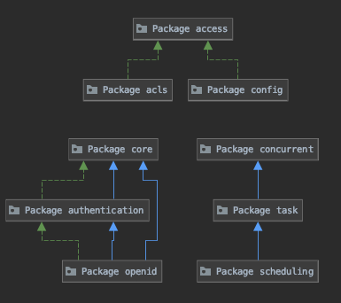
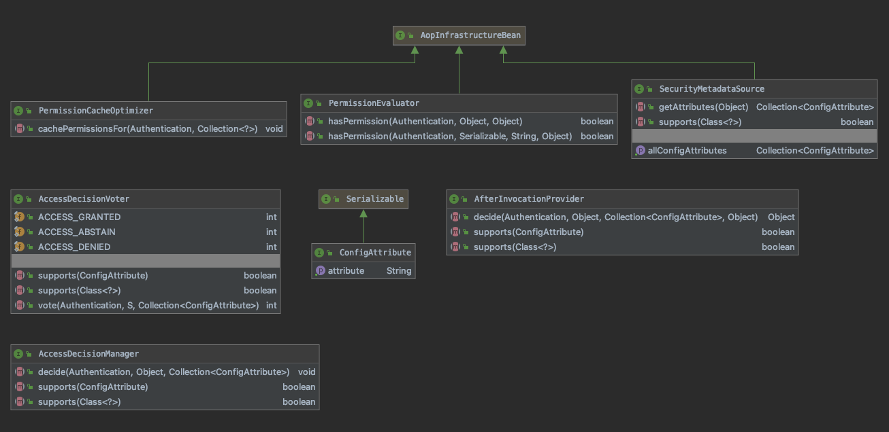

# core
## 2-1、模块关系

> 包 | 描述
> --- | ---
> access |核心访问控制相关代码，包括安全元数据相关类、拦截代码、访问控制注释、EL 支持和中央 AccessDecisionManager 接口的基于投票者的实现。
> access.annotation |支持 JSR-250 和 Spring Security @Secured 注释。
> access.event |授权事件和侦听器类。
> access.expression |表达式处理代码支持在 @PreAuthorize、@PreFilter、@PostAuthorize 和 @PostFilter 注释中使用基于 Spring-EL 的表达式。
> access.expression.method |基于表达式的方法安全的实现。
> access.hierarchicalroles |角色层次结构实现。
> access.intercept |抽象级安全拦截类，负责为安全对象强制执行配置的安全约束。
> access.intercept.aopalliance |为 AOP Alliance MethodInvocation 强制实施安全性，例如通过 Spring AOP。
> access.intercept.aspectj |强制 AspectJ JointPoints 的安全性，将安全对象回调委托给调用方面。
> access.method |提供 SecurityMetadataSource 实现以通过不同的 AOP 库保护 Java 方法调用。
> access.prepost |包含用于处理 @PreAuthorize、@PreFilter、@PostAuthorize 和 @PostFilter 注释的基础结构类。
> access.vote |实施基于投票的授权决策方法。
> authentication |与用户身份验证相关的核心类和接口，在整个 Spring Security 中使用。
> authentication.dao |一个依赖于数据访问对象的 AuthenticationProvider。
> authentication.event |可以发布到 Spring 应用程序上下文的身份验证成功和失败事件。
> authentication.jaas | JAAS 的身份验证提供程序。
> authentication.jaas.event | JAAS 身份验证事件可以由 JAAS 身份验证提供程序发布到 Spring 应用程序上下文。
> authentication.jaas.memory |内存中的 JAAS 实现。
> authentication.rcp |允许远程客户端进行身份验证并获取填充的身份验证对象。
> authorization |
> authorization.method |
> concurrent |
> context |
> converter |
> core |与用户认证和授权相关的核心类和接口，以及安全上下文的维护。
> core.annotation |
> core.authority | GrantedAuthority 接口的默认实现。
> core.authority.mapping |将属性列表（例如角色或 LDAP 组）映射到 GrantedAuthority 列表的策略。
> core.context |与在请求期间（例如 HTTP 或 RMI 调用）建立安全上下文相关的类。
> core.parameters |
> core.session |由 org.springframework.security.core.session.SessionInformation SessionInformation 类提供的会话抽象。
> core.token |用于构建安全随机令牌的服务。
> core.userdetails |用于实现用户数据 DAO 的标准接口。
> core.userdetails.cache | UserCache 的实现。
> core.userdetails.jdbc |公开基于 JDBC 的身份验证存储库，实现 org.springframework.security.core.userdetails.UserDetailsS​​ervice UserDetailsS​​ervice。
> core.userdetails.memory |公开内存中的身份验证存储库。
> jackson2 |混合类以添加 Jackson 序列化支持。
> provisioning |包含简单的用户和权限组帐户供应接口以及基于 JDBC 的实现。
> scheduling |
> task |
> util |在整个 Spring Security 框架中使用的通用实用程序类。
## 2-2、访问（access）
    核心访问控制相关代码，包括安全元数据相关类、拦截代码、访问控制注释、EL 支持和中央 AccessDecisionManager 接口的基于投票者的实现。

#### 2-2-0-1、AccessDecisionManager
    做出最终的访问控制（授权）决定。

##### decide(Authentication authentication, Object object, Collection<ConfigAttribute> configAttributes) void
    为传递的参数解析访问控制决策。
    通过抛出异常的方式判断该方法是否验证通过

> * 参数：
>   * 身份验证 - 调用方法的调用者（非空）
>   * object - 被调用的安全对象
>   * configAttributes - 与被调用的安全对象关联的配置属性
> * 抛出：
>   * AccessDeniedException - 如果访问被拒绝，因为身份验证没有所需的权限或 ACL 特权
>   * InsufficientAuthenticationException - 如果访问被拒绝，因为身份验证没有提供足够的信任级别

##### supports(java.lang.Class<?> clazz) boolean
    指示此 AccessDecisionManager 是否能够处理通过传递的 ConfigAttribute 呈现的授权请求。

    这允许 AbstractSecurityInterceptor 检查配置的 AccessDecisionManager 和/或 RunAsManager 和/或 AfterInvocationManager 可以使用
    的每个配置属性。

> * 参数：
>   * attribute - 针对 AbstractSecurityInterceptor 配置的配置属性
> * 返回：
>   * 如果此 AccessDecisionManager 可以支持传递的配置属性，则为 true
##### supports(ConfigAttribute attribute) boolean
    指示 AccessDecisionManager 实现是否能够为指示的安全对象类型提供访问控制决策。

> * 参数：
>   * clazz - 被查询的类
> * 返回：
>   * 如果实现可以处理指定的类，则为 true

#### 2-2-0-2、AccessDecisionVoter
    表示一个类负责对授权决定进行投票。
    投票的协调（即轮询 AccessDecisionVoters，统计他们的响应，并做出最终的授权决定）由 AccessDecisionManager 执行。
    
> * 域：
>   * ACCESS_ABSTAIN
>   * ACCESS_DENIED
>   * ACCESS_GRANTED

##### supports(Class<?> clazz) boolean
    指示此 AccessDecisionVoter 是否能够对传递的 ConfigAttribute 进行投票。
    这允许 AbstractSecurityInterceptor 检查配置的 AccessDecisionManager 和/或 RunAsManager 和/或 AfterInvocationManager 可以
    使用的每个配置属性。

> * 参数：
>   * attribute - 针对 AbstractSecurityInterceptor 配置的配置属性
> * 返回：
>   * 如果此 AccessDecisionVoter 可以支持传递的配置属性，则为 true

##### supports(ConfigAttribute attribute) boolean
    指示 AccessDecisionVoter 实现是否能够为指示的安全对象类型提供访问控制投票。

> * 参数：
>   * clazz - 被查询的类
> * 返回：
>   * 如果实现可以处理指定的类，则为 true
##### vote(Authentication authentication, S object, Collection<ConfigAttribute> attributes) int
    指示是否授予访问权限。
    决定必须是肯定 (ACCESS_GRANTED)、否定 (ACCESS_DENIED) 或 AccessDecisionVoter 可以弃权 (ACCESS_ABSTAIN) 投票。在任何情况下，
    实现类都不应返回任何其他值。如果需要对结果进行加权，则应改为在自定义 AccessDecisionManager 中处理。

    除非由于传递的方法调用或配置属性参数，AccessDecisionVoter 专门用于对访问控制决策进行投票，否则它必须返回 ACCESS_ABSTAIN。这可以防
    止协调 AccessDecisionManager 计算那些对访问控制决策没有合法利益的 AccessDecisionVoter 的选票。

    虽然安全对象（例如 MethodInvocation）作为参数传递以最大限度地提高访问控制决策的灵活性，但实现类不应修改它或导致所表示的调用发生（例
    如，通过调用 MethodInvocation.proceed()） .

> * 参数：
>   * 身份验证 - 进行调用的调用者
>   * object - 被调用的安全对象
>   * 属性 - 与受保护对象关联的配置属性
> * 返回：
>   * ACCESS_GRANTED、ACCESS_ABSTAIN 或 ACCESS_DENIED
#### 2-2-0-3、AfterInvocationProvider
    表示一个类负责参与 AfterInvocationProviderManager 决策。
    
##### decide(Authentication authentication, Object object, Collection<ConfigAttribute> attributes, Object returnedObject)  Object

> * 抛出:
>   * AccessDeniedException

##### supports(ConfigAttribute attribute) boolean
    指示此 AfterInvocationProvider 是否能够参与涉及传递的 ConfigAttribute 的决策。
    这允许 AbstractSecurityInterceptor 检查配置的 AccessDecisionManager 和/或 RunAsManager 和/或 AccessDecisionManager 可以
    使用的每个配置属性。

> * 参数：
>   * attribute - 针对 AbstractSecurityInterceptor 配置的配置属性
> * 返回：
>   * 如果此 AfterInvocationProvider 可以支持传递的配置属性，则为 true

##### supports(java.lang.Class<?> clazz) boolean
    指示 AfterInvocationProvider 是否能够为指示的安全对象类型提供“调用后”处理。

> * 参数：
>   * clazz - 被查询的安全对象的类
> * 返回：
>   * 如果实现可以处理指定的类，则为 true

#### 2-2-0-4、ConfigAttribute
    存储与安全系统相关的配置属性。
    设置 AbstractSecurityInterceptor 时，会为安全对象模式定义配置属性列表。 这些配置属性对于 RunAsManager、AccessDecisionManager 
    或 AccessDecisionManager 委托具有特殊意义。
    在运行时与同一安全对象目标的其他 ConfigAttributes 一起存储。

##### getAttribute() String
    如果 ConfigAttribute 可以表示为字符串，并且该字符串的精度足以被 RunAsManager、AccessDecisionManager 或 AccessDecisionManager 
    委托作为配置参数所依赖，则此方法应返回这样的字符串。
    如果 ConfigAttribute 不能以足够的精度表示为字符串，则应返回 null。 返回 null 将需要任何依赖类专门支持 ConfigAttribute 实现，因此
    除非实际需要，否则应避免返回 null。

> * 返回：
> * 配置属性的表示（如果配置属性不能表示为具有足够精度的字符串，则为 null）。

#### 2-2-0-5、PermissionCacheOptimizer
    允许在对表达式使用前置或后置过滤时预先缓存权限
    
##### cachePermissionsFor(Authentication a, Collection<?> objects) void
    优化权限缓存以对提供的对象集合进行预期操作。 通常这需要批量加载集合中对象的权限。

> * 参数：
>   * a - 应为其获取权限的用户。
>   * 对象 - 应为其检索权限的域对象的（非空）集合。

#### 2-2-0-6、PermissionEvaluator
    表达式评估中使用的策略，用于确定用户是否具有给定域对象的一个或多个权限。
    
##### hasPermission(Authentication authentication, Object targetDomainObject, Object permission)  boolean
> * 参数：
>   * 身份验证 - 代表有问题的用户。 不应为空。
>   * targetDomainObject - 应检查其权限的域对象。 可能为 null，在这种情况下，实现应返回 false，因为可以在表达式中明确检查 null 条件。
>   * 权限 - 表达系统提供的权限对象的表示。 不为空。
> * 返回：
>   * 如果授予权限，则为 true，否则为 false

##### hasPermission(Authentication authentication, Serializable targetId, String targetType, Object permission) boolean
    评估权限的替代方法，其中只有目标对象的标识符可用，而不是目标实例本身。

> * 参数：
>   * 身份验证 - 代表有问题的用户。 不应为空。
>   * targetId - 对象实例的标识符（通常是 Long）
>   * targetType - 表示目标类型的字符串（通常是 Java 类名）。 不为空。
>   * 权限 - 表达系统提供的权限对象的表示。 不为空。
> * 返回：
>   * 如果授予权限，则为 true，否则为 false

#### 2-2-0-7、SecurityMetadataSource
    由存储并可以识别适用于给定安全对象调用的 ConfigAttributes 的类实现。

##### getAllConfigAttributes() Collection<ConfigAttribute>
    如果可用，则返回实现类定义的所有 ConfigAttributes。
    AbstractSecurityInterceptor 使用它来执行针对它配置的每个 ConfigAttribute 的启动时间验证。

> * 返回：
>   * 如果不支持，则为 ConfigAttributes 或 null

##### getAttributes(Object object) Collection<ConfigAttribute>
    访问适用于给定安全对象的 ConfigAttributes。

> * 参数：
>   * object - 被保护的对象
> * 返回：
>   * 适用于传入的安全对象的属性。 如果没有适用的属性，则应返回一个空集合。
> * 抛出：
>   * java.lang.IllegalArgumentException - 如果传递的对象不是 SecurityMetadataSource 实现支持的类型

##### supports(java.lang.Class<?> clazz) boolean
    指示 SecurityMetadataSource 实现是否能够为指示的安全对象类型提供 ConfigAttributes。

> * 参数：
>   * clazz - 被查询的类
> * 返回：
>   * 如果实现可以处理指定的类，则为 true

### 2-2-1、access
### 2-2-2、access.annotation
### 2-2-3、access.event
### 2-2-4、access.expression
### 2-2-5、access.expression.method
### 2-2-6、access.hierarchicalroles
### 2-2-7、access.intercept
### 2-2-8、access.intercept.aopalliance
### 2-2-9、access.intercept.aspectj
### 2-2-10、access.method
### 2-2-11、access.prepost
### 2-2-12、access.vote
## 2-3、认证（authentication）
### 2-3-1、authentication
### 2-3-2、authentication.dao
### 2-3-3、authentication.event
### 2-3-4、authentication.jaas
### 2-3-5、authentication.jaas.event
### 2-3-6、authentication.jaas.memory
### 2-3-7、authentication.rcp
### 2-3-8、authorization
### 2-3-9、authorization.method
## 2-4、并发（concurrent）
### 2-4-1、concurrent
## 2-5、会话（context）
### 2-5-1、context
## 2-6、转化器（converter）
### 2-6-1、converter
## 2-7、内核（core）
### 2-7-1、core
### 2-7-2、core.annotation
### 2-7-3、core.authority
### 2-7-4、core.authority.mapping
### 2-7-5、core.context
### 2-7-6、core.parameters
### 2-7-7、core.session
### 2-7-8、core.token
### 2-7-9、core.userdetails
### 2-7-10、core.userdetails.cache
### 2-7-11、core.userdetails.jdbc
### 2-7-12、core.userdetails.memory
### 2-7-13、jackson2
### 2-7-14、provisioning
### 2-7-15、scheduling
### 2-7-16、task
### 2-7-17、util
