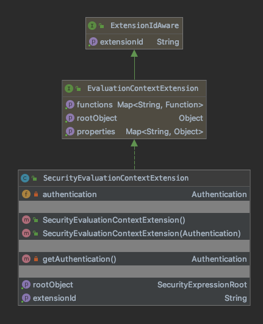

# data
## 3-1、模块关系

> 包 | 描述
> --- | ---
> repository.query.SecurityEvaluationContextExtension | 通过将此对象定义为 Bean，Spring Security 被公开为用于创建 Spring Data 查询的 SpEL 表达式。

## 3-2、repository
### 3-2-1、repository.query



#### 3-2-1-1、SecurityEvaluationContextExtension
    implements org.springframework.data.spel.spi.EvaluationContextExtension
    
    通过将此对象定义为 Bean，Spring Security 被公开为用于创建 Spring Data 查询的 SpEL 表达式。
    
    使用基于 Java 的配置，我们可以使用以下内容定义 bean：
    
    例如，如果您返回扩展以下 User 对象的 UserDetails：

```java
 @Entity
 public class User {
     @GeneratedValue(strategy = GenerationType.AUTO)
     @Id
     private Long id;

     ...
 }
```
     
    您有一个 Message 对象，如下所示：
    
```java
 @Entity
 public class Message {
     @Id
     @GeneratedValue(strategy = GenerationType.AUTO)
     private Long id;

     @OneToOne
     private User to;

     ...
 }
```
     
    您可以使用以下 Query 注释仅搜索发送给当前用户的消息：
```java
 @Repository
 public interface SecurityMessageRepository extends MessageRepository {

        @Query("select m from Message m where m.to.id = ?#{ principal?.id }")
        List<Message> findAll();
 }
```
     
    这是有效的，因为这个实例中的主体是一个用户，它有一个 id 字段。

    域：
> 修饰符和类型 | 类和描述
> ---------- | -------
> private org.springframework.security.core.Authentication |	authentication 

##### SecurityEvaluationContextExtension() 
    创建一个新实例，该实例使用在 SecurityContextHolder 上找到的当前身份验证。

    方法：
> 修饰符和类型 | 方法和描述
> ---------- | -------
> private org.springframework.security.core.Authentication |	getAuthentication() 
  java.lang.String |	getExtensionId() 
  org.springframework.security.access.expression.SecurityExpressionRoot |	getRootObject() 
