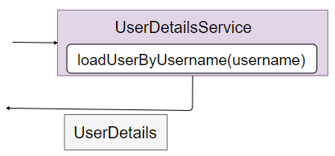

[原文链接](https://medium.com/geekculture/spring-security-authentication-process-authentication-flow-behind-the-scenes-d56da63f04fa)

在每个应用程序中，身份验证是第一层保护。 因此，身份验证是应用程序安全的主要部分，在这篇文章中，我们将深入探讨 Spring Security 用于身份验
证的架构。

> 什么是认证？ 身份验证正在证明您是谁。 例如，您的身份证用于在您的学校/学院/办公室校园内“验证”您。

默认情况下，Spring Security 为身份验证提供了出色的支持。 有点像即插即用的方式。 一个简单的身份验证工作流程非常容易设置。 但是，如果您想
要一个完整的自定义实现，那么您需要了解身份验证流程并理解服务器收到身份验证请求时幕后发生的事情。

## 幕后：理论
### 组件
#### 1.Authentication Filter

它是 FilterChain 中的一个过滤器，用于检测身份验证尝试并将其转发给 AuthenticationManager。

#### 2.Authentication

此组件指定要进行的身份验证类型。 它是一个接口。 它的实现指定了身份验证的类型。 例如，UsernamePasswordAuthenticationToken 是 
Authentication 接口的实现，它指定用户想要使用用户名和密码进行身份验证。 其他示例包括 OpenIDAuthenticationToken 、 
RememberMeAuthenticationToken 。

#### 3.Authentication Manager

该组件的主要工作是将 authenticate() 调用委托给正确的 AuthenticationProvider。 一个应用程序可以有多个 AuthenticationProvider ，其
中很少有 DaoAuthenticationProvider、LdapAuthenticationProvider、OpenIDAuthenticationProvider 等）。 身份验证管理器通过在每个可
用的 AuthenticationProvider 上调用 supports() 方法来决定将调用委托给哪个身份验证提供程序。 如果 support() 方法返回 true，则 
AuthenticationProvider 支持 Authentication 类型并用于执行身份验证。

在此图中，我们可以看到三个身份验证提供程序。 在这三个中，身份验证提供程序 2 支持传入身份验证的类型，因为它的 supports() 方法返回 true。 
然后执行身份验证，并在成功时返回相同类型的身份验证对象，其中身份验证属性设置为 true 以及一些其他相关属性。

#### 4.Authentication Provider

它是一个接口，其实现处理某种类型的身份验证。 AuthenticaionProvider 有一个身份验证方法，该方法接受身份验证类型并对其执行身份验证。 身份验
证成功时，AuthenticationProvider 返回一个相同类型的 Authentication 对象，该对象作为输入，其身份验证属性设置为 true。 如果身份验证失
败，则会引发身份验证异常。 下图显示了一个通用的 AuthenticationProvider ：

在大多数应用程序中，我们执行用户名和密码身份验证，因此，在执行身份验证之前，我们必须在 UserService 的帮助下从“数据源”（例如数据库）中获取
用户详细信息（用户名/电子邮件、密码、角色等） ，然后根据实际数据验证提供的数据。 下图演示了一个DaoAuthenticationProvider的流程（这是
AuthenticationProvider接口的一个实现，主要处理用户名密码认证）：

#### 5.UserDetailService

这是一项负责从“数据源”中获取用户详细信息的服务，最有可能是使用 loadUserByUsername(String username) 方法的数据库，该方法将用户名作为参
数。 然后它返回一个 UserDetails 对象，其中填充了从数据源（数据库）获取的用户数据。 UserDetails 对象的三个主要字段是用户名、密码和角色/权
限。

### 大的方面

是时候把所有东西放在一起了。 我们将借助图表查看用户名和密码身份验证的整个流程。 这是一个相当大的图表，所以我将把它分成两部分，我们将根据我
们刚刚了解的组件将整个过程分解为详细的步骤——

.png)

> * 第 1 步：当服务器收到一个认证请求，比如登录请求时，首先被Filter Chain中的Authentication Filter拦截。
> * 第 2 步：使用用户提供的用户名和密码创建 UsernamePasswordAuthenticationToken。 如上所述，UsernamePasswordAuthenticationToken 
>是 Authentication 接口的实现，当用户想要使用用户名和密码进行身份验证时使用。 有点自我解释，不是吗？
> * 第 3 步：将 UsernamePasswordAuthenticationToken 传递给 AuthenticationManager 以便可以对令牌进行身份验证。

.png)

> * 第 4 步：AuthenticationManager 将身份验证委托给适当的 AuthenticationProvider。如前所述，这是通过调用 AuthenticationProvider 
>上的 supports() 方法来完成的。
> * 第 5 步：AuthenticationProvider调用UserDetailsS​​ervice的loadUserByUsername(username)方法，取回包含用户所有数据的UserDetails
>对象。最重要的数据是密码，因为它将用于检查提供的密码是否正确。如果没有找到具有给定用户名的用户，则抛出 UsernameNotFoundException。
> * 第 6 步：AuthenticationProvider 在收到 UserDetails 后检查密码并验证用户。最后！！！ .如果密码不匹配，则抛出 
>AuthenticationException。但是，如果身份验证成功，则会创建一个 UsernamePasswordAuthenticationToken，并且将 principal、
>credentials 和authenticated 字段设置为适当的值。这里的 principal 是指您的用户名或 UserDetails ，凭据是指密码，并且经过身份验证的字
>段设置为 true。此令牌返回给 AuthenticationManager。
> * 第 7 步：成功验证后，SecurityContext 将更新为当前已验证用户的详细信息。 SecurityContext 可用于应用程序的多个部分，以检查当前是否
>有任何用户通过了身份验证，如果是，则用户的详细信息是什么。
    
这就是整个过程！！！！

所以我们对理论方面进行了非常详细的研究。现在让我们做一些动手练习，看看我们在行动中学到了什么。

### 幕后花絮：实用

[Spring-Security-Authentication-Flow](https://github.com/senshiii/Spring-Security-Authentication-Flow)
