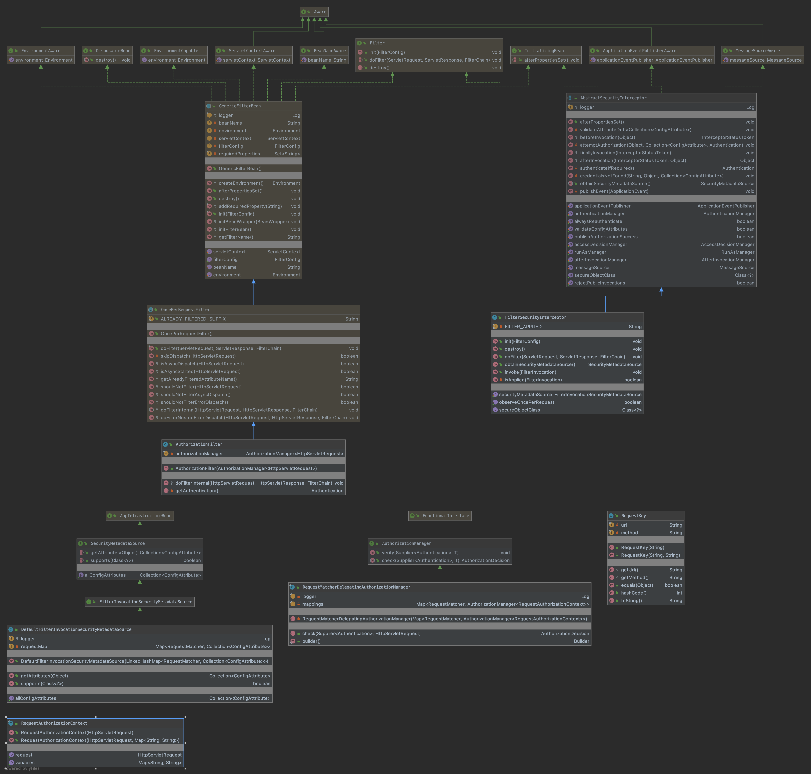

# web
## 3-1、模块信息
> 包 | 描述
> --- | ---
> [web](#3-2-1web) | Spring Security 的网络安全模块。
> [web.access](#3-3-1webaccess) | 访问控制相关的类和包。
> [web.access.channel](#3-3-2webaccesschannel) | 确保通过所需的传输通道接收 Web 请求的类。
> [web.access.expression](#3-3-3webaccessexpression) | 网络安全表达式的实现。
> [web.access.intercept](#3-3-4webaccessintercept) | 强制执行 HTTP 请求的安全性，通常通过请求的 URL。
> [web.authentication](#3-4-1webauthentication) | 身份验证处理机制，使用各种协议（例如 BASIC、CAS、表单登录等）响应身份验证凭据的提交。
> [web.authentication.logout](#3-4-2webauthenticationlogout) | 基于处理特定注销 URL 的过滤器的注销功能。
> [web.authentication.preauth](#3-4-3webauthenticationpreauth) | 支持“预认证”场景，其中 Spring Security 假设传入的请求已经由一些外部配置的系统进行了身份验证。
> [web.authentication.preauth.j2ee](#3-4-4webauthenticationpreauthj2ee) | 对容器身份验证请求的预身份验证支持。
> [web.authentication.preauth.websphere](#3-4-5webauthenticationpreauthwebsphere) | 特定于 Websphere 的预认证类。
> [web.authentication.preauth.x509](#3-4-6webauthenticationpreauthx509) | X.509 客户端证书认证支持。
> [web.authentication.rememberme](#3-4-7webauthenticationrememberme) | 支持在不同的网络会话之间记住用户。
> [web.authentication.session](#3-4-8webauthenticationsession) | 用于处理新认证用户的会话相关行为的策略接口和实现。
> [web.authentication.switchuser](#3-4-9webauthenticationswitchuser) | 提供基于 HTTP 的“切换用户”(su) 功能。
> [web.authentication.ui](#3-4-10webauthenticationui) | 身份验证用户界面呈现代码。
> [web.authentication.www](#3-4-11webauthenticationwww) | 基于 WWW-Authenticate 的认证机制实现：Basic 和 Digest 认证。
> [web.bind.annotation](#3-5-1webbindannotation) |
> [web.bind.support](#3-5-2webbindsupport) |
> [web.context](#3-6-1webcontext) | 负责维护 HTTP 请求之间的安全上下文的类。
> [web.context.request.async](#3-6-2webcontextrequestasync) |
> [web.context.support](#3-6-3webcontextsupport) |
> [web.csrf](#3-7-1webcsrf) |
> [web.debug](#3-7-2webdebug) |
> [web.firewall](#3-7-3webfirewall) |
> [web.header](#3-7-4webheader) |
> [web.header.writers](#3-7-5webheaderwriters) |
> [web.header.writers.frameoptions](#3-7-6webheaderwritersframeoptions) |
> [web.http](#3-7-7webhttp) |
> [web.jaasapi](#3-7-8webjaasapi) | 使 JAAS 主题可用作当前主题。
> [web.jackson2](#3-7-9webjackson2) | 混合类以提供 Jackson2 序列化支持。
> [web.method.annotation](#3-7-10webmethodannotation) |
> [web.reactive.result.method.annotation](#3-7-11webreactiveresultmethodannotation) |
> [web.reactive.result.view](#3-7-12webreactiveresultview) |
> [web.savedrequest](#3-7-13websavedrequest) | 与需要身份验证的 HttpServletRequest 缓存相关的类。
> [web.server](#3-8-1webserver) |
> [web.server.authentication](#3-8-2webserverauthentication) |
> [web.server.authentication.logout](#3-8-3webserverauthenticationlogout) |
> [web.server.authorization](#3-8-4webserverauthorization) |
> [web.server.context](#3-8-5webservercontext) |
> [web.server.csrf](#3-8-4webserverauthorization) |
> [web.server.header](#3-8-7webserverheader) |
> [web.server.jackson2](#3-8-8webserverjackson2) |
> [web.server.savedrequest](#3-8-9webserversavedrequest) |
> [web.server.transport](#3-8-10webservertransport) |
> [web.server.ui](#3-8-11webserverui) |
> [web.server.util.matcher](#3-8-12webserverutilmatcher) |
> [web.servlet.support.csrf](#3-9-1webservletsupportcsrf) |
> [web.servlet.util.matcher](#3-9-2webservletutilmatcher) |
> [web.servletapi](#3-9-3webservletapi) | 使用新的符合 Spring Security 的 HttpServletRequestWrapper 填充 Servlet 请求。
> [web.session](#3-9-4websession) | 会话管理过滤器、HttpSession 事件和发布者类。
> [web.util](#3-9-5webutil) | Web 实用程序类。
> [web.util.matcher](#3-9-6webutilmatcher) |

## 3-2、web
### 3-2-1、web
    Spring Security 的网络安全模块。 可以在此处找到依赖于 Servlet API 的类。
    


#### 3-2-1-1、FilterChainProxy
    extends org.springframework.web.filter.GenericFilterBean
    
    将过滤器请求委托给 Spring 管理的过滤器 bean 列表。从版本 2.0 开始，除非您需要对过滤器链内容进行非常精细的控制，否则您不需要在应用程
    序上下文中显式配置 FilterChainProxy bean。大多数情况应该被默认的 <security:http /> 命名空间配置选项充分覆盖。
    通过在应用程序 web.xml 文件中添加标准 Spring DelegatingFilterProxy 声明，FilterChainProxy 链接到 servlet 容器过滤器链。
    
    配置
    从 3.1 版开始，FilterChainProxy 使用一个 SecurityFilterChain 实例列表进行配置，每个实例包含一个 RequestMatcher 和一个应应用于
    匹配请求的过滤器列表。大多数应用程序将只包含一个过滤器链，如果您使用命名空间，则不必显式设置这些链。如果您需要更细粒度的控制，您可以使
    用 <filter-chain> 命名空间元素。这定义了一个 URI 模式和过滤器列表（以逗号分隔的 bean 名称），它们应该应用于匹配该模式的请求。示例
    配置可能如下所示：
    
```xml
  <bean id="myfilterChainProxy" class="org.springframework.security.web.FilterChainProxy">
      <constructor-arg>
          <util:list>
              <security:filter-chain pattern="/do/not/filter*" filters="none"/>
              <security:filter-chain pattern="/**" filters="filter1,filter2,filter3"/>
          </util:list>
      </constructor-arg>
  </bean>
```
     
    名称“filter1”、“filter2”、“filter3”应该是应用程序上下文中定义的 Filter 实例的 bean 名称。名称的顺序定义了过滤器的应用顺序。如上
    所示，“过滤器”的值“无”可用于从安全过滤器链中完全排除请求模式。请查阅安全命名空间架构文件以获取可用配置选项的完整列表。
    请求处理
    必须输入 FilterChainProxy 应该服务的每个可能的模式。给定请求的第一个匹配项将用于定义适用于该请求的所有过滤器。这意味着您必须将最具
    体的匹配项放在列表顶部，并确保针对相应条目输入应应用于给定匹配器的所有过滤器。 FilterChainProxy 不会遍历地图条目的其余部分来定位其他
    过滤器。
    
    FilterChainProxy 尊重选择不调用 Filter.doFilter(javax.servlet.ServletRequest, javax.servlet.ServletResponse, 
    javax.servlet.FilterChain) 的过滤器的正常处理，因为原始或 FilterChainProxy 声明的过滤器链的其余部分将不会被调用叫。
    
    请求防火墙
    HttpFirewall 实例用于验证传入请求并创建包装请求，该请求提供一致的路径值以进行匹配。请参阅 StrictHttpFirewall，了解有关默认实现可
    防御的攻击类型的更多信息。可以注入自定义实现以对请求内容提供更严格的控制，或者如果应用程序需要支持某些默认拒绝的请求类型。
    请注意，这意味着如果您想要这种保护，您必须将 Spring Security 过滤器与 FilterChainProxy 结合使用。不要在 web.xml 文件中明确定义它们。
    
    FilterChainProxy 将使用防火墙实例获取请求和响应对象，这些对象将向下馈送到过滤器链，因此也可以使用此功能来控制响应的功能。当请求通过安
    全过滤器链时，将调用重置方法。对于默认实现，这意味着之后将返回 servletPath 和 pathInfo 的原始值，而不是用于安全模式匹配的修改后的值。
    
    由于此附加包装功能由 FilterChainProxy 执行，因此我们不建议您在同一过滤器链中使用多个实例。不应将其纯粹视为将过滤器 bean 包装在单个 
    Filter 实例中的实用程序。
    
    过滤器生命周期
    请注意 servlet 容器和 IoC 容器之间的过滤器生命周期不匹配。如 DelegatingFilterProxy Javadocs 中所述，我们建议您允许 IoC 容器而不
    是 servlet 容器来管理生命周期。 FilterChainProxy 不会在您添加到应用程序上下文的任何过滤器 bean 上调用标准过滤器生命周期方法。
    
    域：
> 修饰符和类型 | 类和描述
> ---------- | -------
> private static java.lang.String |	FILTER_APPLIED 
> private java.util.List<SecurityFilterChain> |	filterChains 
> private FilterChainProxy.FilterChainValidator |	filterChainValidator 
> private HttpFirewall |	firewall 
> private static org.apache.commons.logging.Log |	logger 
> private RequestRejectedHandler |	requestRejectedHandler 

##### afterPropertiesSet() void
##### doFilter(ServletRequest request, ServletResponse response, FilterChain chain) void
> * 抛出:
>   * java.io.IOException
>   * javax.servlet.ServletException
##### doFilterInternal(ServletRequest request, ServletResponse response, FilterChain chain) void
> * 抛出:
>   * java.io.IOException
>   * javax.servlet.ServletException
##### getFilters(javax.servlet.http.HttpServletRequest request) List<javax.servlet.Filter>
    返回与提供的 URL 匹配的第一个过滤器链。
> * 参数：
>   * request - 匹配的请求
> * 返回：
>   * 定义过滤器链的有序过滤器数组
##### getFilters(java.lang.String url) List<javax.servlet.Filter>
    方便的方法，主要用于测试。
> * 参数：
>   * url - 网址
> * 返回：
>   * 匹配过滤器列表
##### getFilterChains() List<SecurityFilterChain>
> * 返回：
>   * 将匹配并应用于传入请求的 SecurityFilterChains 列表。
##### setFilterChainValidator(FilterChainProxy.FilterChainValidator filterChainValidator) void
##### setFirewall(HttpFirewall firewall) void
##### setRequestRejectedHandler(RequestRejectedHandler requestRejectedHandler) void
##### requestLine(javax.servlet.http.HttpServletRequest request) String

    嵌套类：
##### FilterChainProxy.FilterChainValidator 
    validate(FilterChainProxy filterChainProxy) 
##### FilterChainProxy.NullFilterChainValidator 
    implements FilterChainProxy.FilterChainValidator

##### FilterChainProxy.VirtualFilterChain
    implements javax.servlet.FilterChain
    内部 FilterChain 实现，用于通过匹配请求的附加内部过滤器列表传递请求。
    
    域：
> 修饰符和类型 | 类和描述
> ---------- | -------
> private java.util.List<javax.servlet.Filter> |	additionalFilters 
> private int |	currentPosition 
> private FirewalledRequest |	firewalledRequest 
> private javax.servlet.FilterChain |	originalChain 
> private int |	size 
#### 3-2-1-2、RequestMatcherRedirectFilter
    extends org.springframework.web.filter.OncePerRequestFilter

    将与 RequestMatcher 匹配的请求重定向到指定 URL 的过滤器。
    
    域：
> 修饰符和类型 | 类和描述
> ---------- | -------
> private RedirectStrategy |	redirectStrategy 
> private java.lang.String |	redirectUrl 
> private RequestMatcher |	requestMatcher 
#### 3-2-1-3、SecurityFilterChain
    定义能够与 HttpServletRequest 匹配的过滤器链。 以决定它是否适用于该请求。
    用于配置 FilterChainProxy。
    
    方法：
    getFilters() List<javax.servlet.Filter>
    matches(javax.servlet.http.HttpServletRequest request) boolean
    
#### 3-2-1-4、DefaultSecurityFilterChain
    implements SecurityFilterChain
    
    SecurityFilterChain的标准实现
    
    域：
> 修饰符和类型 | 类和描述
> ---------- | -------
> private java.util.List<javax.servlet.Filter> |	filters 
> private static org.apache.commons.logging.Log |	logger 
> private RequestMatcher |	requestMatcher 
#### 3-2-1-5、FilterInvocation
    保存与 HTTP 过滤器关联的对象。
    保证请求和响应是 HttpServletRequest 和 HttpServletResponse 的实例，并且没有空对象。
    
    必需，以便安全系统类可以获得对过滤器环境以及请求和响应的访问权。
    
    域：
> 修饰符和类型 | 类和描述
> ---------- | -------
> private javax.servlet.FilterChain	chain 
> (package private) static javax.servlet.FilterChain	DUMMY_CHAIN 
> private javax.servlet.http.HttpServletRequest	request 
> private javax.servlet.http.HttpServletResponse	response 

##### getChain() FilterChain
##### getFullRequestUrl() String
    指示用户代理用于此请求的 URL。
    返回的 URL 不反映从 PortResolver 确定的端口号。

> * 返回：
>   * 此请求的完整 URL
##### getHttpRequest() HttpServletRequest
##### getHttpResponse() HttpServletResponse
##### getRequest() HttpServletRequest
##### getRequestUrl() String
    获取 URL 的特定于 Web 应用程序的片段。
> * 返回：
>   * URL，不包括任何服务器名称、上下文路径或 servlet 路径
##### getResponse() HttpServletResponse

#### 3-2-1-6、PortMapper
    PortMapper 实现为调用者提供有关哪些 HTTP 端口与系统上的哪些 HTTPS 端口相关联的信息，反之亦然。
    
##### lookupHttpPort(java.lang.Integer httpsPort) Integer
    定位与指定 HTTPS 端口关联的 HTTP 端口。
    如果未知，则返回 null。
    
> * 参数：
>   * https端口 -
> * 返回：
>   * HTTP 端口或 null 如果未知
##### lookupHttpsPort(java.lang.Integer httpPort) Integer
    定位与指定 HTTP 端口关联的 HTTPS 端口。
    如果未知，则返回 null。

> * 参数：
>   * http端口 -
> * 返回：
>   * HTTPS 端口或 null 如果未知
#### 3-2-1-7、PortMapperImpl
    implements PortMapper
    
    从应用程序上下文中获取 HTTP:HTTPS 对的 PortMapper 的具体实现。
    默认情况下，实现将假定 80:443 和 8080:8443 分别是 HTTP:HTTPS 对。 如果需要不同的对，请使用 setPortMappings(Map)。
    
    域：
> 修饰符和类型 | 类和描述
> ---------- | -------
> Map<java.lang.Integer,java.lang.Integer> |	httpsPortMappings 
#### 3-2-1-8、RedirectStrategy
    封装框架中所有执行重定向的类的重定向逻辑。
    
##### sendRedirect(HttpServletRequest request, HttpServletResponse response, String url) void
    执行到提供的 URL 的重定向
> * 参数：
>   * request - 当前请求
>   * response - 重定向的响应
>   * url - 要重定向到的目标 URL，例如“/login”
> * 抛出：
>   * java.io.IO异常
#### 3-2-1-9、DefaultRedirectStrategy
    implements RedirectStrategy

    RedirectStrategy 的简单实现，它是整个框架默认使用的。
    
    域：
> 修饰符和类型 | 类和描述
> ---------- | -------
> private boolean |	contextRelative 
> protected org.apache.commons.logging.Log |	logger 

##### sendRedirect(HttpServletRequest request, HttpServletResponse response, String url) void
    如果设置了 contextRelative，则重定向值将是请求上下文路径之后的值。 请注意，这将导致协议信息（HTTP 或 HTTPS）丢失，例如，如果正在执
    行重定向以更改为 HTTPS，则会导致问题。

> * 指定者：
>   * 接口 RedirectStrategy 中的 sendRedirect
> * 参数：
>   * request - 当前请求
>   * response - 重定向的响应
>   * url - 要重定向到的目标 URL，例如“/login”
> * 抛出：
>   * java.io.IOException
#### 3-2-1-10、WebAttributes
    众所周知的键，用于在请求或会话范围内存储 Spring Security 信息。
    
    域：
> 修饰符和类型 | 类 | 描述
> ---------- | ------- | ------
> static java.lang.String |	ACCESS_DENIED_403 | 用于在渲染请求中缓存 AccessDeniedException。
> static java.lang.String |	AUTHENTICATION_EXCEPTION | 用于缓存会话中的身份验证失败异常。
> static java.lang.String |	WEB_INVOCATION_PRIVILEGE_EVALUATOR_ATTRIBUTE | 设置为请求属性以覆盖默认的 WebInvocationPrivilegeEvaluator

#### 3-2-1-11、AuthenticationEntryPoint
    由 ExceptionTranslationFilter 使用以启动身份验证方案。
    
##### commence(HttpServletRequest request, HttpServletResponse response, AuthenticationException authException) void
    启动身份验证方案。
    ExceptionTranslationFilter 将在调用此方法之前使用请求的目标 URL 填充名为 
    AbstractAuthenticationProcessingFilter.SPRING_SECURITY_SAVED_REQUEST_KEY 的 HttpSession 属性。
    
    实现应根据需要修改 ServletResponse 上的标头以开始身份验证过程。
    
> * 参数：
>   * request - 导致 AuthenticationException
>   * 响应 - 以便用户代理可以开始身份验证
>   * authException - 导致调用
> * 抛出：
>   * java.io.IO异常
>   * javax.servlet.ServletException
#### 3-2-1-12、PortResolver
    PortResolver 确定接收 Web 请求的端口。
    此接口是必需的，因为 ServletRequest.getServerPort() 在某些情况下可能不会返回正确的端口。 例如，如果浏览器在重定向后没有正确构建 URL。

##### getServerPort(javax.servlet.ServletRequest request) int
    指示接收 ServletRequest 的端口。
> * 参数：
>   * request - 该方法应该查找端口
> * 返回：
>   * 收到请求的端口

#### 3-2-1-13、PortResolverImpl
    implements PortResolver
    
    从 ServletRequest.getServerPort() 获取端口的 PortResolver 的具体实现。
    此类能够处理 IE 错误，该错误会导致在重定向到不同方案和端口（其中端口不是众所周知的数字（即 80 或 443））之后在标头中显示错误的 URL。 
    处理包括检测来自 ServletRequest.getServerPort() 的不正确响应（例如 8443 上的 HTTP 请求），然后确定真正的服务器端口（例如 HTTP 
    请求实际上是 8080 上）。 有效端口的映射是从配置的 PortMapper 中获取的。
    
    域：
> 修饰符和类型 | 类和描述
> ---------- | -------
> private PortMapper |	portMapper 

## 3-3、web.access
### 3-3-1、web.access
    访问控制相关的类和包。


#### 3-3-1-1、AccessDeniedHandler
    由 ExceptionTranslationFilter 用于处理 AccessDeniedException。
    
##### handle(HttpServletRequest request, HttpServletResponse response, AccessDeniedException accessDeniedException) void
    处理访问被拒绝失败。
> * 参数：
>   * request - 导致 AccessDeniedException
>   * response - 以便用户代理可以被告知失败
>   * accessDeniedException - 导致调用
> * 抛出：
>   * java.io.IOException - 发生 IOException 时
>   * javax.servlet.ServletException - 发生 ServletException 时

#### 3-3-1-2、AccessDeniedHandlerImpl
    implements AccessDeniedHandler
    
    AccessDeniedHandler 的基本实现。
    此实现发送 403 (SC_FORBIDDEN) HTTP 错误代码。 此外，如果定义了 errorPage，则实现将执行请求调度程序“转发”到指定的错误页面视图。 作
    为“转发”，SecurityContextHolder 将保持填充状态。 如果视图（或标记库或宏）希望访问 SecurityContextHolder，这将非常有用。 请求范
    围也将填充异常本身，可从键 WebAttributes.ACCESS_DENIED_403 获得。
    
    域：
> 修饰符和类型 | 类和描述
> ---------- | -------
> private java.lang.String |	errorPage 
> protected static org.apache.commons.logging.Log |	logger 

##### setErrorPage(java.lang.String errorPage) void
    要使用的错误页面。 必须以“/”开头，并相对于当前上下文根进行解释。
> * 参数：
>   * errorPage - 要显示的调度程序路径
> * 抛出：
>   * java.lang.IllegalArgumentException - 如果参数不符合上述限制
#### 3-3-1-3、DelegatingAccessDeniedHandler
    implements AccessDeniedHandler

    一个 AccessDeniedHandler，它根据传入 handle(HttpServletRequest, HttpServletResponse, AccessDeniedException) 的 
    AccessDeniedException 类型委托给其他 AccessDeniedHandler 实例。
    
    域：
> 修饰符和类型 | 类和描述
> ---------- | -------
> private AccessDeniedHandler |	defaultHandler 
> private LinkedHashMap<Class<? extends AccessDeniedException>,AccessDeniedHandler> |	handlers 
#### 3-3-1-4、RequestMatcherDelegatingAccessDeniedHandler
    implements AccessDeniedHandler

    一个 AccessDeniedHandler，它根据传入 handle(HttpServletRequest, HttpServletResponse, AccessDeniedException) 的 
    HttpServletRequest 类型委托给其他 AccessDeniedHandler 实例。
    
    域：
> 修饰符和类型 | 类和描述
> ---------- | -------
> private AccessDeniedHandler |	defaultHandler 
> private LinkedHashMap<RequestMatcher,AccessDeniedHandler> |	handlers 
#### 3-3-1-5、WebInvocationPrivilegeEvaluator
    允许用户确定他们是否拥有给定 Web URI 的权限。
    
##### isAllowed(String uri, Authentication authentication) boolean
    确定是否允许由提供的 Authentication 对象表示的用户调用提供的 URI。
> * 参数：
>   * uri - 不包括上下文路径的 URI（将使用默认的上下文路径设置）
##### isAllowed(String contextPath,String uri,String method,Authentication authentication) boolean
    确定是否允许由提供的 Authentication 对象表示的用户使用给定的 调用提供的 URI。
    请注意，FilterInvocationSecurityMetadataSource 的默认实现在评估哪个安全对象元数据适用于给定请求 URI 时会忽略 contextPath，因
    此通常除非您使用自定义 FilterInvocationSecurityMetadataSource，否则 contextPath 并不重要。

> * 参数：
>   * uri - 不包括上下文路径的 URI
>   * contextPath - 上下文路径（可能为空）。
>   * method - HTTP 方法（或 null，对于任何方法）
>   * 身份验证 - 身份验证实例，其权限应用于评估是否应授予访问权限。
> * 返回：
>   * 如果允许访问则为真，如果拒绝则为假
#### 3-3-1-6、DefaultWebInvocationPrivilegeEvaluator
    implements WebInvocationPrivilegeEvaluator
    
    允许用户确定他们是否拥有给定 Web URI 的权限。
    
    域：
> 修饰符和类型 | 类和描述
> ---------- | -------
> protected static org.apache.commons.logging.Log |	logger 
> private org.springframework.security.access.intercept.AbstractSecurityInterceptor |	securityInterceptor 
#### 3-3-1-7、ExceptionTranslationFilter
    extends org.springframework.web.filter.GenericFilterBean
    implements org.springframework.context.MessageSourceAware

    处理过滤器链中抛出的任何 AccessDeniedException 和 AuthenticationException。
    这个过滤器是必要的，因为它提供了 Java 异常和 HTTP 响应之间的桥梁。它只关心维护用户界面。此过滤器不执行任何实际的安全实施。
    
    如果检测到 AuthenticationException，过滤器将启动 authenticationEntryPoint。这允许对源自 AbstractSecurityInterceptor 的任
    何子类的身份验证失败进行通用处理。
    
    如果检测到 AccessDeniedException，过滤器将确定用户是否为匿名用户。如果他们是匿名用户，则将启动 authenticationEntryPoint。如果
    他们不是匿名用户，过滤器将委托给 AccessDeniedHandler。默认情况下，过滤器将使用 AccessDeniedHandlerImpl。
    
    要使用此过滤器，必须指定以下属性：
    
        1、authenticationEntryPoint 指示在检测到 AuthenticationException 时应开始身份验证过程的处理程序。请注意，这也可能将当前协
        议从 http 切换到 https 以进行 SSL 登录。
        2、requestCache 确定用于在身份验证过程中保存请求的策略，以便在用户通过身份验证后可以检索和重用该请求。默认实现是 
        HttpSessionRequestCache。

    域：
> 修饰符和类型 | 类和描述
> ---------- | -------
> private AccessDeniedHandler |	accessDeniedHandler 
> private AuthenticationEntryPoint |	authenticationEntryPoint 
> private org.springframework.security.authentication.AuthenticationTrustResolver |	authenticationTrustResolver 
> protected org.springframework.context.support.MessageSourceAccessor |	messages 
> private RequestCache |	requestCache 
> private ThrowableAnalyzer |	throwableAnalyzer 
#### 3-3-1-8、ExceptionTranslationFilter.DefaultThrowableAnalyzer
    extends ThrowableAnalyzer
    
    ThrowableAnalyzer 的默认实现，它也能够解包 ServletExceptions。
    
##### initExtractorMap() void
    初始化 Throwables 和 ThrowableCauseExtractors 之间的关联。 默认实现执行以下注册：
    ThrowableAnalyzer.DEFAULT_EXTRACTOR 用于 Throwable
    用于 InvocationTargetException 的 ThrowableAnalyzer.INVOCATIONTARGET_EXTRACTOR
    
    鼓励覆盖此方法的子类调用 super 方法来执行默认注册。 他们可以根据需要注册额外的提取器。
    注意：为特定类型注册的提取器适用于该类型及其所有子类型。 但是，保证首先解析注册到更特定类型的提取器。 因此，在默认情况下，
    InvocationTargetExceptions 将由 ThrowableAnalyzer.INVOCATIONTARGET_EXTRACTOR 处理，而所有其他 throwable 由 
    ThrowableAnalyzer.DEFAULT_EXTRACTOR 处理。
    
> * 覆盖：
>   * ThrowableAnalyzer 类中的 initExtractorMap
> * 也可以看看：
>   * ThrowableAnalyzer.initExtractorMap()
### 3-3-2、web.access.channel
    确保通过所需的传输通道接收 Web 请求的类。
    最常用于强制通过 HTTP 或 HTTPS 提交请求。
    

#### 3-3-2-1、ChannelDecisionManager
    决定网络通道是否提供足够的安全性。
    
##### decide(FilterInvocation invocation, Collection<ConfigAttribute> config)
    根据所请求的 ConfigAttributes 列表确定所呈现的 FilterInvocation 是否提供适当级别的通道安全性。
> * 抛出：
>   * java.io.IOException
>   * javax.servlet.ServletException
##### supports(ConfigAttribute attribute) boolean
    指示此 ChannelDecisionManager 是否能够处理传递的 ConfigAttribute。
    这允许 ChannelProcessingFilter 检查配置的 ChannelDecisionManager 可以使用的每个配置属性。
> * 参数：
>   * attribute - 针对 ChannelProcessingFilter 配置的配置属性
> * 返回：
>   * 如果此 ChannelDecisionManager 可以支持传递的配置属性，则为 true

#### 3-3-2-2、ChannelProcessor
    决定网络通道是否满足特定的安全条件。
    ChannelProcessor 实现由 ChannelDecisionManagerImpl 迭代。
    
    如果实现有通道安全问题，他们应该自己采取行动。 实现的调用者不采取任何行动。

##### decide(FilterInvocation invocation, Collection<ConfigAttribute> config)
    根据所请求的 ConfigAttributes 列表确定所呈现的 FilterInvocation 是否提供适当级别的通道安全性。
> * 抛出：
>   * java.io.IOException
>   * javax.servlet.ServletException
##### supports(ConfigAttribute attribute) boolean
    指示此 ChannelProcessor 是否能够处理传递的 ConfigAttribute。
    这允许 ChannelProcessingFilter 检查配置的 ChannelDecisionManager 可以使用的每个配置属性。
> * 参数：
>   * attribute - 针对 ChannelProcessingFilter 配置的配置属性
> * 返回：
>   * 如果此 ChannelDecisionManager 可以支持传递的配置属性，则为 true

#### 3-3-2-3、ChannelDecisionManagerImpl
    implements ChannelDecisionManager, org.springframework.beans.factory.InitializingBean
    
    ChannelDecisionManager 的实现。
    遍历每个配置的 ChannelProcessor。 如果 ChannelProcessor 对请求的安全性有任何问题，它应该导致重定向、异常或任何其他适合 
    ChannelProcessor 实现的操作。
    
    一旦提交了任何响应（即重定向被写入响应对象），ChannelDecisionManagerImpl 将不会迭代任何进一步的 ChannelProcessor。
    
    如果将属性“ANY_CHANNEL”应用于特定 URL，则将跳过通道处理器的迭代（参见 SEC-494、SEC-335）。
    
    域：
> 修饰符和类型 | 类和描述
> ---------- | -------
> static java.lang.String |	ANY_CHANNEL 
> private java.util.List<ChannelProcessor> |	channelProcessors 
#### 3-3-2-4、InsecureChannelProcessor
    implements org.springframework.beans.factory.InitializingBean, ChannelProcessor
    
    通过审查 HttpServletRequest.isSecure() 响应确保通道安全处于非活动状态。
    该类响应一个区分大小写的关键字，getInsecureKeyword()。 如果检测到此关键字，则使用 HttpServletRequest.isSecure() 来确定提供的通
    道安全性。 如果存在通道安全，则调用配置的 ChannelEntryPoint。 默认情况下，入口点是 RetryWithHttpEntryPoint。
    
    默认的 insecureKeyword 是 REQUIRES_INSECURE_CHANNEL。
    
    使用时与 RetryWithHttpEntryPoint 配合
    
    域：
> 修饰符和类型 | 类和描述
> ---------- | -------
> private ChannelEntryPoint |	entryPoint 
> private java.lang.String |	insecureKeyword 
#### 3-3-2-5、SecureChannelProcessor
    implements org.springframework.beans.factory.InitializingBean, ChannelProcessor
    
    通过审查 HttpServletRequest.isSecure() 响应确保通道安全处于活动状态。
    该类响应一个区分大小写的关键字 getSecureKeyword()。 如果检测到此关键字，则使用 HttpServletRequest.isSecure() 来确定提供的通道
    安全性。 如果不存在通道安全性，则调用配置的 ChannelEntryPoint。 默认情况下，入口点是 RetryWithHttpsEntryPoint。
    
    默认的 secureKeyword 是 REQUIRES_SECURE_CHANNEL。
    
    使用时与 RetryWithHttpsEntryPoint 配合
    
    域：
> 修饰符和类型 | 类和描述
> ---------- | -------
> private ChannelEntryPoint |	entryPoint 
> private java.lang.String |	secureKeyword 
#### 3-3-2-6、ChannelProcessingFilter
    extends org.springframework.web.filter.GenericFilterBean
    
    确保通过所需的通道传递 Web 请求。
    在内部使用 FilterInvocation 来表示请求，允许使用 FilterInvocationSecurityMetadataSource 来查找适用的属性。
    
    将实际的通道安全决策和必要的操作委托给配置的 ChannelDecisionManager。如果 ChannelDecisionManager 提交了响应，则过滤器链将不会继
    续。
    
    最常见的用法是确保请求通过 HTTPS 发生，其中 ChannelDecisionManagerImpl 配置有 SecureChannelProcessor 和 
    InsecureChannelProcessor。一个典型的配置是
    
```xml
 <bean id="channelProcessingFilter" class="org.springframework.security.web.access.channel.ChannelProcessingFilter">
   <property name="channelDecisionManager" ref="channelDecisionManager"/>
   <property name="securityMetadataSource">
     <security:filter-security-metadata-source request-matcher="regex">
       <security:intercept-url pattern="\A/secure/.*\Z" access="REQUIRES_SECURE_CHANNEL"/>
       <security:intercept-url pattern="\A/login.jsp.*\Z" access="REQUIRES_SECURE_CHANNEL"/>
       <security:intercept-url pattern="\A/.*\Z" access="ANY_CHANNEL"/>
     </security:filter-security-metadata-source>
   </property>
 </bean>

 <bean id="channelDecisionManager" class="org.springframework.security.web.access.channel.ChannelDecisionManagerImpl">
   <property name="channelProcessors">
     <list>
     <ref bean="secureChannelProcessor"/>
     <ref bean="insecureChannelProcessor"/>
     </list>
   </property>
 </bean>

 <bean id="secureChannelProcessor"
   class="org.springframework.security.web.access.channel.SecureChannelProcessor"/>
 <bean id="insecureChannelProcessor"
   class="org.springframework.security.web.access.channel.InsecureChannelProcessor"/>
```
     
    这将强制通过 HTTPS 进行登录表单和对 /secure 路径的任何访问。

    域：
> 修饰符和类型 | 类和描述
> ---------- | -------
> private ChannelDecisionManager |	channelDecisionManager 
> private FilterInvocationSecurityMetadataSource |	securityMetadataSource 
    
#### 3-3-2-7、ChannelEntryPoint
    可由 ChannelProcessor 使用以启动网络频道。
    ChannelProcessors 可以选择直接启动一个新的网络频道，也可以委托给另一个类。 ChannelEntryPoint 是一个可插入的接口，用于协助 
    ChannelProcessors 执行此委派。
    
##### commence(HttpServletRequest request, HttpServletResponse response) void
    开始安全通道。
    实现应根据需要修改 ServletResponse 上的标头，以使用实现支持的通道类型启动用户代理。
    
> * 参数：
>   * 请求 - ChannelProcessor 已拒绝
>   * 响应 - 以便用户代理可以开始使用新渠道
> * 抛出：
>   * java.io.IOException
>   * javax.servlet.ServletException
#### 3-3-2-8、AbstractRetryEntryPoint
    implements ChannelEntryPoint

    域：
> 修饰符和类型 | 类 | 描述
> ---------- | ------- | ----
> protected org.apache.commons.logging.Log |	logger  |
> private PortMapper |	portMapper  |
> private PortResolver |	portResolver  |
> private RedirectStrategy |	redirectStrategy  |
> private java.lang.String |	scheme | The scheme ("http://" or "https://")
> private int |	standardPort | The standard port for the scheme (80 for http, 443 for https)
#### 3-3-2-9、RetryWithHttpEntryPoint
    extends AbstractRetryEntryPoint
    
    通过使用 HTTP 重试原始请求来启动不安全的通道。
    在大多数情况下，这个入口点应该足够了。 但是，它不是为了正确处理 HTTP POST 或其他使用标准重定向会导致问题的用法。
#### 3-3-2-10、RetryWithHttpsEntryPoint
    extends AbstractRetryEntryPoint
    
    通过使用 HTTPS 重试原始请求来启动安全通道。
    在大多数情况下，这个入口点应该足够了。 但是，它不是为了正确处理 HTTP POST 或其他使用标准重定向会导致问题的用法。
### 3-3-3、web.access.expression
    网络安全表达式的实现。
    

#### 3-3-3-1、EvaluationContextPostProcessor<I>
    允许对 EvaluationContext 进行后处理
    这个 API 是有意保留包范围的，因为它可能会随着时间的推移而发展。
    
##### postProcess(org.springframework.expression.EvaluationContext context, I invocation) EvaluationContext
    允许对 EvaluationContext 进行后处理。 实现可能会返回一个新的 EvaluationContext 实例或修改传入的 EvaluationContext。
> * 参数：
>   * context - 原始的 EvaluationContext
>   * invocation - 安全调用对象（即 FilterInvocation）
> * 返回：
>   * 更新的上下文。

#### 3-3-3-2、AbstractVariableEvaluationContextPostProcessor
    implements EvaluationContextPostProcessor<FilterInvocation>
    
    将 URI 模板变量公开为 EvaluationContext 上的变量。 例如，模式“/user/{username}/**”将根据当前 URI 公开一个名为 username 的变量。
    注意：此 API 有意保留在包范围内，因为将来可能会发生变化。 允许用户增加表达式和查询可能很好
    
    嵌套类：
> 修饰符和类型 | 类 | 描述
> ---------- | ------- | -------
> (package private) class | 	AbstractVariableEvaluationContextPostProcessor.VariableEvaluationContext | DelegatingEvaluationContext 公开变量。
#### 3-3-3-3、WebExpressionConfigAttribute
    implements org.springframework.security.access.ConfigAttribute, EvaluationContextPostProcessor<FilterInvocation>

    用于 Web 请求授权的简单表达式配置属性。
    
    域：
> 修饰符和类型 | 类 | 描述
> ---------- | ------- | ----
> private org.springframework.expression.Expression |	authorizeExpression  |
> private EvaluationContextPostProcessor<FilterInvocation> |	postProcessor  |
#### 3-3-3-4、WebExpressionVoter
    implements org.springframework.security.access.AccessDecisionVoter<FilterInvocation>

    处理网络授权决定的选民。
    
    域：
> 修饰符和类型 | 类 | 描述
> ---------- | ------- | ----
> private org.springframework.security.access.expression.SecurityExpressionHandler<FilterInvocation> |	expressionHandler  |
> private org.apache.commons.logging.Log |	logger  |

##### vote(Authentication authentication, FilterInvocation filterInvocation, .Collection<ConfigAttribute> attributes)
    指示是否授予访问权限。
    决定必须是肯定 (ACCESS_GRANTED)、否定 (ACCESS_DENIED) 或 AccessDecisionVoter 可以弃权 (ACCESS_ABSTAIN) 投票。在任何情况下，实现类都不应返回任何其他值。如果需要对结果进行加权，则应改为在自定义 AccessDecisionManager 中处理。
    
    除非由于传递的方法调用或配置属性参数，AccessDecisionVoter 专门用于对访问控制决策进行投票，否则它必须返回 ACCESS_ABSTAIN。这可以防止协调 AccessDecisionManager 计算那些对访问控制决策没有合法利益的 AccessDecisionVoter 的选票。
    
    虽然安全对象（例如 MethodInvocation）作为参数传递以最大限度地提高访问控制决策的灵活性，但实现类不应修改它或导致所表示的调用发生（例如，通过调用 MethodInvocation.proceed()） .
    
> * 指定者：
>   * 在接口 org.springframework.security.access.AccessDecisionVoter<FilterInvocation> 中投票
> * 参数：
>   * 身份验证 - 进行调用的调用者
>   * filterInvocation - 被调用的安全对象
>   * 属性 - 与受保护对象关联的配置属性
> * 返回：
>   * AccessDecisionVoter.ACCESS_GRANTED、AccessDecisionVoter.ACCESS_ABSTAIN 或 AccessDecisionVoter.ACCESS_DENIED

#### 3-3-3-5、DelegatingEvaluationContext
    implements org.springframework.expression.EvaluationContext

    委托给另一个实现的 EvaluationContext 的实例。
    域：
> 修饰符和类型 | 类 | 描述
> ---------- | ------- | ----
> private org.springframework.expression.EvaluationContext |	delegate |

    方法：
> 修饰符和类型 | 方法 | 描述
> ---------- | ------- | ----
> org.springframework.expression.BeanResolver |	getBeanResolver()  |
> java.util.List<org.springframework.expression.ConstructorResolver> |	getConstructorResolvers()  |
> java.util.List<org.springframework.expression.MethodResolver> |	getMethodResolvers()  |
> org.springframework.expression.OperatorOverloader |	getOperatorOverloader()  |
> java.util.List<org.springframework.expression.PropertyAccessor> |	getPropertyAccessors()  |
> org.springframework.expression.TypedValue |	getRootObject()  |
> org.springframework.expression.TypeComparator |	getTypeComparator()  |
> org.springframework.expression.TypeConverter |	getTypeConverter()  |
> org.springframework.expression.TypeLocator |	getTypeLocator()  |
> java.lang.Object |	lookupVariable(java.lang.String name)  |
> void |	setVariable(java.lang.String name, java.lang.Object value)  |

#### 3-3-3-6、WebSecurityExpressionRoot
    extends org.springframework.security.access.expression.SecurityExpressionRoot

    域：
> 修饰符和类型 | 类 | 描述
> ---------- | ------- | ----
> javax.servlet.http.HttpServletRequest |	request | 允许直接访问请求对象

##### hasIpAddress(java.lang.String ipAddress) boolean
    使用 IP/网络掩码获取特定 IP 地址或范围（例如 192.168.1.0/24 或 202.24.0.0/14）。
> * 参数：
>   * ipAddress - 请求必须来自的地址或地址范围。
> * 返回：
>   * 如果当前请求的 IP 地址在所需范围内，则为 true。
#### 3-3-3-7、ExpressionBasedFilterInvocationSecurityMetadataSource
    extends DefaultFilterInvocationSecurityMetadataSource

    基于表达式的 FilterInvocationSecurityMetadataSource。
    嵌套类：
> 修饰符和类型 | 类 | 描述
> ---------- | ------- | ----
> (package private) static class | 	ExpressionBasedFilterInvocationSecurityMetadataSource.AntPathMatcherEvaluationContextPostProcessor 
> (package private) static class | 	ExpressionBasedFilterInvocationSecurityMetadataSource.RequestVariablesExtractorEvaluationContextPostProcessor 
#### 3-3-3-8、ExpressionBasedFilterInvocationSecurityMetadataSource.AntPathMatcherEvaluationContextPostProcessor
    extends AbstractVariableEvaluationContextPostProcessor

    域：
> 修饰符和类型 | 类 | 描述
> ---------- | ------- | ----
> private AntPathRequestMatcher |	matcher |
#### 3-3-3-9、ExpressionBasedFilterInvocationSecurityMetadataSource.RequestVariablesExtractorEvaluationContextPostProcessor	 
    AbstractVariableEvaluationContextPostProcessor.VariableEvaluationContext

    域：
> 修饰符和类型 | 类 | 描述
> ---------- | ------- | ----
> private RequestMatcher |	matcher |
#### 3-3-3-10、DefaultWebSecurityExpressionHandler
    extends org.springframework.security.access.expression.AbstractSecurityExpressionHandler<FilterInvocation>
    implements org.springframework.security.access.expression.SecurityExpressionHandler<FilterInvocation>
    
    域：
> 修饰符和类型 | 类 | 描述
> ---------- | ------- | ----
> private java.lang.String |	defaultRolePrefix |
> private org.springframework.security.authentication.AuthenticationTrustResolver |	trustResolver |

##### createSecurityExpressionRoot(Authentication authentication, FilterInvocation fi) SecurityExpressionOperations
##### setDefaultRolePrefix(java.lang.String defaultRolePrefix) void
    设置要添加到 SecurityExpressionRoot.hasAnyRole(String...) 或 SecurityExpressionRoot.hasRole(String) 的默认前缀。 例如，如
    果传入了 hasRole("ADMIN") 或 hasRole("ROLE_ADMIN")，则当 defaultRolePrefix 为 "ROLE_"（默认值）时，将使用角色 ROLE_ADMIN。
    
    如果为 null 或为空，则不使用默认角色前缀。
    
> * 参数：
>   * defaultRolePrefix - 添加到角色的默认前缀。 默认“角色_”。
##### setTrustResolver(AuthenticationTrustResolver trustResolver) void
    设置要使用的 AuthenticationTrustResolver。 默认值为 AuthenticationTrustResolverImpl。
> * 参数：
>   * trustResolver - 要使用的 AuthenticationTrustResolver。 不能为空。
### 3-3-4、web.access.intercept
    强制执行 HTTP 请求的安全性，通常通过请求的 URL。
    


#### 3-3-4-1、FilterInvocationSecurityMetadataSource
    extends org.springframework.security.access.SecurityMetadataSource

    SecurityMetadataSource 实现的标记接口，旨在执行以 FilterInvocation 为键的查找。
    
#### 3-3-4-2、DefaultFilterInvocationSecurityMetadataSource
    implements FilterInvocationSecurityMetadataSource

    FilterInvocationDefinitionSource 的默认实现。
    将 RequestMatchers 的有序映射存储到 ConfigAttribute 集合，并提供 FilterInvocations 与存储在映射中的项目的匹配。
    
    映射中 RequestMatchers 的顺序非常重要。 将使用与请求匹配的第一个。 如果已找到匹配项，则不会调用映射中的后续匹配器。 因此，最具体的
    匹配器应该首先注册，最一般的匹配器最后注册。
    
    创建实例的最常用方法是使用 Spring Security 命名空间。 例如，将定义为 <http> 元素的子元素的 <intercept-url> 元素的模式和访问属性
    组合起来构建 FilterSecurityInterceptor 使用的实例。
    
    域：
> 修饰符和类型 | 类 | 描述
> ---------- | ------- | ----
> protected org.apache.commons.logging.Log |	logger  |
> private java.util.Map<RequestMatcher,java.util.Collection<org.springframework.security.access.ConfigAttribute>> |	requestMap  |
#### 3-3-4-3、RequestMatcherDelegatingAuthorizationManager
    implements org.springframework.security.authorization.AuthorizationManager<javax.servlet.http.HttpServletRequest>

    基于 RequestMatcher 评估委托给特定 AuthorizationManager 的 AuthorizationManager。
    
    域：
> 修饰符和类型 | 类 | 描述
> ---------- | ------- | ----
> private org.apache.commons.logging.Log |	logger |
> private Map<RequestMatcher,AuthorizationManager<RequestAuthorizationContext>> |	mappings |
##### check(Supplier<Authentication> authentication, HttpServletRequest request) AuthorizationDecision
    根据 RequestMatcher 评估委托给特定的 AuthorizationManager。
> * 指定者：
>   * 签入接口 org.springframework.security.authorization.AuthorizationManager<javax.servlet.http.HttpServletRequest>
> * 参数：
>   * authentication - 要检查的身份验证的供应商
>   * request - 要检查的 HttpServletRequest
> * 返回：
>   * 授权决定。 如果没有 RequestMatcher 匹配请求，或者 AuthorizationManager 无法决定，则返回 null
    

#### 3-3-4-4、RequestMatcherDelegatingAuthorizationManager.Builder	
    RequestMatcherDelegatingAuthorizationManager的构造者
    
    域：
> 修饰符和类型 | 类 | 描述
> ---------- | ------- | ----
> private Map<RequestMatcher,AuthorizationManager<RequestAuthorizationContext>> |	mappings |
#### 3-3-4-5、RequestKey
    域：
> 修饰符和类型 | 类 | 描述
> ---------- | ------- | ----
> private java.lang.String |	method  |
> private java.lang.String |	url  |
#### 3-3-4-6、FilterSecurityInterceptor
    extends org.springframework.security.access.intercept.AbstractSecurityInterceptor
    implements javax.servlet.Filter

    通过过滤器实现对 HTTP 资源进行安全处理。
    此安全拦截器所需的 SecurityMetadataSource 是 FilterInvocationSecurityMetadataSource 类型。
    
    有关工作流的详细信息，请参阅 AbstractSecurityInterceptor。
    
    域：
> 修饰符和类型 | 类 | 描述
> ---------- | ------- | ----
> private static java.lang.String |	FILTER_APPLIED  |
> private boolean |	observeOncePerRequest  | 是否每次请求都进行一次filter
> private FilterInvocationSecurityMetadataSource |	securityMetadataSource  |
#### 3-3-4-7、AuthorizationFilter
    extends org.springframework.web.filter.OncePerRequestFilter

    使用 AuthorizationManager 限制对 URL 访问的授权过滤器。
    
    域：
> 修饰符和类型 | 类 | 描述
> ---------- | ------- | ----
> private org.springframework.security.authorization.AuthorizationManager<javax.servlet.http.HttpServletRequest> |	authorizationManager |

#### 3-3-4-8、RequestAuthorizationContext
    HttpServletRequest 授权上下文。
    
    域：
> 修饰符和类型 | 类 | 描述
> ---------- | ------- | ----
> private javax.servlet.http.HttpServletRequest |	request 
> private java.util.Map<java.lang.String,java.lang.String> |	variables 
### 3-4、web.authentication
### 3-4-1、web.authentication
    身份验证处理机制，使用各种协议（例如 BASIC、CAS、表单登录等）响应身份验证凭据的提交。
    

> **entry point**
#### 3-4-1-1、HttpStatusEntryPoint
    implements AuthenticationEntryPoint

    发送通用 HttpStatus 作为响应的 AuthenticationEntryPoint。 对于无法使用基本身份验证的 JavaScript 客户端很有用，因为浏览器会拦截响应。
    
    域：
> 修饰符和类型 | 类 | 描述
> ---------- | ------- | ----
> private org.springframework.http.HttpStatus |	httpStatus |

#### 3-4-1-2、Http403ForbiddenEntryPoint
    implements AuthenticationEntryPoint

    在预认证的身份验证情况下（例如与 CAS 不同），在调用安全强制过滤器时，用户已经通过某种外部机制和建立的安全上下文进行了识别。
    
    因此，此类实际上并不负责身份验证的开始，就像其他提供者的情况一样。 如果用户被 AbstractPreAuthenticatedProcessingFilter 拒绝，则
    会调用它，导致身份验证为空。
    
    开始方法将始终返回 HttpServletResponse.SC_FORBIDDEN（403 错误）。

    域：
> 修饰符和类型 | 类 | 描述
> ---------- | ------- | ----
> private static org.apache.commons.logging.Log |	logger  |
#### 3-4-1-3、DelegatingAuthenticationEntryPoint
    implements AuthenticationEntryPoint, org.springframework.beans.factory.InitializingBean

    一个 AuthenticationEntryPoint，它根据 RequestMatcher 评估选择具体的 AuthenticationEntryPoint。
    配置可能如下所示：
    
```xml
 <bean id="daep" class="org.springframework.security.web.authentication.DelegatingAuthenticationEntryPoint">
     <constructor-arg>
         <map>
             <entry key="hasIpAddress('192.168.1.0/24') and hasHeader('User-Agent','Mozilla')" value-ref="firstAEP" />
             <entry key="hasHeader('User-Agent','MSIE')" value-ref="secondAEP" />
         </map>
     </constructor-arg>
     <property name="defaultEntryPoint" ref="defaultAEP"/>
 </bean>
```
     
    此示例使用 RequestMatcherEditor，它为地图键创建一个 ELRequestMatcher 实例。
 
    域：
> 修饰符和类型 | 类 | 描述
> ---------- | ------- | ----
> private AuthenticationEntryPoint |	defaultEntryPoint  |
> private java.util.LinkedHashMap<RequestMatcher,AuthenticationEntryPoint> |	entryPoints  |
> private static org.apache.commons.logging.Log |	logger  |
#### 3-4-1-4、LoginUrlAuthenticationEntryPoint
    implements AuthenticationEntryPoint, org.springframework.beans.factory.InitializingBean

    由 ExceptionTranslationFilter 使用以通过 UsernamePasswordAuthenticationFilter 开始表单登录身份验证。
    在 loginFormUrl 属性中保存登录表单的位置，并使用它来构建到登录页面的重定向 URL。 或者，可以在此属性中设置绝对 URL，并且将专门使用该 URL。
    
    使用相对 URL 时，您可以将 forceHttps 属性设置为 true，以强制登录表单使用的协议为 HTTPS，即使原始拦截的资源请求使用的是 HTTP 协议。 
    发生这种情况时，在成功登录后（通过 HTTPS），原始资源仍将通过原始请求 URL 作为 HTTP 访问。 要使强制 HTTPS 功能起作用，请咨询 
    PortMapper 以确定 HTTP:HTTPS 对。 如果使用绝对 URL，则 forceHttps 的值将不起作用。

    域：
> 修饰符和类型 | 类 | 描述
> ---------- | ------- | ----
> private boolean |	forceHttps  |
> private static org.apache.commons.logging.Log |	logger  |
> private java.lang.String |	loginFormUrl  |
> private PortMapper |	portMapper  |
> private PortResolver |	portResolver  |
> private RedirectStrategy |	redirectStrategy  |
> private boolean |	useForward  |

    方法：
> 修饰符和类型 | 方法 | 描述
> ---------- | ------- | ----
> public void | afterPropertiesSet() |
> protected String | determineUrlToUseForThisRequest(HttpServletRequest request, HttpServletResponse response, AuthenticationException exception) | 允许子类修改应适用于给定请求的登录表单 URL。
> protected java.lang.String |	buildHttpsRedirectUrlForRequest(javax.servlet.http.HttpServletRequest request) | 构建一个 URL 以将提供的请求重定向到 HTTPS。 用于在转发到登录页面之前将当前请求重定向到 HTTPS。
> protected java.lang.String |	buildRedirectUrlToLoginPage(javax.servlet.http.HttpServletRequest request, javax.servlet.http.HttpServletResponse response, org.springframework.security.core.AuthenticationException authException) | 
> void |	commence(javax.servlet.http.HttpServletRequest request, javax.servlet.http.HttpServletResponse response, org.springframework.security.core.AuthenticationException authException) | 执行重定向（或转发）到登录表单 URL。
> java.lang.String |	getLoginFormUrl()  |
> protected PortMapper |	getPortMapper()  |
> protected PortResolver |	getPortResolver()  |
> protected boolean |	isForceHttps()  |
> protected boolean |	isUseForward()  |
> void |	setForceHttps(boolean forceHttps) | 构建一个 URL 以将提供的请求重定向到 HTTPS。 用于在转发到登录页面之前将当前请求重定向到 HTTPS。
> void |	setPortMapper(PortMapper portMapper)  |
> void |	setPortResolver(PortResolver portResolver)  |
> void |	setUseForward(boolean useForward) | 告诉我们是否要使用 RequestDispatcher 转发到 loginFormUrl，而不是 302 重定向。

> **authentication filter**
#### 3-4-1-5、AbstractAuthenticationProcessingFilter
    extends org.springframework.web.filter.GenericFilterBean
    implements org.springframework.context.ApplicationEventPublisherAware, org.springframework.context.MessageSourceAware
    
    基于浏览器的基于 HTTP 的身份验证请求的抽象处理器。
    **认证流程**
    过滤器要求您设置 authenticationManager 属性。需要 AuthenticationManager 来处理由实现类创建的身份验证请求令牌。
    如果请求与 setRequiresAuthenticationRequestMatcher(RequestMatcher) 匹配，此过滤器将拦截请求并尝试从该请求执行身份验证。
    
    身份验证由attemptAuthentication 方法执行，该方法必须由子类实现。
    
    **认证成功**
    如果身份验证成功，则生成的 Authentication 对象将被放入当前线程的 SecurityContext 中，该线程保证已由较早的过滤器创建。
    然后将调用配置的 AuthenticationSuccessHandler 以在成功登录后重定向到适当的目的地。默认行为在 SavedRequestAwareAuthenticationSuccessHandler 
    中实现，它将利用 ExceptionTranslationFilter 设置的任何 DefaultSavedRequest 并将用户重定向到其中包含的 URL。否则它将重定向到 
    webapp 根目录“/”。您可以通过注入此类的不同配置实例或使用不同的实现来自定义此行为。
    
    有关更多信息，请参阅 successAuthentication(HttpServletRequest, HttpServletResponse, FilterChain, Authentication) 方法。
    
    **验证失败**
    如果身份验证失败，它将委托给配置的 AuthenticationFailureHandler 以允许将失败信息传达给客户端。默认实现是 SimpleUrlAuthenticationFailureHandler ，
    它向客户端发送 401 错误代码。也可以使用失败 URL 进行配置作为替代。同样，您可以在此处注入所需的任何行为。
    **活动发布**
    如果身份验证成功，InteractiveAuthenticationSuccessEvent 将通过应用程序上下文发布。如果身份验证不成功，则不会发布任何事件，因为这
    通常会通过特定于 AuthenticationManager 的应用程序事件进行记录。
    **会话认证**
    该类有一个可选的 SessionAuthenticationStrategy，它将在成功调用尝试验证（）后立即调用。可以注入不同的实现来启用诸如会话固定攻击预防
    或控制主体可能拥有的同时会话数量。

    域：
> 修饰符和类型 | 类 | 描述
> ---------- | ------- | ----
> private boolean |	allowSessionCreation  |
> protected org.springframework.security.authentication.AuthenticationDetailsSource<javax.servlet.http.HttpServletRequest,?> |	authenticationDetailsSource  |
> private org.springframework.security.authentication.AuthenticationManager |	authenticationManager  |
> private boolean |	continueChainBeforeSuccessfulAuthentication  |
> protected org.springframework.context.ApplicationEventPublisher |	eventPublisher  |
> private AuthenticationFailureHandler |	failureHandler  |
> protected org.springframework.context.support.MessageSourceAccessor |	messages  |
> private RememberMeServices |	rememberMeServices  |
> private RequestMatcher |	requiresAuthenticationRequestMatcher  |
> private SessionAuthenticationStrategy |	sessionStrategy  |
> private AuthenticationSuccessHandler |	successHandler  |

> specified methods
##### doFilter(ServletRequest request, ServletResponse response, FilterChain chain) void
    调用 requiresAuthentication 方法以确定请求是否用于身份验证并应由此过滤器处理。如果是身份验证请求，将调用attemptAuthentication 
    来执行身份验证。那么有以下三种可能的结果：
    返回一个 Authentication 对象。将调用配置的 SessionAuthenticationStrategy（以处理任何与会话相关的行为，例如创建新会话以防止会话固
    定攻击），然后调用 successAuthentication(HttpServletRequest, HttpServletResponse, FilterChain, Authentication) 方法
    身份验证期间发生 AuthenticationException。将调用 unsuccessfulAuthentication 方法
    返回Null，表示认证过程未完成。然后该方法将立即返回，假设子类已完成任何必要的工作（例如重定向）以继续身份验证过程。假设是此方法将接收稍
    后的请求，其中返回的 Authentication 对象不为空。
> * 指定者：
>   * 接口 javax.servlet.Filter 中的 doFilter
> * 抛出：
>   * java.io.IO异常
>   * javax.servlet.ServletException 
##### requiresAuthentication(HttpServletRequest request, HttpServletResponse response) boolean
    指示此过滤器是否应尝试处理当前调用的登录请求。
    在与 filterProcessesUrl 属性匹配之前，它会从请求 URL 的“路径”部分中去除任何参数
    （例如 https://host/myapp/index.html;jsessionid=blah 中的 jsessionid 参数）。
    
    子类可以覆盖特殊要求，例如 Tapestry 集成。
    
> * 返回：
>   * 如果过滤器应该尝试身份验证，则为 true，否则为 false。
##### attemptAuthentication(HttpServletRequest request, HttpServletResponse response) Authentication
    执行实际身份验证。
    实现应执行以下操作之一：
    
        1.为经过身份验证的用户返回填充的身份验证令牌，表示身份验证成功
        2.返回null，表示认证过程还在进行中。 在返回之前，实现应该执行完成流程所需的任何额外工作。
        3.如果身份验证过程失败，则抛出 AuthenticationException
> * 参数：
>   * request - 从中提取参数并执行身份验证
>   * response - 响应，如果实现必须将重定向作为多阶段身份验证过程的一部分（例如 OpenID），则可能需要响应。
> * 返回：
>   * 经过身份验证的用户令牌，如果身份验证不完整，则为 null。
> * 抛出：
>   * org.springframework.security.core.AuthenticationException - 如果身份验证失败。
>   * java.io.IOException
>   * javax.servlet.ServletException
##### successfulAuthentication(HttpServletRequest request, HttpServletResponse response, FilterChain chain, Authentication authResult)
    成功身份验证的默认行为。
        1.在 SecurityContextHolder 上设置成功的 Authentication 对象
        2.通知配置的RememberMeServices登录成功
        3.通过配置的 ApplicationEventPublisher 触发 InteractiveAuthenticationSuccessEvent
        4.将附加行为委托给 AuthenticationSuccessHandler。
    子类可以覆盖此方法以在身份验证成功后继续 FilterChain。
> * 参数：
>   * 要求 -
>   * 回复 -
>   * 链 -
>   * authResult - 从attemptAuthentication 方法返回的对象。
> * 抛出：
>   * java.io.IO异常
>   * javax.servlet.ServletException
##### unsuccessfulAuthentication(HttpServletRequest request, HttpServletResponse response, AuthenticationException failed) void
    身份验证失败的默认行为。
        1.清除 SecurityContextHolder
        2.将异常存储在会话中（如果它存在或 allowSessionCreation 设置为 true）
        3.通知配置的RememberMeServices 登录失败
        4.将附加行为委托给 AuthenticationFailureHandler。
> * 抛出：
>   * java.io.IO异常
>   * javax.servlet.ServletException
##### setContinueChainBeforeSuccessfulAuthentication(boolean continueChainBeforeSuccessfulAuthentication) void
    指示在委托给 successAuthentication(HttpServletRequest, HttpServletResponse, FilterChain, Authentication) 之前是否应继续
    过滤器链，这在某些环境（例如 Tapestry 应用程序）中可能很有用。 默认为假。
##### setSessionAuthenticationStrategy(SessionAuthenticationStrategy sessionStrategy) void
    AuthenticationManager 成功处理身份验证请求后将立即调用的会话处理策略。 例如，用于处理会话标识符的更改以防止会话固定攻击。
> * 参数：
>   * sessionStrategy - 要使用的实现。 如果未设置，则使用空实现。

#### 3-4-1-6、UsernamePasswordAuthenticationFilter
    extends AbstractAuthenticationProcessingFilter

    处理身份验证表单提交。 在 Spring Security 3.0 之前调用 AuthenticationProcessingFilter。
    登录表单必须向此过滤器提供两个参数：用户名和密码。 要使用的默认参数名称包含在静态字段 SPRING_SECURITY_FORM_USERNAME_KEY 和 
    SPRING_SECURITY_FORM_PASSWORD_KEY 中。 也可以通过设置 usernameParameter 和 passwordParameter 属性来更改参数名称。
    
    默认情况下，此过滤器响应 URL /login。

> specified methods
##### obtainPassword(javax.servlet.http.HttpServletRequest request) String
    使子类能够覆盖密码的组成，例如通过包含附加值和分隔符。
    例如，如果除密码外还需要邮政编码/邮政编码，则可能会使用此选项。 应该使用分隔符（例如管道 (|)）来分隔密码和扩展值。 AuthenticationDao 
    将需要以相应的方式生成预期的密码。
    
> * 参数：
>   * request - 以便可以检索请求属性
> * 返回：
>   * 将在身份验证请求令牌中显示给 AuthenticationManager 的密码
##### obtainUsername(javax.servlet.http.HttpServletRequest request)
    允许子类覆盖用户名的组成，例如通过包含附加值和分隔符。
> * 参数：
>   * request - 以便可以检索请求属性
> * 返回：
>   * 将在身份验证请求令牌中显示给 AuthenticationManager 的用户名
##### setDetails(HttpServletRequest request, UsernamePasswordAuthenticationToken authRequest) void
    提供以便子类可以配置放入身份验证请求的详细信息属性中的内容。
> * 参数：
>   * request - 正在为其创建身份验证请求
>   * authRequest - 应设置其详细信息的身份验证请求对象
##### setUsernameParameter(java.lang.String usernameParameter) void
    设置将用于从登录请求中获取用户名的参数名称。
> * 参数：
>   * usernameParameter - 参数名称。 默认为“用户名”。
##### setPasswordParameter(java.lang.String passwordParameter) void
    设置将用于从登录请求中获取密码的参数名称。
> * 参数：
>   * passwordParameter - 参数名称。 默认为“密码”。
##### setPostOnly(boolean postOnly) void
    定义此过滤器是否只允许 HTTP POST 请求。 如果设置为 true，并且接收到不是 POST 请求的身份验证请求，则会立即引发异常并且不会尝试进行身
    份验证。 unsuccessfulAuthentication() 方法将被调用，就像处理失败的身份验证一样。
    默认为 true 但可能会被子类覆盖。
#### 3-4-1-7、AuthenticationFilter
    extends org.springframework.web.filter.OncePerRequestFilter

    对特定请求执行身份验证的过滤器。 逻辑概述：
        一个请求进来，如果它不匹配 setRequestMatcher(RequestMatcher)，那么这个过滤器什么都不做，FilterChain 继续。 如果匹配，那么...
        尝试将 HttpServletRequest 转换为身份验证。 如果结果为空，则过滤器不再执行任何操作并继续过滤器链。 如果它确实创建了身份验证...
        #GenericAuthenticationFilter(AuthenticationManager) 中指定的 AuthenticationManager 用于执行身份验证。
        #GenericAuthenticationFilter(AuthenticationManagerResolver) 中指定的 AuthenticationManagerResolver 用于从上下文解析
        适当的身份验证管理器以执行身份验证。
        如果身份验证成功，则调用 AuthenticationSuccessHandler 并在 SecurityContextHolder 上设置身份验证，否则调用 
        AuthenticationFailureHandler
    域：
> 修饰符和类型 | 类 | 描述
> ---------- | ------- | ----
> private AuthenticationConverter |	authenticationConverter  |
> private org.springframework.security.authentication.AuthenticationManagerResolver<javax.servlet.http.HttpServletRequest> |	authenticationManagerResolver  |
> private AuthenticationFailureHandler |	failureHandler  |
> private RequestMatcher |	requestMatcher  |
> private AuthenticationSuccessHandler |	successHandler | 
#### 3-4-1-8、AnonymousAuthenticationFilter
    extends org.springframework.web.filter.GenericFilterBean
    implements org.springframework.beans.factory.InitializingBean
    
    检测 SecurityContextHolder 中是否没有 Authentication 对象，并在需要时填充一个。
    
    域：
> 修饰符和类型 | 类 | 描述
> ---------- | ------- | ----
> private org.springframework.security.authentication.AuthenticationDetailsSource<javax.servlet.http.HttpServletRequest,?> |	authenticationDetailsSource  |
> private java.util.List<org.springframework.security.core.GrantedAuthority> |	authorities  |
> private java.lang.String |	key  |
> private java.lang.Object |	principal  |

> specified methods & constructors
##### AnonymousAuthenticationFilter(String key)
    创建一个具有名为“anonymousUser”的主体和单一权限“ROLE_ANONYMOUS”的过滤器。
> * 参数：
>   * key - 标识此过滤器创建的令牌的密钥

> **success handler**
#### 3-4-1-9、AuthenticationSuccessHandler
    用于处理成功用户身份验证的策略。
    实现可以做任何他们想做的事情，但典型的行为是控制到后续目的地的导航（使用重定向或转发）。 例如，在用户通过提交登录表单登录后，应用程序需
    要决定他们之后应该重定向到哪里（参见 AbstractAuthenticationProcessingFilter 和子类）。 如果需要，还可以包括其他逻辑。
##### onAuthenticationSuccess(HttpServletRequest request, HttpServletResponse response, FilterChain chain, Authentication authentication) void
    当用户成功通过身份验证时调用。
> * 参数：
>   * request - 导致身份验证成功的请求
>   * response — 回应
>   * chain - 可用于处理链中其他过滤器的 FilterChain
>   * authentication - 在身份验证过程中创建的身份验证对象。
> * 抛出：
>   * java.io.IOException
>   * javax.servlet.ServletException
> * 自从：
>   * 5.2.0
##### onAuthenticationSuccess(HttpServletRequest request, HttpServletResponse response, Authentication authentication)
    当用户成功通过身份验证时调用。
> * 参数：
>   * request - 导致身份验证成功的请求
>   * response — 回应
>   * authentication - 在身份验证过程中创建的身份验证对象。
> * 抛出：
>   * java.io.IOException
>   * javax.servlet.ServletException
#### 3-4-1-10、AbstractAuthenticationTargetUrlRequestHandler
    包含处理重定向到 URL 的策略所使用的逻辑的基类，并作为合同的一部分传递一个 Authentication 对象。例如，请参见 
    AuthenticationSuccessHandler 和 LogoutSuccessHandler。
    使用以下逻辑序列来确定它应该如何处理转发/重定向
    
        1.如果 alwaysUseDefaultTargetUrl 属性设置为 true，则 defaultTargetUrl 属性将用于目标。
        2.如果在请求上设置了与 targetUrlParameter 值匹配的参数，则该值将用作目标。如果启用此功能，则应确保攻击者无法使用该参数将用户重定向到恶意站点（例如，通过单击包含该参数的 URL）。通常，当参数包含在登录表单中并与用户名和密码一起提交时，将使用它。
        3.如果设置了 useReferer 属性，则将使用“Referer”HTTP 标头值（如果存在）。
        4.作为后备选项，将使用 defaultTargetUrl 值。
    自从：
    3.0
#### 3-4-1-11、SimpleUrlAuthenticationSuccessHandler
#### 3-4-1-12、ForwardAuthenticationSuccessHandler
#### 3-4-1-13、SavedRequestAwareAuthenticationSuccessHandler
> **failure handler**
#### 3-4-1-14、AuthenticationFailureHandler
#### 3-4-1-15、SimpleUrlAuthenticationFailureHandler
#### 3-4-1-16、ExceptionMappingAuthenticationFailureHandler
#### 3-4-1-17、ForwardAuthenticationFailureHandler
#### 3-4-1-18、DelegatingAuthenticationFailureHandler
#### 3-4-1-19、AuthenticationEntryPointFailureHandler
> **services**
#### 3-4-1-20、RememberMeServices
#### 3-4-1-21、NullRememberServices
> **other implementations and interfaces**
#### 3-4-1-22、AuthenticationConverter
#### 3-4-1-23、WebAuthenticationDetailsSource
#### 3-4-1-24、WebAuthenticationDetails

### 3-4-2、web.authentication.logout
### 3-4-3、web.authentication.preauth
### 3-4-4、web.authentication.preauth.j2ee
### 3-4-5、web.authentication.preauth.websphere
### 3-4-6、web.authentication.preauth.x509
### 3-4-7、web.authentication.rememberme
### 3-4-8、web.authentication.session
### 3-4-9、web.authentication.switchuser
### 3-4-10、web.authentication.ui
### 3-4-11、web.authentication.www
## 3-5、web.bind
### 3-5-1、web.bind.annotation
### 3-5-2、web.bind.support
### 3-6、web.context
### 3-6-1、web.context
### 3-6-2、web.context.request.async
### 3-6-3、web.context.support
## 3-7、parts
### 3-7-1、web.csrf
### 3-7-2、web.debug
### 3-7-3、web.firewall
### 3-7-4、web.header
### 3-7-5、web.header.writers
### 3-7-6、web.header.writers.frameoptions
### 3-7-7、web.http
### 3-7-8、web.jaasapi
### 3-7-9、web.jackson2
### 3-7-10、web.method.annotation
### 3-7-11、web.reactive.result.method.annotation
### 3-7-12、web.reactive.result.view
### 3-7-13、web.savedrequest
## 3-8、web.server
### 3-8-1、web.server
### 3-8-2、web.server.authentication
### 3-8-3、web.server.authentication.logout
### 3-8-4、web.server.authorization
### 3-8-5、web.server.context
### 3-8-6、web.server.csrf
### 3-8-7、web.server.header
### 3-8-8、web.server.jackson2
### 3-8-9、web.server.savedrequest
### 3-8-10、web.server.transport
### 3-8-11、web.server.ui
### 3-8-12、web.server.util.matcher
## 3-9、parts 2
### 3-9-1、web.servlet.support.csrf
### 3-9-2、web.servlet.util.matcher
### 3-9-3、web.servletapi
### 3-9-4、web.session
### 3-9-5、web.util
### 3-9-6、web.util.matcher

