# 1、概述
## 1-1、什么是Servlet？
> 基于Java技术的web组件，容器托管的，用于生成动态内容
## 1-2、什么是servlet容器
> * web server为支持servlet功能扩展的部分  
> * 提供基于请求/响应发送模型的网络服务，解码基于MIME的请求，格式化基于MIME的响应
> * 包含了管理Servlet生命周期

> * 可嵌入web server、application server
> * 可作为附加组件安装

> * 必须支持基于HTTP协议的请求/响应模型
> * RFC2616（HTTP/1.1）：缓存机制可能在请求前、响应后修改他们
> * 需要执行在安全限制的环境中，这些限制应在Java平台定义的安全许可架构中
> * Java SE 6是最低版本
## 1-3、例子
以下是一个典型的事件序列：
> * 1、客户端（如 web 浏览器）发送一个 HTTP 请求到 web 服务器；
> * 2、Web 服务器接收到请求并且交给 servlet 容器处理，servlet 容器可以运行在与宿主 web 服务器同一个进
程中，也可以是同一主机的不同进程，或者位于不同的主机的 web 服务器中，对请求进行处理。
> * 3、servlet 容器根据 servlet 配置选择相应的 servlet，并使用代表请求和响应对象的参数进行调用。
> * 4、servlet 通过请求对象得到远程用户，HTTP POST 参数和其他有关数据可能作为请求的一部分随请求一
起发送过来。Servlet 执行我们编写的任意的逻辑，然后动态产生响应内容发送回客户端。发送数据到客户
端是通过响应对象完成的。
> * 5、一旦 servlet 完成请求的处理，servlet 容器必须确保响应正确的刷出，并且将控制权还给宿主 Web 服务
器。
## 1-4、Servlet与其他技术的比较
相对于其他 server 扩展机制 Servlet 有如下优势：
> * 它们通常比 CGI 脚本更快，因为采用不同的处理模型。
> * 它们采用标准的 API 从而支持更多的 Web Server。
> * 它们拥有 Java 编程语言的所有优势，包括容易开发和平台无关。
> * 它们可以访问 Java 平台提供的大量的 API。
## 1-5、与Java平台企业版的关系
Java Servlet API 3.1 版本是 Java 平台企业版 7 版本（http://java.sun.com/javaee/）必须的 API。Servlet 容器和
servlet 被部署到平台中，为了能在 Java EE 环境中执行，必须满足 JavaEE 规范中描述的额外的一些要求。
## 1-6、与Java Servlet 2.5版本的兼容性
### 1-6-1、监听器顺序
该规范之前发布的版本，监听器以随机顺序被调用。从 Servlet3.0 开始，监听器调用顺序定义在第『8 76』
页的“web.xml 装配描述符，web- fragment .xml 和注解”部分。
### 1-6-2、注解处理
在 servlet 2.5 中不存在 web-fragments 的概念，因此在 servlet2.5 中 metadata-complete 仅影响部署时的注解
扫描。然而，在 servlet 3.0 和后来版本中，在运行时，metadata-complete 将影响扫描指定部署信息的所有注
解和 web-fragments。在一个 web 应用程序中，描述符的版本不能影响你扫描哪些注解。规范的一个典型版
本实现必须扫描配置中支持的所有注解，除非 metadata-complete 被指定。
# 2、Servlet
> * Servlet 接口是 Java Servlet API 的核心抽象。所有 Servlet 类必须直接或间接的实现该接口
> * 目前有 GenericServlet 和 HttpServlet 这两个类实现了 Servlet 接口。大多数情况下，开发者
只需要继承 HttpServlet 去实现自己的 Servlet 即可。
## 2-1、请求处理方法
> * Servlet 基础接口定义了用于客户端请求处理的 service 方法。
> * 当有请求到达时，该方法由 servlet 容器路由到一个 servlet 实例。

> * Web 应用程序的并发请求处理通常需要 Web 开发人员去设计适合多线程执行的 Servlet，从而保证 service
方法能在一个特定时间点处理多线程并发执行。（注：即 Servlet 默认是线程不安全的，需要开发人员处理
多线程问题）
> * 通常 Web 容器对于并发请求将使用同一个 servlet 处理，并且在不同的线程中并发执行 service 方法。
### 2-1-1、基于Http规范的请求处理方法
HttpServlet 抽象子类在 Servlet 接口基础之上添加了些协议相关的方法，并且这些方法能根据 HTTP 请求类
型自动的由 HttpServlet 中实现的 service 方法转发到相应的协议相关的处理方法上。这些方法是：
> * doGet 处理 HTTP GET 请求
> * doPost 处理 HTTP POST 请求
> * doPut 处理 HTTP PUT 请求
> * doDelete 处理 HTTP DELETE 请求
> * doHead 处理 HTTP HEAD 请求
> * doOptions 处理 HTTP OPTIONS 请求
> * doTrace 处理 HTTP TRACE 请求

一般情况下，当开发基于 HTTP 协议的 Servlet 时，Servlet 开发人员将仅去实现 doGet 和 doPost 请求处理
方法即可。如果开发人员想使用其他处理方法，其使用方式跟之前的是类似的，即 HTTP 编程都是类似。
### 2-1-2、附加的方法
> * doPut和doDelete方法允许Servlet开发人员让支持HTTP/1.1的客户端使用这些功能。
> * doHead方法可以认为是 doGet 方法的一个特殊形式，它仅返回由 doGet 方法产生的 header 信息。
> * doOptions 方法返回当前 servlet 支持的 HTTP 方法（译者注：通过 Allow 响应头返回支持的 HTTP 操作，如 GET、POST）。
> * doTrace 方法返回的响应包含 TRACE 请求的所有头信息。
### 2-1-3、有条件的GET支持
> 数据更改前使用缓存的信息

HttpServlet 定义了用于支持有条件 GET 操作的 getLastModified 方法。所谓的有条件 GET 操作是指客户端
通过 GET 请求获取资源时，当资源自第一次获取那个时间点发生更改后才再次发生数据，否则将使用客户
端缓存的数据。在一些适当的场合，实现此方法可以更有效的利用网络资源，减少不必要的数据发送。
## 2-2、实例数量
如何提供？
> * 通过注解描述的（第 8 章 注解和可插拔性）
> * 在 Web 应用程序的部署描述符（第 14 章 部署描述符）中描述的 servlet 声明

对于未托管在分布式环境中（默认）的 servlet 而言
> * servlet 容器对于每一个 Servlet 声明必须且只能产生一
个实例。
> * 如果 Servlet 实现了 SingleThreadModel 接口，servlet 容器可以选择实例化多个实例以便处
理高负荷请求或者串行化请求到一个特定实例。

如果 servlet 以分布式方式进行部署
> * 容器可以为每个虚拟机（JVM）的每个 Servlet 声明产生一个实例。
> * 但是，如果在分布式环境中 servlet 实现了 SingleThreadModel 接口，此时容器可以为每个容器的 JVM 实例化
    多个 Servlet 实例。
### 2-2-1、关于Single Thread Model
作用：
> * 是保证一个特定servlet 实例的service 方法在一个时刻仅能被一个线程执行
> * 仅适用于每一个 servlet 实例
> * 有些对象可以在同一时刻被多个 servlet 实例访问，如 HttpSession 实例，可以在一个特定的时间对多个 Servlet 可用，包括那些
    实现了 SingleThreadModel 接口的 Servlet。
## 2-3、Servlet生命周期
> * 可以通过 javax.servlet.Servlet 接口中的 init、service 和 destroy 这些 API 来表示
> * 所有 Servlet 必须直接或间接的实现 GenericServlet 或 HttpServlet 抽象类。
### 2-3-1、加载和实例化
> * Servlet 容器负责加载和实例化 Servlet。加载和实例化可以发生在容器启动时，或者延迟初始化直到容器决
定有请求需要处理时。
> * 当 Servlet 引擎启动后，servlet 容器必须定位所需要的 Servlet 类。Servlet 容器使用
普通的 Java 类加载设施加载 Servlet 类。可以从本地文件系统或远程文件系统或者其他网络服务加载。加载
完 Servlet 类后，容器就可以实例化它并使用了。
### 2-3-2、初始化
> * 一旦一个 Servlet 对象实例化完毕，容器接下来必须在处理客户端请求之前初始化该 Servlet 实例。初始化
的目的是以便 Servlet 能读取持久化配置数据，初始化一些代价高的资源（比如 JDBC API 连接），或者执
行一些一次性的动作。
> * 容器通过调用 Servlet 实例的 init 方法完成初始化，init 方法定义在 Servlet 接口中，
并且提供一个唯一的 ServletConfig 接口实现的对象作为参数，该对象每个 Servlet 实例一个。
> * 配置对象允许 Servlet 访问由 Web 应用配置信息提供的键-值对的初始化参数。该配置对象也提供给 Servlet
去访问一个ServletContext对象，ServletContext描述了Servlet的运行时环境。

> * 在初始化阶段，servlet 实现可能抛出 UnavailableException 或 ServletException 异常。在这种情况下，Servlet
    不能放置到活动服务中，而且 Servlet 容器必须释放它。如果初始化没有成功，destroy 方法不应该被调用。
> * 在实例初始化失败后容器可能再实例化和初始化一个新的实例。此规则的例外是，当抛出的UnavailableException 表示一个
    不可用的最小时间，容器在创建和初始化一个新的 servlet 实例之前必须等待一段时间。

> 在 Servlet 的 init 方法没被调用，开发人员不应该假定其处于活动的容器环境内。比如，当某个 Servlet
  仅有静态方法被调用时，不应该与数据库或企业级 JavaBean（EJB）容器建立连接。
### 2-3-3、请求处理
> * 客户端请求由 ServletRequest 类型的request 对象表示。
> * Servlet 封装响应并返回给请求的客户端，该响应由 ServletResponse 类型的 response 对象
表示。
> * 这两个对象（request 和 response）是由容器通过参数传递到 Servlet 接口的 service 方法的。

> * 在 HTTP 请求的场景下，容器提供的请求和响应对象具体类型分别是 HttpServletRequest 和
    HttpServletResponse。

> * 需要注意的是，由 Servlet 容器初始化的某个 Servlet 实例在服务期间，可以在其生命周期中不处理任何请
    求。
#### 2-3-3-1、多线程问题
Servlet 容器可以并发的发送多个请求到 Servlet 的 service 方法。为了处理这些请求：
> * 开发人员实现 SingleThreadModel 接口，
    由容器保证一个 service 方法在同一个时间点仅被一个请求线程调用(不推荐)
> * Servlet 容器
    可以通过串行化访问 Servlet 的请求，或者维护一个 Servlet 实例池完成该需求

对于那些没有实现 SingleThreadModel 接口的 Servlet：
> 强烈推荐开发人员不要去通过 service 方法（或者那些
  由 Service 分派的方法），因为这将严重影响性能。
#### 2-3-3-2、请求处理时的异常
Servlet 在处理一个请求时可能抛出 ServletException 或 UnavailableException 异常
> * ServletException 表示在
    处理请求时出现了一些错误，容器应该采取适当的措施清理掉这个请求。
> * UnavailableException 表示 servlet 目前无法处理请求，或者临时性的或者永久性的。
>   * 永久性：Servlet 容器必须从服务中移除这个 Servlet，调用它的 destroy 方法，并
      释放 Servlet 实例。所有被容器拒绝的请求，都会返回一个 SC_NOT_FOUND (404) 响
      应。
>   * 临时性：在这段时间内被容器拒绝的请求，都会返回一个 SC_SERVICE_UNAVAILABLE (503)
      响应状态码，且同时会返回一个 Retry-After 头指示此 Servlet 什么时候可用。
#### 2-3-3-3、异步处理
Filter 及/或 Servlet 在生成响应之前必须等待一些资源或事件以便完成请求处理
> * 一个可用的 JDBC 连接
> * 或者一个远程 web 服务的响应
> * 或者一个 JMS 消息
> * 或者一个应用程序事件

Servlet 3.0 引入了异步处理请求的能力，使线程可以返回到容器，从而执行更多的任务。当开始异步处理请
求时，另一个线程或回调可以或者产生响应，或者调用完成（complete）或请求分派（dispatch），这样，它
可以在容器上下文使用 AsyncContext.dispatch 方法运行

一个典型的异步处理事件顺序是：
> * 1. 请求被接收到，通过一系列如用于验证的等标准的 filter 之后被传递到 Servlet。
> * 2. servlet 处理请求参数及（或）内容体从而确定请求的类型。
> * 3. 该 servlet 发出请求去获取一些资源或数据，例如，发送一个远程 web 服务请求或加入一个等待 JDBC 连
       接的队列。
> * 4. servlet 不产生响应并返回。
> * 5. 过了一段时间后，所请求的资源变为可用，此时处理线程继续处理事件，要么在同一个线程，要么通过
      AsyncContext 分派到容器中的一个资源上。如果应用选择这样做的话，它将可以使用 AsyncContext 
      从一个新线程发起到容器资源的分派请求。这将允\许在容器范围内使用像 JSP 这种内容生成技术。
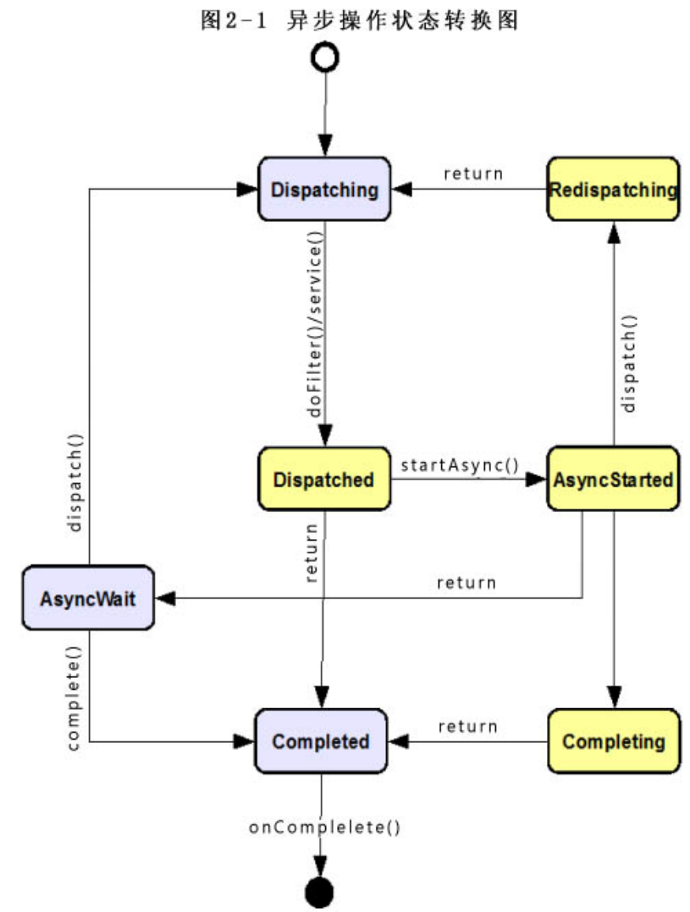
#### 2-3-3-4、线程安全
请注意，
除了 startAsync 和 complete 方法，请求和响应对象不是线程安全的。如果这些对象需要多线程访问，需要
同步这些访问或通过包装器添加线程安全语义，比如，同步化调用访问请求属性的方法，或者在线程内为
响应对象使用一个局部输出流。
#### 2-3-3-5、升级处理
在 HTTP/1.1，Upgrade 通用头（general-header）允许客户端指定其支持和希望使用的其他通信协议。如果
服务器找到合适的切换协议，那么新的协议将在之后的通信中使用。Servlet 容器提供了 HTTP 升级机制。
不过，Servlet 容器本身不知道任何升级协议。协议处理封装在 HttpUpgradeHandler 协议处理器。在容器和
HttpUpgradeHandler 协议处理器之间通过字节流进行数据读取或写入。  
当收到一个升级（upgrade）请求，servlet 可以调用 HttpServletRequest.upgrade 方法启动升级处理。该方法
实例化给定的 HttpUpgradeHandler 类，返回的 HttpUpgradeHandler 实例可以被进一步的定制。应用准备和
发送一个合适的响应到客户端。退出 servlet service 方法之后，servlet 容器完成所有过滤器的处理并标记连
接已交给 HttpUpgradeHandler 协议处理器处理。然后调用 HttpUpgradeHandler 协议处理器的 init 方法，传
入一个 WebConnection 以允许 HttpUpgradeHandler 协议处理器访问数据流。  
Servlet 过滤器仅处理初始的 HTTP 请求和响应，然后它们将不会再参与到后续的通信中。换句话说，一旦
请求被升级，它们将不会被调用。  
协议处理器（ProtocolHandler）可以使用非阻塞 IO（non blocking IO）消费和生产消息。
当处理 HTTP 升级时，开发人员负责线程安全的访问 ServletInputStream 和 ServletOutputStream。
当升级处理已经完成，将调用 HttpUpgradeHandler.destroy 方法。

### 2-3-4、终止服务
> * Servlet 实例可能会在 servlet 容器内保持活跃（active）持续一段时间（以毫秒为单位）
> * Servlet 容器的寿命可能是几天，几个月，或几年，或者是任何之间的时间。

 Servlet 容器确定 servlet 应该从服务中移除时，将调用 Servlet 接口的 destroy 方法以允许 Servlet 释放它使
用的任何资源和保存任何持久化的状态。

在 servlet 容器调用 destroy 方法之前，满足以下两个条件之一：
> * 必须让当前正在执行 service 方法的任何线程完成执行
> * 超过了服务器定义的时间限制。

一旦调用了 servlet 实例的 destroy 方法，容器无法再路由其他请求到该 servlet 实例了。如果容器需要再次
使用该 servlet，它必须用该 servlet 类的一个新的实例。在 destroy 方法完成后，servlet 容器必须释放 servlet
实例以便被垃圾回收。
# 3、Request
请求对象封装了客户端请求的所有信息。在 HTTP 协议中，这些信息是从客户端发送到服务器请求的 HTTP
头部和消息体。
## 3-1、HTTP协议参数
参数以一系列的名-值对的形式保存。任何给定的参数的名称可存在多个参数值。
ServletRequest 接口的下列方法可访问这些参数：
> * getParameter 
> * getParameterNames 
> * getParameterValues 
> * getParameterMap

这些 API不会暴露 GET请求（HTTP 1.1所定义的）的路径参数。他们必须从 getRequestURI方法或 getPathInfo
方法返回的字符串值中解析。
### 3-1-1、当参数可用时
以下是在 POST 表单数据填充到参数集前必须满足的条件：
> * 1。该请求是一个 HTTP 或 HTTPS 请求。
> * 2。HTTP 方法是 POST。 
> * 3。内容类型是 application/x-www-form-urlencoded。 
> * 4。该 servlet 已经对 request 对象的任意 getParameter 方法进行了初始调用。

如果不满足这些条件，而且参数集中不包括 POST 表单数据，那么 servlet 必须可以通过 request 对象的输入
流得到 POST 数据。如果满足这些条件，那么从 request 对象的输入流中直接读取 POST 数据将不再有效。
## 3-2、文件上传
当数据以 multipart/form-data 的格式发送时，servlet 容器支持文件上传。
如果满足以下任何一个条件，servlet 容器提供 multipart/form-data 格式数据的处理，。
> * servlet 处理第 8.1.5 节，8-68 页中定义的注解“@MultipartConfig”标注的请求。
> * 为了 servlet 处理请求，部署描述符包含了一个 multipart-config 元素。
如何使 request 中 multipart/form-data 类型的数据可用，取决于 servlet 容器是否提供 multipart/form-data 格式
数据的处理：
> * 如果 servlet 容器提供 multipart/form-data 格式数据的处理，可通过 HttpServletRequest 中的以下方法得到：
> * public Collection<Part> getParts() 
> * public Part getPart(String name) 

译者注：Part 类代表从 multipart/form-data 格式的 POST 请求中接收到的一个部分或表单项。 每个 part 都可
通过 Part.getInputStream 方法访问头部，相关的内容类型和内容。  
对于表单数据的 Content-Disposition，即使没有文件名，也可使用 part 的名称通过 HttpServletRequest 的
getParameter 和 getParameterValues 方法得到 part 的字符串值。  
> * 如 果 servlet 的容器不提供 multi-part/form-data 格式数据的处理，这些数据将可通过
HttpServletReuqest.getInputStream 得到。
## 3-3、属性
属性是与请求相关联的对象。属性可以由容器设置来表达信息，否则无法通过 API 表示，或者由 servlet 设
置将信息传达给另一个 servlet（通过 RequestDispatcher）。属性通过 ServletRequest 接口中下面的方法来访
问：
> * getAttribute 
> * getAttributeNames 
> * setAttribute 

只有一个属性值可与一个属性名称相关联。以前缀 java.和 javax.开头的属性名称是本规范的保留定义。
同样地，以前缀 sun.和 com.sun.，oracle 和 com.oracle 开头的属性名是 Oracle Corporation 的保留定
义。建议属性集中所有属性的命名与 Java 编程语言的规范 1 为包命名建议的反向域名约定一致。
## 3-4、头
servlet 可以通过 HttpServletRequest 接口的下面方法访问 HTTP 请求的头部信息：
> * getHeader 
> * getHeaders 
> * getHeaderNames 

getHeader 方法返回给定头名称的头。多个头可以具有相同的名称，例如 HTTP 请求中的 Cache-Control 头。
如果多个头的名称相同，getHeader 方法返回请求中的第一个头。 getHeaders 方法允许访问所有与特定头名
称相关的头值，返回一个 String 对象的枚举。

头可包含由 String 形式的 int 或 Date 数据。HttpServletRequest 接口提供如下方便的方法访问这些类型的头
数据：
> * getIntHeader 
> * getDateHeader 

如果 getIntHeader 方法不能转换为 int 的头值，则抛出 NumberFormatException 异常。如果 getDateHeader 方
法不能把头转换成一个 Date 对象，则抛出 IllegalArgumentException 异常。
## 3-5、请求路径元素
引导 servlet 服务请求的请求路径由许多重要部分组成。以下元素从请求 URI 路径得到，并通过 request 对象
公开：
> * Context Path：与 ServletContext 相关联的路径前缀是这个 servlet 的一部分。如果这个上下文是基于 Web
服务器的 URL 命名空间基础上的“默认”上下文，那么这个路径将是一个空字符串。否则，如果上下文不是
基于服务器的命名空间，那么这个路径以/字符开始，但不以/字符结束。
> * Servlet Path：路径部分直接与激活请求的映射对应。这个路径以“/”字符开头，如果请求与“/ *”或“”模式
匹配，在这种情况下，它是一个空字符串。
> * PathInfo：请求路径的一部分，不属于 Context Path 或 Servlet Path。如果没有额外的路径，它要么是 null，
要么是以'/'开头的字符串。

使用 HttpServletRequest 接口中的下面方法来访问这些信息：
> * getContextPath 
> * getServletPath 
> * getPathInfo 

重要的是要注意，除了请求 URI 和路径部分的 URL 编码差异外，下面的等式永远为真：
requestURI = contextPath + servletPath + pathInfo

表 3-1 上下文设置的例子
> key | value
> ------------ | -----------
> Context Path | /catalog
> Servlet Mapping | Pattern: /lawn/* Servlet: LawnServlet
> Servlet Mapping | Pattern: /garden/* Servlet: GardenServlet
> Servlet Mapping | Pattern: *.jsp Servlet: JSPServlet

表 3-2 遵守路径元素行为
> 请求路径 | 路径元素
> ------- | -------
> /catalog/lawn/index.html | ContextPath: /catalog, ServletPath: /lawn, PathInfo: /index.html
> /catalog/garden/implements/ | ContextPath: /catalog, ServletPath: /garden, PathInfo: /implements/
> /catalog/help/feedback.jsp | ContextPath: /catalog, ServletPath: /help/feedback.jsp, PathInfo: null
## 3-6、路径转换方法
在 API 中有两个方便的方法，允许开发者获得与某个特定的路径等价的文件系统路径。这些方法是：
> * ServletContext.getRealPath 
> * HttpServletRequest.getPathTranslated 
>
getRealPath 方法需要一个字符串参数，并返回一个字符串形式的路径，这个路径对应一个在本地文件系统
上的文件。getPathTranslated 方法推断出请求的 pathInfo 的实际路径（译者注：把 URL 中 servlet 名称之后，
查询字符串之前的路径信息转化成实际的路径）。

这些方法在 servlet 容器无法确定一个有效的文件路径 的情况下，如 Web 应用程序从归档中，在不能访问
本地的远程文件系统上，或在一个数据库中执行时，这些方法必须返回 null。JAR 文件中 META-INF/resources
目录下的资源，只有当调用 getRealPath()方法时才认为容器已经从包含它的 JAR 文件中解压，在这种情况
下，必须返回解压缩后位置。
## 3-7、非阻塞IO
Web 容器中的非阻塞请求处理有助于提高对改善 Web 容器可扩展性不断增加的需求，增加 Web 容器可同时
处理请求的连接数量。servlet容器的非阻塞IO允许开发人员在数据可用时读取数据或在数据可写时写数据。
非阻塞 IO 仅对在 Servlet 和 Filter（2.3.3.3 节定义的，“异步处理”）中的异步请求处理和升级处理
（2.3.3.5 节定义的，“升级处理”）有效。否则，当调用 ServletInputStream.setReadListener 或
ServletOutputStream.setWriteListener 方法时将抛出 IllegalStateException。 

ReadListener 为非阻塞 IO 提供了下面的回调方法：
> * ReadListener 
>   * onDataAvailable().当可以从传入的请求流中读取数据时 ReadListener 的 onDataAvailable 方法被调用。当数
据可读时容器初次调用该方法。当且仅当下面描述的 ServletInputStream 的 isReady 方法返回 false，容器随
后将调用 onDataAvailable 方法。
>   * onAllDataRead().当读取完注册了此监听器的 ServletRequest 的所有数据时调用 onAllDataRead 方法。
33
>   * onError(Throwable t). 处理请求时如果有任何错误或异常发生时调用 onError 方法。

容器必须线程安全的访问 ReadListener 中的方法。  
除了上述 ReadListener 定义的方法外，下列方法已被添加到 ServletInputStream 类中：
> * ServletInputStream 
>   * boolean isFinished(). 与 ServletReader/ServletInputStream 相关的请求的所有数据已经读取完时 isFinished
方法返回 true。否则返回 false。 
>   * boolean isReady().如果可以无阻塞地读取数据 isReady 方法返回 true。如果没有数据可以无阻塞地读取该
方法返回 false。如果 isReady 方法返回 false，调用 read 方法是非法的，且必须抛出 IllegalStateException。 
>   * void setReadListener(ReadListener listener). 设置上述定义的 ReadListener，调用它以非阻塞的方式读取数
据。一旦把监听器与给定的 ServletInputStream 关联起来，当数据可以读取，所有的数据都读取完或如果处
理请求时发生错误，容器调用 ReadListener 的方法。注册一个 ReadListener 将启动非阻塞 IO。在那时切换
到传统的阻塞 IO 是非法的，且必须抛出 IllegalStateException。在当前请求范围内，随后调用 setReadListener
是非法的且必须抛出 IllegalStateException。
## 3-8、Cookies
HttpServletRequest 接口提供了 getCookies 方法来获得请求中的 cookie 的一个数组。这些 cookie 是从客户端
发送到服务器端的客户端发出的每个请求上的数据。典型地，客户端发送回的作为 cookie 的一部分的唯一
信息是 cookie 的名称和 cookie 值。当 cookie 发送到浏览器时可以设置其他 cookie 属性，诸如注释，这些信
息不会返回到服务器。该规范还允许的 cookies 是 HttpOnly cookie。HttpOnly cookie 暗示客户端它们不会暴
露给客户端脚本代码（它没有被过滤掉，除非客户端知道如何查找此属性）。使用 HttpOnly cookie 有助于减
少某些类型的跨站点脚本攻击。
## 3-9、SSL属性
如果请求已经通过一个安全协议发送过，如 HTTPS，必须通过 ServletRequest 接口的 isSecure 方法公开该信
息。Web 容器必须公开下列属性给 servlet 程序员：
表 3-3 协议属性
> 属性 | 属性名称 | Java 类型
> ----|---------| --------
> 密码套件 | javax.servlet.request.cipher_suite | String 
> 算法的位大小 | javax.servlet.request.key_size | Integer 
> SSL 会话 id | javax.servlet.request.ssl_session_id | String 
如果有一个与请求相关的 SSL 证书，它必须由 servlet 容器以 java.security.cert.X509Certificate 类型的对象数
组暴露给 servlet 程序员并可通过一个 javax.servlet.request.X509Certificate 类型的 ServletRequest 属性访问。

这个数组的顺序是按照信任的升序顺序。证书链中的第一个证书是由客户端设置的，第二个是用来验证第
一个的，等等。
## 3-10、国际化
客户可以选择希望 Web 服务器用什么语言来响应。该信息可以和使用 Accept-Language 头与 HTTP/1.1 规范
中描述的其他机制的客户端通信。ServletRequest 接口提供下面的方法来确定发送者的首选语言环境：
> * getLocale 
> * getLocales 

getLocale 方法将返回客户端要接受内容的首选语言环境。要了解更多关于 Accept-Language 头必须被解
释为确定客户端首选语言的信息，请参阅 RFC 2616（HTTP/1.1）14.4 节。

getLocales 方法将返回一个 Locale 对象的枚举，从首选语言环境开始顺序递减，这些语言环境是可被客户
接受的语言环境。

如果客户端没有指定首选语言环境，getLocale 方法返回的语言环境必须是 servlet 容器默认的语言环境，而
getLocales 方法必须返回只包含一个默认语言环境的 Local 元素的枚举。
## 3-11、请求数据编码
目前，许多浏览器不随着 Content-Type 头一起发送字符编码限定符，而是**根据读取 HTTP 请求确定字符编
码**。如果客户端请求没有指定请求默认的字符编码，容器用来创建请求读取器和解析 POST 数据的编码必
须是“ISO-8859-1”。然而，为了向开发人员说明客户端没有指定请求默认的字符编码，在这种情况下，客
户端发送字符编码失败，容器从 getCharacterEncoding 方法返回 null。

如果客户端没有设置字符编码，并使用不同的编码来编码请求数据，而不是使用上面描述的默认的字符编
码，那么可能会发生破坏。为了弥补这种情况， ServletRequest 接口添加了一个新的方法
setCharacterEncoding(String enc)。开发人员可以通过调用此方法来覆盖由容器提供的字符编码。必须在解析
任何 post 数据或从请求读取任何输入之前调用此方法。**此方法一旦调用，将不会影响已经读取的数据的编
码**。
## 3-12、Request对象的生命周期
每个 request 对象只在 servlet 的 service 方法的作用域内，或过滤器的 doFilter 方法的作用域内有效，除非该
组件启用了异步处理并且调用了 request 对象的 startAsync 方法。在发生异步处理的情况下，request 对象一
直有效，直到调用 AsyncContext 的 complete 方法。容器通常会重复利用 request 对象，以避免创建 request
对象的性能开销。开发人员必须注意的是，不建议在上述范围之外保持 startAsync 方法还没有被调用的请
求对象的引用，因为这样可能产生不确定的结果。
在升级情况下，如上描述仍成立。
# 4、Servlet Context
## 4-1、ServletContext接口介绍
ServletContext（Servlet 上下文）接口定义了 servlet 运行在的 Web 应用的视图。容器供应商负责提供 Servlet
容器的 ServletContext 接口的实现。Servlet 可以使用 ServletContext 对象
> * 记录事件
> * 获取 URL 引用的资源，
> * 存取当前上下文的其他 Servlet 可以访问的属性。

ServletContext 是 Web 服务器中已知路径的根。例如，Servlet 上下文可以从 http://www.mycorp.com/catalog
找出，/catalog 请求路径称为上下文路径，所有以它开头的请求都会被路由到与 ServletContext 相关联的
Web 应用。
## 4-2、ServletContext接口作用范围
每一个部署到容器的 Web 应用都有一个 Servlet 接口的实例与之关联。在容器分布在多台虚拟机的情况下，
每个 JVM 的每个 Web 应用将有一个 ServletContext 实例。

如果容器内的 Servlet 没有部署到 Web 应用中，则隐含的作为“默认”Web 应用的一部分，并有一个默认
的 ServletContext。在分布式的容器中，默认的 ServletContext 是非分布式的且仅存在于一个 JVM 中。
## 4-3、初始化参数
如下 ServletContext 接口方法允许 Servlet 访问由应用开发人员在 Web 应用中的部署描述符中指定的上下文
初始化参数：
> * getInitParameter 
> * getInitParameterNames 
>
应用开发人员使用初始化参数来表达配置信息。代表性的例子是一个 Webmaster 的 e-mail 地址，或保存关
键数据的系统名称。
## 4-4、配置方法
下面的方法从 Servlet 3.0 开始添加到 ServletContext，以便启用编程方式定义 Servlet、Filter 和它们映射到的
url 模式（url pattern）。这些方法只能从 ServletContextListener 实现的 contextInitialized 方法或者
ServletContainerInitializer 实现的 onStartup 方法进行的应用初始化过程中调用。 除了添加 Servlet 和 Filter，
也可以查找关联到 Servlet 或 Filter 的一个 Registration 对象实例，或者到 Servlet 或 Filter 的所有 Registration
对象的 map。

如果 ServletContext 传到了 ServletContextListener 的 contextInitialized 方法，但该 ServletContextListener 既没
有在 web.xml 或 web-fragment.xml 中声明也没有使用@WebListener 注解，则在 ServletContext 中定义的用于
Servlet、Filter 和 Listener 的编程式配置的所有方法必须抛出 UnsupportedOperationException。
### 4-4-1、编程式添加和配置Servlet
编程式添加 Servlet 到上下文对框架开发者是很有用的。例如，框架可以使用这个方法声明一个控制器
Servlet。这个方法将返回一个 ServletRegistration 或 ServletRegistration.Dynamic 对象，允许我们进一步配置
如 init-params，url-mapping 等 Servlet 的其他参数。下面描述了该方法的三个重载版本。
#### 4.4.1.1 addServlet(String servletName, String className) 
该方法允许应用以编程方式声明一个 Servlet。它添加以给定的名称和 class 名称的 Servlet 到 servlet 上下文。
#### 4.4.1.2 addServlet(String servletName, Servlet servlet) 
该方法允许应用以编程方式声明一个 Servlet。它添加以给定的名称和 Servlet 实例的 Servlet 到 servlet 上下
文。
#### 4.4.1.3 addServlet(String servletName, Class <? extends Servlet> servletClass) 
该方法允许应用以编程方式声明一个 Servlet。它添加以给定的名称和 Servlet 类的一个实例的 Servlet 到
servlet 上下文。
#### 4.4.1.4 <T extends Servlet> T createServlet(Class<T> clazz) 
该方法实例化一个给定的 Servlet class，该方法必须支持适用于 Servlet 的除了@WebServlet 的所有注解。
返回的 Servlet 实例通过调用上边定义的 addServlet(String, Servlet)注册到 ServletContext 之前，可以进行进
一步的定制。
#### 4.4.1.5 ServletRegistration getServletRegistration(String servletName) 
该方法返回与指定名字的 Servlet 相关的 ServletRegistration，或者如果没有该名字的 ServletRegistration 则返
回null。如果ServletContext传到了ServletContextListener的contextInitialized方法，但该ServletContextListener
即没有在 web.xml 或 web-fragment.xml 中声明也没有使用 javax.servlet.annotation.WebListener 注解，则必须
抛出 UnsupportedOperationException。
#### 4.4.1.6 Map<String, ? extends ServletRegistration> getServletRegistrations() 
该方法返回 ServletRegistration 对象的 map，由名称作为键并对应着注册到 ServletContext 的所有 Servlet。
如果没有 Servlet 注册到 ServletContext 则返回一个空的 map。返回的 Map 包括所有声明和注解的 Servlet
对应的ServletRegistration对象，也包括那些使用addServlet方法添加的所有Servlet对于的ServletRegistration
对象。返回的 Map 的任何改变不影响 ServletContext。如果 ServletContext 传到了 ServletContextListener 的
contextInitialized 方法，但该 ServletContextListener 即没有在 web.xml 或 web-fragment.xml 中声明也没有使
用 javax.servlet.annotation.WebListener 注解，则必须抛出 UnsupportedOperationException。
### 4-4-2、编程式添加和配置Filter
#### 4.4.2.1 addFilter(String filterName, String className) 
该方法允许应用以编程方式声明一个 Filter。它添加以给定的名称和 class 名称的 Filter 到 web 应用。
#### 4.4.2.2 addFilter(String filterName, Filter filter) 
36
该方法允许应用以编程方式声明一个 Filter。它添加以给定的名称和 filter 实例的 Filter 到 web 应用。
#### 4.4.2.3 addFilter(String filterName, Class <? extends Filter> filterClass) 
该方法允许应用以编程方式声明一个 Filter。它添加以给定的名称和 filter 类的一个实例的 Filter 到 web 应
用。
#### 4.4.2.4 <T extends Filter> T createFilter(Class<T> clazz) 
该方法实例化一个给定的 Filter class，该方法必须支持适用于 Filter 的所有注解。
返回的 Filter 实例通过调用上边定义的 addServlet(String, Filter)注册到 ServletContext 之前，可以进行进一步
的定制。给定的 Filter 类必须定义一个用于实例化的空参构造器。
#### 4.4.2.5 FilterRegistration getFilterRegistration(String filterName) 
该方法返回与指定名字的 Filter 相关的 FilterRegistration，或者如果没有该名字的 FilterRegistration 则返回
null。如果 ServletContext 传到了 ServletContextListener 的 contextInitialized 方法，但该 ServletContextListener
即没有在 web.xml 或 web-fragment.xml 中声明也没有使用 javax.servlet.annotation.WebListener 注解，则必须
抛出 UnsupportedOperationException。
#### 4.4.2.6 Map<String, ? extends FilterRegistration> getFilterRegistrations() 
该方法返回 FilterRegistration 对象的 map，由名称作为键并对应着注册到 ServletContext 的所有 Filter。如果
没有 Filter 注册到 ServletContext 则返回一个空的 Map。返回的 Map 包括所有声明和注解的 Filter 对应的
FilterRegistration 对象，也包括那些使用 addFilter 方法添加的所有 Servlet 对于的 ServletRegistration 对象。
返回的 Map 的任何改变不影响 ServletContext。如果 ServletContext 传到了 ServletContextListener 的
contextInitialized 方法，但该 ServletContextListener 即没有在 web.xml 或 web-fragment.xml 中声明也没有使
用 javax.servlet.annotation.WebListener 注解，则必须抛出 UnsupportedOperationException。
### 4-4-3、编程式添加和配置Listener
#### 4.4.3.1 void addListener(String className) 
往 ServletContext 添加指定 class 名称的监听器。ServletContext 将使用由与应用关联的 classloader 装载加载
该给定名称的 class，且它们必须实现一个或多个以下接口：
> * javax.servlet.ServletContextAttributeListener 
> * javax.servlet.ServletRequestListener 
> * javax.servlet.ServletRequestAttributeListener 
> * javax.servlet.http.HttpSessionListener 
> * javax.servlet.http.HttpSessionAttributeListener 
> * javax.servlet.http.HttpSessionIdListener 

如果 ServletContext 传到了 ServletContainerInitializer 的 onStartup 方法，则给定名字的类可以实现除上面列
出的接口之外的 javax.servlet.ServletContextListener。作为该方法调用的一部分，容器必须装载指定类名的
class，以确保其实现了所需的接口之一。如果给定名字的类实现了一个监听器接口，则其调用顺序和声明
顺序是一样的，换句话说，如果它实现了 javax.servlet.ServletRequestListener 或
javax.servlet.http.HttpSessionListener，那么新的监听器将被添加到该接口的有序监听器列表的末尾。
#### 4.4.3.2 <T extends EventListener> void addListener(T t) 
往 ServletContext 添加一个给定的监听器。给定的监听器实例必须实现是一个或多个如下接口：
> * javax.servlet.ServletContextAttributeListener 
> * javax.servlet.ServletRequestListener 
> * javax.servlet.ServletRequestAttributeListener 
> * javax.servlet.http.HttpSessionListener 
> * javax.servlet.http.HttpSessionAttributeListener 
> * javax.servlet.http.HttpSessionIdListener 

如果 ServletContext 传到了 ServletContainerInitializer 的 onStartup 方法，则给定的监听器实例可以实现除上
面列出的接口之外的 javax.servlet.ServletContextListener。如果给定的监听器实例实现了一个监听器接口，
则其调用顺序和声明顺序是一样的，换句话说，如果它实现了 javax.servlet.ServletRequestListener 或
javax.servlet.http.HttpSessionListener，那么新的监听器将被添加到该接口的有序监听器列表的末尾。
#### 4.4.3.3 void addListener(Class <? extends EventListener> listenerClass) 
往 ServletContext 添加指定 class 类型的监听器。给定的监听器类必须实现是一个或多个如下接口：
> * javax.servlet.ServletContextAttributeListener 
> * javax.servlet.ServletRequestListener 
> * javax.servlet.ServletRequestAttributeListener 
> * javax.servlet.http.HttpSessionListener 
> * javax.servlet.http.HttpSessionAttributeListener 
> * javax.servlet.http.HttpSessionIdListener 

如果 ServletContext 传到了 ServletContainerInitializer 的 onStartup 方法，则给定的监听器类可以实现除上面
列出的接口之外的 javax.servlet.ServletContextListener。如果给定的监听器类实现了一个监听器接口，则其
调用顺序和声明顺序是一样的，换句话说，如果它实现了 javax.servlet.ServletRequestListener 或
javax.servlet.http.HttpSessionListener，那么新的监听器将被添加到该接口的有序监听器列表的末尾。
#### 4.4.3.4 <T extends EventListener> void createListener(Class<T> clazz) 
该方法实例化给定的 EventListener 类。指定的 EventListener 类必须实现至少一个如下接口：
> * javax.servlet.ServletContextAttributeListener 
> * javax.servlet.ServletRequestListener 
> * javax.servlet.ServletRequestAttributeListener 
> * javax.servlet.http.HttpSessionListener 
> * javax.servlet.http.HttpSessionAttributeListener 
> * javax.servlet.http.HttpSessionIdListener 

该方法必须支持该规范定义的适用于如上接口的所有注解。返回的 EventListener 实例可以在通过调用
addListener(T t)注册到 ServletContext 之前进行进一步的定制。给定的 EventListener 必须定义一个用于实例
化的空参构造器。
#### 4.4.3.5 用于编程式添加 Servlet、Filter 和 Listener 的注解处理需求
除了需要一个实例的 addServlet 之外，当使用编程式 API 添加 Servlet 或创建 Servlet 时，以下类中的有关的
注解必须被内省且其定义的元数据必须被使用，除非它被 ServletRegistration.Dynamic / ServletRegistration
中调用的 API 覆盖了。

@ServletSecurity、@RunAs、@DeclareRoles、@MultipartConfig。

对于没有注解的 Filter 和 Listener 也需要内省。

除了通过需要一个实例的方法添加的那些组件，编程式添加或创建的所有组件（Servlet，Filter 和 Listener）
上的资源注入，只有当组件是一个 CDI Managed Bean 时才被支持。进一步了解更多细节请参考 15-197 页 的 15.5.15，“JavaEE 要求的上下文和依赖注入”。
## 4-5、上下文属性
Servlet 可以使用指定的名字将对象属性绑定到上下文。同一个 Web 应用内的其他任何 Servlet 都可以使用
绑定到上下文的任意属性。以下 Servlet 接口中的方法允许访问此功能：
> * setAttribute 
> * getAttribute 
> * getAttributeNames 
> * removeAttribute 
### 4.5.1 分布式容器中的上下文属性
在 JVM 中创建的上下文属性是本地的，这可以防止从一个分布式容器的共享内存存储中获取 ServletContext
属性。当需要在运行在分布式环境的 Servlet 之间共享信息时，该信息应该被放到 session（请看第 7 章，“会
话”），或存储到数据库，或者设置到企业级 JavaBean 组件（Enterprise JavaBeans™）。
## 4-6、资源
ServletContext 接口提供了直接访问 Web 应用中静态内容层次结构的文件的方法，包括 HTML，GIF 和 JPEG
文件：
> * getResource 
> * getResourceAsStream 

getResource 和 getResourceAsStream 方法需要一个以“/”开头的 String 字符串作为参数，给定的资源路径
是相对于上下文的根，或者相对于 web 应用的 WEB-INF/lib 目录下的 JAR 文件中的 META-INF/resources
目录。这两个方法首先根据请求的资源查找 web 应用上下文的根，然后查找所有 WEB-INF/lib 目录下的 JAR
文件。查找 WEB-INF/lib 目录中 JAR 文件的顺序是不确定的。这种层次结构的文件可以存在于服务器的文
件系统，Web 应用的归档文件，远程服务器，或在其他位置。

这两个方法不能用于获取动态内容。例如，在支持 JavaServer Pages™规范（JavaServer Pages™ 规范可以在
http://java.sun.com/products/jsp 找到）的容器中，如 getResource("/index.jsp")形式的方法调用将返回 JSP 源
码而不是处理后的输出。请看第 9 章，“分派请求”获取更多关于动态内容的信息。

可以使用 getResourcePaths(String path)方法访问 Web 应用中的资源的完整列表。该方法的语义的全部细节
可以从本规范的 API 文档中找到。
## 4-7、多主机和Servlet上下文
Web 服务器可以支持多个逻辑主机共享一个服务器 IP 地址。有时，这种能力被称为“虚拟主机”。这种情
况下，每一个逻辑主机必须有它自己的上下文或一组上下文。Servlet 上下文**不会在虚拟主机之间共享**。

ServletContext 接口的 getVirtualServerName 方法允许访问 ServletContext 部署在的逻辑主机的配置名字。该
方法必须对所有部署在逻辑主机上的所有 servlet context 返回同一个名字。且该方法返回的名字必须是明确
的、每个逻辑主机稳定的、和适合用于关联服务器配置信息和逻辑主机。
## 4-8、Reload注意事项
尽管容器供应商不需要实现类的重新加载（reload）模式以便易于开发，但是任何此类的实现必须确保
> 所有servlet 及它们使用的类（Servlet 使用的系统类异常可能使用的是一个不同的 class loader）在
> 一个单独的 class loader 范围内被加载。

为了保证应用像开发人员预期的那样工作，**该要求是必须的**。作为一个开发辅助，
容器应支持到 session 绑定到的监听器的完整通知语义以用于当 class 重新加载时 session 终结的监控。

之前几代的容器创建新的 class loader 来加载 servlet，且与用于加载在 servlet 上下文中使用的其他 Servlet
或类的 class loader 是完全不同的。这可能导致 servlet 上下文中的对象引用指向意想不到的类或对象，并引
起意想不到的行为。为了防止因创建新的 class loader 所引起的问题，该要求是必须的。
### 4-8-1、临时工作目录
每一个 servlet 上下文都需要一个临时的存储目录。Servlet 容器必须为每一个 servlet 上下文提供一个私有的
临时目录，并将通过 javax.servlet.context.tempdir 上下文属性使其可用，关联该属性的对象必须是 java.io.File
类型。该要求公认为在多个 servlet 引擎实现中提供一个通用的便利。当 servlet 容器重启时，它不需要去保
持临时目录中的内容，但必须确保一个 servlet 上下文的临时目录中的内容对运行在同一个 servlet 容器的其
他 Web 应用的上下文不可见。
# 5、Response
响应（response）对象封装了从服务器返回到客户端的所有信息。在 HTTP 协议中，从服务器传输到客户端
的信息通过 HTTP 头信息或响应的消息体。
## 5-1、缓冲
Servlet 容器允许但不必为了提高效率而缓冲到客户端的输出。典型的服务器默认都是缓冲的，但允许 servlet
指定缓冲参数。

ServletResponse 接口的如下方法允许 servlet 访问和设置缓冲信息：
> * getBufferSize 
> * setBufferSize 
> * isCommitted 
> * reset 
> * resetBuffer 
> * flushBuffer 

不管 Servlet 使用的是一个 ServletOutputStream 还是一个 Writer，ServletResponse 接口提供的这些方法允许
执行缓冲操作。

getBufferSize 方法返回使用的底层缓冲区大小。如果没有使用缓冲，该方法必须返回一个 int 值 0。

Servlet 可以请求 setBufferSize 方法设置一个最佳的缓冲大小。不一定分配 servlet 请求大小的缓冲区，但至
少与请求的大小一样大。这允许容器重用一组固定大小的缓冲区，如果合适，可以提供一个比请求时更大
的缓冲区。该方法必须在使用 ServletOutputStream 或 Writer 写任何内容之前调用。如果已经写了内容或响
应对象已经提交，则该方法必须抛出 IllegalStateException。

isCommitted 方法返回一个表示是否有任何响应字节已经返回到客户端的 boolean 值。flushBuffer 方法强制
刷出缓冲区的内容到客户端。

当响应没有提交时，reset 方法清空缓冲区的数据。头信息，状态码和在调用 reset 之前 servlet 调用 getWriter
或 getOutputStream 设置的状态也必须被清空。如果响应没有被提交，resetBuffer 方法将清空缓冲区中的内
容，但不清空请求头和状态码。

如果响应已经提交并且 reset 或 resetBuffer 方法已被调用，则必须抛出 IllegalStateException，响应及它关联
的缓冲区将保持不变。

当使用缓冲区时，容器必须立即刷出填满的缓冲区内容到客户端。如果这是最早发送到客户端的数据，且
认为响应被提交了。
## 5-2、头信息
Servlet 可以使用如下 HttpServletResponse 接口中的方法设置 HTTP 响应头：
> * setHeader 
> * addHeader 

setHeader 方法设置一个给定名字和值的 header。之前的 header 将被新的 header 替换。如果已经存在同名的
header 值的 set，set 中的值会被清空并用新的值替换。
addHeader 方法使用给定的名字添加一个 header 值到 set。如果没有 header 与给定的名字关联，则创建一个
新的 set。
Header 可能包含表示 int 或 Date 对象的数据。以下 HttpServletResponse 接口提供的便利方法允许 Servlet 对
适当的数据类型用正确的格式设置一个 header： 
> * setIntHeader 
> * setDateHeader 
> * addIntHeader 
> * addDateHeader 

为了成功的传回给客户端，header 必须在响应提交前设置。响应提交后的 Header 设置将被 servlet 容器忽略。
Servlet 程序员负责保证为 Servlet 生成的内容设置合适的 response 对象的 Content-Type header。HTTP 1.1 规
范中没有要求在 HTTP 响应中设置此 header。当 Servlet 程序员没有设置该类型时，Servlet 容器也不能设置
默认的内容类型。

建议容器使用 X-Powered-By HTTP header 公布它的实现信息。该字段值应考虑一个或多个实现类型，如
"Servlet/3.1"。容器应该可以配置来隐藏该 header。可选的容器补充的信息和底层 Java 平台可以被放在括号
内并添加到实现类型之后。

X-Powered-By: Servlet/3.1 

X-Powered-By: Servlet/3.1 JSP/2.2 (GlassFish Open Source Edition 4.0 Java/Oracle Corporation/1.7)
## 5-3、非阻塞IO
非阻塞 IO 仅对在 Servlet 和 Filter（2.3.3.3 节定义的，“异步处理”）中的异步请求处理和升级处理
（2.3.3.5 节定义的，“升级处理”）有效。否则，当调用 ServletInputStream.setReadListener 或
ServletOutputStream.setWriteListener 方法时将抛出 IllegalStateException。为了支持在 Servlet 容器
中的非阻塞写，除了在 3-28 页 3.7 节描述的“非阻塞 IO” 对 ServletRequest 做的更改之外，下面做出的更
改以便于处理响应相关的类/接口。

WriteListener 提供了如下适用于容器调用的回调方法。
> * WriteListener 
>   * void onWritePossible(). 当一个 WriteListener 注册到 ServletOutputStream 时，当可以写数据时该方法
将被容器首次调用。当且仅当下边描述的 ServletOutputStream 的 isReady 方法返回 false，容器随后将
调用该方法。
>   * onError(Throwable t). 当处理响应过程中出现错误时回调。

除了 WriteListener 外，还有如下方法被添加到 ServletOutputStream 类并允许开发人员运行时检查是否可以
写数据发送到客户端。
> * ServletOutputStream 
>   * boolean isReady(). 如果往 ServletOutputStream 写会成功，则该方法返回 true，其他情况会返回 false。
如果该方法返回 true，可以在 ServletOutputStream 上执行写操作。如果没有后续的数据能写到
ServletOutputStream，那么直到底层的数据被刷出之前该方法将一直返回 false。且在此时容器将调用
WriteListener 的 onWritePossible 方法。随后调用该方法将返回 true。 
>   * void setWriteListener(WriteListener listener). 关联 WriteListener 和当且的 ServletOutputStream，当
ServletOutputStream 可以写入数据时容器会调用 WriteListener 的回调方法。注册了 WriteListener 将开
始非阻塞 IO。此时再切换到传统的阻塞 IO 是非法的。

**容器必须线程安全的访问 WriteListener 中的方法。**
## 5-4、简便方法
HttpServletResponse 提供了如下简便方法：
> * sendRedirect 
> * sendError 

sendRedirect 方法将设置适当的 header 和内容体将客户端重定向到另一个地址。使用相对 URL 路径调用该
方法是合法的，但是底层的容器必须将传回到客户端的相对地址转换为全路径 URL。无论出于什么原因，
如果给定的 URL 是不完整的，且不能转换为一个有效的 URL ，那么该方法必须抛出
IllegalArgumentException。

sendError 方法将设置适当的 header 和内容体用于返回给客户端返回错误消息。可以 sendError 方法提供一
个可选的 String 参数用于指定错误的内容体。

如果响应已经提交并终止，这两个方法将对提交的响应产生负作用。这两个方法调用后 servlet 将不会产生
到客户端的后续的输出。这两个方法调用后如果有数据继续写到响应，这些数据被忽略。 如果数据已经写
到响应的缓冲区，但没有返回到客户端（例如，响应没有提交），则响应缓冲区中的数据必须被清空并使用
这两个方法设置的数据替换。如果想要已提交，这两个方法必须抛出 IllegalStateException。
## 5-5、国际化
Servlet 应设置 response 的 locale 和字符集。使用 ServletResponse.setLocale 方法设置 locale。该方法可以重
复的调用；但响应被提交后调用该方法不会产生任何作用。如果在页面被提交之前 Servlet 没有设置 locale，
容器的默认 locale 将用来确定响应的 locale，但是没有制定与客户端通信的规范，例如使用 HTTP 情况下的
Content-Language header。

```xml
<locale-encoding-mapping-list> 
    <locale-encoding-mapping> 
        <locale>ja</locale> 
        <encoding>Shift_JIS</encoding> 
    </locale-encoding-mapping> 
</locale-encoding-mapping-list>
```

如果该元素不存在或没有提供 mapping，setLocale 使用容器依赖的 mapping。setCharacterEncoding，
setContentType 和 setLocale 方法可以被重复的调用来改变字符编码。如果在 servlet 响应的 getWriter 方法已
经调用之后或响应被提交之后，调用相关方法设置字符编码将没有任何作用。只有当给定的 content type 字
符串提供了一个 charset 属性值，调用 setContentType 可以设置字符编码。只有当既没有调用
setCharacterEncoding 也没有调用 setContentType 去设置字符编码之前调用 setLocale 可以设置字符编码。

在 ServletResponse 接口的 getWriter 方法被调用或响应被提交之前，如果 servlet 没有指定字符编码，默认使
用 ISO-8859-1。

如果使用的协议提供了一种这样做的方式，容器必须传递 servlet 响应的 writer 使用的 locale 和字符编码到
客户端。使用 HTTP 的情况下，locale 可以使用 Content-Language header 传递，字符编码可以作为用于指定
文本媒体类型的 Content-Type header 的一部分传递。注意，如果没有指定 content type，字符编码不能通过
HTTP header 传递；但是仍使用它来编码通过 servlet 响应的 writer 写的文本。
## 5-6、结束响应对象
当响应被关闭时，容器必须立即刷出响应缓冲区中的所有剩余的内容到客户端。
以下事件表明 servlet 满足了请求且响应对象即将关闭：
> * servlet 的 service 方法终止。
> * 响应的 setContentLength 或 setContentLengthLong 方法指定了大于零的内容量，且已经写入到响应。
> * sendError 方法已调用。
> * sendRedirect 方法已调用。
> * AsyncContext 的 complete 方法已调用。
## 5-7、Response的生命周期
每个响应对象是只有当在 servlet 的 service 方法的范围内或在 filter 的 doFilter 方法范围内是有效的，除非该
组件关联的请求对象已经开启异步处理。如果相关的请求已经启动异步处理，那么直到 AsyncContext 的
complete 方法被调用，请求对象一直有效。
> * 为了避免响应对象创建的性能开销，容器通常回收响应对象。
> * 在相关的请求的 startAsync 还没有调用时，开发人员必须意识到保持到响应对象引用，超出之上描述的范
围可能导致不确定的行为。
# 6、过滤器
过滤器（Filter）是 Java 组件，允许运行过程中改变进入资源的请求和资源返回的响应中的有效负载和 header
信息。

本章描述了 Java Servlet v3.0 API 类和方法，它们提供了一种轻量级的框架用于过滤动态和静态内容。还描
述了如何在 Web 应用配置 Filter，它们实现的约定和语义。

网上提供了 Servlet 过滤器的 API 文档。过滤器的配置语法在第 14 章的“部署描述符”中的部署描述符模
式部分给出。当阅读本章时，读者应该是以这些资源作为参考。
## 6-1、什么是过滤器
过滤器是一种代码重用的技术，它可以改变 HTTP 请求的内容，响应，及 header 信息。过滤器通常不产生
响应或像 servlet 那样对请求作出响应，而是修改或调整到资源的请求，修改或调整来自资源的响应。

过滤器可以作用于动态或静态内容。这章说的动态和静态内容指的是 Web 资源。

供开发人员使用的过滤器功能有如下几种类型：
> * 在执行请求之前访问资源。
> * 在执行请求之前处理资源的请求。
> * 用请求对象的自定义版本包装请求对请求的 header 和数据进行修改。
> * 用响应对象的自定义版本包装响应对响应的 header 和数据进行修改。
> * 拦截资源调用之后的调用。
> * 作用在 Servlet，一组 Servlet，或静态内容上的零个，一个或多个拦截器按指定的顺序执行。
### 6-1-1、过滤器组件示例
> * 验证过滤器
> * 日志记录和审计过滤器
> * 图像转换过滤器
> * 数据压缩过滤器
> * 加密过滤器
> * 词法（Tokenizing）过滤器
> * 触发资源访问事件过滤器
> * 转换 XML 内容的 XSL/T 过滤器
> * MIME（Multipurpose Internet Mail Extensions）-类型链过滤器
> * 缓存过滤器
## 6-2、主要概念
本章描述了过滤器模型的主要概念。

应用开发人员通过实现 javax.servlet.Filter 接口并提供一个公共的空参构造器来创建过滤器。该类及构建
Web 应用的静态资源和 Servlet 打包在 Web 应用归档文件中。Filter 在部署描述符中通过<filter>元素声明。
一个过滤器或一组过滤器可以通过在部署描述符中定义<filter-mapping>来为调用配置。可以使用 servlet 的
逻辑视图名把过滤器映射到一个特定的 servlet，或者使用 URL 模式把一组 Servlet 和静态内容资源映射到
过滤器。
### 6-2-1、过滤器生命周期
**在 Web 应用部署之后，在请求导致容器访问 Web 资源之前**，容器必须找到过滤器列表并按照如上所述的应
用到 Web 资源。容器必须确保它为过滤器列表中的每一个都实例化了一个适当类的过滤器,并调用其
init(FilterConfig config)方法。过滤器可能会抛出一个异常,以表明它不能正常运转。如果异常的类型是
UnavailableException，容器可以检查异常的 isPermanent 属性并可以选择稍候重试过滤器。

在部署描述符中声明的每个<filter>在**每个 JVM 的容器中仅实例化一个实例**。容器提供了声明在过滤器的部
署描述符的过滤器 config（译者注：FilterConfig），对 Web 应用的 ServletContext 的引用，和一组初始化参
数。

当容器接收到传入的请求时，它将获取列表中的第一个过滤器并调用 doFilter 方法，传入 ServletRequest 和
ServletResponse，和一个它将使用的 FilterChain 对象的引用。

过滤器的 doFilter 方法通常会被实现为如下或如下形式的子集：
> 1. 该方法检查请求的头。
> 2. 该方法可以用自定义的ServletRequest或HttpServletRequest实现包装请求对象为了**修改请求的头或数据**。
> 3. 该方法可以用自定义的ServletResponse 或 HttpServletResponse实现包装传入doFilter方法的响应对象用
于修改响应的头或数据。
> 4. 该过滤器可以调用过滤器链中的下一个实体。下一个实体可能是另一个过滤器，或者如果当前调用的过
滤器是该过滤器链配置在部署描述符中的最后一个过滤器，下一个实体是目标 Web 资源。调用 FilterChain
对象的 doFilter 方法将影响下一个实体的调用，且传入的它被调用时请求和响应，或传入它可能已经创建
的**包装版本**。  
由容器提供的过滤器链的 doFilter 方法的实现，必须找出过滤器链中的下一个实体并调用它的 doFilter 方法，
传入适当的请求和响应对象。另外，过滤器链可以通过不调用下一个实体来阻止请求，离开过滤器负责填
充响应对象。
service 方法必须和应用到 servlet 的所有过滤器运行在同一个线程中。
> 5. 过滤器链中的下一个过滤器调用之后，过滤器可能检查响应的头。
> 6. 另外，过滤器可能抛出一个异常以表示处理过程中出错了。如果过滤器在 doFilter 处理过程中抛出
UnavailableException，容器必须停止处理剩下的过滤器链。 如果异常没有标识为永久的，它或许选择稍候
重试整个链。
> 7. 当链中的最后的过滤器被调用，下一个实体访问的是链最后的目标 servlet 或资源。
> 8. 在容器能把服务中的过滤器实例移除之前，容器必须先调用过滤器的 destroy 方法以便过滤器释放资源
并执行其他的清理工作。
### 6-2-2、包装请求和响应
过滤器的**核心概念是包装请求或响应**，以便它可以覆盖行为执行过滤任务。在这个模型中，开发人员不仅
可以覆盖请求和响应对象上已有的方法，也能提供新的API以适用于对过滤器链中剩下的过滤器或目标web
资源做特殊的过滤任务。例如，开发人员可能希望用更高级别的输出对象如 output stream 或 writer 来扩展
响应对象，如 API，允许 DOM 对象写回客户端。

为了支持这种风格的过滤器，容器必须支持如下要求。当过滤器调用容器的过滤器链实现的 doFilter 方法
时，容器必须确保请求和响应对象传到过滤器链中的下一个实体，或如果过滤器是链中最后一个，将传入
目标 web 资源，且与调用过滤器传入 doFilter 方法的对象是一样的。

当调用者包装请求或响应对象时，对包装对象的要求同样适用于从 servlet 或过滤器到
RequestDispatcher.forward 或 RequestDispatcher.include 的调用。在这种情况下，调用 servlet 看到的请求和
响应对象与调用 servlet 或过滤器传入的包装对象必须是一样的。
### 6-2-3、过滤器环境
可以使用部署描述符中的<init-params>元素把一组初始化参数关联到过滤器。这些参数的名字和值在过滤
器运行期间可以使用过滤器的 FilterConfig 对象的 getInitParameter 和 getInitParameterNames 方法得到。另外，
FilterConfig 提供访问 Web 应用的 ServletContext 用于加载资源，记录日志，在 ServletContext 的属性列表存
储状态。链中**最后的过滤器和目标 servlet 或资源必须执行在同一个调用线程**。
### 6-2-4、在web应用中配置过滤器
过滤器可以通过规范的第 8-67 页的 8.1.2 节“@WebFilter”的@WebFilter 注解定义或者在部署描述符中使
用<filter>元素定义。在这个元素中，程序员可以声明如下内容：
> * filter-name: 用于映射过滤器到 servlet 或 URL 
> * filter-class: 由容器用于表示过滤器类型
> * init-params: 过滤器的初始化参数

程序员可以选择性的指定 icon 图标，文字说明，和工具操作显示的名字。容器必须为部署描述符中定义的
每个过滤器声明实例化一个 Java 类实例。因此，如果开发人员对同一个过滤器类声明了两次，则容器将实
例化两个相同的过滤器类的实例。

下面是一个过滤器声明的例子：
```xml
<filter> 
    <filter-name>Image Filter</filter-name> 
    <filter-class>com.acme.ImageFilter</filter-class> 
</filter> 
```

一旦在部署描述符中声明了过滤器，装配人员使用<filter-mapping>定义 Web 应用中的 servlet 和静态资源到
过滤器的应用。过滤器可以使用<servlet-name>元素关联到一个 Servlet。例如，以下示例代码映射 Image Filter
过滤器到 ImageServlet servlet：
```xml
<filter-mapping> 
    <filter-name>Image Filter</filter-name> 
    <servlet-name>ImageServlet</servlet-name> 
</filter-mapping> 
```

过滤器可以使用<url-pattern>风格的过滤器映射关联到一组 servlet 和静态内容：
```xml
<filter-mapping> 
    <filter-name>Logging Filter</filter-name> 
    <url-pattern>/*</url-pattern> 
</filter-mapping>
```
 
在这里， Logging 过滤器应用到 Web 应用中的所有 servlet 和静态资源，因为每一个请求的 URI 匹配‘/*’URL
模式。

当使用<url-pattern>风格配置<filter-mapping>元素，容器必须使用定义在 12 章“映射请求到 Servlet”中的
路径映射规则（path mapping rule）决定<url-pattern>是否匹配请求 URI。

容器使用的用于构建应用到一个特定请求 URI 的过滤器链的顺序如下所示：
> 1. 首先， <url-pattern>按照在部署描述符中的出现顺序匹配过滤器映射。
> 2. 接下来，<servlet-name>按照在部署描述符中的出现顺序匹配过滤器映射。

如果过滤器映射同时包含了<servlet-name> 和 <url-pattern>，容器必须展开过滤器映射为多个过滤器映射
（每一个<servlet-name> 和 <url-pattern>一个），保持<servlet-name>和<url-pattern>元素顺序。例如，以下
过滤器映射：
```xml
<filter-mapping> 
    <filter-name>Multipe Mappings Filter</filter-name> 
    <url-pattern>/foo/*</url-pattern> 
    <servlet-name>Servlet1</servlet-name> 
    <servlet-name>Servlet2</servlet-name> 
    <url-pattern>/bar/*</url-pattern> 
</filter-mapping> 
```

等价于：
```xml
<filter-mapping> 
    <filter-name>Multipe Mappings Filter</filter-name> 
    <url-pattern>/foo/*</url-pattern> 
</filter-mapping> 
<filter-mapping> 
    <filter-name>Multipe Mappings Filter</filter-name> 
    <servlet-name>Servlet1</servlet-name> 
</filter-mapping> 
<filter-mapping> 
    <filter-name>Multipe Mappings Filter</filter-name> 
    <servlet-name>Servlet2</servlet-name> 
</filter-mapping> 
<filter-mapping> 
    <filter-name>Multipe Mappings Filter</filter-name> 
    <url-pattern>/bar/*</url-pattern> 
</filter-mapping> 
```

关于过滤器链顺序的要求意味着容器，当接收到传入的请求，按照如下方式处理请求：

> * 按照 120 页的“映射规则”识别目标 Web 资源。
> * 如果有过滤器使用 servlet name 匹配到具有<servlet-name>的 Web 资源，容器以声明在部署描述符中的
顺序构建过滤器链。该链中的最后一个过滤器，即最后一个<servlet-name> 匹配的过滤器将调用目标 Web
资源。
> * 如果有过滤器使用<url-pattern>匹配且该<url-pattern>按照第 12.2 节“映射规则”中的规则匹配请求的
URI，容器容器以声明在部署描述符中的顺序构建<url-pattern>匹配到的过滤器链。该链中的最后一个过滤
器是在部署描述符中对当前请求 URI 最后一个<url-pattern>匹配的过滤器。链中的最后一个过滤器将调用
<servlet-name>匹配的链中的第一个过滤器，或如果没有，则调用目标 Web 资源。

想要高性能 Web 容器将缓存过滤器链从而不需要根据每个请求重新计算它们。
### 6-2-5、过滤器和RequestDispatcher
Java Servlet 规范自从 2.4 新版本以来，能够在请求分派器 forward()和 include()调用情况下配置可被调用的
过滤器。

通过在部署描述符中使用新的<dispatcher>元素，开发人员可以为 filter-mapping 指定是否想要过滤器应用到
请求，当：
> 1. 请求直接来自客户端。
可以由一个带有 REQUEST 值的 <dispatcher> 元素，或者没有任何 <dispatcher> 元素来表示。
> 2. 使用表示匹配 <url-pattern> 或 <servlet-name> 的 Web 组件的请求分派器的 forward()调用情况下处理请求。
可以由一个带有 FORWARD 值的<dispatcher>元素表示。
> 3. 使用表示匹配<url-pattern> 或 <servlet-name>的 Web 组件的请求分派器的 include()调用情况下处理请求。
可以由一个带有 INCLUDE 值的<dispatcher>元素表示。
> 4. 使用第 106 页“错误处理”指定的错误页面机制处理匹配<url-pattern>的错误资源的请求。
可以由一个带有 ERROR 值的<dispatcher>元素表示。
> 5. 使用第 10 页指定的“异步处理”中的异步上下文分派机制对 web 组件使用 dispatch 调用处理请求。
可以由一个带有 ASYNC 值的<dispatcher>元素表示。
> 6. 或之上 1，2，3，4 或 5 的任何组合。
例如：
```xml
<filter-mapping> 
    <filter-name>Logging Filter</filter-name> 
    <url-pattern>/products/*</url-pattern> 
</filter-mapping> 
```

客户端以/products/...开始的请求将导致 Logging Filter 被调用，但不是在以路径/products/...开始的请求分派
器调用情况下。LoggingFilter 将在初始请求分派和恢复请求时被调用。如下代码：
```xml
<filter-mapping> 
    <filter-name>Logging Filter</filter-name> 
    <servlet-name>ProductServlet</servlet-name> 
    <dispatcher>INCLUDE</dispatcher> 
</filter-mapping> 
```

客户端到 ProductServlet 的请求将不会导致 Logging Filter 被调用，且也不会在请求分派器 forward()调用到
ProductServlet 情况时，仅在以 ProductServlet 名字开头的请求分派器 include()调用时被调用。如下代码：
```xml
<filter-mapping> 
    <filter-name>Logging Filter</filter-name> 
    <url-pattern>/products/*</url-pattern> 
    <dispatcher>FORWARD</dispatcher> 
    <dispatcher>REQUEST</dispatcher> 
</filter-mapping> 
```

客户端以/products/...开始的请求，或在以路径/products/...开始的请求分派器 forward()调用情况时，将导致
Logging Filter 被调用。

最后，如下代码使用特殊的 servlet 名字 “*”：
```xml
<filter-mapping> 
    <filter-name>All Dispatch Filter</filter-name> 
    <servlet-name>*</servlet-name> 
    <dispatcher>FORWARD</dispatcher> 
</filter-mapping> 
```

在按名字或按路径获取的所有请求分派器 forward()调用时该代码将导致 All Dispatch Filter 被调用。
# 7、会话
超文本传输协议（HTTP）被设计为一种无状态协议。为构建有效的 Web 应用，必须与来自一个特定的客
户端的请求彼此是相互关联。随时间的推移，演变了许多会话跟踪机制，这些机制直接使用对程序员而言
是困难或麻烦的。

该规范定义了一个简单的 HttpSession 接口，允许 servlet 容器使用几种方法来跟踪用户会话，而不会使应用
开发人员陷入到这些方法的细节中。
## 7-1、会话跟踪机制
以下章节描述了跟踪用户会话（session）的方法。
### 7-1-1、Cookies
通过 HTTP cookie 的会话跟踪是**最常用的会话跟踪机制**，且所有 servlet 容器都应该支持。

容器向客户端发送一个 cookie，客户端后续到服务器的请求都将返回该 cookie，明确地将请求与会话关联。
会话跟踪 cookie 的标准名字必须是 **JSESSIONID**，所有 3.0 兼容的容器必须支持。容器也允许通过容器指
定的配置自定义会话跟踪 cookie 的名字。

所有 servlet 容器必须提供能够配置容器是否标记会话跟踪 cookie 为 HttpOnly。已建立的配置必须应用到所
有上下文中还没有建立特定的配置(见 SessionCookieConfig javadoc 获取更多细节)。

如果 web 应用为其会话跟踪 cookie 配置了一个自定义的名字，则如果会话 id 编码到 URL 中那么相同的自
定义名字也将用于 URI 参数的名字（假如 URL 重写已开启）。
### 7-1-2、SSL会话
安全套接字层，在 HTTPS 使用的加密技术，有一种内置机制允许多个来自客户端的请求被明确识别为同一
会话。Servlet 容器可以很容易地使用该数据来定义会话。
### 7-1-3、URL重写
URL 重写是会话跟踪的最低标准。当客户端不接受 cookie 时，服务器可使用 URL 重写作为会话跟踪的基
础。URL 重写涉及添加数据、会话 ID、容器解析 URL 路径从而请求与会话相关联。

会话 ID 必须被编码为 URL 字符串中的一个路径参数。参数的名字必须是 jsessionid。下面是一个 URL 包
含编码的路径信息的例子：

http://www.myserver.com/catalog/index.html;jsessionid=1234 

URL 重写在日志、书签、referer header、缓存的 HTML、URL 工具条中暴露会话标识。在支持 cookie 或 SSL 
会话的情况下，不应该使用 URL 重写作为会话跟踪机制。
### 7-1-4、会话完整性
当服务的来自客户端的请求不支持使用 cookie 时，Web 容器必须能够支持 HTTP 会话。 为了满足这个要
求， Web 容器通常支持 URL 重写机制。
## 7-2、创建会话
当会话仅是一个未来的且还没有被建立时会话被认为是“新”的。因为 HTTP 是一种基于请求-响应的协议，
直到客户端“加入”到 HTTP 会话之前它都被认为是新的。当会话跟踪信息返回到服务器指示会话已经建
立时客户端加入到会话。直到客户端加入到会话，不能假定下一个来自客户端的请求被识别为同一会话。

如果以下之一是 true，会话被认为是“新”的：
> * 客户端还不知道会话
> * 客户端选择不加入会话。

这些条件定义了 servlet 容器没有机制能把一个请求与之前的请求相关联的情况。

Servlet 开发人员必须设计他的应用以便处理客户端没有，不能，或不会加入会话的情况。

与每个会话相关联是一个包含唯一标识符的字符串，也被称为会话 ID。会话 ID 的值能通过调用
javax.servlet.http.HttpSession.getId() 获取，且能在创建后通过调用
javax.servlet.http.HttpServletRequest.changeSessionId()改变。
## 7-3、会话范围
HttpSession 对象必须被限定在**应用（或 servlet 上下文）级别**。底层的机制，如使用 cookie 建立会话，不同
的上下文可以是相同，但所引用的对象，包括包括该对象中的属性，决不能在容器上下文之间共享。

用一个例子来说明该要求： 如果 servlet 使用 RequestDispatcher 来调用另一个 Web 应用的 servlet，任何创
建的会话和被调用 servlet 所见的必须不同于来自调用会话所见的。

此外，**一个上下文的会话在请求进入那个上下文时必须是可恢复的**，不管是直接访问它们关联的上下文还
是在请求目标分派时创建的会话。
## 7-4、绑定Session属性
servlet 可以按名称绑定对象属性到 HttpSession 实现，任何绑定到会话的对象可用于任意其他的 Servlet，其
属于同一个 ServletContext 且处理属于相同会话中的请求。

一些对象可能需要在它们被放进会话或从会话中移除时得到通知。这些信息可以从
HttpSessionBindingListener 接口实现的对象中获取。这个接口定义了以下方法，用于标识一个对象被绑定到
会话或从会话解除绑定时。
> * valueBound 
> * valueUnbound 

在对象对 HttpSession 接口的 getAttribute 方法可用之前 valueBound 方法必须被调用。在对象对 HttpSession
接口的 getAttribute 方法不可用之后 valueUnbound 方法必须被调用。
## 7-5、会话超时
在 HTTP 协议中，当客户端不再处于活动状态时没有显示的终止信号。这意味着当客户端不再处于活跃状
态时可以使用的唯一机制是超时时间。

Servlet 容器定义了默认的会话超时时间，且可以通过 HttpSession 接口的 getMaxInactiveInterval 方法获取。
开发人员可以使用 HttpSession 接口的 setMaxInactiveInterval 方法改变超时时间。这些方法的超时时间以秒
为单位。根据定义，如果超时时间设置为 0 或更小的值，会话将永不过期。会话不会生效，直到所有 servlet
使用的会话已经退出其 service 方法。一旦会话已失效,新的请求必须不能看到该会话。
## 7-6、最后访问时间
HttpSession 接口的 getLastAccessedTime 方法允许 servlet 确定在当前请求之前的会话的最后访问时间。当会
话中的请求是 servlet 容器第一个处理的时该会话被认为是访问了。
## 7-7、重要的会话语义
### 7-7-1、多线程问题
在同一时间多个 Servlet 执行请求的线程可能都有到同一会话的活跃访问。容器必须确保，以一种**线程安全**
的方式维护表示会话属性的内部数据结构。开发人员负责线程安全的访问属性对象本身。这样将防止并发
访问 HttpSession 对象内的属性集合，消除了应用程序导致破坏集合的机会。
### 7-7-2、分布式环境
在一个标识为分布式的应用程序中，会话中的所有请求在同一时间必须仅被一个 JVM 处理。容器必须能够
使用适当的 setAttribute 或 putValue 方法把所有对象放入到 HttpSession 类实例。以下限制被强加来满足这
些条件：
> * 容器必须接受实现了 Serializable 接口的对象。
> * 容器可以选择支持其他指定对象存储在 HttpSession 中，如 Enterprise JavaBeans 组件和事务的引用。
> * 由特定容器的设施处理会话迁移。

> * 当分布式 servlet 容器不支持必需的会话迁移存储对象机制时容器必须抛出 IllegalArgumentException。
> * 分布式 servlet 容器必须支持迁移的对象实现 Serializable 的必要机制。
> * 这些限制意味着开发人员确保除在非分布式容器中遇到的问题没有额外的并发问题。
> * 容器供应商可以确保可扩展性和服务质量的功能，如**负载平衡**和**故障转移**通过把会话对象和它的内容从分
布式系统的任意一个活跃节点移动到系统的一个不同的节点上。
> * 如果分布式容器持久化或迁移会话提供服务质量特性，它们不限制使用原生的 JVM 序列化机制用于序列化
HttpSession 和它们的属性。如果开发人员实现 session 属性上的 readObject 和 writeObject 方法，他们也不
能保证容器将调用这些方法，但保证 Serializable 结束它们的属性将被保存。
> * 容器必须在迁移会话时通知实现了 HttpSessionActivationListener 的所有会话属性。**它们必须在序列化会话
之前通知钝化监听器，在反序列化之后通知激活监听器**。
> * 写分布式应用的开发人员应该意识到容器可能**运行在多个 Java 虚拟机**中，开发人员不能依赖静态变量存储
应用状态。他们应该用企业 Bean 或数据库存储这种状态。
### 7-7-3、客户端语义
由于 Cookie 或 SSL 证书通常由 Web 浏览器进程控制，且不与浏览器的任意特定窗口关联，从客户端应用
程序发起的到 servlet 容器的请求可能在同一会话。为了最大的可移植性，开发人员应该假定客户端**所有窗
口参与同一会话**。
# 8、注解和可插拔性
**本章描述了注解的使用和使 web 应用内使用的框架和库能够可插拔的增强。**
## 8-1、
在 web 应用中，使用注解的类仅当它们位于 WEB-INF/classes 目录中，或它们被打包到位于应用的
WEB-INF/lib 中的 jar 文件中时它们的注解才将被处理。

Web 应用部署描述符的 web-app 元素包含一个新的“metadata-complete”属性。“metadata-complete”属性
定义了 web 描述符是否是完整的，或是否应该在部署时检查 jar 包中的类文件和 web fragments。如果
“metadata-complete”设置为“true”，部署工具必须必须忽略存在于应用的类文件中的所有指定部署信息的
servlet 注解和 web fragments。如果 metadata-complete 属性没有指定或设置为“false”，部署工具必须检查应
用的类文件的注解，并扫描 web fragments。

以下注解必须被 Servlet 3.0 兼容的容器支持。
### 8-1-1、@WebServlet
该注解用于在 Web 应用中定义 Servlet 组件。
> * 该注解在一个类上指定并包含声明 Servlet 的元数据。
> * 必须指定注解的 urlPatterns 或 value 属性。
> * 所有其他属性是可选的默认设置（请参考 javadoc 获取更多细节）。
> * 当注解上唯一属性是 url 模式时推荐使用 value 且当也有使用其他属性时使用 urlPatterns 属性。
> * **在同一注解上同时使用 value 和 urlPatterns 属性是非法的**。
> * 如果没有指定 Servlet 名字则默认是全限定类名。
> * 被注解的 sevlet必须指定至少一个 url 模式进行部署。
> * 如果同一个 Servlet 类以不同的名字声明在部署描述符中，必须实例化一个新的 Servlet 实例。
> * 如果使用不同名字添加的同一个 Servlet 类使用定义在 4-35 页的 4.4.1 节 “编程
式添加和配置 Servlet” 的编程式 API 添加到 ServletContext，使用@WebServlet 注解声明的属性值必须被
忽略，必须创建一个指定名字的 Servlet 的新的实例。

@WebServlet 注解的类必须继承 javax.servlet.http.HttpServlet 类。

下面是如何使用该注解的一个示例。
```java
代码示例 8-1 @WebServlet 注解示例
@WebServlet("/foo") 
public class CalculatorServlet extends HttpServlet{ 
    //... 
} 
```

下面是如何使用该注解指定更多的属性的一个示例。
```java
代码示例 8-2 @WebServlet 注解示例使用其它指定的注解属性
@WebServlet(name="MyServlet", urlPatterns={"/foo", "/bar"}) 
public class SampleUsingAnnotationAttributes extends HttpServlet{ 
    public void doGet(HttpServletRequest req, HttpServletResponse res) {
    } 
}
```

### 8-1-2、@WebFilter
该注解用于在 Web 应用中定义 Filter。
> * 该注解在一个类上指定且包含声明过滤器的元数据。
> * 如果没有指定Filter 名字则默认是全限定类名。
> * 注解的 urlPatterns 属性, servletNames 属性 或 value 属性必须被指定。
> * 所有其他属性是可选的默认设置（请参考 javadoc 获取更多细节）。
> * 当注解上唯一属性是 url 模式时推荐使用value 且当也有使用其他属性时使用 urlPatterns 属性。
> * 在同一注解上同时使用 value 和 urlPatterns 属性是非法的。

@ WebFilter 注解的类必须实现 javax.servlet.Filter。
下面是如何使用该注解的一个示例。
```java
代码示例 8-3 @WebFilter 注解示例
@WebFilter("/foo") 
public class MyFilter implements Filter { 
    public void doFilter(HttpServletRequest req, HttpServletResponse res) { 
        ... 
    } 
}
```

### 8-1-3、@WebInitParam
该注解用于指定必须传递到 Servlet 或 Filter 的任何初始化参数。它是 WebServlet 和 WebFilter 注解的一个属
性。

### 8-1-4、@WebListener
WebListener 注解用于注解用来获得特定 web 应用上下文中的各种操作事件的监听器。@WebListener 注解
的类必须实现以下接口：
> * javax.servlet.ServletContextListener 
> * javax.servlet.ServletContextAttributeListener 
> * javax.servlet.ServletRequestListener 
> * javax.servlet.ServletRequestAttributeListener 
> * javax.servlet.http.HttpSessionListener 
> * javax.servlet.http.HttpSessionAttributeListener 
> * javax.servlet.http.HttpSessionIdListener 
示例：
```java
@WebListener 
public class MyListener implements ServletContextListener{ 
    public void contextInitialized(ServletContextEvent sce) { 
        ServletContext sc = sce.getServletContext(); 
        sc.addServlet("myServlet", "Sample servlet", "foo.bar.MyServlet", null, -1); 
        sc.addServletMapping("myServlet", new String[] { "/urlpattern/*" }); 
    } 
}
```
### 8-1-5、@MultipartConfig
该注解，当指定在 Servlet 上时，表示请求期望是 mime/multipart 类型。相应 servlet 的 HttpServletRequest
对象必须使用 getParts 和 getPart 方法遍历各个 mime 附件以获取 mime 附件。
javax.servlet.annotation.MultipartConfig 的 location 属性和<multipart-config>的<location>元素被解析为一个绝
对路径且默认为 javax.servlet.context.tempdir。如果指定了相对地址，它将是相对于 tempdir 位置。绝对路径
与相对地址的测试必须使用 java.io.File.isAbsolute。
### 8-1-6、其他注解/惯例
除了这些注解，定义在第 15-183 页 15.5 节的“注解和资源注入”将继续工作在这些新注解上下文中。

默认情况下，所有应用将有 index.htm(l)和 index.jsp 在 welcome-file-list 列表中。该描述符可以用来覆盖这
些默认设置。

当使用注解时，从 WEB-INF/classes 或 WEB-INF/lib 中的不同框架 jar 包/类加载监听器、Servlet 的顺序是没
有指定的。如果顺序是很重要的，那么请看 web.xml 模块部分和后面的 web.xml 和 web-fragment.xml 顺序
部分。顺序仅能在部署描述符中指定。
## 8-2、可插拔性
### 8-2-1、web.xml模块
使用上述定义的注解，使得使用 web.xml 可选。然而，对于覆盖默认值或使用注解设置的值，需要使用部
署描述符。如前所述，**如果 web.xml 描述符中的 metadata-complete 元素设置为 true，则存在于 class 文件和
绑定在 jar 包中的 web-fragments 中的指定部署信息的注解将不被处理**。这意味着，所有应用的元数据通过
web.xml 描述符指定。

为了给开发人员更好的可插拔性和更少的配置，在这个版本（Servlet 3.0）的规范中，我们引入了 web 模块
部署描述符片段（web fragment）的概念。web fragment 是 web.xml 的部分或全部，可以在一个类库或框架
jar 包的 META-INF 目录指定和包括。在 **WEB-INF/lib 目录中的普通的老的 jar 文件即使没有
web-fragment.xml 也可能被认为是一个 fragment**，任何在它中指定的注解都将按照定义在 8.2.3 节的规则处
理，容器将会取出并按照如下定义的规则进行配置。

web fragment 是 web 应用的一个逻辑分区，以这样一种方式，在应用中使用的框架可以定义所有制品
（artifact）而无需要求开发人员在 web.xml 中编辑或添加信息。它几乎包含 web.xml 描述符中使用的所有
相同元素。不过描述符的顶级元素必须是 web-fragment 且对应的描述符文件必须被称为 web-fragment.xml，
相关元素的顺序在 web-fragment.xml 和 web.xml 也是不同的，请参考定义在第 14 章的部署描述符一章中
对应的 web-fragment schema。

如果框架打包成 jar 文件，且有部署描述符的形式的元数据信息，那么 web-fragment.xml 描述符必须在该 jar
包的 META-INF/目录中。

如果框架想使用 META-INF/web-fragment.xml，以这样一种方式，它扩充了 web 应用的 web.xml，框架必须
被绑定到 Web 应用的 WEB-INF/lib 目录中。为了使框架中的任何其他类型的资源（例如，类文件）对 web
应用可用，把框架放置在 web 应用的 classloader 委托链的任意位置即可。换句话说，只有绑定到 web 应用
的 WEB-INF/lib 目录中的 JAR 文件，但不是那些在类装载委托链中更高的，需要扫描其 web-fragment.xml。
在部署期间，容器负责扫描上面指定的位置和发现 web-fragment.xml 并处理它们。存在于当前的单个
web.xml 的名字唯一性的要求，也同样适用于一组 web.xml 和所有能适用的 web-fragment.xml 文件。

如下是库或框架可以包括什么的例子。
```xml
<web-fragment> 
 <servlet> 
    <servlet-name>welcome</servlet-name> 
    <servlet-class> 
        WelcomeServlet 
    </servlet-class> 
 </servlet> 
 <listener> 
    <listener-class> 
        RequestListener 
    </listener-class> 
 </listener> 
</web-fragment>
```
 
以上的 web-fragment.xml 将被包括在框架的 jar 文件的 META-INF /目录。web-fragment.xml 配置和应该应用
的注解的顺序是未定义的。如果顺序对于某一应用是很重要的方面，请参考下面如何实现所需的顺序定义
的规则。
### 8-2-2、web.xml和web-fragment.xml顺序
由于规范允许应用配置由多个配置文件组成（web.xml 和 web-fragment.xml）的资源，从应用中多个不同
位置发现和加载，顺序问题必须被解决。本节详述了配置资源的作者如何声明他们制品（artifact）的顺序
要求。

web-fragment.xml 可以有一个 javaee:java-identifierType 类型的顶级<name>元素，且在一个 web-fragment.xml
中仅能有一个<name>元素。如果存在一个<name>元素，它必须考虑用于 artifact 顺序（除非出现重复名异
常，如上文所述）。

两种情况必须被考虑，以允许应用程序配置资源来表达它们的顺序配置。

1. 绝对顺序：在 web.xml 中的<absolute-ordering>元素。在一个 web.xml 中仅能有一个<absolute-ordering>
元素。
> * a. 在这种情况下，第二种情况处理的顺序配置必须被忽略。
> * b. web.xml 和 WEB-INF/classes 必须在列在 absolute-ordering 元素中的所有 web-fragment 之前处理。
> * c. <absolute-ordering>的任何直接子<name>元素必须被解释为在这些被指定的 web-fragment 中表示绝
对顺序，不管它存不存在，必须被处理。
> * d. <absolute-ordering>可以包含零个或一个<others />元素。下面描述此元素必需的功能。如果
<absolute-ordering>元素没有包含<others/>元素，没有在<name />明确提到的 web-fragment 必须被忽略。
不会扫描被排除的 jar 包中的注解 Servlet、Filter 或 Listener。然而，如果是被排除的 jar 包中的 servlet、
filter 或 listener，其列在 web.xml 或非排除的 web-fragment.xml 中，那么它的注解将使用除非另外使用
metadata-complete 排除。

在排除的 jar 包的 TLD 文件中发现的 ServletContextListener 不能使用编程式 API 配置 Filter 和 Servlet，
任何试图这样做将导致 IllegalStateException。如果发现的 ServletContainerInitializer 是从一个被排除的
jar 包中装载的，它将被忽略。**无论是否设置了 metadata-complete，通过<absolute-ordering>排除的 jar
包不扫描被任何 ServletContainerInitializer 处理的类**。
> * e. 重复名字异常：如果，当遍历<absolute-ordering>子元素，**遇到多个子元素具有相同<name>元素，
只需考虑首次出现的**。
2. 相对顺序：在 web-fragment.xml 中的<ordering>元素，一个 web-fragment.xml 只能有一个<ordering>元素。
> * a. web-fragment.xml 可以有一个<ordering>元素。如果是这样，该元素必须包含零个或一个<before> 元
素和零个或一个<after>元素。这些元素的含义在下面进行说明。
> * b. web.xml 和 WEB-INF/classes 必须在列在 ordering 元素中的所有 web-fragment 之前处理。
> * c. 重复命名异常：如果，当遍历 web-fragments，遇到多个成员具有相同<name>元素，应用必须记录
包含帮助解决这个问题的提供有用信息的错误消息，且部署必须失败。例如，一种解决该问题的办法
是用户使用绝对顺序，在这种情况下相对顺序被忽略。
> * d. 思考这个简短的但具说明下的例子。3 个 web-fragment -作为应用一部分的 MyFragment1、
MyFragment2 和 MyFragment3，也包括一个 web.xml

全部原则：
> * <before> 意味着文档必须被安排在指定在嵌套<name>元素的 name 匹配的文档之前。
> * <after> 意味着文档必须被安排在指定在嵌套<name>元素的 name 匹配的文档之后。
> * 在<before> 或 <after>可以包括特殊的<others/>元素零次或一次，或直接包括在<absolute-ordering>元素
中零次或一次。<others/>元素必须作如下处理。
>   * 如果<before>元素包含一个嵌套的<others/>，该文档将被移动有序的文档列表开头。如果有多个文指
定<before><others/>，则它们将都在有序的文档列表开头，但该组文档的顺序是未指定的。
>   * 如果<after>元素包含一个嵌套的<others/>，该文档将被移动有序的文档列表末尾。如果有多个文指
定<after><others/>，则它们将都在有序的文档列表末尾，但该组文档的顺序是未指定的。
>   * 在一个的<before>或<after>元素内，如果存在一个<others/> 元素，但在它的父元素内<name>元素不
是唯一的，父元素内的其他元素必须按照顺序处理。
>   * 如果<others/>直接出现在<absolute-ordering>内，runtime 必须确保任何 web-fragment 未明确指定在
<absolute-ordering>部分的以处理的顺序包括在这一点上。
> * 如果 web-fragment.xml 文件没有<ordering>或 web.xml 没有<absolute-ordering>元素，则 artifact 被假定
没有任何顺序依赖。
> * 如果 runtime 发现循环引用，必须记录提供有用信息的消息，应用必须部署失败。此外， 用户采取的一
系列动作可能是在 web.xml 中使用绝对顺序。
### 8-2-3、装配 web.xml、web-fragment.xml 描述符和注解
如果对于一个应用 Listener、Servlet 和 Filter 的调用顺序是很重要的，那么必须使用部署描述符。同样，如
果有必要，可以使用上面定义的顺序元素。如上所述，当时有注解定义 Listener、Servlet 和 Filter，它们调
用的顺序是未指定的。下面是用于装配应用程序的最终部署描述符的一组规则：
1. 如果有关的 Listener、Servlet 和 Filter 的顺序必须指定，那么必须指定在 web-fragment.xml 或 web.xml。
2. 顺序将依据它们定义在描述符中的顺序，和依赖于 web.xml 中 的 absolute-ordering 元素或
web-fragment.xml 中的 ordering 元素，如果存在。
> * a. 匹配请求的过滤器链的顺序是它们在 web.xml 中声明的顺序。
> * b. Servlet 在请求处理时实例化或在部署时立即实例化。在后一种情况，以它们的 load-on-startup 元素
表示的顺序实例化。
> * c. 在之前发布的规范，上下文 Listener 以随机顺序调用。在 Servlet3.0，Listener 以它们在 web.xml 中
声明的顺序调用，如下所示：
>   * i. javax.servlet.ServletContextListener 实现的 contextInitialized 方法以声明时顺序调用，
contextDestroyed 以相反顺序调用。
>   * ii. javax.servlet.ServletRequestListener 实现的 requestInitialized 以声明时顺序调用，
requestDestroyed 方法以相反顺序调用。
>   * iii. javax.servlet.http.HttpSessionListener 实现的 sessionCreated 方法以声明时顺序调用，
sessionDestroyed 方法以相反顺序调用。
>   * iv. 当相应的事件触发时， javax.servlet.ServletContextAttributeListener 、
javax.servlet.ServletRequestAttributeListener和 javax.servlet.HttpSessionAttributeListener 的方法按照
它们声明的顺序调用。
3. 如果在 web.xml 使用 enabled 元素禁用引入的 servlet，那么该 servlet 将不可以指定 url-pattern。
4. 当在 web.xml、web-fragment.xml 和 注解之间解析发生冲突时 web 应用的 web.xml 具有最高优先级。
5. 如果没有在描述符中指定 metadata-complete 或在部署描述符中设置为 false，通过组合出现在注解和描
述符中的 metadata 导出有效的 metadata。合并的规则具体如下：
> * a. 在 web fragment 中的配置设置用于扩充那些已指定在主 web.xml 的配置设置，使用这种方式就好像
它们指定在同一个 web.xml。
> * b. 添加到主 web.xml 的 web fragment 中的配置设置的顺序由 8-70 页的 8.2.2 节“web.xml 和
web-fragment.xml 顺序”指定。
> * c. 当主 web.xml 的 metadata-complete 属性设置为 true，被认为是完整的且在部署时不会扫描注解和
fragment。如果有 absolute-ordering 和 ordering 元素将被忽略。当设置 fragment 上的为 true 时，
metadata-complete 属性仅适用于在特定的 jar 包中扫描注解。
> * d. 除非 metadata-complete 设置为 true，否则 web fragment 被合并到主 web.xml。合并发生在相关
fragment 的注解处理之后。
> * e. 当使用 web fragment 扩充 web.xml 时以下被认为配置冲突：
>   * i. 多个<init-param>元素使用相同的<param-name>但不同的<param-value> 
>   * ii. 多个<mime-mapping>元素使用相同的<extension>但不同的<mime-type> 
> * f. 上面的配置冲突被解析为如下：
>   * i. 在主 web.xml 和 web fragment 之间的配置冲突被解析为在 web.xml 的配置具有高优先级。
>   * ii. 在两个 web fragment 之间的配置冲突，冲突的中心元素没有出现在主 web.xml，将导致一个错
误。必须记录一个有用的消息，且应用必须部署失败。
> * g. 上面的冲突被解析后，这些额外的规则适用：
>   * i. 可以在多个 web-frament 中声明任意多次元素并生成到 web.xml。比如，<context-param>元素可
以以不同的名字添加。
>   * ii. 如果指定在 web.xml 中的覆盖了指定在 web-fragment 中的同名的值，则可以声明任意多次元素。
>   * iii. 如果是最少出现零次且最多出现一次的元素存在于 web fragment，且没有在主 web.xml 中，则
主 web.xml 继承 web fragment 的设置。如果元素出现在主 web.xml 和 web fragment，则主 web.xml
的配置设置具有高优先级。例如，如果在主 web.xml 和 web fragment 中都声明了相同的 servlet，
且声明在 web fragment 中的 servlet 指定了<load-on-startup>元素，且没在主 web.xml 指定，则 web 
fragment 的<load-on-startup>元素将被使用并合并到 web.xml。
>   * iv. 如果是最少出现零次且最多出现一次的元素指定在两个 web fragment，且没有出现在主
web.xml，则认为是错误的。例如，如果两个 web fragment 声明了相同的 Servlet，但具有不同的
<load-on-startup>元素，且相同的 Servlet 也声明在主 web.xml，但没有<load-on-startup>，则必须报
告一个错误。
>   * v. <welcome-file>声明是可添加的。
>   * vi. 具有相同<servlet-name>的<servlet-mapping>元素可以添加到多个 web-fragment。在 web.xml 中
指定的<servlet-mapping>覆盖在 web-fragment 中指定的同名的<servlet-name>的<servlet-mapping>。
>   * vii. 具有相同<filter-name>的<filter-mapping>元素可以添加到多个 web-fragment。在 web.xml 中指
定的<filter-mapping>覆盖在 web-fragment 中指定的同名的<filter-name>的<filter-mapping>。
>   * viii. 具有相同<listener-class>的多个<listener>元素被当作一个<listener>声明。
>   * ix. 合并产生的 web.xml 被认为是<distributable>，仅当所有它的 web fragment 也被标记为
<distributable>。
>   * x. web fragment 的顶级<icon>和它的孩子元素，<display-name>，和<description>元素被忽略。
>   * xi. jsp-property-group 是可添加的。当绑定静态资源到 jar 包的 META-INF/resources 目录，推荐
jsp-config 元素使用 url-pattern，反对使用 extension 映射。此外，如果存在一个 fragment 的 JSP 资
源，则应该在一个与 fragment 同名的子目录中。这有助于防止一个 web-fragment 的
jsp-property-group 受到来自应用的主 docroot 中的 JSP 的影响和受到来自一个 fragment 的
META-INF/resources 的 JSP 的影响。
> * h. 对于所有资源引用元素 (env-entry, ejb-ref, ejb-local-ref, service-ref, resource-ref, resource-env-ref, 
message-destination-ref, persistence-context-ref and persistence-unit-ref) 如下规则适用：
>   * i. 如果任意资源引用元素出现在 web fragment，主 web.xml 继承 web fragment 的值。 如果该元素
同时出现在主 web.xml 和 web fragment，使用相同的名字，web.xml 具有高优先级。所有 fragment
的子元素除下面指定的 injection-target 被合并到主 web.xml。例如，如果主 web.xml 和 web fragment
都使用相同的<resource-ref-name>声明一个<resource-ref>，将使用 web.xml 中的<resource-ref>且不
会合并 fragment 中的任意子元素除下面声明的<injection-target>。
>   * ii. 如果资源引用元素指定在两个 fragment，当没有指定在主 web.xml 中，且资源引用元素的所有
属性和子元素都是一样的，资源引用将被合并到主 web.xml。如果使用相同名字在两个 fragment
中指定资源引用元素，且没有在 web.xml 中指定，属性和子元素是不一样的，那么被认为是错误
的。错误必须被报告且应用必须部署失败。例如，如果两个 web fragment 使用相同的
<resource-ref-name>声明了<resource-ref>但类型一个指定为 javax.sql.DataSource 另一个指定为
JavaMail，这是错误的且应用必须部署失败。
>   * iii. 对于在 fragment 中使用相同名称的<injection-target> 的资源引用元素将被合并到主 web.xml。
> * i. 除了上面定义的 web-fragment.xml 的合并规则之外，下面的规则适用于使用资源引用注解
(@Resource, @Resources, @EJB, @EJBs, @WebServiceRef, @WebServiceRefs, @PersistenceContext, 
@PersistenceContexts,@PersistenceUnit, and @PersistenceUnits)。
如果资源引用注解应用到类上，这等价于定义了一个资源，但是这不等价于定义一个
injection-target。在这种情况下上述规则适用于 injection-target 元素。  
如果在字段上使用资源引用注解，这等价于在 web.xml 定义 injection-target 元素。但是如果在描述
符中没有injection-target元素，那么fragment中的injection-target仍将被合并到上面定义的web.xml。
如果从另一方面来说，在主 web.xml 中有一个 injection-target 并同时有一个同资源名的资源引用注
解，那么这被认为是对资源引用注解的覆盖。在这种情况下，由于在描述符中指定了一个
injection-target，上述定义的规则将适用于除了覆盖的资源引用注解。  
> * j. 如果在两个 fragment 中指定了 data-source 元素，而没有出现在主 web.xml，且 data-source 元素的所有属
性和子元素都是一样的，data-source 将被合并到主 web.xml。如果在两个 fragment 中指定同名的 data-source
元素，而没有出现在主 web.xml 且两个 fragment 的属性和子元素不是一样的，这被认为是错误的。在这种
情况下，必须报告一个错误且引用必须部署失败。
> * k. 如果主 web.xml 没有指定任何<post-construct>元素，且 web-fragment 中也指定了<post-construct> ，
那么 fragment 中的<post-construct>将被合并到主 web.xml。不过如果在主 web.xml 中至少指定一个
<post-construct>元素，那么 fragment 中的<post-construct>将不被合并。由 web.xml 的作者负责确保
<post-construct>列表是完成的。
> * l. 如果主 web.xml 没有指定任何<pre-destroy>元素，且 web-fragment 中也指定了<pre-destroy>，那么
fragment 中的<pre-destroy>元素将被合并到主 web.xml。不过如果在主 web.xml 中至少指定一个
<pre-destroy>元素，那么 fragment 中的<pre-destroy>将不被合并。由 web.xml 的作者负责确保
<pre-destroy>列表是完成的。
> * m. 在处理完 web-fragment.xml 之后，在处理下一个 fragment 之前相应 fragment 的注解被处理以完成有
效的 metadata。以下规则用于处理注解：
> * n. 通过注解指定的 metadata，尚未存在于描述符中，将被用来扩充有效的描述符。
>   * i. 指定在主 web.xml 或 web fragment 中的配置比通过注解指定的配置具有更高优先级。
>   * ii. 使用@WebServlet 注解定义 Servlet，要使用描述符覆盖其值，描述符中的 servlet 名字必须匹配
使用注解指定的 servlet 名字（明确指定或如果注解没有指定则是默认名字）。
>   * iii. 使用注解定义的 Servlet 和 Filter 初始化参数，如果描述符中的初始化参数的名字完全匹配指定
在注解中的名字，则将被描述符中的覆盖。初始化参数在注解和描述符之间是可添加的。
>   * iv. url-pattern，当以给定 servlet 名字指定在描述符中时，将覆盖注解指定的 url pattern。
>   * v. 使用@WebFilter 注解定义的 Filter，要使用描述符覆盖其值，描述符中的 Filter 名字必须匹配
使用注解指定的 Filter 名字（明确指定或如果注解没有指定则是默认名字）。
>   * vi. Filter 应用的 url-pattern，当以给定 Filter 名字指定在描述符中时，将覆盖注解指定的 url pattern。
>   * vii. Filter 应用的 DispatcherType，当以给定 Filter 名字指定在描述符中时，将覆盖注解指定的
DispatcherType。
### 8-2-4、共享库 / 运行时可插拔性
除了支持 fragment 和使用注解的外，要求之一是我们不仅能 plug-in 绑定在 WEB-INF/lib 下的，也能 plugin
框架共享副本—包括能 plug-in 到容器的如建议在 web 容器之上的 JAX-WS、JAX-RS 和 JSF。
ServletContainerInitializer 允许处理这样的使用情况下，如下所述。

**ServletContainerInitializer 类通过 jar services API 查找。对于每一个应用，应用启动时，由容器创建一个
ServletContainerInitializer 实例**。 框架提供的 ServletContainerInitializer 实现必须绑定在 jar 包 的
META-INF/services 目录中的一个叫做 javax.servlet.ServletContainerInitializer 的文件，根据 jar services API，
指定 ServletContainerInitializer 的实现。

除 ServletContainerInitializer 外，我们还有一个注解—HandlesTypes。在 ServletContainerInitializer 实现上的
HandlesTypes 注解用于表示感兴趣的一些类，它们可能指定了 HandlesTypes 的 value 中的注解（类型、方
法或自动级别的注解），或者是其类型的超类继承/实现了这些类之一。**无论是否设置了 metadata-complete，
HandlesTypes 注解将应用。**

当检测一个应用的类看是否它们匹配 ServletContainerInitializer 的 HandlesTypes 指定的条件时，如果应用的
一个或多个可选的 JAR 包缺失，容器可能遇到类装载问题。由于容器不能决定是否这些类型的类装载失败
将阻止应用正常工作，**它必须忽略它们**，同时也提供一个将记录它们的配置选项。

如果 ServletContainerInitializer 实现没有@HandlesTypes 注解，或如果没有匹配任何指定的 HandlesType，那
么它会为每个应用使用 null 值的集合调用一次。这将允许 initializer 基于应用中可用的资源决定是否需要初
始化 Servlet/Filter。

**在任何 Servlet Listener 的事件被触发之前，当应用正在启动时，ServletContainerInitializer 的 onStartup 方法
将被调用。**

ServletContainerInitializer’s 的 onStartup 得到一个类的 Set，其或者继承/实现 initializer 表示感兴趣的类，或
者它是使用指定在@HandlesTypes 注解中的任意类注解的。

下面一个具体的例子展示了这是如何工作的。

让我们学习 JAX-WS web service 运行时。

JAX-WS 运行时实现通常不是绑定到每个 war 包。其实现将绑定一个 ServletContainerInitializer 的实现（如
下所示）且容器将查找使用的 services API（绑定在 jar 包中的 META-INF/services 目录中的一个叫做
javax.servlet.ServletContainerInitializer 的文件，它将指出如下所示的 JAXWSServletContainerInitializer）。
```java
@HandlesTypes(WebService.class) 
JAXWSServletContainerInitializer implements ServletContainerInitializer { 
 public void onStartup(Set<Class<?>> c, ServletContext ctx) throws ServletException { 
 // 在此，使用 JAX-WS 特定的代码来初始化运行库和设置 mapping 等。
 ServletRegistration reg = ctx.addServlet("JAXWSServlet", "com.sun.webservice.JAXWSServlet"); 
 reg.addServletMapping("/foo"); 
 } 
} 
```

框架的 jar 包也可能被绑定到 war 报目录中的 WEB-INF/lib 目录。如果 ServletContainerInitializer 被绑定到
应用的 WEB-INF/lib 目录内的一个 JAR 包中，它的onStartup 方法在绑定到的应用启动期间将被仅调用一次。
如果，相反，ServletContainerInitialzer 被绑定到 WEB-INF/lib 目录外的一个 JAR 包中，但仍能被运行时的
服务提供商查找机制发现时，每次启动应用时，它的 onStartup 方法将被调用。

ServletContainerInitializer 接口的实现将被运行时的服务查找机制或语义上与它等价的容器特定机制发现。
在任一种情况，web fragment JAR 包的 ServletContainerInitializer 服务被排除于一个 absolute ordering 必须
被忽略，这些服务被发现的顺序必须遵照应用的类装载委托模型。
## 8-3、JSP 容器可插拔性
ServletContainerInitializer 和编程式注册特性可以在 Servlet 和 JSP 容器之间提供一个清晰的职责分离，通过
由 Servlet 容器只负责解析 web.xml 和 web-fragment.xml 资源，而解析标签库描述符（TLD）资源委托给 JSP
容器。

在此之前，web 容器必须扫描 TLD 资源寻找任何 Listener 声明。使用 Servlet3.0 和后续版本后，该职责可
以委托给 JSP 容器。JSP 容器是内嵌到一个 Servlet3.0 兼容的 Servlet 容器中，可以提供它自己的
ServletContainerInitializer 实现，搜索传递到它的 onStartup 方法的 ServletContext 参数寻找任何 TLD 资源，
扫描这些资源寻找 Listener 声明，并向 ServletContext 注册相关的 Listener。

另外，Servlet3.0 之前，JSP 容器用于必须扫描应用的部署描述符寻找 jsp-config 相关的配置。使用 Servlet3.0
和后续版本后，Servlet 容器必须提供通过 ServletContext.getJspConfigDescriptor 方法得到应用的 web.xml 和
web-fragment.xml 部署描述符中的任何 jsp-config 相关的配置。

在 TLD 中发现的和编程注册的任何 ServletContextListener 在它们提供的功能上是有限的。任何试图调用一
个在 Servlet3.0 中加入的 ServletContext API 方法将导致一个 UnsupportedOperationException。

另外，Servlet3.0 和后续版本兼容的 Servlet 容器必须提供一个名字为 javax.servlet.context.orderedLibs 的
ServletContext 属性，它的值（java.util.List<java.lang.String>类型）包含了由 ServletContext 所代表的应用的
WEB-INF/lib 目录中的 JAR 文件的名字列表，按照它们的 web fragment 名字的排序（可能排除如果 fragment 
JAR 包已经被排除在 absolute-ordering），或者 null 如果应用没有指定任意绝对或相对顺序。
## 8-4、处理注解和 fragment
Web 应用可同时包括注解和 web.xml/web-fragment.xml 部署描述符。如果没有部署描述符，或有一个但其
metadata-complete 没有设置为 true，web.xml、web-fragment 和注解如果在应用中使用则必须被处理。下表
描述了是否处理注解和 web.xml 的 fragment。
# 9、分派请求
构建 Web 应用时，把请求转发给另一个 servlet 处理、或在 response 中包含另一个 servlet 的输出通常是很有
用的。RequestDispatcher 接口提供了一种机制来实现这种功能。

当请求启用异步处理时，AsyncContext 允许用户将这个请求转发到 servlet 容器。
## 9-1、获得一个RequestDispatcher
实现了 RequestDispatcher 接口的对象，可以从 ServletContext 中的下面方法得到：
> * getRequestDispatcher 
> * getNamedDispatcher 

getRequestDispatcher 方法需要一个 String 类型的参数描述在 ServletContext 作用域内的路径。这个路径必须
是相对于 ServletContext 的根路径，或以’/’开头，或者为空。该方法根据这个路径使用 servlet 路径匹配规则
（见第 12 章，请求映射到 servlet）来查找 servlet，把它包装成 RequestDispatcher 对象并返回。如果基于给
定的路径没有找到相应的 servlet，那么返回这个路径内容提供的 RequestDispatcher。

getNamedDispatcher 方法使用一个 ServletContext 知道的 servlet 名称作为参数。如果找到一个 servlet，则把
它包装成 RequestDispatcher 对象，并返回该对象。如果没有与给定名字相关的 servlet，该方法必须返回 null。

为了让 RequestDispatcher 对象使用相对于当前请求路径的相对路径（不是相对于 ServletContext 根路径）获
得一个 servlet，在 ServletRequest 接口中提供了 getRequestDispatcher 方法。

此方法的行为与 ServletContext 中同名的方法相似。Servlet 容器根据 request 对象中的信息把给定的相对路
径转换成当前 servlet 的完整路径。例如，在以’/’作为上下文根路径和请求路径/garden/tools.html 中，通过
ServletRequest.getRequestDispatcher("header.html") 获得的请求调度器和通过调用
ServletContext.getRequestDispatcher("/garden/header.html")获得的完全一样。
### 9-1-1、请求调度器路径中的查询字符串
ServletContext 和 ServletRequest 中创建 RequestDispatcher 对象的方法使用的路径信息中允许附加可选的查
询字符串信息。比如，开发人员可以通过下面的代码来获得一个 RequestDispatcher：

String path = “/raisins.jsp?orderno=5”; 

RequestDispatcher rd = context.getRequestDispatcher(path); 

rd.include(request, response); 

查询字符串中指定的用来创建 RequestDispatcher 的参数优先于传递给它包含的 servlet 中的其他同名参数。
与 RequestDispatcher 相关的参数作用域仅适用于包含（include）或转发（forward）调用期间。
## 9-2、请求调度器的使用
要使用请求调度器，servlet 可调用 RequestDispatcher 接口的 include 或 forward 方法。这些方法的参数既可
以是 javax.servlet.Servlet 接口的 service 方法传来的 request 和 response 对象实例，也可以是本规范的 2.3 版
本中介绍的 request 和 response 包装器类的子类对象实例。对于后者，包装器实例必须包装容器传递到 service
方法中的 request 和 response 对象。

容器提供者应该保证分发到目标 servlet 的请求作为原始请求发生在的同一个 JVM 的同一个线程中。
## 9-3、Include方法
RequestDispatcher 接口的 include 方法可能随时被调用。Include 方法的目标 servlet 能够访问 request 对象的
各个方法（all aspects），但是使用 response 对象的方法会受到更多限制。

它只能把信息写到 response 对象的 ServletOutputStream 或 Writer 中，或提交在最后写保留在 response 缓冲
区中的内容，或通过显式地调用 ServletResponse 接口的 flushBuffer 方法。它不能设置响应头部信息或调用
任何影响响应头部信息的方法，HttpServletRequest.getSession()和 HttpServletRequest.getSession(boolean)方法
除外。任何试图设置头部信息必须被忽略，任何调用 HttpServletRequest.getSession() 和
HttpServletRequest.getSession(boolean)方法将需要添加一个 Cookie 响应头部信息，如果响应已经提交，必须
抛出一个 IllegalStateException 异常。

如果默认的 servlet 是 RequestDispatch.include()的目标 servlet，而且请求的资源不存在，那么默认的 servlet
必须抛出 FileNotFoundException 异常。如果这个异常没有被捕获和处理，以及响应还未提交，则响应状态
码必须被设置为 500。
### 9-3-1、内置请求参数
除了可以用 getNamedDispatcher 方法获得 servlet 外，已经被另一个 servlet 使用 RequestDispatcher 的 include
方法调用过的 servlet，有权访问被调用过的 servlet 的路径。

以下的 request 属性必须被设置：
> * javax.servlet.include.request_uri 
> * javax.servlet.include.context_path 
> * javax.servlet.include.servlet_path 
> * javax.servlet.include.path_info 
> * javax.servlet.include.query_string 

这些属性可以通过包含的 servlet 的 request 对象的 getAttribute 方法访问，它们的值必须分别与被包含 servlet
的请求 RUI、上下文路径、servlet 路径、路径信息、查询字符串相等。如果随后的请求包含这些属性，那
么这些属性会被后面包含的属性值替换。

如果包含的 servlet 通过 getNamedDispatcher 方法获得，那么这些属性不能被设置。
## 9-4、Forward方法
RequestDispatcher 接口的 forward 方法，只有在没有输出提交到向客户端时，通过正在被调用的 servlet 调用。
如果 response 缓冲区中存在尚未提交的输出数据，这些数据内容必须在目标 servlet 的 service 方法调用前清
除。如果 response 已经提交，必须抛出一个 IllegalStateException 异常。

request 对象暴露给目标 servlet 的路径元素（path elements）必须反映获得 RequestDispatcher 使用的路径。

唯一例外的是，如果 RequestDispatcher 是通过 getNamedDispatcher 方法获得。这种情况下，request 对象的
路径元素必须反映这些原始请求。

在 RequestDispatcher 接口的 forward 方法无异常返回之前，响应的内容必须被发送和提交，且由 Servlet 容
器关闭，除非请求处于异步模式。如果 RequestDispatcher.forward()的目标发生错误，异常信息会传回所有
调用它经过的过滤器和 servlet，且最终传回给容器。
### 9-4-1、查询字符串
在转发或包含请求时请求调度机制负责聚集（aggregating）查询字符串参数。
### 9-4-2、转发的请求参数
除了可以用 getNamedDispatcher 方法获得 servlet 外，已经被另一个 servlet 使用 RequestDispatcher 的 forward
方法调用过的 servlet，有权访问被调用过的 servlet 的路径。

以下的 request 属性必须设置：
> * javax.servlet.forward.request_uri 
> * javax.servlet.forward.context_path 
> * javax.servlet.forward.servlet_path 
> * javax.servlet.forward.path_info 
> * javax.servlet.forward.query_string 

这些属性的值必须分别与 HttpServletRequest 的 getRequestURI,、getContextPath、 getServletPath、getPathInfo、
getQueryString 方法的返回值相等，这些方法在从客户端接收到的 request 对象上调用，值传递给调用链中
的第一个 servlet 对象。

（在 request 对象上调用从客户端接收请求的调用链中的第一个 servlet 对象）

这些属性通过转发 servlet 的 request 对象的 getAttribute 方法访问。请注意，即使在多个转发和相继的包含
（subsequent includes）被调用的情况下，这些属性必须始终反映原始请求中的信息。

如果转发的 servlet 使用 getNamedDispatcher 方法获得，这些属性必须不能被设置。
## 9-5、错误处理
如果请求分发的目标 servlet 抛出运行时异常或受检查类型异常 ServletException 或 IOException，异常应该
传播到调用的 servlet。所有其它的异常都应该被包装成 ServletExceptions，异常的根本原因设置成原来的异
常，因为它不应该被传播。
## 9-6、或得一个异步上下文对象
实现了 AsyncContext 接口的对象可从 ServletRequest 的一个 startAsync 方法中获得，一旦有了 AsyncContext
对象，你就能够使用它的 complete()方法来完成请求处理，或使用下面描述的转发方法。
## 9-7、Dispatch方法
可以使用 AsyncContext 中下面的方法来转发请求：

dispatch(path) 

这个 dispatch 方法的 String 参数描述了一个在 ServletContext 作用域中的路径。这个路径必须是相对于
ServletContext 的根路径并以’/’开头。

dispatch(servletContext, path) 

这个 dispatch 方法的 String 参数描述了一个在 ServletContext 指定作用域中的路径。这个路径必须是相对于
ServletContext 的根路径并以’/’开头。

dispatch() 

这个方法没有参数，它使用原来的 URI 路径。如果 AsyncContext 已经通过 startAsync(ServletRequest, 
ServletResponse)初始化，且传递过来的 request 是 HttpServletRequest 的实例，那么这个请求分发到
HttpServletRequest.getRequestURI()返回的 URI。否则当最后转发时当由容器转发到 request 的 URI。

AsyncContext 接口中的 dispatch 方法可被等待异步事件发生的应用程序调用。如果 AsyncContext 已经调用
了 complete()方法，必须抛出 IllegalStateException 异常。所有不同的 dispatch 方法会立即返回并且不会提交
response。

request 对象暴露给目标 servlet 的路径元素（path elements）必须反映 AsyncContext.dispatch 中指定的路径。
### 9-7-1、查询字符串
请求调度机制是在调度请求时负责聚焦（aggregating）查询字符串。
### 9-7-2、调度请求参数
使用 AsyncContext 的 dispatch 方法调用过的 servlet 能够访问原始请求的路径。

下面的 request 属性必须设置：
> * javax.servlet.async.request_uri 
> * javax.servlet.async.context_path 
> * javax.servlet.async.servlet_path 
> * javax.servlet.async.path_info 
> * javax.servlet.async.query_string 

这些属性的值必须分别与 HttpServletRequest 的 getRequestURI,、getContextPath、 getServletPath、getPathInfo、
getQueryString 方法的返回值相等，这些方法在从客户端接收到的 request 对象上调用，值传递给调用链中
的第一个 servlet 对象。
这些属性通过转发 servlet 的 request 对象的 getAttribut 方法访问。请注意，即使在多个转发和相继的包含
（subsequent includes）被调用的情况下，这些属性必须始终反映原始请求中的信息。
# 10、Web应用
一个 Web 应用是由许多 servlet、HTML 页面、类和其他资源组成的集合，这些资源组成了一个运行在 Web
服务器上的完整应用程序。Web 应用程序能够捆绑和运行在来自不同提供商的不同容器上。
## 10-1、Web服务器中的Web应用程序
在 Web 服务器中 Web 应用程序的根目录是一个特定的路径。例如，一个 catalog 应用，可以位于
http://www.mycorp.com/catalog。以这个前缀开始的所有请求将被路由到代表 catalog 应用的 ServletContext
环境中。

servlet 容器能够制定 Web 应用程序自动生成的规则。例如，一个~user/映射可用于映射到一个基于/home 
/user/public_html/的 Web 应用。

默认情况下，在任何时候一个 Web 应用程序的实例必须运行在一个虚拟机（VM）中。如果应用程序通过
其部署描述文件标记为“分布式”的，那么可以覆盖此行为。标记为分布式的应用程序必须遵守比普通的 Web
应用程序更严格的规则。本规范中陈述了这些规则。
## 10-2、与ServletContext的关系
servlet 容器必须强制 web 应用程序和 ServletContext 之间一对一进行通信。ServletContext 对象提供了一个
servlet 和它的应用程序视图。
## 10-3、Web应用的要素
Web 应用程序可能包括以下项目：
> * Servlets 
> * JSP™页面
> * 实用工具类
> * 静态文件（HTML，图像，声音等）
> * 客户端 Java applets，beans，和类
> * 结合上述所有要素的描述性的元信息
## 10-4、部署层次结构
本规范定义了一个用于部署和打包用途的，可存在于开放文件系统、归档文件或一些其他形式中的层次结
构。建议 servlet 容器支持这种结构作为运行时表示形式，但不是必须的。
## 10-5、目录结构
一个 Web 应用程序以结构化的目录层次结构存在。层次结构的根目录作为文件的归档目录，这些文件是应
用的一部分。例如，对于 Web 容器中一个 Web 应用程序的上下文路径/catalog，在 Web 应用程序层次结构
中的 index.html 文件，或在 WEB-INF/lib 目录下的 JAR 文件中的 META-INF/resources 目录下包括的
index.html 文件，可以满足从/catalog/index.html 送达的请求。如果在根上下文中和应用的 WEB-INF/lib 目录
下的 JAR 文件中的 META-INF/resources 目录中都存在一个 index.html 文件，那么必须使用根上下文中的
index.html。匹配的 URL 到上下文路径的规则安排在第 12 章：“请求映射到 servlet”中。由于应用的上下文
路径确定了 Web 应用内容的 URL 命名空间，Web 容器必须拒绝 Web 应用定义的上下文路径，因为可能在
这个 URL 命名空间中导致潜在的冲突。例如，试图部署两个具有相同上下文路径的 Web 应用时可能发生
这种情况。由于把请求匹配到资源是区分大小写的，所以在确定潜在冲突时也必须区分大小写。

应用程序层次结构中存在一个名为“WEB-INF”的特殊目录。这个目录包含了与应用程序相关的所有东西，
这些东西不在应用程序的归档目录中。大多数 WEB-INF 节点都不是应用程序公共文档树的一部分。除了
静态资源和 WEB-INF/lib 目录下打包在 JAR 文件中 META-INF/resources 目录下的 JSP 文件之外，WEB-INF
目录下包含的其他任何文件都不能由容器直接提供给客户端访问。然而，WEB-INF 目录中的内容可以通过
servlet 代码调用 ServletContext 的 getResource 和 getResourceAsStream 方法来访问，并可使用
RequestDispatcher 调用公开这些内容。因此，如果应用开发人员想通过 servlet 代码访问这些内容，而不愿
意直接对客户端公开应用程序指定配置信息，那么可以把它放在这个目录下。由于把请求匹配到资源的映
射区分大小写，例如，客户端请求‘/WEB-INF/foo’，‘/WEb-iNf/foo’，不应该返回位于/WEB-INF 下的 Web
应用程序的内容，也不应该返回其中任何形式的目录列表。

WEB-INF 目录中的内容有：
> * /WEB-INF/web.xml 部署描述文件。
> * servlet 和实用工具类目录/WEB-INF/classes/。此目录中的类对应用程序类加载器必须是可见的。
> * java 归档文件区域/WEB-INF/lib/*.jar。这些文件中包括了 servlet，beans，静态资源和打包在 JAR 文件中
的 JSP 文件，以及其他对 Web 应用程序有用的实用工具类。Web 应用程序的类加载器必须能够从这些归档
文件中加载类。

Web 应用程序类加载器必须先从 WEB-INF/classes 目录下加载类，然后从 WEB-INF/lib 目录下的 JAR 库中
加载。此外，除了静态资源打包在 JAR 文件中的情况外，任何来自客户端的请求访问 WEB-INF/目录中的
资源必须返回一个 SC_NOT_FOUND（404）的响应。
### 10-5-1、应用程序目录结构示例
下面是一个示例 Web 应用程序的文件清单：
> * /index.html 
> * /howto.jsp 
> * /feedback.jsp 
> * /images/banner.gif 
> * /images/jumping.gif 
> * /WEB-INF/web.xml 
> * /WEB-INF/lib/jspbean.jar 
> * /WEB-INF/lib/catalog.jar!/META-INF/resources/catalog/moreOffers/books.html 
> * /WEB-INF/classes/com/mycorp/servlets/MyServlet.class 
> * /WEB-INF/classes/com/mycorp/util/MyUtils.class
## 10-6、Web应用程序归档文件
可以使用标准的 Java 归档工具把 Web 应用程序打包并签名到一个 Web 存档格式（WAR）文件中。例如，
一个关于“issue tracking”的应用程序可以分布在一个称为 issuetrack.war 的归档文件中。

当打包成这种形式时，将生成一个 META-INF 目录，其中包含了对 java 归档工具有用的信息。尽管这个目
录的内容可以通过 servlet 代码调用 ServletContext 的 getResource 和 getResourceAsStream 方法来访问，容器
也不能把这个目录当作内容来响应客户端请求。此外，任何请求访问 META-INF 目录中的资源必须返回一
个 SC_NOT_FOUND（404）的响应。
## 10-7、Web应用程序部署描述文件
Web 应用程序部署描述文件（见第 14 章，“部署描述文件”）的配置和部署信息包括以下几种类型：
> * ServletContext 的初始化参数
> * Session 配置
> * Servlet/JSP 的定义
> * Servlet JSP 的映射
> * MIME 类型映射
> * 欢迎文件列表
> * 错误页面
> * 安全
### 10-7-1、扩展的依赖关系
当许多应用程序使用相同的代码或资源，通常将它们安装在容器的库文件中。这些文件往往是通用的或标
准的 API，可以在不牺牲可移植性的情况下使用。仅由一个或几个应用程序使用的文件将作为 Web 应用程
序的一部分来访问。容器必须为这些库提供一个目录。放置在这个目录中的文件必须对所有的 Web 应用可
见。此目录的位置由容器指定。servlet 容器用于加载这些库文件的类加载器必须和在同一个 JVM 中的所有
Web 应用的类加载器相同。这个类加载器的实例必须在 Web 应用程序类加载器的父类加载器链中。

为了保持可移植性，应用程序开发人员需要知道 Web 容器中安装了哪些扩展，而容器需要知道 WAR 中的
servlet 依赖哪些库。

依赖这样的扩展的应用开发人员必须在 WAR 文件中提供一个列出所有 WAR 文件所需扩展的
META-INF/MANIFEST.MF 文件。清单文件的格式应该遵循标准的 JAR 清单格式。在部署 Web 应用程序的
时候，Web 容器必须使正确的扩展版本对遵循可选包版本控制（Optional Package Versioning）机制
（http://java.sun.com/j2se/1.4/docs/guide/extensions/）定义的规则的应用程序可见。

Web 容器也必须能够识别出 WAR 文件中 WEB-INF/lib 目录下的任意一个 JAR 包中的清单文件声明的依赖
关系。

如果 Web 容器不能够满足以这种方式声明的依赖关系，它应该使用一条有意义的错误消息拒绝该应用程序。
### 10-7-2、Web应用程序类加载器
容器用于加载 WAR 文件中 servlet 的类加载器必须允许开发人员使用 getResource 加载遵循正常 JavaSE 语
义的 WAR 文件的 JAR 包中包含的任何资源。和 Java EE 许可协议中描述的一样，不属于 Java EE 产品的
servlet 容器不应该允许应用程序覆盖 Java SE 平台中的类，如在 java.*和 javax.*命名空间中的类，Java SE
不允许进行修改。容器不应该允许应用程序覆盖或访问容器的实现类。同时建议应用程序类加载器实现成
WAR 文件中的类和资源优先于属于容器范围内的 JAR 包中的类和资源加载。一个类加载器的实现必须保
证对部署到容器的每个 web 应用，调用 Thread.currentThread.getContextClassLoader()返回一个实现了本节规
定的约定的 ClassLoader 实例。此外，部署的每个 Web 应用程序的 ClassLoader 实例必须是一个单独的实例。
容器必须在任何回调（包括侦听器回调）到 Web 应用程序之前设置上面描述的线程上下文 ClassLoader，一
旦回调返回，需要把它设置成原来的 ClassLoader。
## 10-8、更新Web应用
服务器应该能够更新一个新版本的应用程序，而无需重启容器。当一个应用程序更新时，容器应提供一个
可靠的方法来保存该应用程序的会话数据。
## 10-9、错误处理
### 10-9-1、请求属性
在发生错误时，Web 应用程序必须能够详细说明，应用程序中的其他资源被用来提供错误响应的内容主体。
这些资源的规定在部署描述文件中配置。

如果错误处理位于一个 servlet 或 JSP 页面：
> * 原来打开的由容器创建的请求和响应对象被传递给 servlet 或 JSP 页面。。
> * 请求路径和属性被设置成如同 RequestDispatcher.forward 跳转到已经完成的错误资源一样。
> * 必须设置表 10-1 中的请求属性。

表 10-1 请求属性和它们的类型
> 请求属性 | 类型
> -------|-------
> javax.servlet.error.status_code | java.lang.Integer 
> javax.servlet.error.exception_type | java.lang.Class 
> javax.servlet.error.message | java.lang.Class 
> javax.servlet.error.exception | java.lang.Throwable 
> javax.servlet.error.request_uri | java.lang.String 
> javax.servlet.error.servlet_name | java.lang.String

这些属性允许 servlet 根据状态码、异常类型、错误消息、传播的异常对象、发生错误时由 servlet 处理的请
求 URI（像调用 getRequestURI 方法确定的 URI 一样）、以及发生错误的 servlet 的逻辑名称来生成专门的内
容。

由于本规范的 2.3 版本引入了异常对象属性列表，异常类型和错误消息属性是多余的。他们保留向后兼容
早期的 API 版本。
### 10-9-2、错误页面
为了使开发人员能够在 servlet 产生一个错误时自定义内容的外观返回到 Web 客户端，部署描述文件中定义
了一组错误页面说明。这种语法允许当 servlet 或过滤器调用 response 的 sendError 方法指定状态码时，或如
果 servlet 产生一个异常或错误传播给容器时，由容器返回资源配置。

如果调用 response 的 sendError 方法，容器参照为 Web 应用声明的错误页面列表，使用状态码语法并试图
匹配一个错误页面。如果找到一个匹配的错误页面，容器返回这个位置条目指示的资源。

在处理请求的时候 servlet 或过滤器可能会抛出以下异常：
> * 运行时异常或错误
> * ServletException 或它的子类异常
> * IOException 或它的子类异常

Web 应用程序可以使用 exception-type 元素声明错误页面。在这种情况下，容器通过比较抛出的异常与使用
exception-type 元素定义的 error-page 列表来匹配异常类型。在容器中的匹配结果返回这个位置条目指示的
资源。在类层次中最接近的匹配将被返回。

如果声明的 error-page 中没有包含 exception-type 适合使用的类层次结构的匹配，那么抛出一个
ServletException 异常或它的子类异常，容器通过 ServletException.getRootCause 方法提取包装的异常。第二
遍通过修改错误页面声明，使用包装的异常再次尝试匹配声明的错误页面。

使用 exception-type 元素声明的 error-page 在部署描述文件中必须唯一的，由 exception-type 的类名决定它的
唯一性。同样地， 使用 status-code 元素声明的 error-page 在部署描述文件中必须是唯一的，由状态码决定
它的唯一性。

如果部署描述中的一个 error-page 元素没包含一个 exception-type 或 an error-code 元素，错误页面时默认的
错误页面。

当错误发生时，错误页面机制不会干预调用使用 RequestDispatcher 或 filter.doFilter 方法。用这种方法，过
滤器或 Servlet 有机会使用 RequestDispatcher 处理产生的错误。

如果上述错误页面机制没有处理 servlet 产生的错误，那么容器必须确保发送一个状态 500 的响应。

默认的 servlet 和容器将使用 sendError 方法，发送 4xx 和 5xx 状态的响应，这样错误机制才可能会被调用。

默认的 servlet 和容器将使用 setStatus 方法，设置 2xx 和 3xx 的响应，并不会调用错误页面机制。

如果应用程序使用第 2.3.3.3 节，第 2-10 页“异步处理”中描述的异步操作，那么处理应用程序创建的线程的
所有错误是应用程序的职责。容器应该通过 AsyncContext.start 方法注意线程发出的错误。对于处理
AsyncContext.dispatch 过程中发生的错误，请参照第 2-16 页中看到的几节，“执行 dispatch 方法的时候可能
发生的错误或异常必须被容器按照如下的方式捕获并处理”。
### 10-9-3、错误过滤器
错误页面机制运行在由容器创建的原来未包装过的或未经过过滤的 request 或 response 对象上。在第 6.2.5
节“过滤器和请求转发”中描述的机制可以在产生一个错误响应之前用来指定要应用的过滤器。
## 10-10、欢迎文件
Web 应用程序开发人员可以在 Web 应用程序部署描述文件中定义一个称为欢迎文件的局部 URI 有序列表。
在 Web 应用程序部署描述文件模式中描述了部署描述文件中欢迎文件列表的语法。

这种机制的目的是，当一个对应到 WAR 文件中一个目录条目的请求 URI 没有映射到一个 Web 组件时，允
许部署者为容器用于添加 URI 指定局部 URI 有序列表。这种请求被认为是有效的局部请求。

通过下面常见的例子来明确这种用法的便利：可以定义‘index.html’欢迎文件，以便像请求 URL 
host:port/webapp/directory/，其中‘directory’是 WAR 文件中的一个不能映射到 servlet 或 JSP 页面的条目，以
下面的形式返回给客户端：‘host:port/webapp/directory/index.html’。

如果 Web 容器接收到一个有效的局部请求，Web 容器必须检查部署描述文件中定义的欢迎文件列表。欢迎
文件列表是一个没有尾随或前导/的局部 URL 有序列表。Web 服务器必须把部署描述文件中按指定顺序的
每个欢迎文件添加到局部请求，并检查 WAR 文件中的静态资源是否映射到请求 URI。Web 服务器必须再
把部署描述文件中按指定顺序的每个欢迎文件添加到局部请求,并检查 servlet 是否映射到请求 URI。 Web
容器必须将请求发送到 WAR 文件中第一个匹配的资源。容器可使用转发、重定向、或容器指定的机制将
请求发送到欢迎资源，这与直接请求没有什么区别。

如果按上述的方式没有找到匹配的欢迎文件，容器可能会使用它认为合适的方式处理该请求。对于有的配
置来说，这可能意味着返回一个目录列表，对其他配置来说可能返回一个 404 响应。

考虑一个 Web 应用程序：
> * 部署描述文件列出了以下的欢迎文件。
```xml
<welcome-file-list> 
    <welcome-file>index.html</welcome-file> 
    <welcome-file>default.jsp</welcome-file> 
</welcome-file-list> 
```

> * WAR 文件中的静态内容如下
>   * /foo/index.html 
>   * /foo/default.jsp 
>   * /foo/orderform.html 
>   * /foo/home.gif 
>   * /catalog/default.jsp 
>   * /catalog/products/shop.jsp 
>   * /catalog/products/register.jsp 

> * 请求 URI /foo 将被重定向到 URI /foo/。 
> * 请求 URI /foo/将返回/foo/index.html 的。
> * 请求 URI /catalog 将被重定向到 URI /catalog/。 
> * 请求 URI /catalog/将返回/catalog/default.jsp。 
> * 请求 URI /catalog/index.html 将导致 404 未找到错误。
> * 请求 URI /catalog/products 将重定向到 URI /catalog/products/。
> * 请求 URI /catalog/products/将被传递给“默认”的 servlet
（如果有默认的 servlet 的话）。如果没有映射到“默 认”的 servlet，请求可能会导致一个 404 未找到错误，可能会导致一个包括 shop.jsp 和
 register.jsp 目录列表，
或可能导致容器定义的其他行为。请参见 12.2 节，“映射规范”定义的“默认”servlet。 
> * 所有上述的静态内容都可以打包到 JAR 文件的
 META-INF/resources 目录中。这个 JAR 文件可以放到 Web应用的 WEB-INF/lib 目录下。
## 10-11、Web应用程序环境
 servlet 容器不属于 JavaEE 技术标准的实现，鼓励实现这个容器但不是必需的，实现应用环境的功能请参
见第 15.2.2 节中描述的“Web 应用环境”和 JavaEE 规范。如果他们没有实现需要支持这种环境的条件，根据
部署依赖它们的应用程序，容器应该提供一个警告。
## 10-12、Web应用程序部署
当一个 Web 应用程序部署到容器中，在 Web 应用程序开始处理客户端请求之前，必须按照下述步骤顺序执
行。
> * 实例化部署描述文件中<listener>元素标识的每个事件监听器的一个实例。
> * 对于已实例化的实现了 ServletContextListener 接口的监听器实例，调用 contextInitialized()方法。
> * 实例化部署描述文件中<filter>元素标识的每个过滤器的一个实例，并调用每个过滤器实例的 init()方法。
> * 包含<load-on-startup>元素的<servlet>元素，根据 load-on-startup 元素值定义的顺序为每个 servlet 实例化
一个实例，并调用每个 servlet 实例的 init()方法。
## 10-13、包含web.xml部署描述文件
如果 Web 应用不包含任何 servlet、过滤器、或监听器组件或使用注解声明相同的，那么可以不需要 web.xml
文件。换句话说，只包含静态文件或 JSP 页面的应用程序并不需要一个 web.xml 的存在。
# 11、应用生命周期事件
## 11-1、介绍
应用事件设施给 Web 应用开发人员更好地控制 ServletContext、HttpSession 和 ServletRequest 的生命周期，
可以更好地代码分解，并在管理 Web 应用使用的资源上提高了效率。
## 11-2、事件监听器
应用事件监听器是实现一个或多个 Servlet 事件监听器接口的类。它们是在部署 Web 应用时，实例化并注册
到 Web 容器中。它们由开发人员在 WAR 包中提供。

Servlet 事件监听器支持在 ServletContext、HttpSession 和 ServletRequest 状态改变时进行事件通知。Servlet
上下文监听器是用来管理应用的资源或 JVM 级别持有的状态。HTTP 会话监听器是用来管理从相同客户端
或用户进入 web 应用的一系列请求关联的状态或资源。Servlet 请求监听器是用来管理整个 Servlet 请求生命
周期的状态。异步监听器是用来管理异步事件，例如超时和完成异步处理。

可以有多个监听器类监听每一个事件类型，且开发人员可以为每一个事件类型指定容器调用监听器 bean 的
顺序。
### 11-2-1、事件类型和监听器接口
事件类型和监听器接口用于监控下表所示的：

表 11-1 Servlet 上下文事件
> 事件类型 | 描述 | 监听器接口
> ------- | --- | --------- 
> 生命周期 | Servlet 上下文刚刚创建并可用于服务它的第一个请求，或者 Servlet 上下文即将关闭 | javax.servlet.ServletContextListener 
> 更改属性 | 在 Servlet 上下文的属性已添加、删除、或替换。 | javax.servlet.ServletContextAttributeListener 
表 11-2 HTTP 会话事件
> 事件类型 | 描述 | 监听器接口
> ------- | --- | --------- 
> 生命周期 | 会话已创建、销毁或超时。 | javax.servlet.http.HttpSessionListener 
> 更改属性 | 已经在 HttpSession 上添加、移除、或替换属性。 | javax.servlet.http.HttpSessionAttributeListener 
> 改变 ID | HttpSession 的 ID 将被改变 | javax.servlet.httpHttpSessionIdListener 
> 会话迁移 | HttpSession 已被激活或钝化。 | javax.servlet.http.HttpSessionActivationListener 
> 对象绑定 | 对象已经从 HttpSession 绑定或解除绑定 | javax.servlet.http.HttpSessionBindingListener 
表 11-3 Servlet 请求事件
> 事件类型 | 描述 | 监听器接口
> ------- | --- | --------- 
> 生命周期 | 一个 servlet 请求已经开始由 Web 组件处理。 | javax.servlet.ServletRequestListener 
> 更改属性 | 已经在 ServletRequest 上添加、移除、或替换属性。 | javax.servlet.ServletRequestAttributeListener 
> 异步事件 | 超时、连接终止或完成异步处理 | javax.servlet.AsyncListener
### 11-2-2、监听器使用的一个例子
为了说明事件使用方案，考虑一个包含一些使用数据库的 Servlet 的简单 Web 应用。开发人员提供了一个
Servlet 上下文监听器类用于管理数据库连接。
1. 当应用启动时，监听器类得到通知。应用登录到数据库，并在 servlet 上下文中存储连接。
2. 应用中的 Servlet 根据需要，在 Web 应用的活动期间访问连接。
3. 当 Web 服务器关闭时，或应用从 Web 服务器移除时，监听器类得到通知且关闭数据库连接。
## 11-3、监听器类配置
### 11-3-1、提供监听器类
Web 应用的开发人员提供实现了一个或多个在 javax.servlet API 中的监听器接口的监听器类。每一个监听器
类必须有一个无参构造器。监听器类打包到 WAR 包中，或者在 WEB-INF/classes 归档项下，或者在
WEB-INF/lib 目录的一个 JAR 内部。
### 11-3-2、部署声明
监听器类在 Web 应用部署描述符中使用 listener 元素声明。它们根据类名列出的顺序就是它们被调用的顺
序。与其他监听器不同，**AsyncListener 类型的监听器可能仅通过编程式注册**（使用一个 ServletRequest）。
### 11-3-3、监听器注册
Web 容器创建每一个监听器类的一个实例，并在应用处理第一个请求之前为事件通知注册它。Web 容器根
据他们实现的接口注册监听器实例，且按照它们出现在部署描述符中的顺序。在 Web 应用执行期间，监听
器按照它们注册的顺序被调用，但也有例外，例如，HttpSessionListener.destroy 按照相反的顺序调用。参考
8.2.3 节 “装配 web.xml、web-fragment.xml 描述符和注解”。
### 11-3-4、关闭时通知
在应用关闭时，监听器以它们声明时相反的顺序得到通知，且通知会话监听器在通知上下文监听器之前。
通知会话监听器 session 失效必须在通知上下文监听器关闭之前。
## 11-4、部署描述符示例
以下示例是注册两个 Servlet 上下文生命周期监听器和一个 HttpSession 监听器的部署语法。
假 设 com.acme.MyConnectionManager 和 com.acme.MyLoggingModule 两个都实现了
javax.servlet.ServletContextListener ， 且 com.acme.MyLoggingModule 又实现了
javax.servlet.http.HttpSessionListener 。此外，开发人员希望 com.acme.MyConnectionManager 在
com.acme.MyLoggingModule 得到 Servlet 上下文生命周期事件的通知。下面是这个应用的部署描述符：
```xml
<web-app> 
    <display-name>MyListeningApplication</display-name> 
    <listener> 
        <listener-class>com.acme.MyConnectionManager</listener-class> 
    </listener> 
    <listener> 
        <listener-class>com.acme.MyLoggingModule</listener-class> 
    </listener>
    <servlet> 
        <display-name>RegistrationServlet</display-name> 
        ...etc 
    </servlet> 
</web-app>
```
## 11-5、监听器实例和线程
容器需要在开始执行进入应用的第一个请求之前完成 Web 应用中的监听器类的实例化。容器必须保持到每
一个监听器的引用直到为 Web 应用最后一个请求提供服务。

ServletContext 和 HttpSession 对象的属性改变可能会同时发生。不要求容器同步到属性监听器类产生的通
知。维护状态的监听器类负责数据的完整性且应明确处理这种情况。
## 11-6、监听器异常
一个监听器里面的应用代码在运行期间可能会抛出异常。一些监听器通知发生在应用中的另一个组件调用
树过程中。这方面的一个例子是一个 Servlet 设置了会话属性，该会话监听器抛出未处理异常。容器必须允
许未处理的异常由描述在 10.9 节“错误处理”的错误页面机制处理。如果没有为这些异常指定错误页面，
容器必须确保返回一个状态码为 500 的响应。这种情况下，不再有监听器根据事件被调用。

有些异常不会发生在应用中的另一个组件调用栈过程中。这方面的一个例子 SessionListener 接收通知的会
话已经超时并抛出未处理的异常，或者 ServletContextListener 在 Servlet 上下文初始化通知期间抛出未处理
异常，或者 ServletRequestListener 在初始化或销毁请求对象的通知期间抛出未处理异常。这种情况下，开
发人员没有机会处理这种异常。容器可以以 HTTP 状态码 500 来响应所有后续的到 Web 应用的请求，表示
应用出错了。

开发人员希望发生在监听器产生一个异常且在通知方法里面必须处理它们自己的异常之后的正常处理。
## 11-7、分布式容器
在分布式 Web 容器中，HttpSession 实例被限到特定的 JVM 服务会话请求，且 ServletContext 对象被限定到
Web 容器所在的 JVM。分布式容器不需要传播 Servlet 上下文事件或 HttpSession 事件到其他 JVM。监听器
类实例被限定到每个 JVM 的每个部署描述符声明一个。
## 11-8、会话事件
监听器类提供给开发人员一种跟踪 Web 应用内会话的方式。它通常是有用的，在跟踪会话知道一个会话是
否变为失效，因为容器超时会话，或因为应用内的一个 Web 组件调用了 invalidate 方法。该区别可能会间
接地决定使用监听器和 HttpSession API 方法。
# 12、映射请求到Servlet
Web 容器需要本章描述的映射技术去映射客户端请求到 Servlet（该规范 2.5 以前的版本，使用这些映射技
术是作为一个建议而不是要求，允许 servlet 容器各有其不同的 schema 用于映射客户端请求到 servlet）。
## 12-1、使用URL路径
在收到客户端请求时，web 容器确定转发到哪一个 Web 应用。选择的 Web 应用必须具有最长的上下文路径
匹配请求 URL 的开始。当映射到 Servlet 时，URL 匹配的一部分是上下文。

Web 容器接下来必须用下面描述的路径匹配步骤找出 servlet 来处理请求。

用于映射到 Servlet 的路径是请求对象的请求 URL 减去上下文和路径参数部分。下面的 URL 路径映射规则
按顺序使用。使用第一个匹配成功的且不会进一步尝试匹配：
1. **精确**：容器将尝试找到一个请求路径到 servlet 路径的精确匹配。成功匹配则选择该 servlet。
2. **前缀**：容器将递归地尝试匹配最长路径前缀。这是通过一次一个目录的遍历路径树完成的，使用‘/’字符作为
路径分隔符。最长匹配确定选择的 servlet。
3. **扩展名**：如果 URL 最后一部分包含一个扩展名（如 .jsp），servlet 容器将视图匹配为扩展名处理请求的 Servlet。
扩展名定义在最后一部分的最后一个‘.’字符之后。
4. **默认的**：如果前三个规则都没有产生一个 servlet 匹配，容器将试图为请求资源提供相关的内容。如果应用中定义
了一个“default”servlet，它将被使用。许多容器提供了一种隐式的 default servlet 用于提供内容。
容器必须使用区分大小写字符串比较匹配。
## 12-2、映射规范
在 web 应用部署描述符中，以下语法用于定义映射：
> * 以‘/’字符开始、以‘/*’后缀结尾的字符串用于路径匹配。
> * 以‘*.’开始的字符串用于扩展名映射。
> * 空字符串“”是一个特殊的 URL 模式，其精确映射到应用的上下文根，即，http://host:port/<context-root>/
请求形式。在这种情况下，路径信息是‘/’且 servlet 路径和上下文路径是空字符串（“”）。
> * 只包含“/”字符的字符串表示应用的“default”servlet。在这种情况下，servlet 路径是请求 URL 减去上
下文路径且路径信息是 null。 
> * 所以其他字符串仅用于精确匹配。

如果一个有效的 web.xml（在从 fragment 和注解合并了信息后）包含人任意的 url-pattern，其映射到多个
servlet，那么部署将失败。
### 12-2-1、隐式映射
如果容器有一个内部的 JSP 容器，*.jsp 扩展名映射到它，允许执行 JSP 页面的要求。该映射被称为隐式映
射。如果 Web 应用定义了一个*.jsp 映射，它的优先级高于隐式映射。

Servlet 容器允许进行其他的隐式映射，只要显示映射的优先。例如，一个*.shtml 隐式映射可以映射到包含
在服务器上的功能。
### 12-2-2、示例映射集合
请看下面的一组映射：

表 12-1 示例映射集合
> Path Pattern | Servlet
> ------------ | --------
> /foo/bar/* | servlet1
> /baz/* | servlet2
> /catalog | servlet3
> *.bop | servlet4

将产生以下行为：
表 12-2 传入路径应用于示例映射
> Incoming Path | Servlet Handling Request
> ------------- | ----------------------
> /foo/bar/index.html | servlet1
> /foo/bar/index.bop | servlet1
> /baz | servlet2
> /baz/index.html | servlet2
> /catalog | servlet3
> /catalog/index.html | “default” servlet
> /catalog/racecar.bop | servlet4
> /index.bop | servlet4
请注意，在/catalog/index.html 和/catalog/racecar.bop 的情况下，不使用映射到“/catalog”的 servlet，因为不
是精确匹配的。
# 13、安全
应用开发人员创建 Web 应用，他给、销售或其他方式转入应用给部署人员，部署人员覆盖安装到运行时环
境。应用开发人员与部署人员沟通部署系统的安全需求。该信息可以通过应用部署描述符声明传达，通过
在应用代码中使用注解，或通过 ServletRegistration 接口的 setServletSecurity 方法编程。

本节描述了 Servlet 容器安全机制、接口、部署描述符和基于注解机制和编程机制用于传达应用安全需求。
## 13-1、介绍
web 应用包含的资源可以被多个用户访问。这些资源常常不受保护的遍历，开放网络如 Internet。在这样的
环境，大量的 web 应用将有安全需求。

尽管质量保障和实现细节可能会有所不同，但 servlet 容器有满足这些需求的机制和基础设施，共用如下一
些特性：
> * 身份认证：表示通信实体彼此证明他们具体身份的行为是被授权访问的。
> * 资源访问控制：表示和资源的交互是受限于集合的用户或为了强制完整性、保密性、或可用性约束的程序。
> * 数据完整性：表示用来证明信息在传输过程中没有被第三方修改。
> * 保密或数据隐私：表示用来保证信息只对以授权访问的用户可用。
## 13-2、声明式安全
声明式安全是指以在应用外部的形式表达应用的安全模型需求，包括角色、访问控制和认证需求。部署描
述符是 web 应用中的声明式安全的主要手段。

部署人员映射应用的逻辑安全需求到特定于运行时环境的安全策略的表示。在运行时，servlet 容器使用安
全策略表示来实施认证和授权。

安全模型适用于 web 应用的静态内容部分和客户端请求到的应用内的 servlet 和过滤器。安全模型不适用于
当 servlet 使用 RequestDispatcher 调用静态内容或使用 forward 或 include 到的 servlet。
## 13-3、编程式安全
当仅仅声明式安全是不足以表达应用的安全模型时，编程式安全被用于意识到安全的应用。

编程式安全包括以下 HttpServletRequest 接口的方法：
> * authenticate 
> * login 
> * logout 
> * getRemoteUser 
> * isUserInRole 
> * getUserPrincipal 

login 方法允许应用执行用户名和密码收集（作为一种 Form-Based Login 的替代）。

authenticate 方法允许应用由容器发起在一个不受约束的请求上下文内的来访者请求认证。

logout 方法提供用于应用重置来访者的请求身份。

getRemoteUser 方法由容器返回与该请求相关的远程用户（即来访者）的名字。

isUserInRole 方法确定是否与该请求相关的远程用户（即来访者）在一个特定的安全角色中。

getUserPrincipal 方法确定远程用户（即来访者）的 Principal 名称并返回一个与远程用户相关的
java.security.Principal 对象。调用 getUserPrincipal 返回的 Principal 的 getName 方法返回远程用户的名字。这
些 API 允许 Servlet 基于获得的信息做一些业务逻辑决策。

如果没有用户通过身份认证，getRemoteUser 方法返回 null，isUserInRole 方法总返回 false，getUserPrincipal
方法总返回 null。

isUserInRole 方法需要一个引用应用角色的参数。对于用在调用 isUserInRole 的每一个单独的角色引用，一
个带有关联到角色引用的 role-name 的 security-role-ref 元素应该声明在部署描述符中。每一个
security-role-ref 元素应该包含一个 role-link 子元素，其值是应用内嵌的角色引用链接到的应用安全角色名
称。容器使用 security-role-ref 的 role-name 是否等于角色引用来决定哪一个 security-role 用于测试用户是否
在身份中。

例如，映射安全角色应用“FOO”到 role-name 为"manager"的安全角色的语法是：
```xml
<security-role-ref> 
    <role-name>FOO</role-name> 
    <role-link>manager</role-link> 
</security-role-ref> 
```

在这种情况下，如果属于“manager”安全角色的用户调用了 servlet，则调用 isUserInRole("FOO") API 的结
果是 true。

如果用于调用 isUserInRole 的一个角色引用，没有匹配的 security-role-ref 存在 ，容器必须默认以
security-role 的 role-name 等于用于调用的角色引用来测试用户身份。

**角色名“\*”应该从不用作调用 isUserInRole 的参数**。任何以“\*”调用 isUserInRole 必须返回 false。如果
security-role 的 role-name 使用“\**”测试，且应用没有声明一个 role-name 为“\**”的应用 security-role，
isUserInRole 必须仅返回 true。

如果用户已经认证；即，仅当 getRemoteUser 和 getUserPrincipal 将同时返回非 null 值。否则，容器必须检
查用户身份是否在应用角色中。

security-role-ref 元素声明通知部署人员应用使用的角色引用和必须定义哪一个映射。
## 13-4、编程式**安全策略配置**
本章定义的注解和 API 提供用于配置 Servlet 容器强制的安全约束。
### 13-4-1、@ServletSecurity注解
@ServletSecurity提供了用于定义访问控制约束的另一种机制，相当于那些通过在便携式部署描述符中声明式或通过ServletRegistration接口的
setServletSecurity方法编程式表示。Servlet容器必须支持在实现javax.servlet.Servlet接口的类（和它的子类）上使用@ServletSecurity注解。
```java
package javax.servlet.annotation; 
@Inherited 
@Documented 
@Target(value=TYPE) 
@Retention(value=RUNTIME) 
public @interface ServletSecurity { 
    HttpConstraint value(); 
    HttpMethodConstraint[] httpMethodConstraints(); 
}
```

表 13-1 ServletSecurity 接口
> 元素 | 描述 | 默认值
> --- | ---- | -----
> value | HttpConstraint 定义了应用到没有在 httpMethodConstraints返回的数组中表示的所有 HTTP 方法的保护。 | @HttpConstraint 
> httpMethodConstraints | HTTP 方法的特定限制数组 | {} 

#### @HttpConstraint 
@HttpConstraint 注解用在@ServletSecurity 中表示应用到所有 HTTP 协议方法的安全约束，且 HTTP 协议方
法对应的@HttpMethodConstraint 没有出现在@ServletSecurity 注解中。

对于一个@HttpConstraint返回所有默认值发生在与至少一个@HttpMethodConstraint返回不同于所有默认值
的组合的特殊情况，@HttpMethodConstraint 表示没有安全约束被应用到任何 HTTP 协议方法，否则一个安
全约束将应用。这个例外是确保这些潜在的非特定@HttpConstraint 使用没有产生约束，这将明确建立不受
保护的访问这些方法；因为，它们没有被约束覆盖。
```java
package javax.servlet.annotation; 
@Documented 
@Retention(value=RUNTIME) 
public @interface HttpConstraint { 
    ServletSecurity.EmptyRoleSemantic value(); 
    java.lang.String[] rolesAllowed(); 
    ServletSecurity.TransportGuarantee transportGuarantee(); 
} 
```

表 13-2 HttpConstraint 接口
> 元素 | 描述 | 默认值
> ---- | --- | -----
> value | 当 rolesAllowed 返回一个空数组，（只）应用的默认授权语义。 | PERMIT 
> rolesAllowed | 包含授权角色的数组 | {} 
> transportGuarantee | 在连接的请求到达时必须满足的数据保护需求。 | NONE 

#### @HttpMethodConstraint 
@HttpMethodConstraint 注解用在@ServletSecurity 注解中表示在特定 HTTP 协议消息上的安全约束。
```java
package javax.servlet.annotation; 
@Documented 
@Retention(value=RUNTIME) 
public @interface HttpMethodConstraint { 
    ServletSecurity.EmptyRoleSemantic value(); 
    java.lang.String[] rolesAllowed(); 
    ServletSecurity.TransportGuarantee transportGuarantee(); 
} 
```

表 13-3 HttpMethodConstraint 接口
> 元素 | 描述 | 默认值
> ---- | --- | -----
> value | HTTP 协议方法名 |
> emptyRoleSemantic | 当 rolesAllowed 返回一个空数组，（只）应用的默认授权语义。| PERMIT 
> rolesAllowed | 包含授权角色的数组 | {} 
> transportGuarantee | 在连接的请求到达时必须满足的数据保护需求。 | NONE 
@ServletSecurity 注解可以指定在(更准确地说，目标是) Servlet 实现类上，且根据@Inherited 元注解定义的
规则，它的值是被子类继承的。至多只有一个@ServletSecurity 注解实例可以出现在 Servlet 实现类上，且
@ServletSecurity 注解必须不指定在(更准确地说，目标是)Java 方法上。

当一个或多个@HttpMethodConstraint 注解定义在@ServletSecurity 注解中时，每一个@HttpMethodConstraint
定义的 security-constraint，其应用到@HttpMethodConstraint 中标识的 HTTP 协议方法。除了它的
@HttpConstraint 返回所有默认值、和它包含至少一个返回不同于所有默认值的@HttpMethodConstraint 的情
况之外， @ServletSecurity 注解定义另一个 security-constraint 应该到所有还没有定义相关
@HttpMethodConstraint 的 HTTP 协议方法。

定义在便携式部署描述符中的 security-constraint 元素用于对所有出现在该约束中的 url-pattern 授权。

当在便携式部署描述符中的一个 security-constraint 包含一个 url-pattern ，其精确匹配一个使用
@ServletSecurity 注解的模式映射到的类，该注解必须在由容器在该模式上强制实施的约束上没有效果。

当为便携式部署描述符定义了 metadata-complete=true 时，@ServletSecurity 注解不会应用到部署描述符中的
任何 url-pattern 映射到（任何 servlet 映射到）的注解类。

@ServletSecurity 注解不应用到 ServletRegistration 使用 ServletContext 接口的 addServlet(String, Servlet)方法
创建的 url-pattern，除非该 Servlet 是由 ServletContext 接口的 createServlet 方法构建的。

除了上面列出的，当一个 Servlet 类注解了@ServletSecurity，该注解定义的安全约束应用到所有 url-pattern
映射到的所有 Servlet 映射到的类。

当一个类没有加@ServletSecurity 注解时，应用到从那个类映射到的 Servlet 的访问策略是由合适的
security-constraint 元素确定的，如果有，在相关的便携式部署描述符，或者由约束禁止任何这样的标签，
则如果有，为目标 servlet 通过 ServletRegistration 接口的 setServletSecurity 方法编程式确定的。

#### 13-4-1-1、示例
以下示例演示了 ServletSecurity 注解的使用。
代码示例 13-1 用于所有 HTTP 方法，且无约束
```java
@ServletSecurity 
public class Example1 extends HttpServlet { 
} 
```

代码示例 13-2 用于所有 HTTP 方法，无认证约束，需要加密传输
```java
@ServletSecurity(@HttpConstraint(transportGuarantee = TransportGuarantee.CONFIDENTIAL)) 
public class Example2 extends HttpServlet { 
} 
```

代码示例 13-3 用于所有 HTTP 方法，所有访问拒绝
```java
@ServletSecurity(@HttpConstraint(EmptyRoleSemantic.DENY)) 
public class Example3 extends HttpServlet { 
} 
```

代码示例 13-4 用于所有 HTTP 方法，认证约束需要成员身份在角色“R1”中
```java
@ServletSecurity(@HttpConstraint(rolesAllowed = "R1")) 
public class Example4 extends HttpServlet { 
} 
```

代码示例 13-5 用于除 GET 和 POST 之外的所有 HTTP 方法，无约束；对于 GET 和 POST 方法， 认证约
束需要成员身份在角色“R1”中；对于 POST，需要加密传输
```java
@ServletSecurity((httpMethodConstraints = { 
 @HttpMethodConstraint(value = "GET", rolesAllowed = "R1"), 
 @HttpMethodConstraint(value = "POST", rolesAllowed = "R1", 
 transportGuarantee = TransportGuarantee.CONFIDENTIAL) 
 }) 
public class Example5 extends HttpServlet { 
} 
```

代码示例 13-6 用于除了 GET 之外的所有 HTTP 方法，认证约束需要成员身份在“R1”角色中；对于 GET，
无约束
```java
@ServletSecurity(value = @HttpConstraint(rolesAllowed = "R1"), 
 httpMethodConstraints = @HttpMethodConstraint("GET")) 
public class Example6 extends HttpServlet { 
} 
```

代码示例 13-7 用于除了 TRACE 之外的所有 HTTP 方法，认证约束需要成员身份在“R1”角色中；对于
TRACE，拒绝所有访问
```java
@ServletSecurity(value = @HttpConstraint(rolesAllowed = "R1"), 
 httpMethodConstraints = @HttpMethodConstraint(value="TRACE", 
emptyRoleSemantic = EmptyRoleSemantic.DENY)) 
public class Example7 extends HttpServlet { 
}
```

#### 13-4-1-2、映射@ServletSecurity为security-constraint
本节将介绍@ServletSecurity 注解映射为它等价表示，security-constraint 元素。这提供了使用已存在容器的
security-constraint 实施机制来简化实施。由 Servlet 容器实施的@ServletSecurity 注解必须在实施的效果上是
等价的，由容器从在本节中定义的映射产生 security-constraint 元素。

@ServletSecurity 注解用于定义一个方法无关的 @HttpConstraint，且紧跟着一个包含零个或多个
@HttpMethodConstraint 规格的列表。方法无关的约束应用到那些没有定义 HTTP 特定方法约束的所有 HTTP
方法。

当没有包含@HttpMethodConstraint 元素，@ServletSecurity 注解相当于包含一个 web-resource-collection 的
单个 security-constraint 元素，且 web-resource-collection 不包含 http-method 元素，因此涉及到所有 HTTP 方
法。

下面的例子展示了把一个不包含@HttpMethodConstraint 注解的@ServletSecurity 注解表示为单个
security-constraint 元素。相关的 servlet（registration）定义的 url-pattern 元素将被包含在 web-resource-collection
中， 任何包含的 auth-constraint 和 user-data-constraint 元素的存在和值，将由定义在 13-132 页中 13.4.1.3
节的“映射@HttpConstraint 和 @HttpMethodConstraint 为 XML”的映射的@HttpConstraint 的值确定。

代码示例 13-8 不包含@HttpMethodConstraint 的映射@ServletSecurity 
```xml
@ServletSecurity(@HttpConstraint(rolesAllowed = "Role1")) 
<security-constraint> 
<web-resource-collection> 
<url-pattern>...</url-pattern> 
</web-resource-collection> 
<auth-constraint> 
<role-name>Role1</role-name> 
</auth-constraint> 
</security-constraint> 
```

当指定了一个或多个@HttpMethodConstraint 元素，方法无关的约束关联一个单个 security-constraint 元素，
其 ， web-resource-collection 包含了为每一个 HTTP 方法命名在 @HttpMethodConstraint 元素中的
http-method-omission 元素。如果方法无关的约束返回所有默认值和至少一个@HttpMethodConstraint 不是，
包含 http-method-omission 元素的 security-constraint 必须不被创建。每一个@HttpMethodConstraint 与另一种
包含一个 web-resource-collection 的 security-constraint 关联，web-resource-collection 包含一个使用相应 HTTP
方法命名的 http-method 元素。

下面的例子展示了映射带有单个@HttpMethodConstraint 的@ServletSecurity 注解为两种 security-constraint
元素。相应的 Servlet（registration）定义的 url-pattern 元素将被包含在两种约束的 web-resource-collection 中，
且任何包含的 auth-constraint 和 user-data-constraint 元素的存在和值，将由定义在 13-135 页中 13.4.1.3 节的
“映射 @HttpConstraint 和 @HttpMethodConstraint 为 XML ”的映射关联的 @HttpConstraint 和
@HttpMethodConstraint 的值确定。

代码示例 13-9 映射包含@HttpMethodConstraint 的@ServletSecurity
```xml
@ServletSecurity(value=@HttpConstraint(rolesAllowed = "Role1"), 
httpMethodConstraints = @HttpMethodConstraint(value = "TRACE", 
emptyRoleSemantic = EmptyRoleSemantic.DENY)) 
<security-constraint> 
<web-resource-collection> 
<url-pattern>...</url-pattern> 
<http-method-omission>TRACE</http-method-omission> 
</web-resource-collection> 
<auth-constraint> 
<role-name>Role1</role-name> 
</auth-constraint> 
</security-constraint> 
<security-constraint> 
<web-resource-collection> 
<url-pattern>...</url-pattern> 
<http-method>TRACE</http-method> 
</web-resource-collection> 
<auth-constraint/> 
</security-constraint>
```

#### 13-4-1-3、映射@HttpConstraint和@HttpMethodConstraint为XML
本节将介绍映射映射@HttpConstraint 和@HttpMethodConstraint 注解值（在@ServletSecurity 中定义使用的）
为它们等价的 auth-constraint 和 user-data-constraint 表示，这些注解共用一个通用模型用于表示用在便携式
部署描述符中的 auth-constraint 和 user-data-constraint 元素的等价形式。该模型包括以下 3 种元素：
> * emptyRoleSemantic 

授权语义，PERMIT 或 DENY，适用于在 rolesAllowed 中没有指定的角色时。此元素的默认值为 PERMIT， 且 DENY 不支持与非空的 rolesAllowed 
列表结合使用。
> * rolesAllowed 

一个包含授权角色的名字列表。当该列表为空时，其含义取决于 emptyRoleSemantic 的值。当角色名字“\*”
包含在允许的角色列表中时是没有特别的含义的。当特殊的角色名字“\**”出现在 rolesAllowed 中时，它
表示用户认证，不受约束的角色，是必需的和足够的。该元素的默认值是一个空列表。
> * transportGuarantee 

数据保护需求，NONE 或 CONFIDENTIAL，在连接的请求到达时必须满足。该元素与一个包含一个使用相
应值的 transport-guarantee 的 user-data-constraint 是等价的。该元素的默认值是 NONE。

下面的例子展示了上述的@HttpConstraint 模型和 web.xml 中的 auth-constraint 和 user-data-constraint 元素之
间的对应关系。

代码示例 13-10 emptyRoleSemantic=PERMIT, rolesAllowed={}, transportGuarantee=NONE 

无约束

代码示例 13-11 emptyRoleSemantic=PERMIT, rolesAllowed={}, transportGuarantee=CONFIDENTIAL 
```xml
<user-data-constraint> 
<transport-guarantee>CONFIDENTIAL</transport-guarantee> 
</user-data-constraint> 
```

代码示例 13-12 emptyRoleSemantic=PERMIT, rolesAllowed={Role1}, transportGuarantee=NONE 
```xml
<auth-constraint> 
<security-role-name>Role1</security-role-name> 
</auth-constraint> 
```

代码示例 13-13 emptyRoleSemantic=PERMIT, rolesAllowed={Role1}, transportGuarantee=CONFIDENTIAL 
```xml
<auth-constraint> 
<security-role-name>Role1</security-role-name> 
</auth-constraint> 
<user-data-constraint> 
<transport-guarantee>CONFIDENTIAL</transport-guarantee>
</user-data-constraint> 
```

代码示例 13-14 emptyRoleSemantic=DENY, rolesAllowed={}, transportGuarantee=NONE 
```xml
<auth-constraint/> 
```

代码示例 13-15 emptyRoleSemantic=DENY, rolesAllowed={}, transportGuarantee=CONFIDENTIAL 
```xml
<auth-constraint/> 
<user-data-constraint> 
<transport-guarantee>CONFIDENTIAL</transport-guarantee> 
</user-data-constraint>
```

### 13-4-2、ServletRegistration.Dynamic的setServletSecurity 
ServletContextListener 内的 setServletSecurity 方法用于定义应用到 ServletRegistration 定义的映射的安全约
束。

Collection<String> setServletSecurity(ServletSecurityElement arg); 

setServletSecurity 的 javax.servlet.ServletSecurityElement 参数与 ServletSecurity 接口的@ServletSecurity 注解
在结构和模型上是类似的。因此，定义在 13-130 页 13.4.1.2 节的“映射@ServletSecurity 为 security-constraint”
的映射，应用类似的包含 HttpConstraintElement 和 HttpMethodConstraintElement 值的 ServletSecurityElement
映射为其等价的 security-constraint 表示。

setServletSecurity 方法返回一组 URL pattern（可能空），其已是便携式部署描述符中的 security-constraint 元
素的精确目标（因此，调用是不影响的）。

如果 ServletContext 中得到的 ServletRegistration 已经被初始化了，该方法抛出 IllegalStateException。

当便携式部署描述符中的 security-constraint 包含一个 url-pattern 其精确匹配 ServletRegistration 映射的
pattern，调用 ServletRegistration 的 setServletSecurity 必须对 Servlet 容器对 pattern 实施的约束没有任何影响。

除了上面列出的，包括当Servlet类注解了@ServletSecurity，当调用了ServletRegistration的setServletSecurity，
它制定应用到 registration 的 url-pattern 的安全约束。

## 13-5、角色
安全角色是由应用开发人员或装配人员定义的逻辑用户分组。当部署了应用，由部署人员映射角色到运行
时环境的 principal 或组。

Servlet 容器根据 principal 的安全属性为与进入请求相关的 principal 实施声明式或编程式安全。
这可能以如下任一方式发生：
1. 部署人员已经映射一个安全角色到运行环境中的一个用户组。调用的 principal 所属的用户组取自其安全
属性。仅当 principal 所属的用户组由部署人员已经映射了安全角色，principal 是在安全角色中。
2. 部署人员已经映射安全角色到安全策略域中的 principal 名字。在这种情况下，调用的 principal 的名字取
自其安全属性。仅当 principal 名字与安全角色已映射到的 principal 名字一样时，principal 是在安全角色
中。
## 13-6、认证
web 客户端可以使用以下机制之一向 web 服务器认证用户身份：
> * HTTP 基本认证（HTTP Basic Authentication） 
> * HTTP 摘要认证（HTTP Digest Authentication） 
> * HTTPS 客户端认证（HTTPS Client Authentication） 
> * 基于表单的认证（Form Based Authentication）
### 13-6-1、HTTP基本认证
HTTP 基本认证基于用户名和密码，是 HTTP/1.0 规范中定义的认证机制。Web 服务器请求 web 客户端认证
用户。作为请求的一部分，web 服务器传递 realm（字符串）给要被认证的用户。Web 客户端获取用户的用
户名和密码并传给 web 服务器。Web 服务器然后在指定的 realm 认证用户。

基本认证是不安全的认证协议。用户密码以简单的 base64 编码发送，且未认证目标服务器。额外的保护可
以减少一些担忧：安全传输机制（HTTPS），或者网络层安全（如 IPSEC 协议或 VPN 策略）被应用到一些
部署场景。
### 13-6-2、HTTP摘要认证
与 HTTP 基本认证类似，HTTP 摘要认证也是基于用户名和密码认证用户，但不像 HTTP 基本认证，HTTP
摘要认证不在网络上发生用户密码。在 HTTP 摘要认证中，客户端发送单向散列的密码（和额外的数据）。
尽管密码不在线路上发生，HTTP 摘要认证需要对认证容器可用的明文密码等价物（密码等价物可以是这
样的，它们仅能在一个特定的 realm 用来认证用户），以致容器可以通过计算预期的摘要验证接收到的认证
者。Servlet 容器应支持 HTTP_DIGEST 身份认证。
### 13-6-3、基于表单的认证
“登录界面”的外观在使用 web 浏览器的内置的认证机制时不能被改变。本规范引入了所需的基于表单的
认证机制，允许开发人员控制登录界面的外观。

Web 应用部署描述符包含登录表单和错误页面条目。登录界面必须包含用于输入用户名和密码的字段。这
些字段必须分别命名为 j_username 和 j_password。

当用户试图访问一个受保护的 web 资源，容器坚持用户的认证。如果用户已经通过认证则具有访问资源的
权限，请求的 web 资源被激活并返回一个引用。如果用户未被认证，发生所有如下步骤：
1. 与安全约束关联的登录界面被发送到客户端，且 URL 路径和 HTTP 协议方法触发容器存储的认证。
2. 用户被要求填写表单，包括用户名和密码字段。
3. 客户端 post 表单到服务器。
4. 容器尝试使用来自表单的信息认证用户。
5. 如果认证失败，使用 forward 或 redirect 返回错误页面，且响应状态码设置为 200。错误页面包含失败信
息。
6. 如果授权成功，客户端使用存储的 URL 路径重定向到资源。
7. 当一个重定向的和已认证的请求到达容器，容器恢复请求和 HTTP 协议方法，且已认证的用户主体被检
查看看是否它在已授权的允许访问资源的角色中。
8. 如果用户已授权，容器处理接受的请求。

到达步骤 7 的重定向的请求的 HTTP 协议方法，可以和触发认证的请求有不同的 HTTP 方法。同样地，在
第 6 步的重定向之后，表单认证器必须处理重定向的请求，即使对到达请求的 HTTP 方法的认证不是必需
的。为了改善重定向的请求的 HTTP 方法的可预测性，容器应该使用 303 状态码（SC_SEE_OTHER）重定
向（步骤 6），除了与 HTTP 1.0 用户代理的协作之外的是必需的；在这种情况应该使用 302 状态码。

当进行一个不受保护的传输时，基于表单的认证受制于一些与基本验证一样的相同的脆弱性。
当触发认证的请求在一个安全传输之上到达，或者登录页面受制于一个 CONFIDENTIAL 
user-data-constraint，登录页面必须返回给用户，并在安全传输之上提交到容器。

登录页面受制于一个 CONFIDENTIAL user-data-constraint，且一个 CONFIDENTIAL user-data-constraint 应
该包含在每一个包含认证要求的 security-constraint 中。

HttpServletRequest 接口的 login 方法提供另一种用于应用控制它的登录界面外观的手段。
#### 登录表单
基于表单的登录和基于 URL 的 session 跟踪可以通过编程实现。基于表单的登录应该仅被用在当 session 由
cookie 或 SSL session 信息维护时。

为了进行适当的认证，登录表单的 action 总是 j_security_check。该限制使得不管请求什么资源，登录表单
都能工作，且避免了要求服务器指定输出表单的 action 字段。登录表单应该在密码表单字段上指定
autocomplete=”off”。

下面的示例展示了如何把表单编码到 HTML 页中：
```xml
<form method=”POST” action=”j_security_check”> 
<input type=”text” name=”j_username”> 
<input type=”password” name=”j_password”> 
</form> 
```

如果因为 HTTP 请求造成基于表单的登录被调用，容器必须保存原始请求参数，在成功认证时使用，它重
定向调用所请求的资源。

如果用户已使用表单登录通过认证，且已经创建一个 HTTP session，该 session 的超时或失效将导致用户被
注销，在这种情况下，随后的请求必须导致用户重新认证。注销与认证具有相同的作用域：例如，如果容
器支持单点登录，如 JavaEE 技术兼容的 web 容器，用户只需要与托管在 web 容器中的任何一个 web 应用
重新认证即可。
### 13-6-4、HTTPS客户端认证
使用 HTTPS（HTTP over SSL）认证最终用户是一种强认证机制。该机制需要客户端拥有 Public Key 
Certificate（PKC）。目前，PKCs 在电子商务应用中是很有用的，也对浏览器中的单点登录很有用。
### 13-6-5、其他容器认证机制
Servlet 容器应该提供公共接口，可用于集成和配置其他的 HTTP 消息层的认证机制，提供给代表已部署应
用的容器使用。这些接口应该提供给参与者使用而不是容器供应商（包括应用开发人员、系统管理人员和
系统集成人员）。

为了便于实现和集成其他容器认证机制，建议为所有 Servlet 容器实现 Servlet 容器 Profile 的 Javatm认证 SPI
（即，JSR 196）。SPI 可下载地址：http://www.jcp.org/en/jsr/detail?id=196
## 13-7、服务器跟踪认证信息
下面的安全标识（如用户和组）在运行时环境中映射的角色是环境指定的而非应用指定的，理想的是：
1. 使登录机制和策略是 web 应用部署到的环境属性。
2. 在同一个容器部署的所有应用能使用相同的认证信息来表示 principal，且
3. 需要重新认证用户仅当已经越过了安全策略域边界。

因此，servlet 容器需要在容器级别（而不是在 web 应用级别）跟踪认证信息。这允许在一个 web 应用已经
通过认证的用户可以访问容器管理的以同样的安全标识许可的其他资源。
## 13-8、指定安全约束
安全约束是一种定义 web 内容保护的声明式方式。安全约束关联授权和或在 web 资源上对 HTTP 操作的用
户数据约束。安全约束，在部署描述符中由 security-constraint 表示，其包含以下元素：
> * web 资源集合 (部署描述符中的 web-resource-collection) 
> * 授权约束 (部署描述符中的 auth-constraint) 
> * 用户数据约束 (部署描述符中的 user-data-constraint) 

HTTP 操作和网络资源的安全约束应用(即受限的请求)根据一个或多个 web 资源集合识别。Web 资源集合包
含以下元素：
> * URL 模式 (部署描述符中的 url-pattern) 
> * HTTP methods (部署描述符中的 http-method 或 http-method-omission 元素) 

授权约束规定认证和命名执行受约束请求的被许可的授权角色的要求。用户必须至少是许可执行受约束请
求的命名角色中的一个成员。特殊角色名“\*”是定义在部署描述符中的所有角色名的一种简写。特殊的角
色名“\**”是一种用于任何授权的用户不受约束的角色的速记法。它表示任何授权的用户，不受约束的角
色，被授权允许执行约束的请求。没有指定角色的授权约束表示在任何情况下不允许访问受约束请求。授
权约束包含以下元素：
> * role name (部署描述符中的 role-name) 

用户数据约束规定了在受保护的传输层连接之上接收受约束的请求的要求。需要保护的强度由传输保障的
值定义。INTEGRAL 类型的传输保障用于规定内容完整性要求，且传输保障 CONFIDENTIAL 用于规定保
密性要求的。传输保障“NONE”表示当容器通过任何包括不受保护的连接接受到请求时，必须接受此受
约束的请求。容器可能在响应中强加一个受信的传输保障（confidential transport guarantee）为 INTEGRAL
值。 用户数据约束包括如下元素：
> * transport guarantee (部署描述符中的 transport-guarantee) 
如果没有授权约束应用到请求，容器必须接受请求，而不要求用户身份认证。如果没有用户数据约束应用
到请求，当容器通过任何包括不受保护的连接接收到请求时，必须接受此请求。
### 13-8-1、组合约束
为了组合约束，HTTP 方法可以说是存在于 web-resource-collection 中，仅当没有在集合中指定 HTTP 方法，
或者集合在包含的 http-method 元素中具体指定了 HTTP 方法，或者集合包含一个或多个
http-method-omission 元素，但那些没有指定的 HTTP 方法。

当 url-pattern 和 HTTP 方法以组合方式（即，在 web-resource-collection 中）出现在多个安全约束中，该约
束（在模式和方法上的）是通过合并单个约束定义的。以相同的模式和方法出现的组合约束规则如下所示：

授权约束组合，其明确指定角色或通过“\*” 隐式指定角色，可产生单个约束的合并的角色名称作为许可
的角色。一个命名角色“\**”的授权约束将与授权约束命名的或隐式的角色组合以允许任何授权的用户不
受约束的角色。不包含授权约束的安全约束将与明确指定角色的或隐式指定角色的允许未授权访问的安全
约束合并。授权约束的一个特殊情况是其没有指定角色，将与任何其他约束合并并覆盖它们的作用，这导
致访问被阻止。

应用到常见的 url-pattern 和 http-method 的 user-data-constraint 组合，可产生合并的单个约束接受的连接类型
作为接受的连接类型。不包含 user-data-constraint 的安全约束，将与其他 user-data-constraint 合并，使不安
全的连接类型是可接受的连接类型。
### 13-8-2、示例
下面的示例演示了组合约束及它们翻译到的可应用的约束表格。假设部署描述符包含如下安全约束。
```xml
<security-constraint> 
 <web-resource-collection> 
 <web-resource-name>precluded methods</web-resource-name> 
 <url-pattern>/*</url-pattern> 
 <url-pattern>/acme/wholesale/*</url-pattern> 
 <url-pattern>/acme/retail/*</url-pattern> 
 <http-method-omission>GET</http-method-omission> 
 <http-method-omission>POST</http-method-omission> 
 </web-resource-collection> 
 <auth-constraint/> 
</security-constraint> 
<security-constraint> 
 <web-resource-collection> 
 <web-resource-name>wholesale</web-resource-name> 
 <url-pattern>/acme/wholesale/*</url-pattern> 
 <http-method>GET</http-method> 
 <http-method>PUT</http-method> 
 </web-resource-collection> 
 <auth-constraint> 
 <role-name>SALESCLERK</role-name> 
 </auth-constraint> 
</security-constraint> 
<security-constraint> 
 <web-resource-collection> 
 <web-resource-name>wholesale 2</web-resource-name> 
 <url-pattern>/acme/wholesale/*</url-pattern> 
 <http-method>GET</http-method> 
 <http-method>POST</http-method> 
 </web-resource-collection> 
 <auth-constraint> 
 <role-name>CONTRACTOR</role-name> 
 </auth-constraint> 
 <user-data-constraint> 
 <transport-guarantee>CONFIDENTIAL</transport-guarantee> 
 </user-data-constraint> 
</security-constraint> 
<security-constraint> 
 <web-resource-collection> 
 <web-resource-name>retail</web-resource-name> 
 <url-pattern>/acme/retail/*</url-pattern> 
 <http-method>GET</http-method> 
 <http-method>POST</http-method> 
 </web-resource-collection> 
 <auth-constraint> 
 <role-name>CONTRACTOR</role-name> 
 <role-name>HOMEOWNER</role-name> 
 </auth-constraint> 
</security-constraint>
```

翻译这个假定的部署描述符将产生定义在表 13-4 中的约束。
表 13-4 安全约束表
> url-pattern | http-method | 许可的角色 | 支持的连接类型
> ----------- | ----------- | -------- | ------------
> /* | 所有方法除 GET，POST | 阻止访问 | 不限制
> /acme/wholesale/* | 所有方法 除 GET，POST | 阻止访问 | 不限制
> /acme/wholesale/* | GET | CONTRACTOR SALESCLERK | 不限制
> /acme/wholesale/* | POST | CONTRACTOR | CONFIDENTIAL 
> /acme/retail/* | 所有方法 除 GET，POST | 阻止访问 | 不限制
> /acme/retail/* | GET | CONTRACTOR HOMEOWNER | 不限制
> /acme/retail/* | POST | CONTRACTOR HOMEOWNER | 不限制
### 13-8-3、处理请求
当 servlet 容器接收到一个请求，它将使用 119 页“使用 URL 路径”描述的规则来选择在请求 URI 最佳匹
配的 url-pattern 上定义的约束（如果有）。如果没有约束被选择，容器将接受该请求。否则，容器将确定在
选择的模式上是否此请求的 HTTP 方法是受约束的。如果不是，请求将被接受。否则，请求必须满足在
urlpattern 应用到 HTTP 方法的约束。请求被接受和分派到相关的 servlet，必须满足以下两个规则。

1. 接收到的请求的连接特性必须满足至少一种由约束定义的支持的连接类型。如果该规则不满足，容器将
拒绝该请求并重定向到 HTTPS 端口。（作为一种优化，容器将以拒绝该请求为 forbidden 并返回 403 
(SC_FORBIDDEN)状态码，如果知道该访问将最终将被阻止 (通过没有指定角色的授权约束)）
2. 请求的认证特性必须满足任何由约束定义的认证和角色要求。如果该规则不能满足是因为访问已经被阻
止（通过没有指定角色的授权约束），则请求将被拒绝为 forbidden 并返回 403 (SC_FORBIDDEN)状态码。
如果访问是受限于许可的角色且请求还没有被认证，则请求将被拒绝为 unauthorized 且
401(SC_UNAUTHORIZED)状态码将被返回以导致身份认证。如果访问是受限于许可的角色且请求的认证
身份不是这些角色中的成员，则请求将被拒绝为 forbidden 且 403 状态码(SC_FORBIDDEN)将被返回到用
户。
### 13-8-4、未覆盖的HTTP协议方法
security-constraint schema提供了枚举（包括省略）定义在security-constraint中的保护要求应用到哪一个HTTP
方法的能力。当 HTTP 方法枚举在 security-constraint，约束定义的保护仅应用到枚举建立的方法。我们把
不是枚举建立的方法称为“未覆盖的”HTTP 方法。未覆盖的 HTTP 方法不保护所有 security-constraint 的
url-pattern 最匹配的请求的 URL。

当 HTTP 方法没有枚举在一个 security-constraint 中时，约束定义的保护应用到完整的 HTTP（扩展）方法
集。在那种情况，在那些 security-constraint 的 url-pattern 最佳匹配的所有请求的 URL，没有未覆盖的 HTTP
方法。

例子用三种方式描述了在哪些 HTTP 协议方法可能未覆盖。方法是否是未覆盖的是由在所有约束应用到一
个 url-pattern 已经按照 13-143 页的 13.8.1 节，“组合约束”组合决定的。

1. security-constraint在http-method元素中命名一个或多个HTTP方法。除了那些明明在约束中的，所有HTTP
方法是未覆盖的。
```xml
<security-constraint> 
<web-resource-collection> 
<web-resource-name>wholesale</web-resource-name> 
<url-pattern>/acme/wholesale/*</url-pattern> 
<http-method>GET</http-method> 
</web-resource-collection> 
<auth-constraint> 
<role-name>SALESCLERK</role-name> 
</auth-constraint> 
</security-constraint> 
```

除了 GET，所以 HTTP 方法是未覆盖的。

2. security-constriant 在 http-method-omission 元素中命名一个或多个 HTTP 方法。所有命名在约束中的 HTTP
方法是未覆盖的。
```xml
<security-constraint> 
<web-resource-collection> 
<web-resource-name>wholesale</web-resource-name> 
<url-pattern>/acme/wholesale/*</url-pattern> 
<http-method-omission>GET</http-method-omission> 
</web-resource-collection> 
<auth-constraint/> 
</security-constraint> 
```

GET 是未覆盖的。所有其他方法是被排除的 auth-constraint 覆盖的。

3. 包括一个@@HttpConstraint 的@ServletSecurity 注解返回所有默认值，且也包括至少一个返回除了所有默
认值之外的@HttpMethodConstraint。除了那些命名在@HttpMethodConstraint 中的所有 HTTP 方法是被注解
未覆盖的。这种情况是与情况 1 是类似的，且等价于使用 ServletRegistration 接口的 setServletSecurity 方法
也将产生一个类似的结果。
```java
@ServletSecurity((httpMethodConstraints = { 
@HttpMethodConstraint(value = "GET", rolesAllowed = "R1"), @HttpMethodConstraint(value = "POST", 
rolesAllowed = "R1", transportGuarantee = TransportGuarantee.CONFIDENTIAL) }) 
public class Example5 extends HttpServlet { 
} 
```

除了 GET 和 POST 之外的所有 HTTP 方法是未覆盖的。
#### 13.8.4.1 安全约束配置规则
目的：确保在所有约束的 URL 模式上的所有 HTTP 方法有预期的安全保护（即，覆盖的）。
1. 没有在约束中命名 HTTP 方法；在这种情况下，未 URL 模式定义的安全保护将应用到所有 HTTP 方法。
2. 如果你不能遵循规则#1，添加<deny-uncovered-http-methods>和声明（使用<http-method>元素，或等价的
注解）所有在约束 URL 模式允许的 HTTP 方法（有安全保护）。
3. 如果你不能遵循规则#2，声明约束来覆盖每一个约束的 URL 模式的所有 HTTP 方法。使用
<http-method-omission> 元素或 HttpMethodConstraint 注解来表示除了被 <http-method> 或
HttpMethodConstraint 命名的那些之外的所有 HTTP 方法集。当使用注解时，使用 HttpConstraint 定义应用
到所有其他 HTTP 方法和配置 EmptyRoleSemantic=DENY 来导致所有其他 HTTP 方法被拒绝的安全语义。
#### 13.8.4.2 处理未覆盖的 HTTP 方法
在应用部署期间，容器必须通知部署人员任何存在于从为应用定义的约束组合产生的应用安全约束配置中
的未覆盖的 HTTP 方法。提供的信息必须标识未覆盖的 HTTP 协议方法，和在 HTTP 方法未覆盖那些相关
的 URL 模式。通知部署人员的要求可以通过记录必需的信息来满足。

当 deny-uncovered-http-methods 标记在应用的 web.xml 中设置了，容器必须拒绝任何 HTTP 协议方法，当它
用于一个其 HTTP 方法在应用到请求 URL 最佳匹配的 url-pattern 的组合安全约束请求 URL 是未覆盖的。
拒绝的请求将被拒绝为 forbidden 并返回一个 403（SC_FORBIDDEN）状态码。

导致未覆盖的 HTTP 方法为拒绝，部署系统将建立额外的排除 auth-constraint，去覆盖这些在未覆盖的 HTTP
方法约束的 url-pattern 的 HTTP 方法。

当应用的安全配置不包含未覆盖的方法，deny-uncovered-http-methods 标记在应用的有效的安全配置上必须
没有效果。

应用 deny-uncovered-http-methods 到一个应用，其安全配置包含未覆盖的方法，可能，在一些情况下，拒绝
访问资源为了应用的功能必须是可访问的。这这种情况下，应用的安全配置应该完成所有未覆盖的方法被
相关约束配置覆盖。

应用开发人员应该定义安全约束配置，没有任何未覆盖的 HTTP 方法，且他们应该设置
deny-uncovered-http-methods 标记确保他们的应用不会依赖于通过未覆盖的方法来得到可访问性。

Servlet 容器可以提供一个配置选项来选择未覆盖方法的默认行为是 ALLOW 还是 DENY。这个选项可以配
置在每容器粒度或更大。注意，设置这个默认为 DENY 可能导致一些应用失败。
## 13-9、默认策略
默认情况下，身份认证并不需要访问资源。当安全约束（如果有）包含的 url-pattern 是请求 URI 的最佳匹
配，且结合了施加在请求的 HTTP 方法上的 auth-constraint（指定的角色），则身份认证是需要的。同样，
一个受保护的传输是不需要的，除非应用到请求的安全约束结合了施加在请求的 HTTP 方法上的
user-data-constraint（有一个受保护的 transport-guarantee）。
## 13-10、登录和退出
容器在分派请求到 servlet 引擎之前建立调用者身份。在整个请求处理过程中或直到应用成功的在请求上调
用身份认证、登录或退出，调用者身份保持不变。对于异步请求，调用者身份建立在初始分派时，直到整
个请求处理完成或直到应用成功的在请求上调用身份认证、登录或退出，调用者身份保持不变。

在处理请求时登录到一个应用，精确地对应有一个有效的非空的与请求关联的调用者身份，可以通过调用
请求的 getRemoteUser 或 getUserPrincipal 确定。这些方法的任何一个返回 null 值表示调用者没有登录到处
理请求的应用。

容器可以创建 HTTP Session 对象用于跟踪登录状态。如果开发人员创建一个 session 而用户没有进行身份认
证，然后容器认证用户，登录后，对开发人员代码可见的 session 必须是相同的 session 对象，该 session 是
登录发生之前创建的，以便不丢失 session 信息。
# 14、部署描述文件
本章指定的 Java™Servlet 规范 3.0 版要求 Web 容器支持部署描述文件。部署描述文件表达了应用开发人员、
应用集成人员和 Web 应用部署人员之间的元素和配置信息。

对于 Java Servlet 2.4 和以后的版本，部署描述文件在 XML 模式文档中定义。

为了向后兼容到 2.2 版本的 API 编写的应用程序，Web 容器也需要支持 2.2 版本的部署描述文件。为了向
后兼容 2.3 版本的 API 编写的应用程序，Web 容器也需要支持 2.3 版本的部署描述文件。2.2 版本的部署描
述文件可在此下载：http://java.sun.com/j2ee/dtds/web-app_2_2.dtd，2.3 版本的部署描述文件可在此下载：
http://java.sun.com/dtd/web-app_2_3.dtd。
## 14-1、 部署描述文件元素
所有 servlet 容器的 Web 应用程序部署描述文件需要支持以下类型的配置和部署信息：
> * ServletContext 初始化参数
> * Session 配置
> * Servlet 声明
> * Servlet 映射
> * 应用程序生命周期监听器类
> * 过滤器定义和过滤器映射
> * MIME 类型映射
> * 欢迎文件列表
> * 错误页面
> * 语言环境和编码映射
> * 安全配置，包括 login-config，security-constraint，security-constraint，security-role-ref 和 run-as
## 14-2、 部署描述符处理规则
本节列出了一些通用的规则，Web 容器和开发人员必须注意有关 Web 应用程序部署描述文件的处理。
> * 对于部署描述文件的文本节点元素内容，Web 容器必须删除所有前导和后置空格，空格在 XML 
1.0“（http://www.w3.org/TR/2000/WD-xml-2e-20000814）中被定义为“S(white space)”。 
> * 部署描述文件对模式来说必须是有效的。Web 容器和操作 Web 应用程序的工具对检查 WAR 文件的有效
性有多种选择。包括检查 WAR 文件中部署描述文件的有效性。

此外，推荐 Web 容器和操作 Web 应用程序的工具提供一个级别的语义检查。例如，应该检查安全约束中引
用的角色和部署描述文件中定义的某个安全角色具有相同的名称。

在 Web 应用程序不符合规范的情况下，工具和容器应该用描述性的错误消息告知开发人员。鼓励高端应用
服务器提供商都提供这种有效性检查，以工具的形式和容器分开。
> * 这个版本的规范中，web-aap 的子元素的顺序可以是任意的。由于 XML 模式的限制，可分发元素多样性，
session-config、welcome-file-list、jsp-config、login-config 以及 locale-encoding-mapping-list，从“可选的”变 
成“0 个或多个”。当部署描述文件包含多个 session-config、 jsp-config 和 login-config 时，容器必须用描述
性的错误消息告知开发人员。当有多个事件时，容器必须连接 welcome-file-list 和 locale-encoding-mapping-list
中的项目。多个可分发的事件必须与单个可分发的事件以同样的方式正确对待。
> * 假定部署描述符中指定的 URI 路径通过 URL 解码形式（意思是已经对 URL 进行了转义）。当 URL 包含
CR(#xD)（回车）或 LF(#xA)（换行）时，容器必须用描述性的错误消息告知开发人员。容器必须保存所有
其他字符，包括 URL 中的空格。
> * 容器必须尝试规范化部署描文件中的路径。例如，/a/../b 形式的路径必须解释为/b。部署描述文件中以../
开始的路径或解析成以../开始的路径都不是有效的路径。
> * URI 路径指的是相对于 WAR 文件的根目录，或相对于 WAR 文件的根目录的一个路径映射，除非另有规
定，应以/开头。
> * 元素的值是一个枚举类型，其值是区分大小写的。
## 14-3、 部署描述文件
这个版本规范的部署描述文件可在此下载：http://xmlns.jcp.org/xml/ns/javaee/web-app_3_1.xsd
## 14-4、 部署描述文件图解
本节举例说明部署描述文件中的元素。属性没有在图中显示。详细信息请参阅部署描述文件模式。
### 1、web-app 元素
web-app 元素是一个 Web 应用程序的根部署描述符。此元素包含下列元素。这个元素有一个必需的属性
version 来指定部署描述符符合哪个版本的模式。此元素的所有子元素可以是任意的顺序。

图 14-1 web-app 元素结构
<p align="center">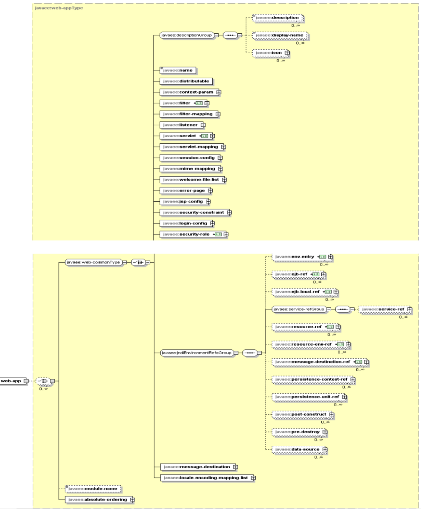</p>

### 2、description 元素
description 元素提供了父元素的文本描述。此元素不仅出现在 web-app 元素中，其他很多元素中也有。它有
一个可选属性 xml:lang 指明描述中使用哪一种语言。该属性的默认值是英语（“en”）。
### 3、display-name 元素
display-name 元素包含一个简短的名称，目的是通过工具显示。显示名称不必是唯一的。这个元素有一个可
选属性 xml:lang 用于指定语言。
### 4、icon 元素
icon 元素包含 small-icon 和 large-icon 元素，为大型和小型 GIF 或 JPEG 图标图片指定文件名，用于在 GUI
工具中表示父元素。
### 5、distributable 元素
distributable 元素表示设定该 Web 应用程序适合部署到一个分布式的 servlet 容器中。
### 6、context-param 元素
context-param 元素包含了 Web 应用程序的 servlet 上下文初始化参数的声明。
### 7、filter 元素
filter 元素声明了 Web 应用程序中的过滤器。该过滤器映射到一个 servlet 或 filter-mapping 元素中的一个 URL
模式，使用 filter-name 的值来引用。过滤器在运行时可以通过 FilterConfig 接口访问部署描述文件中声明的
初始化参数。filter-name 元素是过滤器的逻辑名称。它在 Web 应用程序中必须是唯一的。filter-name 元素的
元素内容不能为空。filter-class 是过滤器的完全限定类名。init-param 元素包含的名值对作为此过滤器的初
始化参数。当指定可选的 async-supported 元素时，表示该过滤器支持异步请求处理。

图 14-2 过滤器元素结构
<p align="center">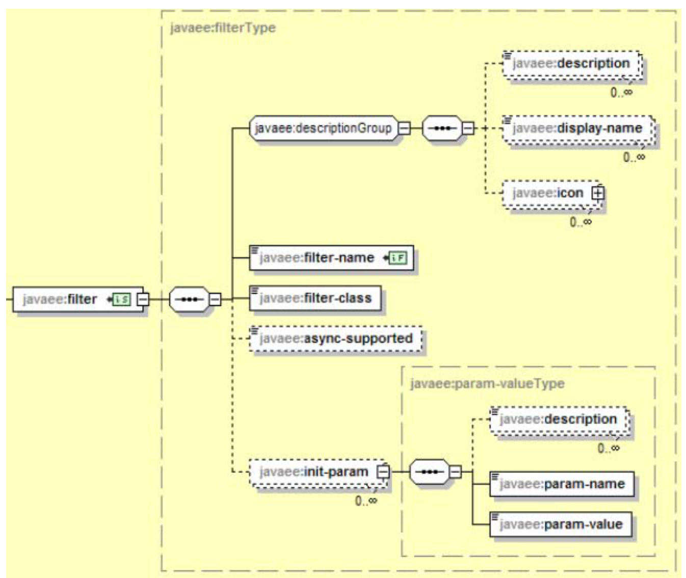</p>

### 8、filter-mapping 元素
容器使用 filter-mapping 决定哪个过滤器以什么样的顺序应用到请求。filter-name 的值必须是部署描述文件
中声明的过滤器中的一个。匹配的请求可以被指定为 url-pattern 或 servlet-name。 

图 14-3 filter-mapping 元素结构
<p align="center">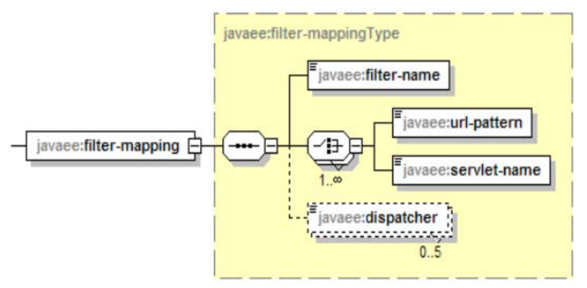</p>

### 9、listener 元素
listener 表示应用程序监听器 bean 的部署属性。子元素 listener-class 声明应用程序中的一个类必须注册为
Web 应用程序监听器 bean。它的值是监听器类的完全限定类名。

图 14-4 listener 元素结构
<p align="center">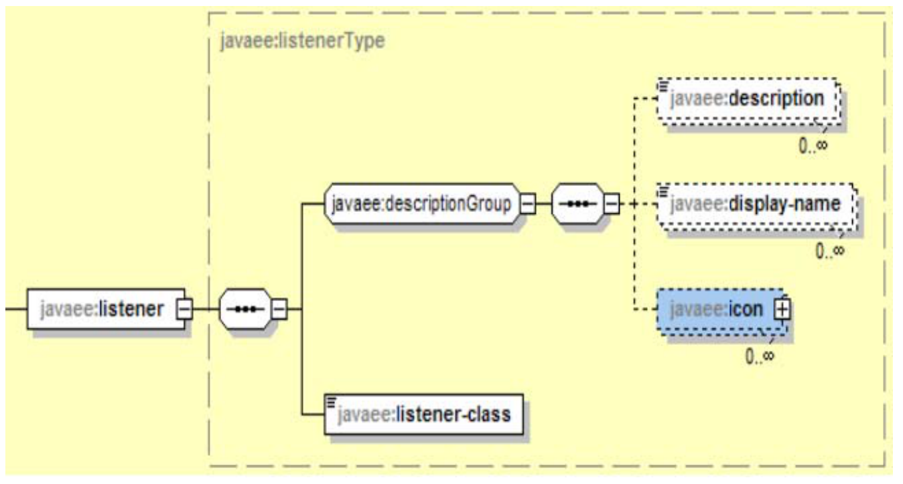</p>

### 10、servlet 元素
servlet 元素用于声明一个 servlet。它包含一个 servlet 的声明性数据。jsp-file 元素包含到以“/”开头的 Web
应用程序中一个 JSP 文件的完全路径。如果指定了 jsp-file 并且存在 load-on-start 元素，那么 JSP 应该被预
编译和加载。servlet-name 元素包含了 servlet 的规范名称。在 Web 应用程序中每个 servlet 的名称是唯一的。
servlet-name 元素内容不能为空。servlet-class 包含了 servlet 的完全限定类名。run-as 元素指定用作一个组件
执行的标识。它包含一个可选的 description，和一个由 role-name 元素指定安全角色。load-on-startup 元素表
示该 servlet 应该在 Web 应用程序启动时加载（实例化并调用它的 init()方法）。该元素的元素内容必须是一
个整数，表示 servlet 应该被加载的顺序。如果该值是一个负整数，或不存在该元素，容器自由选择什么时
候加载这个 servlet。如果该值是一个正整数或 0，当应用部署后容器必须加载和初始化这个 servlet。容器必
须保证较小整数标记的 servlet 在较大整数标记的 servlet 之前加载。容器可以选择具有相同 load-on-startup
值的 servlet 的加载顺序。security-role-ref 元素声明组件中或部署组件的代码中的安全角色引用。它由一个
可选的 description，在代码中使用的安全角色名称（role-name），以及一个可选的到一个安全角色（role-link）
的链接组成。如果没有指定安全角色，部署器必须选择一个合适的安全角色。当指定了可选的
async-supported 元素，指示的 servlet 可以支持异步请求处理。如果一个 servlet 支持文件上传功能和
mime-multipart 请求处理，通过描述文件中的 multipart-config 元素能够提供相同的配置。multipart-config 元
素可用于指定文件存储的位置，上传文件大小的最大值，最大请求大小和文件将写入磁盘之后的大小阈值。

图 14-5 servlet 元素结构
<p align="center"></p>

### 11、servlet-mapping 元素
servlet-mapping 定义了 servlet 和 URL 模式之间的映射。

图 14-6 servlet-mapping 元素结构
<p align="center">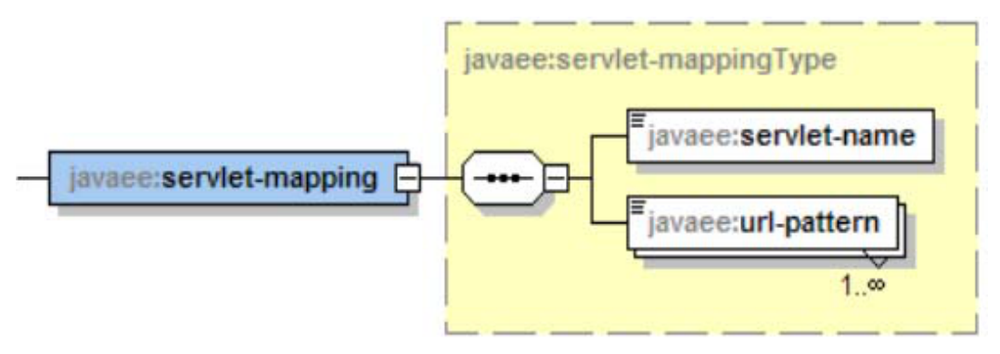</p>

### 12、session-config 元素
session-config 元素定义了该 Web 应用程序的会话参数。子元素 session-timeout 定义了该 Web 应用程序中创
建的所有会话的默认超时时间间隔。指定的超时时间必须使用分钟数表示。如果超时时间小于或等于 0，
容器将确保会话的默认行为永远不会超时。如果没有指定这个元素，容器必须设置它的缺省超时期限。

图 14-7 session-config 元素结构
<p align="center">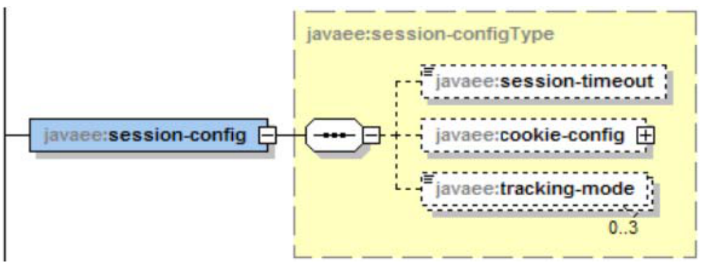</p>

### 13、mime-mapping 元素
mime-mapping 定义了扩展名和 MIME 类型之间的映射。extension 元素包含一个字符串描述的扩展名，例
如“txt”。 

图 14-8 mime-mapping 元素结构
<p align="center">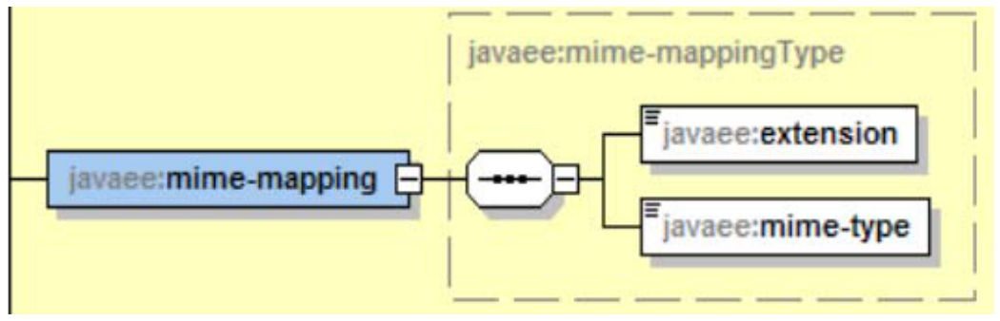</p>

### 14、welcome-file-list 元素
welcome-file-list 包含了一个有序的欢迎文件列表。子元素 welcome-file 包含一个用作缺省欢迎文件的文件
名，如 index.html 

图 14-9 welcome-file-list 元素结构
<p align="center"></p>

### 15、error-page 元素
error-page 包含一个错误代码或异常类型到 Web 应用程序中资源的路径之间的映射。不过，error-code 或
exception-type 元素可以省略来指定一个默认的错误页面。子元素 exception-type 包含了一个 Java 异常类型
的完全限定名称。子元素 location 包含了 web 应用程序中相对于 web 应用程序根目录的资源位置。location
的值必须以'/'开头。

图 14-10 error-page 元素结构
<p align="center">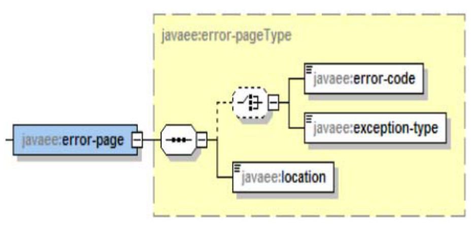</p>

### 16、jsp-config 元素
jsp-config 用来提供 Web 应用程序中的 JSP 文件的全局配置信息。它有两个子元素，taglib 和
jsp-property-group。taglib 元素可用来为 Web 应用程序中的 JSP 页面使用的标签库提供信息。详细信息请参
阅 JavaServer Pages 规范 2.1 版本。

图 14-11 jsp-config 元素结构
<p align="center">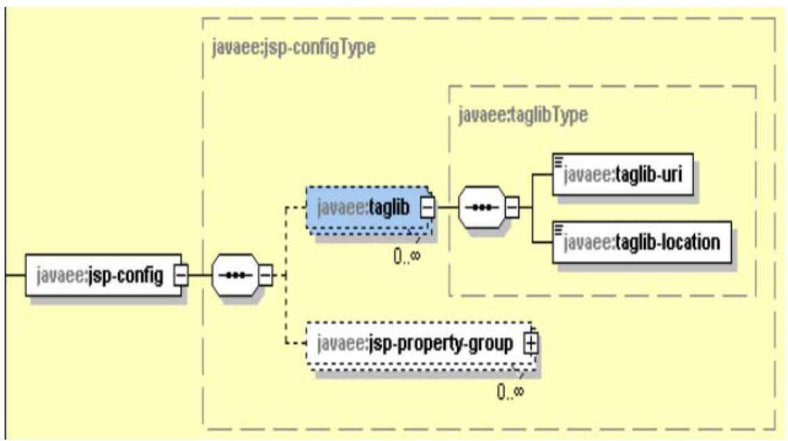</p>

### 17、security-constraint 元素
security-constraint 用于关联安全约束和一个或多个 Web 资源集合。子元素 web-resource-collection 确定安全
约束应用到哪一些 Web 应用程序中资源的子集和这些资源的 HTTP 方法。auth-constraint 表示用户角色应该
允许访问此资源集合。这里使用的 role-name 必须与该 Web 应用程序定义的其中一个 security-role 元素的
role-name 对应，或者是指定的保留 role-name“*”对应，这是一个表示 web 应用程序中的所有角色的紧凑语
法。如果“*”和角色名都出现了，容器会将此解释为所有角色。如果没有定义角色，不允许任何用户访问由
包含 security-constraint 所描述的 Web 应用程序的部分。当容器确定访问时匹配角色名称是区分大小写的。
user-data-constraint 表示客户端和容器之间的通信数据如何受到子元素 transport-guarantee 的保护。
transport-guarantee 的合法值是 NONE，INTEGRAL 或 CONFIDENTIAL 之一。

图 14-12 security-constraint 元素结构
<p align="center">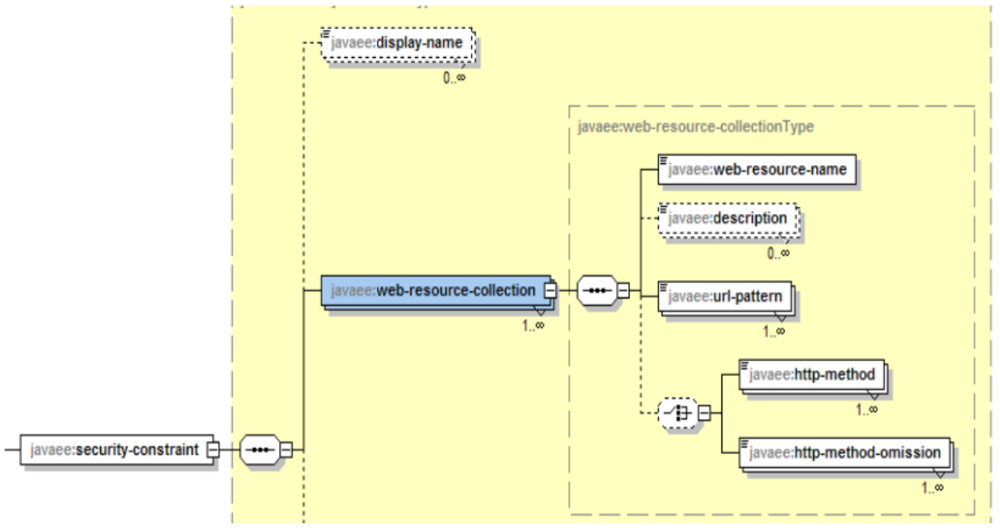</p>
<p align="center">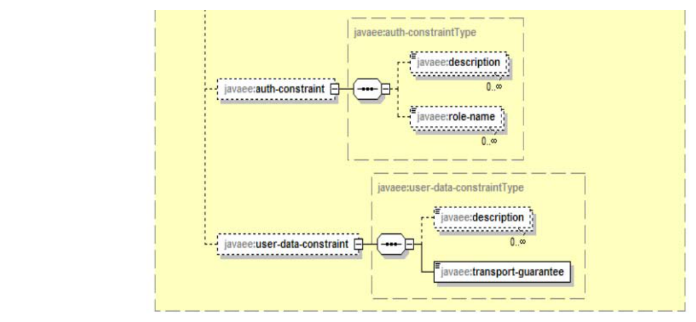</p>

### 18、login-config 元素
login-config 用于配置应该使用的验证方法，可用于此应用程序的领域名，以及表单登录机制所需要的属性。
子元素 auth-method 为 Web 应用程序配置验证机制。该元素的内容必须是 BASIC、DIGEST、FORM、
CLIENT-CERT、或 vendor-specific 验证模式。realm-name 表示为 Web 应用程序选择用于验证模式的领域名。
form-login-config 指定应该用于基于表单登录的登录和错误页面。如果不使用基于表单的登录方式，这些元
素将被忽略。

图 14-13 login-config 元素结构
<p align="center">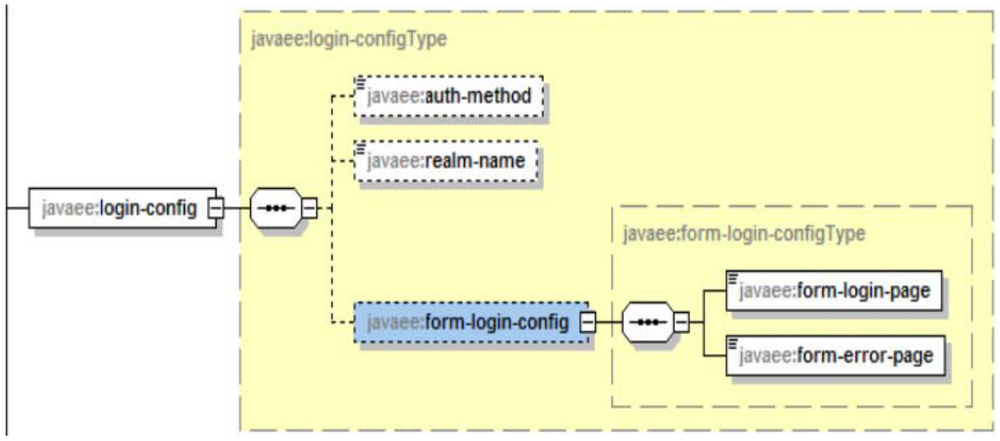</p>

### 19、security-role 元素
security-role 定义了一个安全角色。子元素 role-name 指定安全角色的名称。该名称必须符合 NMTOKEN 的
词法规则。

图 14-14 security-role 元素结构
<p align="center">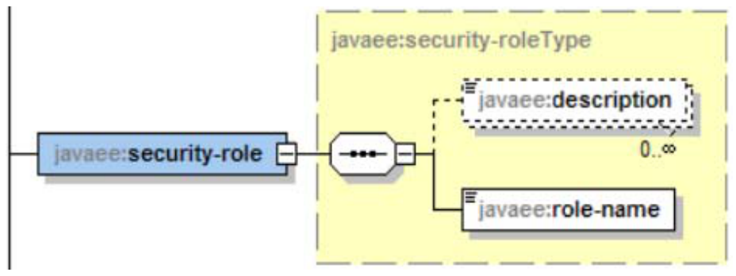</p>

### 20、env-entry 元素
env-entry 声明了一个应用程序的环境入口。子元素 env-entry-name 包含部署组件环境入口的名称。这个名
称是一个相对于 java:comp/env 上下文的 JNDI 名称。在部署组件中该名称必须是唯一的。env-entry-type 包
含了应用程序代码所期望的环境入口值的 Java 类型完全限定名。子元素 env-entry-value 指定部署组件的环
境入口值。该值必须是一个 String，对指定的使用一个 String 或 java.lang.Character 类型作为参数的构造器
有效。可选的 injection-target 元素用来定义把指定的资源注入到字段或 JavaBean 属性。injection-target 指定
了类中应该被注入资源的类和名称。injection-target-class 指定了注入目标的完全限定类名称。

injection-target-name 指定了指定类中的目标。首先把查找目标作为一个 JavaBean 属性名称。如果没有找到，
则把查找目标作为一个字段名。在类初始化期间通过调用目标属性的 set 方法或给名称字段设置一个值将指
定的资源注入到目标。如果环境入口指定了一个 injection-target，那么 env-entry-type 可以省略或必须与注
入目标的类型匹配。如果没有指定 injection-target，那么需要指定 env-entry-type。 
图 14-15 env-entry 元素结构
<p align="center">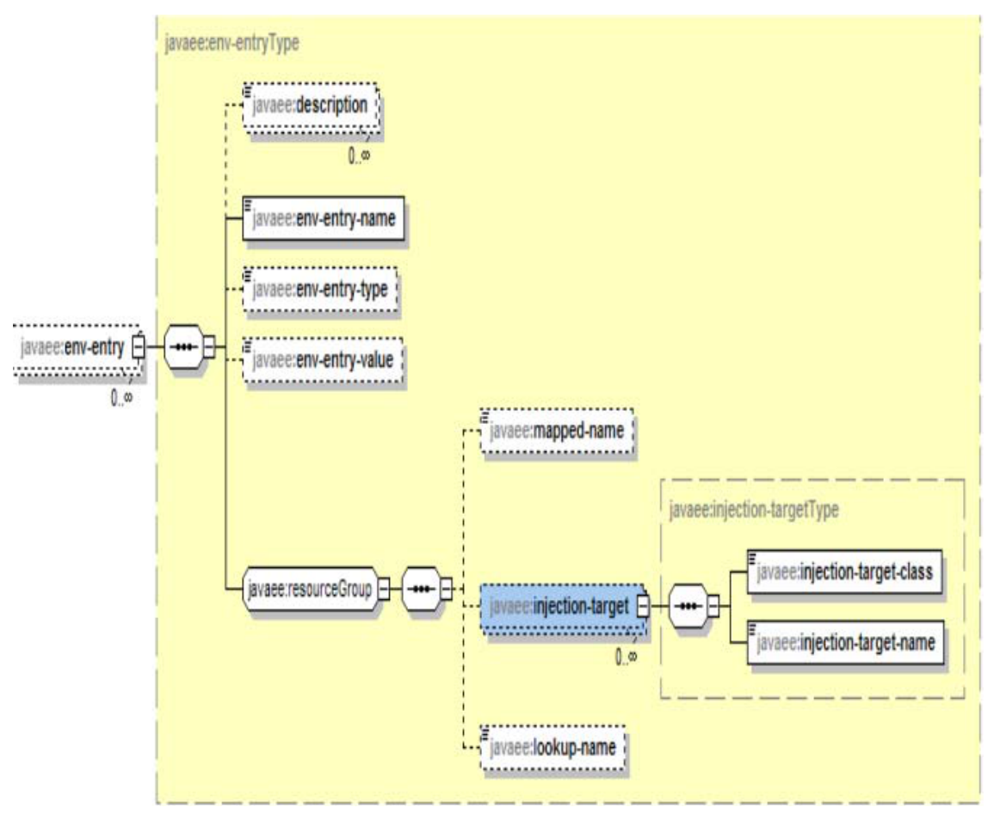</p>

### 21、ejb-ref 元素
ejb-ref 声明了一个对企业 bean 的 home 引用。ejb-ref-name 指定了引用企业 bean 的部署组件代码中使用的
名称。ejb-ref-type 是引用的企业 bean 期望的类型，它可以是 Entity 或 Session。home 定义了引用的企业 bean
的 home 接口的完全限定名称。remote 定义了引用的企业 bean 的 remote 接口的完全限定名称。ejb-link 指
定了连接到企业 bean 的一个 EJB 引用。更多详细信息请参阅 Java 平台企业版第 6 版。除了这些元素之外，
injection-target 元素可以用于定义指定的企业 bean 注入到一个组件的字段或属性。

图 14-16 ejb-ref 元素结构
<p align="center">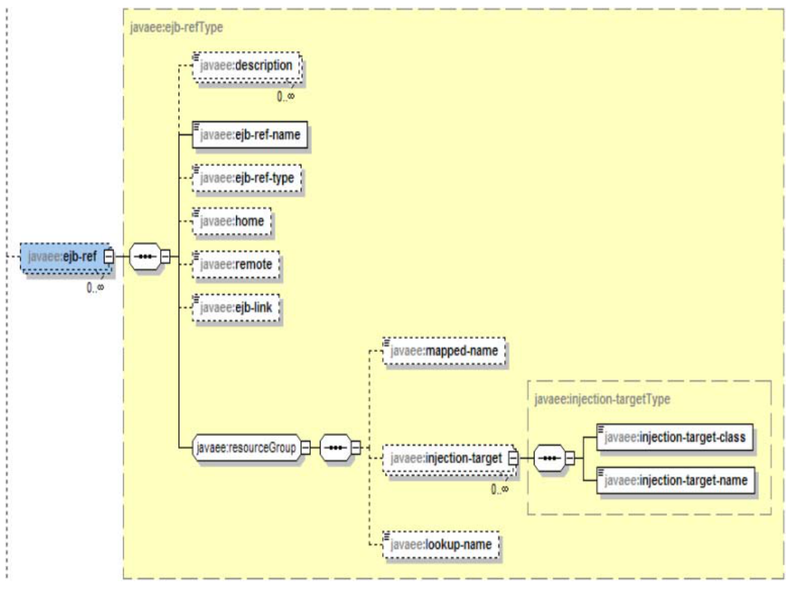</p>

### 22、ejb-local-ref 元素
ejb-local-ref 声明了对企业 bean 的本地 home 引用。local-home 定义了企业 bean 的本地 home 接口的完全限
定名称。local 定义了企业 bean 的本地接口的完全限定名称。

图 14-17 ejb-local-ref 元素结构
<p align="center">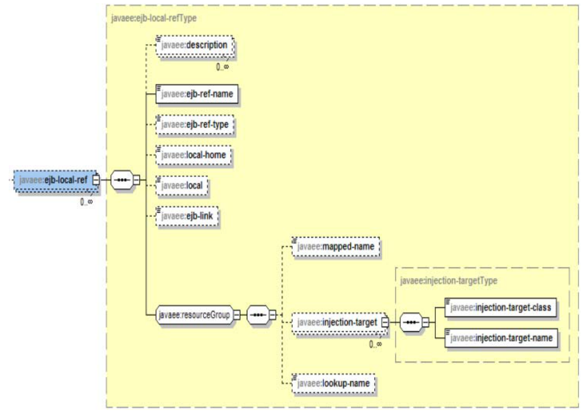</p>

### 23、service-ref 元素
service-ref 声明了一个对 Web service 的引用。service-ref-name 声明了用于查找 Web service 模块组件的逻辑
名称。建议所有 service 的引用名称以/service/ 开头。service-interface 定义了客户端依赖的 JAX-WS Service
接口的完全限定类名称。在大多数情况下，这个值
是 javax.xml.rpc.Service。也可以指定一个 JAX-WS 生成的服务接口类。 wsdl-file 元素包含了 WSDL 文件
的 URI 位置。这个位置相对于模块根目录。jaxrpc-mapping-file 包含了描述应用程序使用的 Java 接口和
wsdl-file 中的 WSDL 描述之间的 JAX-WS 映射的文件名。这个文件名是一个模块文件中的相对路径。

service-qname 元素声明了具体的被称为 WSDL 的服务元素。如果没有声明 wsdl-file，则不需要指定。

port-component-ref 元素声明了一个在容器中解析服务终端接口到一个 WSDL 端口的客户端依赖关系。它使
用一个特别的端口组件选择性地关联服务终端接口。这仅被容器用于 Service.getPort(Class)方法调用。handler
元素为端口组件声明处理器。处理程序可以使用 HandlerInfo 接口访问 init-param 名值对。如果未指定
port-name ，处理器将与 service 的所有端口关联。详细信息请参阅 JSR-109 规 范
[http://www.jcp.org/en/jsr/detail?id=109]。不属于 Java EE 实现的容器不要求支持这个元素。

图 14-18 service-ref 元素结构
<p align="center">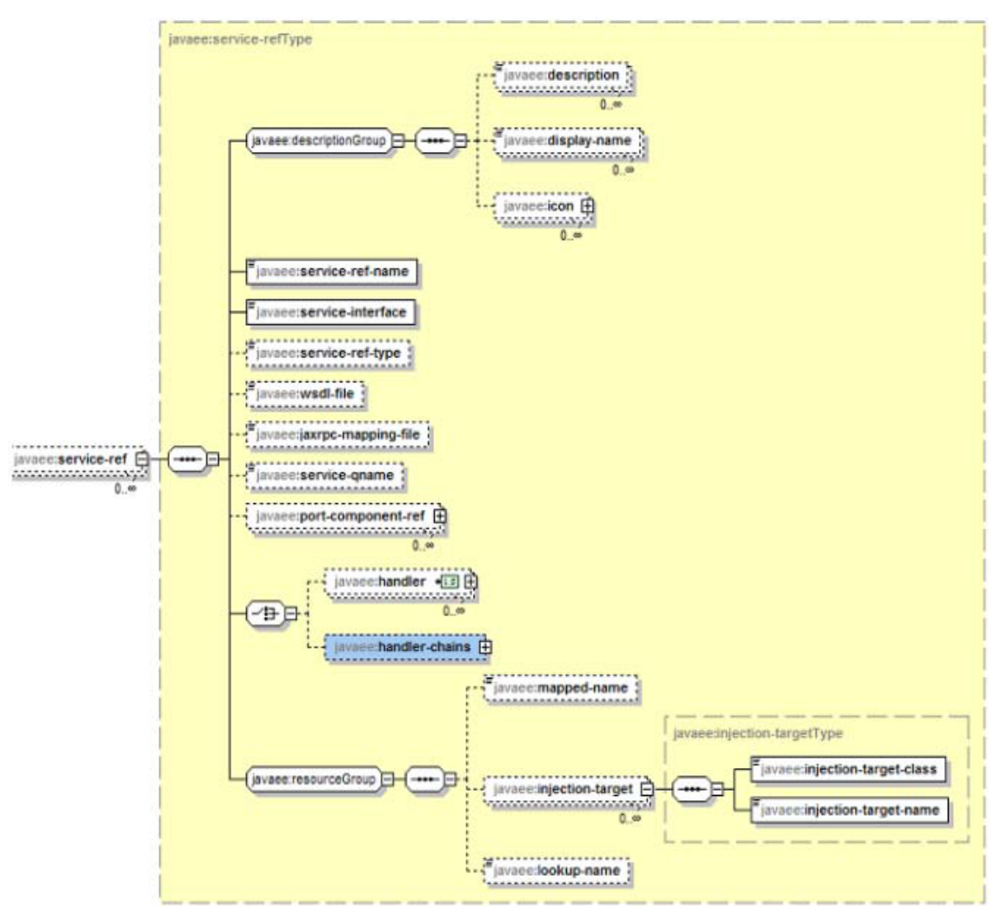</p>

### 24、resource-ref 元素
resource-ref 元素包含了部署组件对外部资源的引用声明。res-ref-name 指定了一个资源管理器连接工厂引用
的名称。这个名称是一个相对于 java:com /env 上下文的 JNDI 名称。在部署文件中这个名称必须是唯一的。
res-type 元素指定数据源的类型。该类型是一个希望由数据源实现的 Java 语言类或接口的完全限定名。

res-auth 指定部署组件代码是否以编程方式注册到资源管理器，或容器是否将代表的部署组件注册到资源管
理器。如果是第二种情况，容器使用部署器提供的信息。res-sharing-scope 指定了通过给定的资源管理器连
接工厂引用获取的连接是否可以共享。如果指定了这个值，它必须是 Shareable 或 Unshareable。可选的
injection-target 元素用于定义把指定的资源注入到字段或 JavaBean 属性。

图 14-19 resource-ref 元素结构
<p align="center">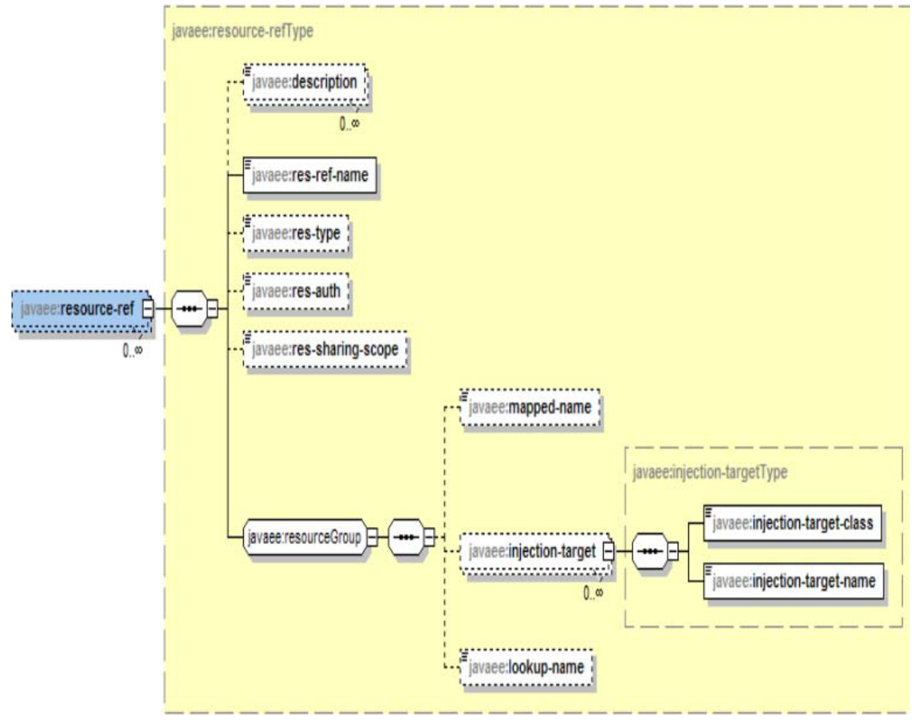</p>

### 25、resource-env-ref 元素
resource-env-ref 包含了部署组件和对部署组件环境中的资源有关的管理对象的引用。resource-env-ref-name
指定了资源环境引用的名称。它的值是部署组件代码中使用的环境入口名称，它是一个相对于 java:comp/env
上下文的 JNDI 名称，并且在部署组件中必须是唯一的。resource-env-ref-type 指定了资源环境引用的类型。
它是一个 Java 语言类或接口的完全限定名。可选的 injection-target 元素用于定义把指定的资源注入到字段
或 JavaBean 属性。必须提供 resource-env-ref-type 除非指定了注入目标，在这种情况下，将使用目标的类型。
如果两者都指定，该类型必须与注入目标的类型兼容。

图 14-20 resource-env-ref 元素结构
<p align="center">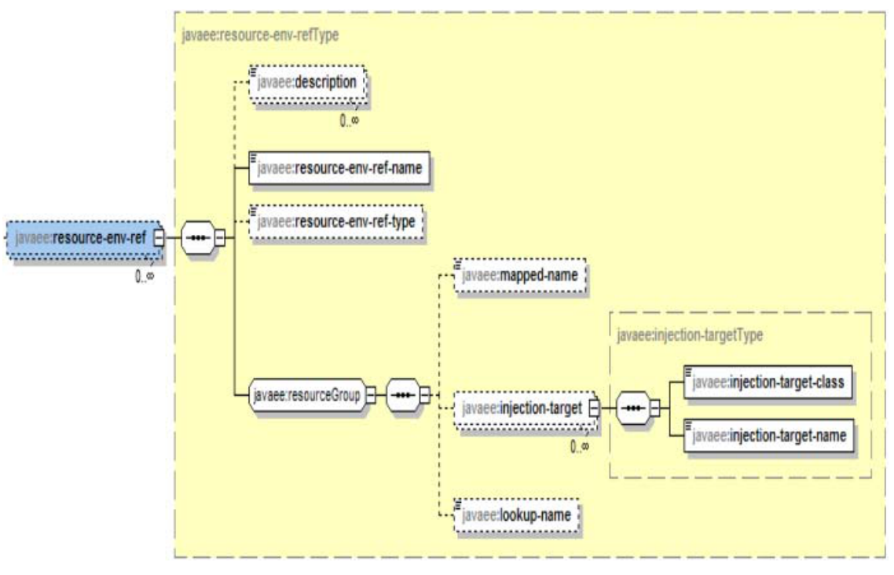</p>

### 26、message-destination-ref 元素
message-destination-ref 元素包含了部署组件和对部署组件环境中的资源有关的消息目标的引用声明。
message-destination-ref-name 元素指定了一个消息目标引用的名称，它的值是部署组件代码中使用的环境入
口名称。这个名称是一个相对于 java:comp/env 上下文的 JNDI 名称，并且在企业 bean 的 ejb-jar 中或其他部
署文件中必须是唯一的。message-destination-type 指定了目标的类型。这个类型由希望目标实现的 Java 接
口指定。message-destination-usage 指定了引用表示的消息目标的用法。这个值表示是使用目标信息中的消
息，还是产生目标消息，亦或两者兼而有之。汇编器将使用此信息来连接目标的生产者与消费者。

message-destination-link 把一个消息目标引用或消息驱动 bean 连接到一个消息目标。汇编器设置这个值来反
映应用程序中的生产者和消费者消息流。

这个值必须是同一个部署文件或同一个 Java EE 应用程序单元的另一个部署文件中的消息目标的
message-destination-name。或者，这个值可以由一个路径名称组成，使用目标添加的 message-destination-name
和通过"#"分隔路径名称说明一个部署文件包含引用的消息目标。这个路径名称是相对于部署文件，包含引
用消息目标的部署组件。这允许多个消息目标使用相同的名称作为唯一标识。可选的 injection-target 元素用
于定义把指定的资源注入到字段或 JavaBean 属性。必须指定 message-destination-type 除非注入目标已经指
定，在这种情况下，将使用目标的类型。如果两者都指定，该类型必须与注入目标的类型兼容。
示例：
```xml
<message-destination-ref> 
<message-destination-ref-name> 
jms/StockQueue 
</message-destination-ref-name> 
<message-destination-type> 
javax.jms.Queue 
</message-destination-type> 
<message-destination-usage> 
Consumes 
</message-destination-usage> 
<message-destination-link> 
CorporateStocks 
</message-destination-link> 
</message-destination-ref> 
```

图 14-21 message-destination-ref 元素结构
<p align="center">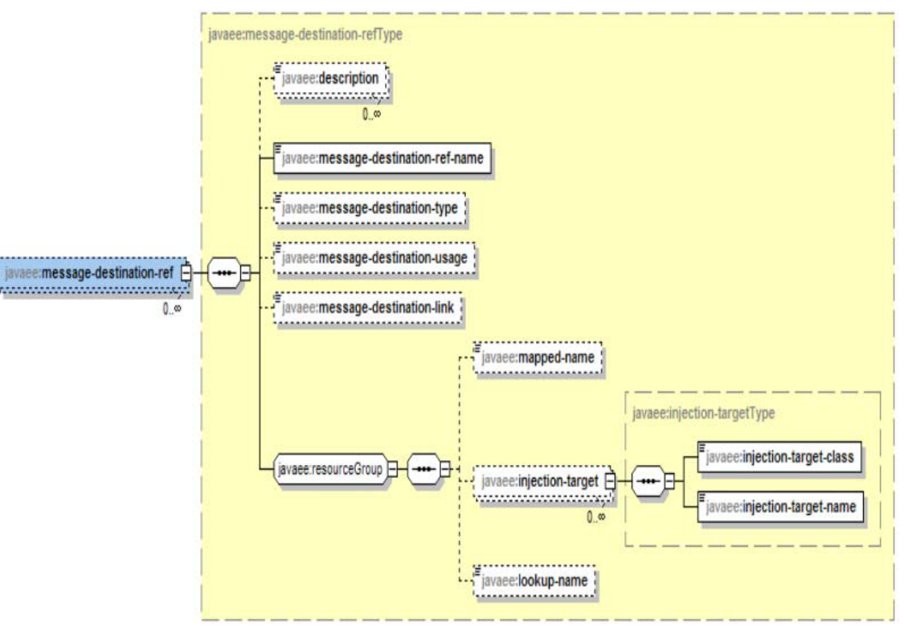</p>

### 27、message-destination 元素
message-destination 指定消息的目标。这个元素所描述的逻辑目标由部署器映射到物理目标。
message-destination-name 元素指定了消息目标的名称。该名称在部署文件的消息目标名称中必须是唯一的。
示例：
```xml
<message-destination> 
<message-destination-name> 
CorporateStocks 
</message-destination-name> 
</message-destination> 
```

图 14-22 message-destination 元素结构
<p align="center">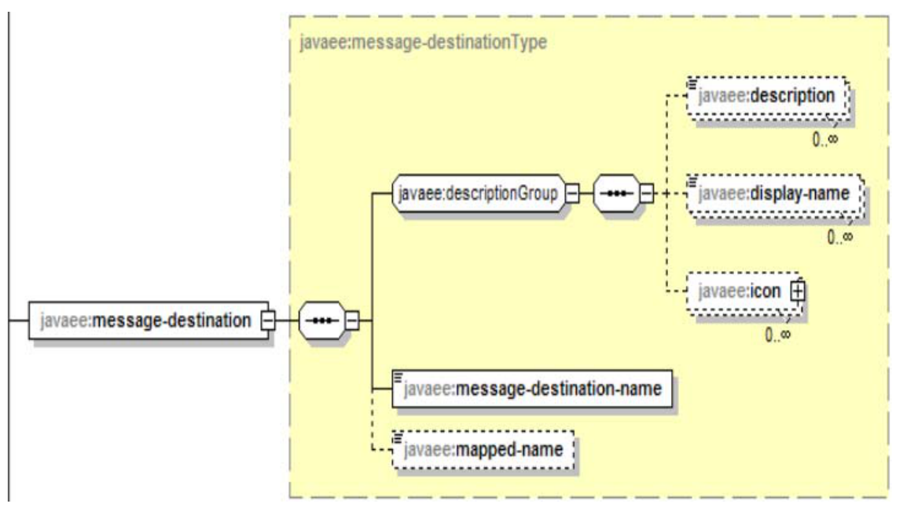</p>

### 28、locale-encoding-mapping-list 元素
locale-encoding-mapping-list 包含了语言环境和编码之间的映射。由子元素 locale-encoding-mapping 指定。
示例：
```xml
<locale-encoding-mapping-list> 
<locale-encoding-mapping> 
<locale>ja</locale> 
<encoding>Shift_JIS</encoding> 
</locale-encoding-mapping> 
</locale-encoding-mapping-list> 
```

图 14-23 locale-encoding-mapping-list 元素结构
<p align="center">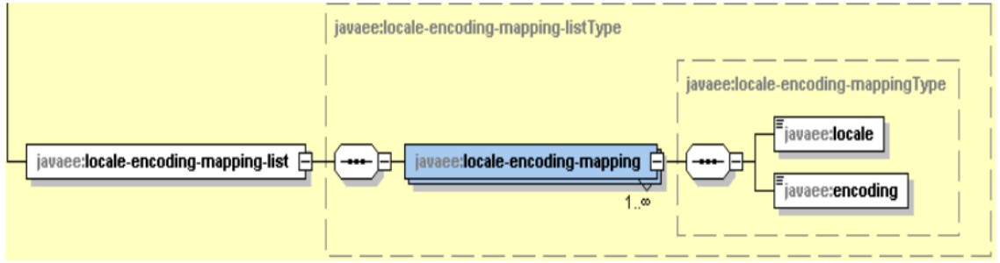</p>


## 14-5、 实例
下面的例子说明了部署描述文件模式中列出的定义的用法。
## 14-5-1、一个简单的例子 
代码示例 14-1 基本部署描述文件示例
```xml
<?xml version="1.0" encoding="ISO-8859-1"?> 
<web-app xmlns="http://java.sun.com/xml/ns/j2ee" 
xmlns:xsi="http://www.w3.org/2001/XMLSchema-instance" 
xsi:schemaLocation="http://java.sun.com/xml/ns/j2ee 
http://java.sun.com/xml/ns/j2ee/web-app_2_5.xsd" version=”2.5”> 
<display-name>A Simple Application</display-name> 
<context-param> 
<param-name>Webmaster</param-name> 
<param-value>webmaster@mycorp.com</param-value> 
</context-param> 
<servlet> 
<servlet-name>目录</ servlet 的名称> 
<servlet-class>com.mycorp.CatalogServlet 
</servlet-class> 
<init-param> 
<param-name>catalog</param-name> 
<param-value>Spring</param-value> 
</init-param> 
</servlet>
<servlet-mapping> 
<servlet-name>catalog</servlet-name> 
<url-pattern>/catalog/*</url-pattern> 
</servlet-mapping> 
<session-config> 
<session-timeout>30</session-timeout> 
</session-config> 
<mime-mapping> 
<extension>pdf</extension> 
<mime-type>application/pdf</mime-type> 
</mime-mapping> 
<welcome-file-list> 
<welcome-file>index.jsp</welcome-file> 
<welcome-file>index.html</welcome-file> 
<welcome-file>index.htm</welcome-file> 
</welcome-file-list> 
<error-page> 
<error-code>404</error-code> 
<location>/404.html</location> 
</error-page> 
</web-app>
```

## 14-5-2、安全示例
代码示例 14-2 部署描述文件使用安全示例
```xml
<?xml version="1.0" encoding="ISO-8859-1"?> 
<web-app xmlns="http://java.sun.com/xml/ns/j2ee" 
xmlns:xsi="http://www.w3.org/2001/XMLSchema-instance" 
xsi:schemaLocation="http://java.sun.com/xml/ns/j2ee 
http://java.sun.com/xml/ns/j2ee/web-app_2_5.xsd" version=”2.5”> 
<display-name>A Secure Application</display-name> 
<servlet> 
<servlet-name>catalog</servlet-name> 
<servlet-class>com.mycorp.CatalogServlet 
</servlet-class> 
<init-param> 
<param-name>catalog</param-name> 
<param-value>Spring</param-value> 
</init-param> 
<security-role-ref> 
<role-name>MGR</role-name> 
<!-- role name used in code --> 
<role-link>manager</role-link> 
</security-role-ref> 
</servlet> 
<security-role> 
<role-name>manager</role-name> 
</security-role> 
<servlet-mapping> 
<servlet-name>catalog</servlet-name> 
<url-pattern>/catalog/*</url-pattern> 
</servlet-mapping> 
<security-constraint> 
<web-resource-collection> 
<web-resource-name>SalesInfo 
</web-resource-name> 
<url-pattern>/salesinfo/*</url-pattern> 
<http-method>GET</http-method> 
<http-method>POST</http-method> 
</web-resource-collection> 
<auth-constraint> 
<role-name>manager</role-name> 
</auth-constraint> 
<user-data-constraint> 
<transport-guarantee>CONFIDENTIAL 
</transport-guarantee> 
</user-data-constraint> 
</security-constraint> 
</web-app>
```


# 15、与其它规范有关的要求
本章列出对 web 容器的要求，它已经包含在容器产品中了，还包括其他 Java 技术。

下面章节中任何涉及到 Java EE 应用的 profile，不只是完整的 Java EE profile，还包括任何支持 Servelt 的
profile，像 Java EE Web Profile。有关配置文件的更多信息，请参阅 Java EE 平台规范。
## 15-1、会话
属于 Java EE 实现的分布式 servlet 容器必须支持其他 Java EE 对象从一个 JVM 迁移到另一个 JVM 所必需
的机制。
## 15-2、web应用程序
### 15-2-1、Web应用程序类加载器
Servlet 容器是一个 Java EE 产品的一部分，不应该允许应用程序重写 Java SE 或 Java EE 平台的类，比如那
些在 Java.*和 javax.*命名空间中的类，Java SE 或 Java EE 不允许被修改。
### 15-2-2、Web应用程序环境
Java EE 定义了一个命名的环境，允许应用程序在没有明确的知道外部信息是如何命名和组织的情况下轻松
地访问资源和外部信息。

由于 servlet 是 Java EE 技术的一个完整的组件类型，已经在 Web 应用程序部署文件中规定了允许 servlet 获
取引用资源和企业 bean 的指定信息。此包含信息的的部署元素有：
> * env-entry 
> * ejb-ref 
> * ejb-local-ref 
> * resource-ref 
> * resource-env-ref 
> * service-ref 
> * message-destination-ref 
> * persistence-context-ref 
> * persistence-unit-ref 
开发人员使用这些元素来描述在 Web 容器中运行时 Web 应用程序需要在 JNDI 命名空间中注册的某些对
象。

Java EE 规范第 5 章中描述了关于 Java EE 环境设置的要求。

Servlet 容器属于 Java EE 技术标准实现的一部分，它必须支持这种语法。查阅 Java EE 规范可获取更多详细
信息。这种类型的 servlet 容器必须支持查找这种对象并在受 servlet 容器管理的线程上执行时调用这些对象。
当在开发人员创建的线程上执行时，这种类型的 servlet 容器应该支持这种行为，但目前没有要求这样做。
这样的规定将被添加到本规范的下一个版本中。开发人员应该小心，不推荐应用程序创建的线程依赖这种
能力，因为它是不可移植的。
### 15-2-3、Web模块上下文根URL的JNDI名称
Java EE 平台规范定义了一个标准化的全局 JNDI 命名空间和一系列相关的命名空间映射到不同的 Java EE
应用程序范围。应用程序可以使用这些命名空间可移植地检索组件和资源的引用。本节定义的 Web 应用程
序的基本 URL 是需要注册的 JNDI 名称。

为一个 Web 应用程序上下文根目录预定义的 java.net.URL 资源的名称的语法如下：
全局命名空间中 java:global[/<app-name>]/<module-name>!ROOT ，应用程序指定的命名空间中
java:app/<module-name>!ROOT。

确定应用程序名称和模块名称的规则请参阅 Java EE 规范 8.1.1 节（组件创建）和 8.1.2 节（应用程序组装）。
只有当 Web 应用打包成一个.ear 文件时才适合使用<app-name>。

java:app 前缀允许一个组件内执行的 Java EE 应用程序来访问特定于应用程序的命名空间。java:app 名称允
许一个企业应用程序中的模块引用同一个企业应用程序中其他模块的上下文根目录。<module-name>是
java:app url 语法的必要组成部分。

示例

然后，可以在应用程序使用上述的 URL，如下：

如果 Web 应用程序使用模块名称 myWebApp 独立部署。URL 可被注入到另一个 web 模块，如下：

代码示例 15-1 
```java
@Resource(lookup=“java:global/myWebApp!ROOT”) 
URL myWebApp; 
```

当打包到一个名为 myApp 的 EAR 文件中时，可像下面这样使用：
代码示例 15-2 
```java
@Resource(lookup=“java:global/myApp/myWebApp!ROOT”) 
URL myWebApp;
```

## 15-3、安全性
本节详细介绍了 Web 容器包含在一个产品中时额外的安全性要求，还包含 EJB、JACC 和（或）JASPIC。
以下各节将介绍这些要求。
### 15-3-1、EJB™调用传播的安全标识
必须始终提供一个安全标识或主体(principal)，用于调用一个企业 bean。从 Web 应用程序中调用企业 Bean
的默认模式是为把 Web 用户的安全标识传播到 EJB 容器。

在其他情况下，Web 容器必须允许不了解 Web 容器或 EJB 容器的 web 用户进行调用：
> * Web 容器必须支持未把自己授权给容器的用户访问 Web 资源。这是在互联网上访问 Web 资源常见的模式。
> * 应用程序代码可以是单点登录和基于调用者标识的定制化数据的唯一处理器。

在这些情况下，Web 应用程序部署描述文件可以指定一个 run-as 元素。当为 Servlet 指定了一个 run-as 角色
时，Servlet 容器必须传播主要的映射到该角色，作为任何从 Servlet 到 EJB 调用的安全标识，包括从 Servlet
的 init 和 destory 方法进行原始调用。安全角色名必须是为 Web 应用程序定义的安全角色名称之一。

由于 Web 容器作为 Java EE 平台的一部分运行，在同一个 Java EE 应用程序中调用 EJB 组件，以及调用部
署在其他 Java EE 中的应用程序都必须支持 run-as 元素的使用。
### 15-3-2、容器授权的要求
在 Java EE 产品中或包括支持 Java 容器授权合约（JAAC, i.e, JSR 115）的产品中，所有 Servlet 容器必须实
现支持 JACC。JACC 规范可在此处下载 http://www.jcp.org/en/jsr/detail?id=115
### 15-3-3、容器认证的要求
在 Java EE 产品中或包括支持 Java 容器认证 SPI（JASPIC, i.e, JSR 196）的产品中，所有 Servlet 容器必须实
现 JASPIC 规范的 Servlet 容器 Profile。JASPIC 规范可在此处下载 http://www.jcp.org/en/jsr/detail?id=196
## 15-4、部署
本节将详述一个符合 JavaEE 技术的容器和包含支持 JSP 和/或 Web Service 的产品的部署描述符、打包和部
署描述符处理的要求。
### 15-4-1、部署描述符元素
以下附加元素存在于 Web 应用程序部署描述符，用于满足 Web 容器开启 JSP 页面的要求，或作为 JavaEE
应用服务器的一部分。它们不需要由希望仅支持 Servlet 规范的容器支持：
> * jsp-config 
> * 用于描述资源引用的语法 (env-entry, ejb-ref, ejb-local-ref, resource-ref, resource-env-ref) 
> * 指定消息目的地的语法 (message-destination, message-destination-ref) 
> * 引用 Web Service (service-ref) 
> * 引用持久化上下文(persistence-context-ref) 
> * 引用持久化单元 (persistence-unit-ref) 

这些元素的语法现在由 Java 服务器页面（JavaServer Pages）规范 2.2 版本，和 Java EE 规范控制。
### 15-4-2、打包和JAX-WS组件部署
Web 容器可以选择支持运行实现 JAX-PRC 和/或 JAX-WS 规范定义的 Web 服务端点（endpoint）编写的组
件。需要 Web 容器嵌入一个 Java EE 符合的实现来支持 JAX-RPC 和 JAX-WS Web Service 组件。本节描述
了 Web 容器包括也支持 JAX-RPC 和 JAX-WS 的产品的打包和部署模型。

JSR-109 [http://jcp.org/jsr/detail/109.jsp]定义了用于打包 Web service 接口与它关联的 WSDL 描述和关联的类
的模型。它定义了一种机制用于启用了 JAX-WS 和 JAX-RPC 的容器链接到一个实现了这个 Web service 的
组件。一个 JAX-WS 或 JAX-RPC Web service 实现组件使用 JAX-WS 和/或 JAX-RPC 规范定义的 API，其
定义了它与启用了 JAX-WS 和/或 JAX-RPC 的 Web 容器之间的契约。它被打包到 WAR 文件。Web service
开发人员使用平常的<servlet>声明来声明这个组件。

启用了 JAX-WS 和 JAX-RPC 的 Web 容器必须支持开发人员在使用的 Web 部署描述符中定义用于端点实现
组件的如下信息，使用与 HTTP Servlet 组件使用的 Servlet 元素相同的语法。子元素用于以如下方式指定端
点信息：
> * servlet-name 元素定义可用于找出 WAR 中的处于其他组件中的这个端点描述的逻辑名字
> * servlet-class 元素提供这个端点实现的全限定 Java 类名
> * description 元素可以用于描述该组件，并可能显示在一个工具中
> * load-on-startup 元素指定 Web 容器中的组件相对于其它组件的初始化顺序
> * security-role-ref 元素可以用于测试是否已通过身份认证的用户在一个逻辑安全角色中
> * run-as 元素可以用于覆盖该组件到 EJB 调用的身份传播

由开发人员定义的用于这个组件的任何 Servlet 初始化参数可能被容器忽略。此外，启用了 JAX-WS 和
JAX-RPC 的 Web 组件继承了用于定义如下信息的传统 Web 组件机制：
> * 使用 Servlet 映射技术映射组件到 Web 容器的 URL 命名空间
> * 使用安全约束在 Web 组件上授权约束
> * 能够使用 servlet 过滤器提供底层（low-level）字节流支持，用于使用过滤器映射技术操纵 JAX-WS 和/ 或 JAX-RPC 消息
> * 任何与组件关联的 HTTP 会话的超时特性
> * 链接到存储在 JNDO 命名空间的 Java EE 对象

所有上述要求可使用定义在 8-69 页 8.2 节的“可插拔性”的插拔机制得到满足。
### 15-4-3、处理部署描述符的规则
符合 Java EE 技术实现一部分的容器和工具，需要根据 XML schema 验证部署描述符结构的正确性。建议
验证，但对于不符合 Java EE 技术实现的 web 容器和工具不是必须的。
## 15-5、注解和资源注入
Java 元数据（Metadata）规范（JSR-175），是 J2SE 和更高版本的一部分，提供一种在 Java 代码中指定配置
数据的方法。Java 代码中的元数据也被称为注解。在 JavaEE 中，注解用于声明对外部资源的依赖和在 Java
代码中的配置数据而无需在配置文件中定义该数据。

本节描述了在 Java EE 技术兼容的 Servlet 容器中注解和资源注入的行为。本节扩展了 Java EE 规范第 5 节
标题为“资源，命名和注入”。

注解必须支持以下容器管理的类，其实现了以下接口并声在 web 应用部署描述符中明，或使用定义在 8-65
页 8.1 节“注解和可插拔性”的注解声明或编程式添加的。

表 15-1 支持注解和依赖注入的组件和接口
> 组件类型 | 实现以下接口的类
> ------- | --------------
> Servlet | javax.servlet.Servlet 
> Filter | javax.servlet.Filter 
> Listener | javax.servlet.ServletContextListener ServletContextAttributeListener ServletRequestListener ServletRequestAttributeListener http.HttpSessionListener http.HttpSessionAttributeListener http.HttpSessionIdListener AsyncListener 

Web 容器不需要为存在注解的除了上表 15-1 列出的那些类执行资源注入。

引用必须在任何生命周期方法调用之前注入，且组件实例对应用是可用的。

在一个 web 应用中，使用资源注入的类只有当它们位于 WEB-INF/classes 目录，或如果它们被打包到位于
WEB-INF 目录下的 jar 文件中，它们的注解将被处理。容器可以选择性地为在其他地方的应用类路径中找
到的类处理资源注入注解。

Web 应用部署描述符的 web-app 元素上包含一个 metadata-complete 属性。metadata-complete 属性定义了
web.xml 描述符是否是完整的，或是否应考虑部署过程中使用的其他资源的元数据。元数据可能来自
web.xml 文件、web-fragment.xml 文件、WEB-INF/classes 中的类文件上的注解、和 WEB-INF/lib 目录中的
jar 文件中的文件上的注解。如果 metadata-complete 设置为“true”，部署工具仅检查 web.xml 文件且必须忽
略如出现在应用的类文件上的@WebServlet、@WebFilter、和@WebListener 注解，且必须也忽略 WEB-INF/lib
中的打包在 jar 文件的任何 web-fragment.xml 描述符。如果 metadata-complete 没有指定或设置为“false”，
部署工具必须检查类文件和 web-fragment.xml 文件的元数据，就像前面指定的那样。

web-fragment.xml 的 web-fragment 元素也包含了 metadata-complete 属性。该属性定义了对于给定片段的
web-fragment.xml 描述符是否是完整的，或者是否应该扫描相关的 jar 文件中的类中的注解。如果
metadata-complete 设置为“true”，部署工具仅检查 web-fragment.xml 文件且必须忽略如出现在 fragment 的
类文件上的@WebServlet、@WebFilter、和@WebListener 注解。如果 metadata-complete 没有指定或设置为
“false”，部署工具必须检查类文件的元数据。

以下是 Java EE 技术兼容的 web 容器需要的注解。
### 15.5.1 @DeclareRoles 
该注解用于定义由应用安全模型组成的安全角色。该注解指定在类上，且它用于定义能从注解的类的方法
内测试（即，通过调用 isUserInRole）的角色。由于用在@RolesAllowed 而隐式声明的角色，不必使用
@DeclareRoles 注解明确声明。@DeclareRoles 注解仅可以定义在实现了 javax.servlet.Servlet 接口或它的一
个子类的类中。

以下是如果使用该注解的一个例子。

代码示例 15-3 @DeclareRoles 注解示例
```java
@DeclareRoles("BusinessAdmin") 
 public class CalculatorServlet { 
 //... 
 } 
```

声明@DeclareRoles ("BusinessAdmin")等价于如下在 web.xml 中的定义。

代码示例 15-4 @DeclareRoles web.xml 
```xml
<web-app> 
 <security-role> 
 <role-name>BusinessAdmin</role-name> 
 </security-role> 
 </web-app> 
```

该注解不是用于重新链接（relink）应用角色到其他角色。当这样的链接是必需的，它是通过在相关的部署
描述符中定义一个适当的 security-role-ref 来实现。

当从注解的类调用 isUserInRole 时，与调用的类关联的调用者身份以相同名称作为 isCallerInRole 的参数来
测试角色成员身份。如果已经定义了参数 role-name 的一个 security-role-ref，调用者测试映射到 role-name
的角色成员身份。

为进一步了解@DeclareRoles 注解细节，请参考 Java™平台™的通用注解（Common Annotation）规范（(JSR 
250）第 2.10 节。
### 15.5.2 @EJB 注解
企业级 JavaBean™ 3.2 (EJB)组件可以从一个 web 组件使用@EJB 注解引用。@EJB 注解提供了与部署描述
符中声明 ejb-ref 或 ejb-local-ref 元素等价的功能。有一个相应的@EJB 注解的字段被注入一个相应的 EJB
组件的引用。

一个例子：
```java
@EJB private ShoppingCart myCart; 
```


在上述情况下，到 EJB 组件“myCart”的一个引用被注入作为私有字段“myCart”的值，在声明注入的类
可用之前。

进一步了解@EJB 注解的行为请参考 EJB 3.0 规范（JSR 220）第 15.5 节。
### 15.5.3 @EJBs 注解
@EJBs 注解允许在单个资源上声明多于一个@EJB 注解。

一个例子：

代码示例 15-5 @EJBs 注解示例
```java
@EJBs({@EJB(Calculator), @EJB(ShoppingCart)}) 
public class ShoppingCartServlet { 
//... 
} 
```

上面例子中的 EJB 组件 ShoppingCart 和 Calculator 对 ShoppingCartServlet 是可用的。ShoppingCartServlet 仍
然必须使用 JNDI 查找引用，但不需要声明在 web.xml 文件中。

@EJBs 注解讨论的进一步细节请参考 EJB 3.0 规范（JSR 220）第 15.5 节。
### 15.5.4 @Resource 注解
@Resource 注解用于声明到资源的引用，如一个数据源（data source）、Java 消息服务（JMS）目的地、或
环境项（environment entry）。该注解等价于在部署描述符中声明 resource-ref、 message-destination-ref、或
env-ref、或 resource-env-ref 元素。

@Resource 注解指定在一个类、方法或字段上。容器负责注入到由@Resource 注解声明的资源的引用和映
射到适当的 JNDI 资源。请参考 Java EE 规范第 5 章进一步了解细节。

以下是一个@Resource 注解的例子：

代码示例 15-6 @Resource 示例
```java
@Resource private javax.sql.DataSource catalogDS; 
public getProductsByCategory() { 
 // get a connection and execute the query 
 Connection conn = catalogDS.getConnection(); 
.. 
} 
```

在上面的示例代码中，servlet、filter 或 listener 声明一个 javax.sql.DataSource 类型的 catalogDS 字段，在该
组件对应用可用之前由容器注入数据源引用。数据源 JNDI 映射是从字段名“catalogDS”和类型
（javax.sql.DataSource）推导出来的。此外，catalogDS 数据源不再需要定义在部署描述符中。

进一步了解@Resource 注解的语义请参考 Java™平台™的通用注解规范（JSR 250）第 2.3 节和 Java EE 规
范第 5.2.5 节。
### 15.5.5 @PersistenceContext 注解
该注解指定容器管理的用于引用持久化单元（persistence unit）的实体管理器（entity manager）。

一个例子：

代码示例 15-7 @PersistenceContext 示例
```java
@PersistenceContext (type=EXTENDED) 
EntityManager em; 
```

进一步了解@PersistenceContext 注解的行为请参考 Java 持久化 API（Java Persistence API）2.1 版本第 10.5.2
节（JSR 338）。
### 15.5.6 @PersistenceContexts 注解
PersistenceContexts 注解允许在一个资源上声明多于一个 @PersistenceContext 。进一步了解
@PersistenceContexts 注解的行为请参考 Java 持久化 API（Java Persistence API）2.1 版本第 10.5.2 节（JSR 
338）。
### 15.5.7 @PersistenceUnit 注解
@PersistenceUnit 注解提供声明在 servlet 中的到企业级 JavaBean 组件实体管理器工厂（entity manager 
factory）的引用。实体管理器工厂绑定到一个单独的 persistence.xml 配置文件，该文件在 EJB 3.2 规范（JSR 
345）中描述。

一个示例：

代码示例 15-8 @PersistenceUnit 示例
```java
@PersistenceUnit 
EntityManagerFactory emf; 
```

进一步了解@ PersistenceUnit 注解的行为请参考 Java 持久化 API（Java Persistence API）2.1 版本第 10.5.2
节（JSR 338）。
### 15.5.8 @PersistenceUnits Annotation 
该注解允许在一个资源上声明多于一个@ PersistentUnit。进一步了解@ PersistentUnits 注解的行为请参考
Java 持久化 API（Java Persistence API）2.1 版本第 10.5.2 节（JSR 338）。
### 15.5.9 @PostConstruct 注解
@ PostConstruct 注解声明在一个无参的方法上，且必须不抛出任何受查异常。返回值必须是 void。该方法
必须在资源注入完成之后被调用且在组件的任何生命周期方法之前被调用。

一个例子：

代码示例 15-9 @PostConstruct 示例
```java
@PostConstruct 
public void postConstruct() { 
... 
} 
```

上面的示例展示了一个使用@ PostConstruct 注解的方法。

@PostConstruct 注解必须支持那些支持依赖注入的所有类并即使该类不要求任何资源注入也会被调用。如
果该方法抛出未受查一次，该类必须不被放入服务中且该实例没有方法被调用。

参考 Java EE 规范第 2.5 节和 Java™平台™的通用注解规范的第 2.5 节获取更多细节。
### 15.5.10 @PreDestroy 注解
@PreDestroy 注解声明在容器管理组件的一个方法上。该方法在容器移除该组件之前调用。

一个例子：

代码示例 15-10 @PreDestroy 示例
```java
@PreDestroy 
public void cleanup() { 
// clean up any open resources 
... 
```

使用@PreDestroy 注解的该方法必须返回 void 且必须不抛出受查异常。该方法可以是 public、protected、
package 私有或 private。该方法必须不是 static 的，但它可以是 final 的。

参考 JSR 250 第 2.6 节获取更多细节。
### 15.5.11 @Resources 注解
由于 Java 元数据规范不允许在相同的注解目标以相同名字使用多个注解，因此@Resources 注解充当容器的
多个@Resource 注解。

一个例子：

代码示例 15-11 @Resources 示例
```java
@Resources ({ 
 @Resource(name=”myDB” type=javax.sql.DataSource), 
 @Resource(name=”myMQ” type=javax.jms.ConnectionFactory) 
}) 
public class CalculatorServlet { 
```

上面例子中的一个 //... JMS 连接工厂和一个数据源通过@Resource 注解的方法对 CalculatorServlet 可用。
进一步了解 } @Resources 注解的语义请参考 Java™平台™的通用注解规范第 2.4 节。

### 15.5.12 @RunAs 注解
@RunAs 注解等价于部署描述符中的 run-as 注解。@RunAs 注解可能仅定义在 javax.servlet.Servlet 接口或它
的子类的类实现上。

一个例子：

代码示例 15-12 @RunAs 示例
```java
@RunAs(“Admin”) 
public class CalculatorServlet { 
 @EJB private ShoppingCart myCart; 
 public void doGet(HttpServletRequest, req, HttpServletResponse res) { 
 //.... 
 myCart.getTotal(); 
 //.... 
 } 
 //.... 
} 
```

@RunAs(“Admin”)语句将等价于以下在 web.xml 中定义的。

代码示例 15-13 @RunAs web.xml 示例
```xml
<servlet> 
 <servlet-name>CalculatorServlet</servlet-name> 
 <run-as>Admin</run-as> 
</servlet>
```
 
以上示例展示了当调用 myCart.getTotal()方法时 Servlet 如何使用@RunAs 注解来传播安全身份“Admin”到
EJB 组件。进一步了解传播身份的细节请看 15-180 页的第 15.3.1 节“EJB™调用的安全身份传播”。

进一步了解@RunAs 注解的细节请参考 Java™平台™的通用注解规范（JSR 250）第 2.6 节。
### 15.5.13 @WebServiceRef 注解
@WebServiceRef注解在一个web组件中使用可能在部署描述符中的resource-ref相同的方式提供一个到web 
service 的引用。

一个例子：
```java
@WebServiceRef private MyService service; 
```

在这个例子中，一个到 web service“MyService”的引用将被注入到声明该注解的类。

进一步了解这个注解和行为，请参考 JAX-WS 规范（JSR 224）第 7 章。
### 15.5.14 @WebServiceRefs 注解
这个注解允许在单个资源上声明多于一个的@WebServiceRef 注解。进一步了解这个注解的行为请参考
JAX-WS 规范（JSR 224）第 7 章。
### 15.5.15 JavaEE 要求的上下文和依赖注入
在一个支持 JavaEE（CDI）上下文和依赖注入且 CDI 开启的产品中，实现必须支持使用 CDI managed bean。

Servlet、Filter、Listener 和 HttpUpgradeHandler 必须支持 CDI 注入和描述在 EE.5.24 节的拦截器使用，JavaEE 
7 平台规范“支持依赖注入”。
