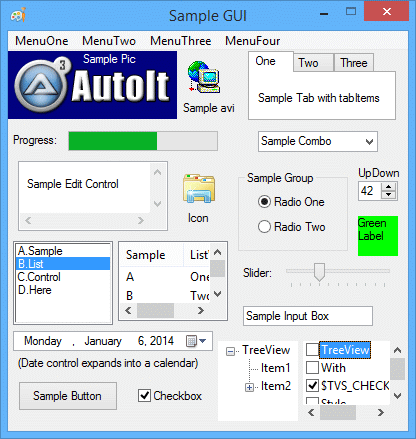
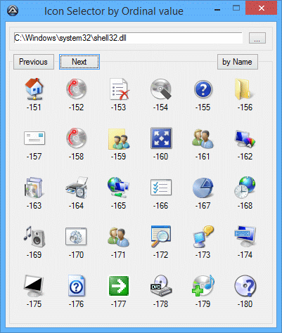

# 1、AutoIt
## 1-1、介绍
    介绍
AutoIt v3 是一种类似 BASIC 的免费软件脚本语言，旨在自动化 Windows GUI 和一般脚本。它结合了模拟击键、鼠标移动和窗口/控件操作，以便以其他语言
（例如 VBScript 和 SendKeys）不可能或不可靠的方式自动执行任务。 AutoIt 也非常小，是独立的，可以在所有版本的 Windows 上开箱即用地运行，不需
要烦人的“运行时”！

AutoIt 最初是为 PC“推出”情况而设计的，以可靠地自动化和配置数千台 PC。随着时间的推移，它已经成为一种强大的语言，支持复杂的表达式、用户函数、循环
以及资深脚本编写者所期望的所有其他内容。特征：

> * 易于学习的类似 BASIC 的语法
> * 模拟击键和鼠标移动
> * 操作窗口和进程
> * 与所有标准窗口控件交互
> * 脚本可以编译成独立的可执行文件
> * 创建图形用户界面 (GUI)
> * COM 支持
> * 常用表达
> * 直接调用外部DLL和Windows API函数
> * 可编写脚本的 RunAs 函数
> * 详细的帮助文件和大型社区支持论坛
> * 兼容 Windows XP SP3 / 2003 SP2 / Vista / 2008 / Windows 7 / 2008 R2 / Windows 8 / 2012 R2
> * Unicode 和 x64 支持
> * 数字签名让您高枕无忧
> * 适用于 Windows 用户帐户控制 (UAC)

AutoIt 被设计为尽可能小且独立，无需外部 .dll 文件或注册表项，使其可以在服务器上安全使用。可以使用 Aut2Exe 将脚本编译成独立的可执行文件。

还提供了 AutoIt 的 COM 和 DLL 组合版本，称为 AutoItX，它允许您将 AutoIt 的独特功能添加到您自己喜欢的脚本或编程语言中！

最重要的是，AutoIt 继续免费 - 但如果您想支持在项目和网络托管上花费的时间、金钱和精力，那么您可以在 AutoIt 主页上捐款。

    详细功能

> 类基本语法和丰富的功能集

AutoIt 具有类似 BASIC 的语法，这意味着大多数曾经编写过脚本或使用过高级语言的人应该能够轻松掌握它。

尽管它最初是一个简单的自动化工具，但 AutoIt 现在具有允许它用作通用脚本语言的功能和特性（当然还有很棒的自动化！）。语言功能包括：

> * 函数、循环和表达式解析的常用高级元素
> * 数量惊人的字符串处理函数和 Perl 兼容的正则表达式引擎（使用 PCRE 库）。
> * COM 支持
> * 调用 Win32 和第三方 DLL API

> 带有语法高亮的内置编辑器

AutoIt 带有一个定制的“精简”版本的 SciTE，使编辑脚本变得容易。用户还可以下载 SciTE 的完整版本，其中包括使事情变得更容易的其他工具。

> 独立和小型

AutoIt 是一个非常小的独立应用程序，不依赖于大量运行时，例如 .NET 或 VB。运行 AutoIt 脚本所需的只是主要的 AutoIt 可执行文件 (AutoIt3.exe) 和脚本。也可以使用内置的脚本编译器 Aut2Exe 将脚本编码为独立的可执行文件。

> 国际和 64 位支持

AutoIt 完全支持 Unicode，还包括所有主要组件的 x64 版本！你能说多少其他免费脚本语言？

> 键鼠模拟

已花费大量时间优化击键和鼠标模拟功能，使其在所有 Windows 版本上尽可能准确。所有鼠标和键盘例程在模拟“速度”和功能方面都是高度可配置的。

> 窗口管理

您可以期望移动、隐藏、显示、调整大小、激活、关闭以及几乎可以使用 Windows 做任何您想做的事情。可以通过标题、窗口上的文本、大小、位置、类甚至内部 Win32 API 句柄来引用窗口。

> 控件

直接获取有关编辑框、复选框、列表框、组合、按钮、状态栏的信息并与之交互，而不会丢失击键的风险。甚至可以在不活动的窗口中使用控件！

> 图形用户界面 (GUI)

AutoIt v3 还允许您创建一些复杂的 GUI - 就像下面的那些！

 

## 1-2、[执照](https://www.autoitscript.com/autoit3/docs/license.htm)
## 1-3、[安装目录](https://www.autoitscript.com/autoit3/docs/intro/installdir.htm)
## 1-4、[常见问题 (FAQ)](https://www.autoitscript.com/autoit3/docs/faq.htm)
## 1-5、[贡献者](https://www.autoitscript.com/autoit3/docs/credits.htm)
## 1-6、[历史/变更日志](https://www.autoitscript.com/autoit3/docs/history.htm)
## 1-7、[AutoIt 和开发者历史](https://www.autoitscript.com/autoit3/docs/intro/dev_history.htm)
# 2、使用 AutoIt
## 2-1、有可能的使用
AutoIt 作为一种编程语言不断发展。 它最初是作为一个附加工具来自动化其他程序的 GUI 中的基本任务，而任务自动化（例如发送击键或单击按钮）仍然是 
AutoIt 的核心。 然而，随着许多新功能的引入，AutoIt 已成为比以往任何时候都更强大的工具。

一些新的和更新的功能包括：
> * GUI 自动化 - 为您的应用程序创建自定义图形界面。
> * COM（对象）功能填补了 VBScript/JScript 等 WSH 语言的空白。
> * 循环、函数和表达式解析。
> * 用于处理和操作字符串的大量函数。
> * 使用 PCRE 库的 Perl 兼容正则表达式引擎，具有本机 16 位模式和 UCP/UTF 支持。
> * 强大的递归文件列表到数组功能
> * 从您的脚本中轻松调用 Win32 和第三方 DLL API。
## 2-2、[运行脚本](https://www.autoitscript.com/autoit3/docs/intro/running.htm)
## 2-3、文件名和路径
每当函数参数被指定为“文件名”时，它意味着一个带有完整路径的文件名。 尽管 AutoIt 函数通常会接受相对路径，但这不能保证正确工作，因为 Windows API 
中的某些文件函数需要完全限定的路径。 如果没有指定路径并且只使用一个简单的名称来定义一个文件，AutoIt 将创建它或在当前工作目录中搜索它 - 可以在 
@WorkingDir 宏中找到该路径。

工作目录在脚本启动时设置为@ScriptDir，并且可以在脚本运行期间通过调用 FileChangeDir 更改此路径。 但请注意，当前工作目录也可以通过某些功能自动
更改 - 例如 FileOpen/SaveDialog 成功返回，如果指定了“workingdir”参数，则运行。

MSDN 页面 [命名文件、路径和命名空间](http://msdn.microsoft.com/en-us/library/windows/desktop/aa365247(v=vs.85).aspx#fully_qualified_vs._relative_paths) 有更多关于如何编写文件名和路径的详细信息。
## 2-4、[Windows Vista 上的 AutoIt](https://www.autoitscript.com/autoit3/docs/intro/autoit_on_vista.htm)
## 2-5、[命令行参数](https://www.autoitscript.com/autoit3/docs/intro/running.htm#CommandLine)
## 2-6、脚本编辑器
AutoIt 脚本是简单的文本文件，您可以使用任何文本编辑器对其进行编辑。然而，有许多免费或共享软件编辑器更适合编写脚本和许多功能语法突出显示，以便 
AutoIt 关键字和功能脱颖而出，使脚本编写更容易，更不容易出错。

目前大多数 AutoIt 用户使用的编辑器是 SciTE，AutoIt 开发团队创建了一个自定义版本的 SciTE，具有完整的语法突出显示，还集成了各种第三方 AutoIt 
工具（如语法检查和脚本整理）。 SciTE 编辑器的“精简版”版本随 AutoIt 安装包一起提供。所有工具随附的完整 AutoIt SciTE 版本可在 
http://www.autoitscript.com/autoit3/scite/ 单独下载

 

其他一些推荐的编辑器是：

> * [文本板](http://www.textpad.com/)
> * [深红编辑器](http://www.crimsoneditor.com/) （免费）
> * [源编辑](http://www.sourceedit.com/) （免费）
> * [超编辑](http://www.ultraedit.com/)
> * [记事本++](http://notepad-plus-plus.org/) （免费）

AutoIt 为许多编辑器提供了一些预先编写的语法文件，它们可以在 Extra 安装目录中找到（在开始菜单/AutoIt v3/Extra 下有一个链接）。
## 2-7、[编译脚本](https://www.autoitscript.com/autoit3/docs/intro/compiler.htm)
## 2-8、[AutoIt 窗口信息工具 (Au3Info)](https://www.autoitscript.com/autoit3/docs/intro/au3spy.htm)
## 2-9、[AutoIt 语法检查器 (Au3Check)](https://www.autoitscript.com/autoit3/docs/intro/au3check.htm)
## 2-10、[窗口标题和文本（基本）](https://www.autoitscript.com/autoit3/docs/intro/windowsbasic.htm)
## 2-11、[窗口标题和文本（高级）](https://www.autoitscript.com/autoit3/docs/intro/windowsadvanced.htm)
## 2-12、[控件](https://www.autoitscript.com/autoit3/docs/intro/controls.htm)
## 2-13、[Unicode 支持](https://www.autoitscript.com/autoit3/docs/intro/unicode.htm)
## 2-14、[在Windows 64位版下运行](https://www.autoitscript.com/autoit3/docs/intro/64-bit_support.htm)
# 3、教程
## 3-1、[我的第一个脚本（Hello World）](https://www.autoitscript.com/autoit3/docs/tutorials/helloworld/helloworld.htm)
## 3-2、[简单的记事本自动化](https://www.autoitscript.com/autoit3/docs/tutorials/notepad/notepad.htm)
## 3-3、[WinZip 安装](https://www.autoitscript.com/autoit3/docs/tutorials/winzip/winzip.htm)
## 3-4、[字符串正则表达式](https://www.autoitscript.com/autoit3/docs/tutorials/regexp/regexp.htm)
## 3-5、[简单的计算器 GUI](https://www.autoitscript.com/autoit3/docs/tutorials/simplecalc-josbe/simplecalc.htm)
# 4、语言参考
## 4-1、[数据类型](https://www.autoitscript.com/autoit3/docs/intro/lang_datatypes.htm)
## 4-2、[变量](https://www.autoitscript.com/autoit3/docs/intro/lang_variables.htm)
## 4-3、宏
AutoIt 有许多 [宏](https://www.autoitscript.com/autoit3/docs/macros.htm) ，它们是 AutoIt 使用的特殊只读变量。 宏以 @ 字符而不是通
常的 $ 开头，因此很容易区分。 与普通变量一样，您可以在表达式中使用宏，但不能为它们赋值。

预定义的宏通常用于提供对系统信息的轻松访问，例如 Windows 目录的位置或登录用户的名称。

去 [这里](https://www.autoitscript.com/autoit3/docs/macros.htm) 查看完整列表。
## 4-4、[运算符](https://www.autoitscript.com/autoit3/docs/intro/lang_operators.htm)
## 4-5、[条件语句](https://www.autoitscript.com/autoit3/docs/intro/lang_conditional.htm)
## 4-6、循环语句
循环是您引用重复多次的脚本部分的方式。 您可能希望循环给定次数，或者您可能希望重复一段脚本，只要某个条件为真或假。

 

AutoIt 中提供了以下循环语句：

> * [For...Next](https://www.autoitscript.com/autoit3/docs/keywords/For.htm)
> * [While...WEnd](https://www.autoitscript.com/autoit3/docs/keywords/While.htm)
> * [Do...Until](https://www.autoitscript.com/autoit3/docs/keywords/Do.htm)
> * [For...In...Next](https://www.autoitscript.com/autoit3/docs/keywords/ForInNext.htm)

虽然所有语句都执行类似的功能，但它们略有不同，对于给定的情况，一个通常比另一个更合适。

具有很少或没有内部代码的循环将非常迅速地使用 CPU 周期，在最坏的情况下可能导致过热。 循环中的 Sleep(10) 行足以防止这种情况发生 - 请注意，如果循
环中的代码包含阻塞函数（例如 MsgBox）或 GUIGetMsg，则不需要这样做。
## 4-7、对象语句
obj 是您引用对象的方式。 您可能想要枚举 Object 集合中的元素

AutoIt 中提供了以下 obj 语句：
> * [With...EndWith](https://www.autoitscript.com/autoit3/docs/keywords/With.htm)
> * [For...In...Next](https://www.autoitscript.com/autoit3/docs/keywords/ForInNext.htm)

## 4-8、[自定义函数](https://www.autoitscript.com/autoit3/docs/intro/lang_functions.htm)
## 4-9、[注释](https://www.autoitscript.com/autoit3/docs/intro/lang_comments.htm)
## 4-10、指令
预处理器指令是一种告诉脚本（或编译器）以特殊方式运行的方法。 它们以井号 (#) 开头并位于脚本的顶部。

下面是 AutoIt 支持的按字母顺序排列的预处理器指令列表。

> 指令 | 描述
> --- | ---
> [#comments...](https://www.autoitscript.com/autoit3/docs/keywords/comments-start.htm) | 指定应注释掉整个脚本部分
> [#include](https://www.autoitscript.com/autoit3/docs/keywords/include.htm) | 在当前脚本中包含一个文件。
> [#include-once](https://www.autoitscript.com/autoit3/docs/keywords/include-once.htm) | 指定当前文件只能包含一次。
> [#NoTrayIcon](https://www.autoitscript.com/autoit3/docs/keywords/NoTrayIcon.htm) | 指示脚本启动时不会显示 AutoIt 托盘图标。
> [#OnAutoItStartRegister](https://www.autoitscript.com/autoit3/docs/keywords/OnAutoItStartRegister.htm) | 注册 AutoIt 启动时要调用的函数。
> [#pragma](https://www.autoitscript.com/autoit3/docs/keywords/pragma.htm) | 更改脚本的编译方式。
> [#RequireAdmin](https://www.autoitscript.com/autoit3/docs/keywords/RequireAdmin.htm) | 指定当前脚本需要完全管理员权限才能运行。

# 5、图形用户界面参考(可选)
## 5-1、[图形用户界面概念](https://www.autoitscript.com/autoit3/docs/guiref/GUIRef.htm)
## 5-2、[GUI 消息循环模式](https://www.autoitscript.com/autoit3/docs/guiref/GUIRef_MessageLoopMode.htm)
## 5-3、[GUI OnEvent 模式](https://www.autoitscript.com/autoit3/docs/guiref/GUIRef_OnEventMode.htm)
## 5-4、[GUI 常量包含文件](https://www.autoitscript.com/autoit3/docs/guiref/GUIConstants.htm)

    对象/COM 参考
    
# 6、关键字参考
## 6-1、[关键字参考](https://www.autoitscript.com/autoit3/docs/keywords.htm)
# 7、宏参考
## 7-1、[宏参考](https://www.autoitscript.com/autoit3/docs/macros.htm)
# 8、功能参考
## 8-1、[功能参考](https://www.autoitscript.com/autoit3/docs/functions.htm)
# 9、附录
## 9-1、[AutoIt 常量包含文件](https://www.autoitscript.com/autoit3/docs/appendix/AutoItConstants.htm)
## 9-2、[AutoIt3 限制/默认值](https://www.autoitscript.com/autoit3/docs/appendix/LimitsDefaults.htm)
## 9-3、[ASCII 字符](https://www.autoitscript.com/autoit3/docs/appendix/ascii.htm)
## 9-4、[特殊文件夹的 CLSID](https://www.autoitscript.com/autoit3/docs/appendix/clsid.htm)
用于 [FileOpenDialog](https://www.autoitscript.com/autoit3/docs/functions/FileOpenDialog.htm) 、[FileSaveDialog](https://www.autoitscript.com/autoit3/docs/functions/FileSaveDialog.htm) 或 [FileSelectFolder](https://www.autoitscript.com/autoit3/docs/functions/FileSelectFolder.htm)

列表取自 [WinGuides Network 上的 Windows 注册表指南](http://www.pctools.com/guides/registry/detail/61/)

注意：并非所有值都可以用作上面列出的 AutoIt 函数的参数。

示例： FileSelectFolder("选择一个文件夹。", "::{D20EA4E1-3957-11d2-A40B-0C5020524152}", 1)
## 9-5、[GUI 控件样式](https://www.autoitscript.com/autoit3/docs/appendix/GUIStyles.htm)
此页面包含可用于窗口的常见和扩展样式的列表，以及可用于控件的特定样式。 这些样式用于许多 GUI 函数的“style”和/或“exStyle”参数。 要使用这些值，您
必须#include 每个部分顶部指定的文件。
## 9-6、[@OSLang 可能取值](https://www.autoitscript.com/autoit3/docs/appendix/OSLangCodes.htm)
操作系统的语言
## 9-7、[*发送按键命令列表*](https://www.autoitscript.com/autoit3/docs/appendix/SendKeys.htm)
## 9-8、[标准 Windows 字体](https://www.autoitscript.com/autoit3/docs/appendix/fonts.htm)
## 9-9、[Windows 消息代码](https://www.autoitscript.com/autoit3/docs/appendix/WinMsgCodes.htm)
# 10、用户定义函数参考
## 10-1、[*用户定义函数参考*](https://www.autoitscript.com/autoit3/docs/libfunctions.htm)

## 其余功能点
### 调用dll文件，封装windows功能
> * 1、在 [microsoft windows api](https://docs.microsoft.com/en-us/windows/win32/api/_shell/)  中找到需要的函数、出入参数、ddl文件
> * 2、调用 [DllCall](https://www.autoitscript.com/autoit3/docs/functions/DllCall.htm) ，获取返回值即可

### 定位当前元素
> * 1、使用_UIA_getFirstObjectOfElement获取 所有桌面元素$UIA_oDesktop 的 孩子$treescope_children中 符合条件（通过class名称筛选）的元素，得到对象obj
> * 2、调用obj.setfocus定位元素，使用_UIA_DumpThemAll将obj的所有$treescope_subtree落地为xml文件

