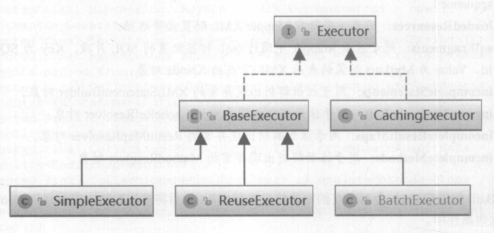

java.sql

Javax.sql

javax.sql与java.sql

javax.sql.RowSet与java.sql.ResultSet

ODBC

Native API

JDBC-NET

Native Protocol

SPI机制

mybatis核心组件

executor

statementHandler实现

缓存实现类

日志框架之间的关系

SLF4J日志框架适配器

SLF4J绑定其他日志框架

Mybatis的log接口

SqlNode实现类

插件：动态代理对象创建

插件：拦截逻辑执行

