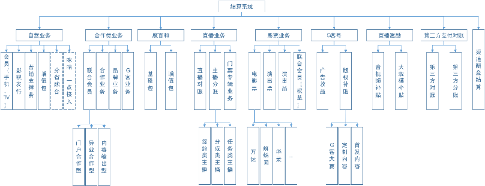
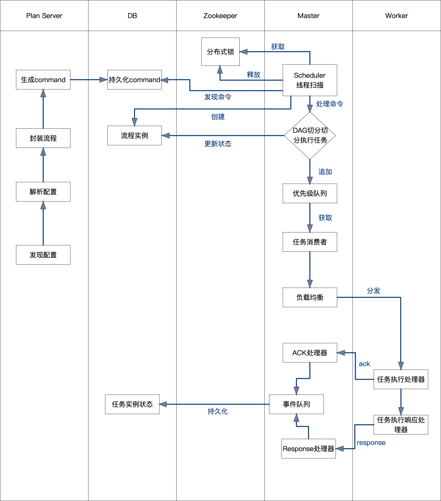

答辩内容：

	结算系统：
		1、业务
			商务模式：商务合同规定的结算模式
			商务模式维度：
			结算方：代计、平台、内容 提供/运营/整合/补贴、播控、营销、转码、合作方
			结算对象：
			稽核规则：
			
			基于商务合同规定的结算模式，根据商务模式维度，通过一系列的稽核规则，根据结算方的分成比例将收入结给不同结算对象

		2、流程：
			数据采集、支付 业务对账、分账、输出结算报表
			

			
		3、框架
			总体架构
			
		
		4、作用
			提高集团对于咪咕子业务的把控能力，对接保障系统，实现全业务结算流程电子化、自动化，减少人工报账存在的风险，增加结算信息透明度。
			
		
	监控系统：
		1、业务
		    在统一结算系统支撑各个业务结算的同时，为其提供一个可以实时监控数据质量和提供错误可能原因的功能，针对系统设计实施的方式
		    进行全流程数据监控和错误告警。支持文件与文件、文件与表以及表与表的比对。
		    
		    流程：
		        配置解析 -> 环境、任务初始化 -> 数据获取 -> 基准筛选 -> 数据持久化 -> 交叉稽核 -> 数据整合 -> 格里芬展示
		    
		    限制：
		        适用于统一结算系统中各个流程、环境中无任何过滤、聚合等导致数据量变化操作的数据质量的监控，且对应的文件或表在划定的范围内
                		    （路径或分区）应有数据一致性，方可校验。
		2、框架
		    hadoop
		    hive
		    mysql
		    spark
		    
		    FuzzyWuzzy 是一个简单易用的模糊字符串匹配工具包。github 上 5K 星，它依据 Levenshtein Distance 算法 计算两个序列之间的差异。
            Levenshtein Distance 算法，又叫 Edit Distance 算法，是指两个字符串之间，由一个转成另一个所需的最少编辑操作次数。许可的编
            辑操作包括将一个字符替换成另一个字符，插入一个字符，删除一个字符。一般来说，编辑距离越小，两个串的相似度越大。
		    
		
		    
		3、作用
		    从一定程度上确保了数据的正确性，避免环境、人为因素等未知因素导致的潜在问题。
		    数据变更、数据丢失、数据差异、表结构异常
		    
	稽核子系统：
		1、业务
		    满足结算系统任意环节的统计与输出、交叉比对、错误预警、字段监控
		    
		    流程：
		        配置管理、任务封装和任务记录与发布

		2、框架
		    使用DolphinScheduler-1.3.2版本的框架做为引擎，基于该版本的主从节点服务架构和任务处理模式开发配置服务，进行配置的解析和任务的发布

		3、作用
		    根据前台配置视图的数据源、维度、对象、统计指标以及过滤器等主要信息，由数据源、维度、对象确定基本任务逻辑框架，然后根据统计指标、
		    过滤器来确定数据统计范围
		    
		    其中视图的配置部分，是根据业务结算特点，在结算数据的基础之上将汇总、计算的逻辑封装在视图中，并给出输出视图的创建逻辑、维度对象
		    的属性信息来形成配置，从而从页面中可以做相应的选择。
		    
		    而任务逻辑框架，在当前版本中仅支持数据的聚合和求和计算，即按照配置的维度信息进行汇总，对于对象进行求和进而输出结果的操作。
		    
		    
	咪咕营账：
		1、业务
		    
		    营帐平台为客户经理、企业客户、合作伙伴提供可操作的平台，拥有企业客户业务支撑能力、企业业务计费能力，同时为客户经理、业管人员、财务人员及
		    维护人员提供所有业务的帐务处理能力。
		    
		    流程：
		    
		2、框架
		    
		
		3、作用
		    完善咪咕创新业务的运营体系，提升创新业务运营支撑能力，形成业务与财务管理的闭环。

    
    技能
        hadoop
            减少HDFS小文件
            
            HDFS小文件过多会影响NameNode的寿命，因为文件元数据存储在NameNode的内存中。另外，HDFS小文件过多影响计算引擎的任务数量，比如每个小的文件都会生成一个Map任务。
            
            小文件过多可以采用如下3个方法处理：
            
            （1）合并小文件：对小文件进行归档（Har）、自定义Inputformat将小文件存储成SequenceFile文件。
            
            （2）采用ConbineFileInputFormat来作为输入，解决输入端大量小文件场景。
            
            （3）对于大量小文件Job，可以开启JVM重用。
            
            Map阶段优化
            
            （1）增大环形缓冲区大小。比如可以由100M扩大到200M。
            
            （2）增大环形缓冲区溢写的比例。比如由80%扩大到90%。
            
            （3）减少对溢写文件的merge次数。
            
            （4）不影响实际业务的前提下，采用Combiner提前合并，降低后续 I/O。
            
            Reduce阶段优化
            
            （1）合理设置Map和Reduce数。都不能设置太少，也不能设置太多。太少，会导致Task等待，延长处理时间；太多，会导致 Map、Reduce任务间竞争资源，造成处理超时等错误。
            
            （2）设置Map、Reduce共存：调整slowstart.completedmaps参数，使Map运行到一定程度后，Reduce也开始运行，减少Reduce的等待时间。
            
            （3）规避使用Reduce，因为Reduce在用于连接数据集的时候将会产生大量的网络消耗。
            
            （4）增加每个Reduce去Map中拿数据的并行数
            
            （5）集群性能可以的前提下，增大Reduce端存储数据内存的大小。
            
            IO传输优化
            
            （1）采用数据压缩的方式，减少网络IO的的时间。比如安装Snappy和LZOP压缩编码器。
            
            （2）使用SequenceFile二进制文件。
            
            整体调优
            
            （1）MapTask默认内存大小为1G，可以增加MapTask内存大小为4-5G。
            
            （2）ReduceTask默认内存大小为1G，可以增加ReduceTask内存大小为4-5G。
            
            （3）可以增加MapTask的cpu核数，增加ReduceTask的CPU核数。
            
            （4）增加每个Container的CPU核数和内存大小。
            
            （5）调整每个Map Task和Reduce Task最大重试次数。
        
        java
            https://blog.csdn.net/qq_42894896/article/details/82256770
        
        sql
            原则：
                减少数据访问：设置合理的字段类型，启用压缩，通过索引访问等减少磁盘IO
                返回更少的数据：只返回需要的字段和数据分页处理 减少磁盘io及网络io
                减少交互次数：批量DML操作，函数存储等减少数据连接次数
                减少服务器CPU开销：尽量减少数据库排序操作以及全表查询，减少cpu 内存占用
                利用更多资源：使用表分区，可以增加并行操作，更大限度利用cpu资源

            总结：
                最大化利用索引；
                尽可能避免全表扫描；
                减少无效数据的查询；

            一、避免不走索引的场景
            
            1. 尽量避免在字段开头模糊查询，会导致数据库引擎放弃索引进行全表扫描。如下：
                instr
            2. 尽量避免使用in 和not in，会导致引擎走全表扫描。如下：
                如果是连续数值，可以用between代替。如下：
                如果是子查询，可以用exists代替。如下：
            3. 尽量避免使用 or，会导致数据库引擎放弃索引进行全表扫描。如下：
                可以用union代替or。如下：
            4. 尽量避免进行null值的判断，会导致数据库引擎放弃索引进行全表扫描。如下：
                可以给字段添加默认值0，对0值进行判断。如下：
            5.尽量避免在where条件中等号的左侧进行表达式、函数操作，会导致数据库引擎放弃索引进行全表扫描。
                可以将表达式、函数操作移动到等号右侧。如下：
            7. 查询条件不能用 <> 或者 !=
            8. where条件仅包含复合索引非前置列
               MySQL联合索引的最左匹配原则，不会走联合索引。
            9. 隐式类型转换造成不使用索引
                如下SQL语句由于索引对列类型为varchar，但给定的值为数值
            
            二、SELECT语句其他优化
            
            1. 避免出现select *
                让优化器无法完成索引覆盖扫描这类优化，
                影响优化器对执行计划的选择，
                会增加网络带宽消耗，
                带来额外的I/O,内存和CPU消耗。
            2. 避免出现不确定结果的函数
                now()、rand()、sysdate()、current_user()
                导致主库与从库相应的数据不一致。
                无法利用query cache。
            3.多表关联查询时，小表在前，大表在后。
            4. 使用表的别名
            5. 用where字句替换HAVING字句
                HAVING只会在检索出所有记录之后才对结果集进行过滤，而where则是在聚合前刷选记录
                HAVING中的条件一般用于聚合函数的过滤，除此之外，应该将条件写在where字句中。
            6.调整Where字句中的连接顺序
                MySQL采用从左往右，自上而下的顺序解析where子句。
                将过滤数据多的条件往前放，最快速度缩小结果集。
            
            三、增删改 DML 语句优化
            
            1. 大批量插入数据
            
            如果同时执行大量的插入，建议使用多个值的INSERT语句(方法二)。这比使用分开INSERT语句快（方法一），一般情况下批量插入效率有几倍的差别。
            
            方法一：
            
            insert into T values(1,2); 
             
            insert into T values(1,3); 
             
            insert into T values(1,4);
            方法二：
            
            Insert into T values(1,2),(1,3),(1,4);
            选择后一种方法的原因有三。
            
            减少SQL语句解析的操作，MySQL没有类似Oracle的share pool，采用方法二，只需要解析一次就能进行数据的插入操作；
            在特定场景可以减少对DB连接次数
            SQL语句较短，可以减少网络传输的IO。
            2. 适当使用commit
            
            适当使用commit可以释放事务占用的资源而减少消耗，commit后能释放的资源如下：
            
            事务占用的undo数据块；
            事务在redo log中记录的数据块；
            释放事务施加的，减少锁争用影响性能。特别是在需要使用delete删除大量数据的时候，必须分解删除量并定期commit。
            
            四、查询条件优化
            
            1. 对于复杂的查询，可以使用中间临时表 暂存数据
            
            2. 如果查询包括 GROUP BY 但你并不想对分组的值进行排序，你可以指定 ORDER BY NULL禁止排序。例如：
            
            3. 连接(JOIN).. 之所以更有效率一些，是因为 MySQL 不需要在内存中创建临时表来完成这个逻辑上的需要两个步骤的查询工作。
            
            4. 优化union查询
                MySQL通过创建并填充临时表的方式来执行union查询。
                除非确实要消除重复的行，否则建议使用union all。
                    原因在于如果没有all这个关键词，MySQL会给临时表加上distinct选项，
                    这会导致对整个临时表的数据做唯一性校验，这样做的消耗相当高。
            
            5.拆分复杂SQL为多个小SQL，避免大事务
                简单的SQL容易使用到MySQL的QUERY CACHE；
                减少锁表时间特别是使用MyISAM存储引擎的表；
                可以使用多核CPU。
                
            6. 使用truncate代替delete
                delete语句的操作会被记录到undo块中，删除记录也记录binlog，
                使用truncate操作有其极少的资源占用与极快的时间。另外，使用truncate可以回收表的水位，使自增字段值归零。
            
            五、建表优化
            
            1. 在表中建立索引，优先考虑where、order by使用到的字段。
            
            2. 优先使用数值型字段
                这是因为引擎在处理查询和连接时会 逐个比较字符串中每一个字符，而对于数字型而言只需要比较一次就够了。
            
            4. 用varchar/nvarchar 代替 char/nchar
                首先变长字段存储空间小，可以节省存储空间，其次对于查询来说，在一个相对较小的字段内搜索效率显然要高些。
            
